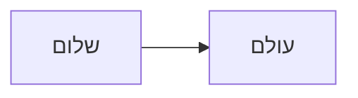

# User Notes

## Mermaid Direction

Mermaid diagrams default to LTR formatting on this site.

If a specific diagram should render as RTL, start the fenced block with ` ```mermaid-rtl ` instead of ` ```mermaid `.

Example:

````md

````
