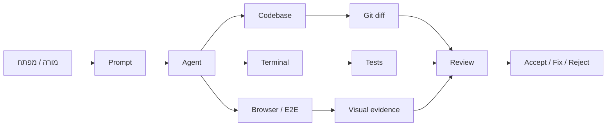

{: .box-success}
**We are in a world where developers spend their days *==conversing with different agents, checking in on them, and seeing the work that they did.==*** מעבר מ"שימוש בצ'אט" אל **ניהול עבודה הנדסית עם סוכנים**. הארכיטקט לא רק כותב פרומפט. הארכיטקט מגדיר סביבת עבודה, כללי בטיחות, בדיקות, תיעוד, משימות, ואופן בדיקה של התוצר.



---
**הערות לסרטון:**

- [האתר שנולד בפרומפט הזה נמצא כאן](https://vibe180326.vercel.app/)
- ה-deployment בוצע בפקודה לאייג'נט שיעשה deploy ל-vercel בתוספת הבהרה שאני לא מכיר את התהליך אבל יש לי חשבון. האייג'נט ביצע ואני רק התקבשתי לאשר login - לתת כמה ספרות.

מטרה ומבנה ההצגה

## מטרת השיעור

בסוף 30 דקות המורים אמורים להבין:

1. מה ההבדל בין שיחה עם מודל לבין עבודה עם agent על קוד.
2. למה Git, בדיקות, Markdown ו־AGENTS.md הם חלק מהמקצוע החדש.
3. איך הופכים "תעשה לי" ל־workflow שאפשר לבדוק, לשחזר וללמד.

{: .box-note}
המטרה אינה לשכנע שכל תלמיד חייב לעבוד כך מחר. המטרה היא לתת למורה מילון מושגים, תחושת כיוון, ודוגמת עבודה מספיק מוחשית כדי לזהות מה חסר בסביבת ההוראה הנוכחית.

## 30 דקות - מבנה מוצע

| זמן | פעילות | מה הארכיטקט אמור לראות |
| ---: | --- | --- |
| 0-5 | פתיח: עולם של agents | לא עוד autocomplete, אלא משימות ארוכות עם בדיקה |
| 5-10 | Online מול CLI / Extension / App | ההבדל בין תשובה לבין עבודה בתוך repo |
| 10-18 | Demo קצר | agent קורא קבצים, משנה קובץ, מריץ בדיקה, מסכם |
| 18-24 | Harness Engineering | AGENTS, tests, docs, Git, notifications |
| 24-30 | דיון כיתתי | מה אפשר לתת לתלמידים, ומה אסור עדיין לפתוח |

## המפה הגדולה

## המונח: Harness Engineering

Harness הוא הרתמה שמחזיקה את ה־agent בתוך מסלול עבודה מועיל:

- הוראות קבועות: `AGENTS.md`, `CLAUDE.md`, skills, docs.
- גבולות פעולה: הרשאות, תיקיות מותרות, מה לא למחוק, מתי לשאול.
- בדיקות: unit tests, build, lint, Playwright, בדיקה ידנית בדפדפן.
- תיעוד: Markdown, תרשימי Mermaid, דפי משימה, רשימת "done when".
- ניהול שינוי: Git, Pull Requests, checkpoints, review.

{: .box-success}
אם ה־agent הוא "עובד", ה־harness הוא מערכת העבודה. בהוראה, אנחנו מלמדים לא רק את העובד אלא את מערכת העבודה סביבו.

## דמו - הסרטון שראינו

נסו בעצמכם לקחת פרוייקט עובד שלכם, ולבקש מ-Codex, Claude or חס וחלילה Copilot, לבצע שינוי מסויים.

### דוגמא

> קרא את מבנה הפרויקט. הוסף עמוד Markdown קצר עם טבלה ותרשים Mermaid.
עדכן את התפריט. הרץ build. בסוף תן לי רשימת קבצים ששונו והאם הבדיקה עברה.

הדמו טוב אם רואים ארבעה דברים:

1. ה־agent קורא לפני שהוא משנה.
2. הוא משנה מעט קבצים ולא "משכתב את העולם".
3. הוא מריץ build או בדיקה.
4. הוא נותן evidence: מה עבר, מה לא עבר, ומה נשאר לבדיקה.

## דוגמא נוספת - עבודה ב-repo הנוכחי

כתוב 5-12 עמודי markdown kramdown תחת תיקיה agentic, שמטרתם ללמד מורים את הנושא Agentic Engineering / Harness Engineering. 
ראשית עמוד - ברמה תחילית לחשיפה ראשונה במשך 30 דקות. 
ושאר העמודים תוך מיקוד על תתי נושאים. 

ניתן ליצור תת תפריט תחת א מתקדם

לפני שאתה מתחיל סקור את אתר, ושמור לך קישורים לעמודים שכבר כרגע עושים בנושא - למשל אם יש משהו לגבי google sheets / clasp. אם לא, אז ספציפית לגבי הנושא הזה אני ארצה לשלוח לך חומר מתומצת.

הוסף עמוד לגבי playwright, ובתוכו גם התייחסות ליכולות חדשות של דפדפן בתוך codex

להלן רשימת הנושאים שעבורם יש ליצור הרחבות / עמודים.

**opener - in English:** We are in a world where developers spend their days “conversing with different agents, checking in on them, and seeing the work that they did. 

Sub-topics (so many things I need to teach):

- The difference between Online and Agentic (CLI/Extension/App) 
- Viable alternatives (April 26): openai, antropic.  
- Demo, (link to a youtube of my that I still need to edit).  
- Git and Github. 
- Agentic Engineering on **App scripts? clasp**  
- **AGENTS, Skills, Docs, and markdown**. It’s all about specifications. markdown - the language. 
- Hosting: Netlify, Pages, **Vercel, Railway**
- **TDD How to make the agent work longer:**  
  - Unit-tests 
  - TDD 
    - Green green 
    - Red green 
  - E2E testing:  
    - playwright  
      - Attach vs. CDP,  
      - Headed vs. Headless 
    - playwright-cli 
   - codex browser plugin
   - codex in-app browser

- How to Firebase from the first prompt? 
- Notify me when the agent is done? using PushBullet to know when Agent is done working. 

שמור על יכולות העיצוב המדהימות באמצעות {: .box-success}, {: .box-note}, {: .tabl-rl} לטבלאות דו לשוניות  
mermaid,  ושאר יכולות שכבר יש באתר כגון שאלונים אינטרקטיביים.

## שאלת יציאה

איזה חלק בעבודה עם agent הוא הכי מסוכן בכיתה?

{: .alefbet}

1. כתיבת קוד
1. מחיקת קבצים
1. קבלת תשובה בלי בדיקה
1. שימוש ב-Markdown

התשובה הרצויה היא **ג**. הבעיה אינה שה־agent כותב קוד. הבעיה היא שמקבלים תוצר בלי מסלול בדיקה, בלי Git, ובלי הגדרת אחריות.
## על מה נדבר בסדנה

- Online מול Agentic - מה ההבדל בין שיחה עם מודל לבין עבודה עם agent בתוך פרויקט אמיתי.
- Git ו-GitHub - איך שומרים נקודות חזרה, בודקים שינויים, ומלמדים עבודה אחראית עם קוד.
- AGENTS ו-Markdown - איך כותבים הוראות עבודה, מסמכי משימה ותיעוד שה-agent מסוגל לבצע לפיהם.
- Google Sheets ו-clasp - איך מחברים עבודה agentic לכלי בית ספר מוכרים כמו Sheets ו-Apps Script.
- Hosting - איך מעלים תוצר לרשת ומבינים את ההבדל בין קוד מקומי לשירות חי.
- TDD ובדיקות - איך נותנים ל-agent לרוץ יותר זמן בלי לאבד שליטה: בדיקות, build וקריטריוני סיום.
- Playwright ודפדפן Codex - איך בודקים ממשק בדפדפן ומקבלים ראיות ויזואליות שהתוצר עובד.
- Firebase מפרומפט ראשון - איך ניגשים לשירותי backend בלי להפוך את הפרומפט לקסם לא מבוקר.
- התראות PushBullet - איך מקבלים סימן כשה-agent סיים, במיוחד במשימות ארוכות.
