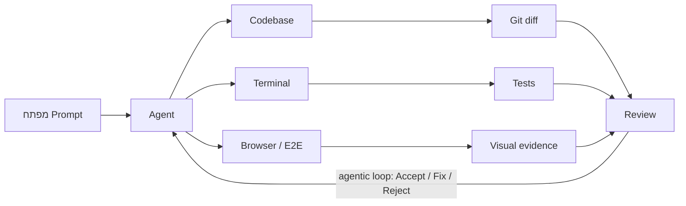

{: .box-success}
**We are in a world where developers spend their days ==conversing with different agents, checking in on them, and seeing the work that they did.==** מעבר מ"שימוש בצ'אט" אל **ניהול עבודה הנדסית עם סוכנים**. הארכיטקט לא רק כותב פרומפט. הארכיטקט מגדיר סביבת עבודה, כללי בטיחות, בדיקות, תיעוד, משימות, ואופן בדיקה של התוצר.

## הזמנה לסדנה {#id1invitation}

הזמנה

**הי כולם**. ב-29/6 הסדנה שלנו על Agentic Engineering.
המשפט שמסכם את התקופה הוא זה: ~~אנחנו עוברים~~ **עברנו** מעולם שבו “שואלים את הצ’אט” לעולם שבו **מנהלים עבודה הנדסית עם סוכנים.**

זו לא הולכת להיות הרצאה שבה אני “מעביר החומר” (אשתדל לקצר בחפירות). זו סדנה. בואו לשחק, לשבור, לשאול, לאתגר, להראות חלופות, ולעזור אחד לשני. מי שמכיר כלי אחר, דרך אחרת, ניסיון מוצלח או כישלון מפואר, שיביא אותו. כולנו נרוויח.

כל החומרים שאני בונה לסדנה זמינים כבר [כאן בתפריט Agentic Engineering]({{ '/agentic/00-opener' | relative_url }})

**יש שם יותר ממה שנספיק:**

- פתיחה על [ההבדל בין Chat רגיל לבין עבודה עם agent בתוך סביבת קוד]({{ '/agentic/01-online-vs-agentic' | relative_url }}),
- [Git/GitHub]({{ '/agentic/02-git-github' | relative_url }}), [מפרטים ב-Markdown, AGENTS.md]({{ '/agentic/03-specifications-markdown' | relative_url }}),
- [Harness Engineering mindset & Agentic Workflows]({{ '/agentic/agentic-workflows-and-harness-engineering-he' | relative_url }}),
- עבודה עם [clasp ו-Google Sheets / Apps Script]({{ '/agentic/04-apps-script-clasp-sheets' | relative_url }}),
- יצירת אתר תוכן Markdown/Jekyll בפרומפט אחד שיכול לשמש אותכם להוראה: [גרסת GitHub Pages בלבד]({{ '/agentic/03b-1shot-github-markdown-site' | relative_url }}) או [גרסת Jekyll מקומית עם WSL/Bundler]({{ '/agentic/03c-1shot-github-jekyll-with-local-wsl-bundle' | relative_url }}),
- אתר מלא עם Harness: [live hosting]({{ '/agentic/05-hosting' | relative_url }}), CI/CD, [UnitTests ו-TDD]({{ '/agentic/06-tdd-long-running-agents' | relative_url }}), [Playwright E2E]({{ '/agentic/07-playwright-browser' | relative_url }}), [Firebase מהפרומפט הראשון]({{ '/agentic/08-firebase-first-prompt' | relative_url }}),
- ואפילו [התראות מ-Codex כשהוא מסיים לעבוד]({{ '/agentic/09-notifications-pushbullet' | relative_url }}), לאלו שיצרו חשבון [pushbullet](https://www.pushbullet.com/){:target="_blank"}

**אשתדל לעבוד איתכם על שלושה *תוצרים* שימושיים לנו כמורים:**

1. [clasp ו-Google Apps Script]({{ '/agentic/04-apps-script-clasp-sheets' | relative_url }}). כל מי שמשתמש באקסל או בגוגל שיטס יכול להנות מהתועלת של app script. ואם כבר, אז agentic.
2. אתר Markdown/Jekyll שבו תוכלו ליצור תכניה הוראה הזמינים לתלמידים באתר (כמו אצלי למשל). יש שתי גרסאות - [למתחילים]({{ '/agentic/03b-1shot-github-markdown-site' | relative_url }}) ו[למתקדמים שכבר עובדים עם WSL/Bundler]({{ '/agentic/03c-1shot-github-jekyll-with-local-wsl-bundle' | relative_url }}).
3. התנסות ב- one shot prompt for a project+git with a **full harness**, עם המשך ל-[Firebase]({{ '/agentic/08-firebase-first-prompt' | relative_url }}) ול-[live deployment]({{ '/agentic/05-hosting' | relative_url }}).

המטרה שלי היא לא שתצאו עם "עוד כלי AI", אלא עם התנסות טובה בעבודה שבה אתם הארכיטקטים וה- agentעובד (קורא קבצים, כותב, מעדכן, מתקין, מריץ בדיקות, מציג ראיות).

כפי שכבר ביקשתי לפני מספר חודשים - **לא ניכנס לדיונים של "לאן פנינו" בחלון הזמנים של הסדנה.** ונשאיר זאת לארוחת הערב.

תיאום ציפיות: **harness enginneering סובב סביב עבודה נכונה שיכולה לקחת פרוייקט הרבה הרבה יותר רחוק.** ואנחנו לצערינו כמעט בכל ההדגמות נבצע יותר one-shot prompt עם ראייה לטווח מעט יותר קצר.

מוזמנים להציץ מראש בחומרים. יש הרבה מעבר למה שנוכל להספיק.

## מי זה ה-AGENT ומה עושים איתו?

{: .box-note}

בסדנה זו, `Agent` הוא coding agent, כגון ==codex== or ==claude code== or ==chat==. אלו פלגינים ל-vscode וגם אפליקציות נפרדות. את ההבחנה בין Chat, CLI, Extension ו-App נרחיב בעמוד [Online מול Agentic]({{ '/agentic/01-online-vs-agentic' | relative_url }}). אנחנו נעבוד עם codex ומי שמנוסים ב-claude or copilot יעבדו איתם.

{: .box-error}
**הקושי בסדנה שלנו:** בזמן קצר אפשר בעיקר לראות את הכח שיש כיום ל-**Agent** לעשות הכל, והדרך היא להראות דוגמאות ל- `one shot prompt` שמגיע רחוק. זה יוצר **פרוייטק עם אורך חיים מוגבל.** האתגר הוא לעבור ל- harness mindset, באופן שיאפשר לבנות מוצר שניתן להגדיל ולגדול איתו בלי שהכל מתפרק.



---
**הערות לסרטון:**

- [האתר שנולד בפרומפט הזה נמצא כאן](https://vibe180326.vercel.app/){:target="_blank"}
- [הגיט כאן](https://github.com/3strategy/vibe180326){:target="_blank"} קומיטס של 18/3 בשעות:
  - 18:21 empty.
  - 18:49 before spec (harness and infa only - to reach running site)
  - 18:53 firebase RTDB
  - 19:06 implement spec
  - 19:40 (hebrew + OAuth)
  - 19:57 (font)
- ה-deployment בוצע בפקודה לאייג'נט שיעשה deploy ל-vercel בתוספת הבהרה שאני לא מכיר את התהליך אבל יש לי חשבון. האייג'נט ביצע ואני רק התבקשתי לאשר login - לתת כמה ספרות.

## המפה הגדולה

## המונח: Harness Engineering כפי שהגדיר GPT5.5

Harness הוא הרתמה שמחזיקה את ה־agent בתוך מסלול עבודה מועיל:

- הוראות קבועות: `AGENTS.md`, `CLAUDE.md`, skills, docs.
- גבולות פעולה: הרשאות, תיקיות מותרות, מה לא למחוק, מתי לשאול.
- בדיקות: [unit tests, TDD]({{ '/agentic/06-tdd-long-running-agents' | relative_url }}), build, lint, [Playwright]({{ '/agentic/07-playwright-browser' | relative_url }}), בדיקה ידנית בדפדפן.
- תיעוד: [Markdown, תרשימי Mermaid, דפי משימה, רשימת "done when"]({{ '/agentic/03-specifications-markdown' | relative_url }}).
- ניהול שינוי: [Git, Pull Requests, checkpoints, review]({{ '/agentic/02-git-github' | relative_url }}).

{: .box-success}
אם ה־agent הוא "עובד", ה־harness הוא מערכת העבודה. בפרומפט, אנחנו מנחים את העובד ליצור, אך גם ליצור את סביבת העבודה שסביבו.

### דוגמת Prompt: תוצר מיידי וגם שיפור של ה־harness

לא כל פרומפט צריך לבקש רק שינוי בעמוד או בקוד. אפשר לבקש גם שהתוצאה תלמד את הסוכן ואת המאגר כיצד לבצע את אותה עבודה טוב יותר בפעם הבאה.

**דוגמת פרומפט בגישת Harness Engineering:**

1. Write line 188 in English.
2. In some places in your edit you used `text` code fences when a correct approach would be to use one of the design classes `box-note`, `box-success`, `box-warning`, or `box-error`. For a section rather than a one-liner, use a `div` wrapper instead of the short `{: .box-note}` syntax.
3. Update `AGENTS.md` with this preference regarding important content highlighting and keeping it interesting and visually appealing.

הבקשה הראשונה משפרת תוצר קיים. השנייה משפרת את דרך ההצגה. ==השלישית הופכת את הלקח לכלל קבוע ב־harness, כך שהסוכן הבא יתחיל מנקודת פתיחה טובה יותר.==

## Harness - הגדרה שלי

עבורי: זה כל מה שיש בפרוייקט שהוא מחוץ לקוד הפרוייקט עצמו, ומשמש את ה-Agent (ולעיתים אותנו) כדי לעבוד נכון וביעילות
אצלנו זה כולל:

- פרוייקט UnitTest שנכתב ומתוחזק על ידי האייג'נט.
- בפרוייקט ה- UnitTests יושבים גם סקריפטים ps1 שיודעים לבצע כל מיני משימות ב-UnitTests אבל גם בפרוייקט בדיקות E2E לעיתים.
- פרוייקט בדיקות E2E מבוסס PlayWright.
- פרוייקט מסמכולוגיה. כולל כ-30-50 מסמכים, קובץ rules, לעיתים demo artifacts
- קובץ AGENTS עם הפנייה ל-3-5 קובצי AGENTS משימתיים, ובהם הפניות למסמכים השונים בפרוייקט המסמכולוגיה.

**זו הסביבה שבה קודקס:**

1. יודע להבין **גבולות גזרה**.
2. יודע מהר אין עובד, **ואיך אמור לעבוד** פיצ'ר מסויים.
3. איך נראית הסכימה.
4. וכו'.

התוצרים שלנו מהאייג'נט יהיו, **כמעט תמיד**, גם קוד במערכת, וגם **שיפור ה-Harness**. האייגנט לא רק כותב קוד. הוא כותב הכל. אנחנו שם כדי לקרוא, לערוך לבקר ולהנחות.

שימו לב שלא הזכרתי בכלל את המילה Skils. אין לנו. וזה יכול להיות אוזלת יד, או אמונה שגויה שלי (גם בעקבות קריאה מזמן), שאנחנו מקבלים אותם כיום יותר בתוך הקודקס בצורה יותר יעילה, ==ושתפקידנו מתמצה ליצור לו סביבת עבודה נוחה וברורה,== ולהגדיר לו הכי טוב בעולם מה צריך לעשות / ==ומה צריך להיות.==

## דמו - הסרטון שראינו

נסו בעצמכם לקחת פרוייקט עובד שלכם, ולבקש מ-Codex, Claude or אם תרצו נסיון חינמי-Copilot, לבצע שינוי מסויים.

### דוגמא ממש שגויה - פרומפט שהציע AI

{: .box-error}
קרא את מבנה הפרויקט. הוסף עמוד Markdown קצר עם טבלה ותרשים Mermaid. עדכן את התפריט. הרץ build. בסוף תן לי רשימת קבצים ששונו והאם הבדיקה עברה.

אין טעם לבקש את הדברים האלו בסביבה אייג'נטית תקינה. קודקס יודיע אלו קבצים שונו, וגם **הגיט יַעֲקֹב** אחרי זה. עדכון התפריט בד"כ יקרה אם הוא רגיל לזה וזה שולי.

הדמו טוב אם רואים ארבעה דברים (שוב, לא מדוייק, הערות שלי ב-bold)

1. ה־agent קורא לפני שהוא משנה. **מובן מאליו**
2. הוא משנה מעט קבצים ולא "משכתב את העולם". **לא מדוייק - תלוי פרוייקט**
3. הוא מריץ build או בדיקה. כיום, build **מובן מאליו. בדיקה - רשות, תלויית הגדרות, ודרישה. עלולה לעלות ביוקר, ומצד שני הכרחית במקרים מסויימים של לולאות.**
4. הוא נותן evidence: מה עבר, מה לא עבר, ומה נשאר לבדיקה.
5. **תוספת שלי**: שינויים שרלוונטיים ל-AGENTS, Schema, Spec, Harness **בוצעו** כחלק מהמימוש (של פיצ'ר או תיקון באג).

## דוגמא נוספת - עבודה ב-repo הנוכחי

כתוב 5-12 עמודי markdown kramdown תחת תיקיה agentic, שמטרתם ללמד מורים את הנושא Agentic Engineering / Harness Engineering.
ראשית עמוד - ברמה תחילית לחשיפה ראשונה במשך 30 דקות.
ושאר העמודים תוך מיקוד על תתי נושאים.

ניתן ליצור תת תפריט תחת `א מתקדם`

לפני שאתה מתחיל סקור את אתר, ושמור לך קישורים לעמודים שכבר כרגע עושים בנושא - למשל אם יש משהו לגבי google sheets / clasp. אם לא, אז ספציפית לגבי הנושא הזה אני ארצה לשלוח לך חומר מתומצת.

הוסף עמוד לגבי playwright, ובתוכו גם התייחסות ליכולות חדשות של דפדפן בתוך codex

להלן רשימת הנושאים שעבורם יש ליצור הרחבות / עמודים.

**opener - in English:** We are in a world where developers spend their days “conversing with different agents, checking in on them, and seeing the work that they did.

Sub-topics (so many things I need to teach):

- [The difference between Online and Agentic (CLI/Extension/App)]({{ '/agentic/01-online-vs-agentic' | relative_url }})
- Viable alternatives (April 26): openai, antropic.  
- Demo, (link to a youtube of my that I still need to edit).  
- [Git and Github]({{ '/agentic/02-git-github' | relative_url }}).
- [Agentic Engineering on **App scripts? clasp**]({{ '/agentic/04-apps-script-clasp-sheets' | relative_url }})  
- [**AGENTS, Skills, Docs, and markdown**]({{ '/agentic/03-specifications-markdown' | relative_url }}). It’s all about specifications. markdown - the language.
- [Hosting: Netlify, Pages, **Vercel, Railway**]({{ '/agentic/05-hosting' | relative_url }})
- [**TDD How to make the agent work longer:**]({{ '/agentic/06-tdd-long-running-agents' | relative_url }})  
  - Unit-tests
  - TDD
    - Green green
    - Red green
  - E2E testing:  
    - [playwright]({{ '/agentic/07-playwright-browser' | relative_url }})  
      - Attach vs. CDP,  
      - Headed vs. Headless
    - playwright-cli
  - codex browser plugin
  - codex in-app browser

- [How to Firebase from the first prompt?]({{ '/agentic/08-firebase-first-prompt' | relative_url }})
- [Notify me when the agent is done? using PushBullet to know when Agent is done working.]({{ '/agentic/09-notifications-pushbullet' | relative_url }})

שמור על יכולות העיצוב המדהימות באמצעות {: .box-success}, {: .box-note}, {: .tabl-rl} לטבלאות דו לשוניות  
mermaid,  ושאר יכולות שכבר יש באתר כגון שאלונים אינטרקטיביים.

## שאלת יציאה

איזה חלק בעבודה עם agent הוא הכי מסוכן בכיתה?

{: .alefbet}

1. כתיבת קוד
1. מחיקת קבצים
1. קבלת תשובה בלי בדיקה
1. שימוש ב-Markdown

התשובה הרצויה היא **ג**. הבעיה אינה שה־agent כותב קוד. הבעיה היא שמקבלים תוצר בלי מסלול בדיקה, בלי Git, ובלי הגדרת אחריות. **והכי מסוכן ללמידה - בלי שהתלמיד מבין מה הקוד עושה**.

⟵ **Harness בפרוייקט של תלמיד צריך לכלול:**

- הגדרות וכלים לתיעוד מתמשך של המסמכים,
- שמירה אוטומטית של הפרומפטים והדיאלוגים החשובים,
- כתיבה של קוד הכולל תיעוד וסשנים שבהם ה-AGENT **בוחן את התלמיד** על הבנתו (למשל AGENT שמגדיר סשן שו"ת בכל מספר פרומפטים).
- התלמיד צריך לשאול את עצמו תמיד אם הוא בצד הטוב של הסרטון הבא



## על מה נדבר בסדנה

- [**Online מול Agentic**]({{ '/agentic/01-online-vs-agentic' | relative_url }}) - מה ההבדל בין שיחה עם מודל לבין עבודה עם agent בתוך פרויקט אמיתי.
- [Git ו-**GitHub**]({{ '/agentic/02-git-github' | relative_url }}) - איך שומרים נקודות חזרה, בודקים שינויים, ומלמדים עבודה אחראית עם קוד.
- [AGENTS ו-**Markdown**]({{ '/agentic/03-specifications-markdown' | relative_url }}) - איך כותבים הוראות עבודה, מסמכי משימה ותיעוד שה-agent מסוגל לבצע לפיהם.
- [Google Sheets ו-**clasp**]({{ '/agentic/04-apps-script-clasp-sheets' | relative_url }}) - איך מחברים עבודה agentic לכלי בית ספר מוכרים כמו Sheets ו-Apps Script.
- [Hosting]({{ '/agentic/05-hosting' | relative_url }}) - איך מעלים תוצר לרשת ומבינים את ההבדל בין קוד מקומי לשירות חי.
- [**TDD** ובדיקות]({{ '/agentic/06-tdd-long-running-agents' | relative_url }}) - איך נותנים ל-agent לרוץ יותר זמן בלי לאבד שליטה: בדיקות, build וקריטריוני סיום.
- [**Playwright** ודפדפן Codex]({{ '/agentic/07-playwright-browser' | relative_url }}) - איך בודקים ממשק בדפדפן ומקבלים ראיות ויזואליות שהתוצר עובד.
- [Firebase מפרומפט ראשון]({{ '/agentic/08-firebase-first-prompt' | relative_url }}) - איך ניגשים לשירותי backend בלי להפוך את הפרומפט לקסם לא מבוקר.
- [התראות **PushBullet**]({{ '/agentic/09-notifications-pushbullet' | relative_url }}) - איך מקבלים סימן כשה-agent סיים, במיוחד במשימות ארוכות.
