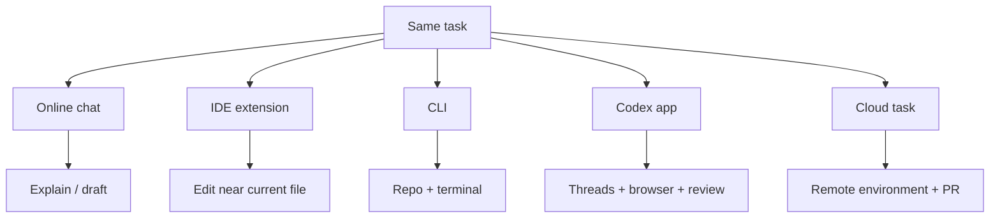

## ההבחנה הבסיסית

{: .table-ehhh}

| סוג עבודה | מה הכלי רואה | מה הכלי עושה | סיכון מרכזי |
|---|---|---|---|
| Online chat | מה שהדבקנו בשיחה | מסביר, מציע, כותב קטעי קוד | אין קשר אמיתי ל־repo |
| IDE extension | קבצים פתוחים וסביבת IDE | מציע שינוי, עורך, רואה diagnostics | שינוי מקומי בלי בדיקה מספקת |
| CLI agent | תיקיית עבודה, terminal, קבצים | קורא, עורך, מריץ פקודות | הרשאות רחבות מדי |
| Desktop app / Cloud agent | threads, worktrees, Git, browser, automations | משימות מקבילות וארוכות יותר | קשה לעקוב בלי checkpoints |
{: .tabl-rl}

{: .box-note}
Online הוא טוב להסבר, תכנון, ניסוח ושאלות נקודתיות. Agentic מתאים כאשר רוצים שהכלי יעבוד בתוך פרויקט אמיתי ויחזיר diff שניתן לבדוק.

## דוגמה קצרה

שאלה online:

```text
כתוב לי דף HTML שמציג טבלת תלמידים.
```

משימה agentic:

```text
בפרויקט הנוכחי, מצא את דפוסי העיצוב הקיימים.
הוסף עמוד תלמידים שמשתמש באותו layout.
עדכן תפריט. הרץ build. אל תשנה קבצים לא קשורים.
```

ההבדל אינו רק אורך הפרומפט. ההבדל הוא שהמשימה השנייה דורשת:

- קריאת repo.
- הבנת conventions.
- שינוי קבצים.
- בדיקה.
- דיווח על evidence.

## Codex: משטחים שונים

לפי התיעוד הרשמי של OpenAI, Codex זמין כ־CLI, IDE extension, app, ו־cloud workflows. ה־app מוסיף עבודה עם threads מקבילים, worktrees, automations, Git, browser ו־artifacts.



## Viable alternatives - נכון לאפריל/מאי 2026

| משפחה | דוגמאות | מתי להראות למורים |
|---|---|---|
| OpenAI | Codex CLI, Codex IDE extension, Codex app, Codex cloud | כשמדגישים repo, Git, browser, worktrees ו־AGENTS.md |
| Anthropic | Claude Code CLI, IDE integrations, CLAUDE.md, settings | כשמדגישים terminal-first workflow ו־IDE diagnostics |
| IDE-first tools | Cursor, Windsurf, VS Code extensions | כשמורים כבר עובדים בתוך IDE ורוצים מעבר הדרגתי |
| Web assistants | ChatGPT, Claude web, Gemini | כשצריך להסביר מושגים, לתכנן או ליצור טיוטה |
{: .tabl-rl}

{: .box-success}
המסר למורים: לא צריך לבחור "דת". צריך להבין את שכבות העבודה: מודל, agent, הרשאות, repo, בדיקות, Git, hosting.

## מה חשוב לבדוק בכל כלי

1. האם הוא רואה את כל ה־repo או רק קובץ פתוח?
2. האם הוא יכול להריץ פקודות?
3. האם אפשר להגביל הרשאות?
4. האם יש תיעוד הוראות קבוע: `AGENTS.md`, `CLAUDE.md`, docs?
5. האם יש דרך נוחה לראות diff לפני שמקבלים שינוי?
6. האם הוא עובד עם GitHub / PR / review?
7. האם הוא יודע לפתוח browser או להריץ Playwright?

## מקור הוראה אפשרי

תנו למורים אותה משימה בשלוש דרכים:

```text
הוסף לתפריט קישור לעמוד חדש בשם "בדיקה".
העמוד צריך להכיל כותרת, טבלה, ותיבת box-note.
```

בצעו פעם אחת ב־Online chat, פעם אחת ב־IDE extension, ופעם אחת ב־agent מקומי. אחרי זה השוו:

- כמה העתקה ידנית נדרשה?
- האם הכלי ידע איפה `_config.yml`?
- האם ה־build רץ?
- האם נוצר diff שאפשר לבדוק?

## מקורות

- [OpenAI Codex quickstart](https://developers.openai.com/codex/quickstart)
- [OpenAI Codex app](https://developers.openai.com/codex/app)
- [Anthropic Claude Code getting started](https://docs.anthropic.com/en/docs/claude-code/getting-started)
- [Anthropic Claude Code IDE integrations](https://docs.anthropic.com/en/docs/claude-code/ide-integrations)
