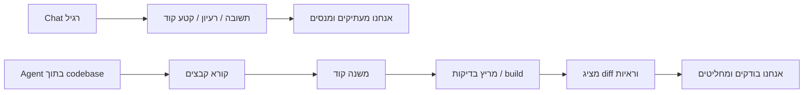

## הרעיון המרכזי

רוב האנשים מכירים AI דרך צ'אט: שואלים שאלה, מקבלים תשובה, מעתיקים משהו, ומנסים לבד.

בעבודה עם כלי כמו Codex או Claude Code בתוך פרויקט קוד, קורה משהו אחר: לא רק מדברים על הקוד. הסוכן נכנס אל סביבת העבודה, קורא קבצים, מבין מבנה קיים, משנה קוד, מריץ פקודות, ובסוף משאיר לנו שינוי שאפשר לבדוק.

{: .box-success}
ההבדל החשוב אינו בין "אתר", "CLI", "Extension" או "App". ההבדל הוא בין **תשובה בצ'אט** לבין **עבודה בתוך codebase אמיתי**.

## מה קורה בצ'אט רגיל

בצ'אט רגיל הכלי יודע רק את מה שנתנו לו בשיחה. הוא לא באמת רואה את הפרויקט, לא יודע אילו קבצים קיימים, לא יודע אילו מוסכמות כבר יש בקוד, ולא יכול להריץ את האתר או את הבדיקות.

זה שימוש מצוין עבור:

- הסבר מושג.
- ניסוח רעיון.
- כתיבת דוגמת קוד קטנה.
- חשיבה ראשונית על פתרון.
- עזרה בהבנת שגיאה שהעתקנו אליו.

אבל בצ'אט רגיל האחריות על החיבור למציאות נשארת אצלנו לגמרי: אנחנו צריכים להעתיק, להדביק, להתאים, להריץ, לתקן, ולבדוק אם זה באמת עובד בפרויקט שלנו.

## מה קורה בעבודה Agentic

בעבודה Agentic הסוכן לא רק עונה. הוא עובד.

**הוא יכול לקבל משימה כמו:** 

{: .box-note}
בפרויקט הנוכחי, הוסף עמוד חדש לתפריט.
שמור על סגנון העמודים הקיימים.
עדכן את קובץ התפריט המתאים.
הרץ build.
בסוף סכם אילו קבצים השתנו ומה נבדק.

כדי לבצע משימה כזו הוא צריך:

- לקרוא את מבנה הפרויקט.
- למצוא דוגמאות קיימות.
- להבין איפה מוגדר התפריט.
- לערוך קבצים.
- להריץ build או בדיקה.
- לדווח מה באמת השתנה.

זה כבר לא "תכתוב לי קוד". זה קרוב יותר ל"עבוד איתי על הפרויקט".

## אותה בקשה, שתי צורות עבודה

{: .table-he}

| עבודה בצ'אט | עבודה עם Agent בתוך codebase |
|---|---|
| "כתוב לי דף HTML עם טבלת תלמידים" | "מצא איך בנויים עמודים באתר הזה, הוסף עמוד תלמידים באותו סגנון, וחבר אותו לתפריט" |
| מקבלים דוגמת קוד כללית | מקבלים שינוי שמתאים לפרויקט |
| אנחנו מחליטים איפה לשים את הקוד | הסוכן מחפש את המקום הנכון |
| אנחנו מריצים ובודקים לבד | הסוכן יכול להריץ build/tests ולדווח |
| קל לקבל תשובה יפה שלא עובדת אצלנו | קל יותר לדרוש ראיה מתוך הפרויקט |

## דוגמה קטנה לכשל נפוץ

נניח שמורה מבקש בצ'אט:

{: .box-note}
כתוב לי קוד לדף התחברות ב-Android.

התשובה יכולה להיראות מצוין. יהיו בה `Activity`, אולי XML, אולי הסבר. אבל היא לא יודעת:

- איך נקרא ה-package בפרויקט.
- האם עובדים עם Java או Kotlin.
- האם כבר יש `LoginActivity`.
- איך בנוי ה-navigation.
- אילו גרסאות Android ו-Gradle מותקנות.
- האם יש Firebase או מנגנון התחברות אחר.

לעומת זאת, משימה לסוכן בתוך הפרויקט יכולה להישמע כך:

{: .box-note}
קרא את פרויקט Android הנוכחי.
בדוק איך Activities מוגדרות בו ואיך התפריט עובד.
הוסף מסך התחברות מינימלי שמתאים למבנה הקיים.
עדכן AndroidManifest אם צריך.
הרץ build או הסבר למה לא ניתן להריץ.

כאן הבקשה מכריחה את הכלי לעבוד מול המציאות של הקוד, לא מול דוגמה דמיונית.

## שינוי בתפקיד שלנו

בצ'אט, אנחנו בעיקר שואלים ומעתיקים.

בעבודה Agentic, אנחנו מנהלים עבודה:

1. מגדירים מטרה.
2. מגדירים גבולות.
3. נותנים לסוכן לקרוא ולעבוד.
4. בודקים את ה-diff.
5. דורשים ראיות: build, tests, צילום מסך, או הסבר ברור למה לא נבדק.
6. מחליטים מה לקבל ומה לדחות.

{: .box-success}
המיומנות החדשה אינה "לכתוב פרומפט ארוך". המיומנות היא להחזיק סביבת עבודה שבה אפשר לתת לסוכן לפעול בלי לוותר על ביקורת, בדיקה ואחריות.

## התרשים הפשוט

```mermaid
flowchart LR
    A["Chat רגיל"] --> B["תשובה / רעיון / קטע קוד"]
    B --> C["אנחנו מעתיקים ומנסים"]

    D["Agent בתוך codebase"] --> E["קורא קבצים"]
    E --> F["משנה קוד"]
    F --> G["מריץ בדיקות / build"]
    G --> H["מציג diff וראיות"]
    H --> I["אנחנו בודקים ומחליטים"]
```

## למה זה משנה למורים

לתלמידים קל מאוד להתרשם מתשובה שנראית נכונה. קוד בצ'אט נראה מסודר, מנומק ובטוח בעצמו. אבל בעולם אמיתי, קוד צריך לחיות בתוך פרויקט: עם קבצים קיימים, שמות קיימים, טעויות קיימות, בדיקות קיימות, והרגלי עבודה קיימים.

לכן ההדגמה החשובה בכיתה אינה "הנה AI כותב קוד". את זה כולם כבר ראו.

ההדגמה החשובה היא:

- איך נותנים לסוכן משימה בתוך פרויקט.
- איך הוא קורא לפני שהוא משנה.
- איך בודקים מה הוא שינה.
- איך לא מקבלים שינוי בלי ראיה.
- איך משתמשים ב-Git כדי לראות ולשמור שליטה.

## ניסוי קצר לסדנה

תנו אותה משימה בשתי דרכים:

{: .box-note}
כתוב לי עמוד Markdown שמסביר מה זה Git.

ואחר כך:

{: .box-note}
באתר הנוכחי, מצא איך בנויים עמודי ההדרכה.
הוסף עמוד קצר על Git באותו סגנון.
חבר אותו לתפריט אם זה מתאים למבנה האתר.
הרץ build.
בסוף הצג מה השתנה ומה נבדק.

אחרי שתי ההרצות משווים:

- איזה תוצר היה כללי ואיזה תוצר היה מחובר לפרויקט?
- איפה נדרשה יותר העתקה ידנית?
- האם הכלי ידע לשמור על סגנון האתר?
- האם היה אפשר לראות diff?
- האם היתה ראיה שהאתר עדיין נבנה?

{: .box-success}
זה כל הסיפור: Chat עוזר לנו לחשוב ולנסח. Agent עוזר לנו לעבוד בתוך מערכת קיימת. בשני המקרים האדם אחראי, אבל סוג האחריות משתנה.
