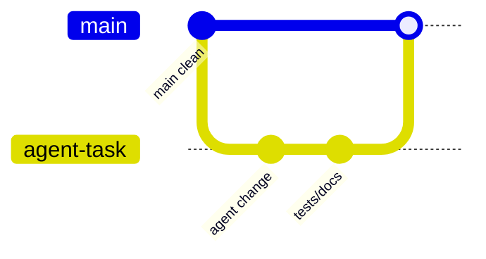

## דרישות קדם - חיבור ל-GitHub CLI

<details open markdown="1"><summary>הוראות התקנה</summary>

**פותחים cmd ומתקינים:**

```powershell
winget install --id GitHub.cli -e
```

**מתחברים:**

```powershell
gh auth login
```


```powershell
git config --global --list
```

**אם לא מוגדר לכם עדיין מייל לגיט הוסיפו באופן הבא (עם השם והמייל שלכם):**

```powershell
git config --global user.name "Your Name"
git config --global user.email "your.email@example.com"
```

עכשיו אפשר לעבוד עם Git מקומי ו־GitHub מה־CLI. לא פחות חשוב: **גם לאייג'נט יותר קל לעבוד. עם `gh` מותקן ומאומת.** סוכנים כמו Claude Code ו-Codex יכולים לבדוק סטטוס של CI, ולתשאל issues/PRs ישירות מה-shell - בלי שתצטרך להעביר להם טוקן API בתוך ה-prompt. זה בעצם מרחיב להם את היכולות מעבר ל-git הבסיסי (commit/push/clone) לכל מה שדורש את ה-API של GitHub. שווה לבדוק שה-scopes שנבחרו ב-`gh auth login` מספיקים למה שתרצה שהסוכן יעשה.

</details>

## למה Git הוא תנאי בסיסי

Agentic Engineering בלי Git הוא כמו מעבדה בלי מחברת ניסוי. אפשר לעבוד, אבל קשה לדעת מה השתנה, למה השתנה, ואיך חוזרים אחורה.

{: .box-success}
בכיתה, Git אינו רק כלי של מפתחים. הוא כלי פדגוגי: הוא מאפשר לראות תהליך, לא רק תוצר.

## שלושת מצבי העבודה

| מצב | שימוש | מתאים למורה? |
|---|---|---|
| Local checkpoint | לפני/אחרי משימה, diff מקומי | כן, חובה כמעט בכל דמו |
| Branch | ניסוי מבודד או עבודת תלמיד | לא הכרחי, מועיל כשיש אתר לייב או הרבה משימות |
| Pull Request | review, דיון, תיעוד החלטות | לא מומלץ בתיכון |
{: .tabl-rl}

## זרימת עבודה בסיסית



## מה לבקש מה־agent

```text
לפני שינוי:
1. בדוק git status.
2. אל תיגע בקבצים שיש בהם שינויים לא קשורים.
3. אחרי השינוי הצג רשימת קבצים ששונו.
4. הרץ בדיקה רלוונטית.
5. סכם מה בדיוק השתנה ומה לא נבדק.
```

## תבנית ל־Pull Request

```md
## What changed
- 

## Why
- 

## Evidence
- [ ] Build passed
- [ ] Unit tests passed
- [ ] Playwright/manual browser check passed

## Risks
- 

## Teacher review notes
- 
```

## נקודת חיבור לאתר הקיים

יש כבר עמוד מפורט על [Pull Requests](/android/projectSteps/202GitPullRequests). בסדרה הזו לא נחליף אותו. נשתמש בו כעמוד עומק ונוסיף את ההקשר החדש: PR כ־review surface לעבודה של agent.

## בדיקות לפני שמקבלים שינוי

1. `git diff` - מה באמת השתנה?
2. build - האם האתר / האפליקציה עדיין נבנים?
3. test - האם ההתנהגות נשמרה?
4. browser - האם המסך נראה נכון?
5. review - האם ההסבר תואם לקוד?

{: .box-note}
כדאי להרגיל תלמידים לסיים כל משימה במשפט: "הראיה שהשינוי עובד היא...". בלי ראיה, זו רק טענה.

## דוגמת פרומפט למורה

```text
עבוד על branch נפרד או worktree אם זמין.
הוסף תרגול קטן, הרץ בדיקות, ואז כתוב לי PR summary.
אל תבצע merge ואל תמחק branches.
```

## מקורות

- [GitHub Pages and Jekyll](https://docs.github.com/github/working-with-github-pages/about-github-pages-and-jekyll)
- [OpenAI Codex app review and Git workflows](https://developers.openai.com/codex/app)
- [Pull Requests באתר זה](/android/projectSteps/202GitPullRequests)
