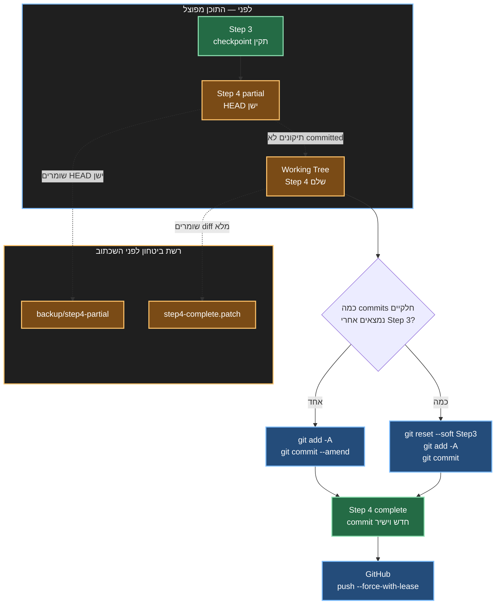

{: .box-note}
זהו פרק המשך ל-[Git ו-GitHub עם Agents]({{ '/agentic/02-git-github' | relative_url }}).
הוא מטפל במקרה נפוץ: ביצענו commit מוקדם מדי, אחר כך השלמנו את השלב בקבצים
שעדיין לא committed, וכעת אנחנו רוצים שההיסטוריה תציג **קומיט שלם אחד**.

[חזרה לפרק 02: Git ו-GitHub עם Agents]({{ '/agentic/02-git-github' | relative_url }})

## המצב

נניח ש-`Step 3` הוא checkpoint תקין. אחריו כבר יצרנו `Step 4 partial`, ואולי
גם דחפנו אותו ל-GitHub. ב-Working Tree נמצאים כעת התיקונים שמשלימים את Step 4.

המטרה אינה לשנות את הקבצים הסופיים. המטרה היא לשנות רק את הסיפור ש-Git מספר:
במקום commit חלקי ואחריו commit תיקון, נקבל commit אחד שמכיל את כל Step 4.



## לפני שמשנים היסטוריה: האם בכלל צריך?

אם צריך רק לראות את כל ההבדל בין Step 3 לבין המצב הנוכחי, אין צורך לשנות
commit אחד:

```powershell
git diff STEP3_COMMIT
git diff --stat STEP3_COMMIT
```

הפקודה משווה את Step 3 ישירות ל-Working Tree הנוכחי ולכן כבר מציגה את השינוי
השלם, גם אם חלק ממנו committed וחלק ממנו עדיין לא.

{: .box-warning}
משכתבים היסטוריה רק כאשר **מבנה ההיסטוריה עצמו הוא חלק מן התוצר** — למשל repo
לימודי שבו כל commit אמור לייצג פרק runnable אחד. בפרויקט צוותי רגיל עדיף
לעיתים להשאיר את ההיסטוריה וליצור commit תיקון נוסף.

## מסלול א: יש commit חלקי אחד — amend

אם ה-commit החלקי הוא `HEAD`, וה-parent שלו הוא כבר ה-checkpoint הנכון, אין
צורך ב-reset. מוסיפים את כל התיקונים ל-staging ומחליפים את ה-commit האחרון:

```powershell
git status
git add -A
git diff --cached --stat
git diff --cached --check
git commit --amend --no-edit
```

`--amend` יוצר commit חדש שמכיל את התוכן הישן ואת כל התיקונים staged. ה-parent
נשאר Step 3, אבל ה-hash משתנה מפני שתוכן ה-commit השתנה.

אם גם הודעת ה-commit החלקי אינה מתאימה, החליפו את השורה האחרונה:

```powershell
git commit --amend -m "Step 4 - complete feature"
```

{: .box-success}
זהו המסלול הקצר והטוב ביותר למקרה שבתמונה: commit חלקי אחד בראש הענף ותיקונים
שעדיין נמצאים ב-Working Tree.

## מסלול ב: יש כמה commits חלקיים — reset --soft

אם Step 4 כבר התפצל לכמה commits, מחזירים את `HEAD` ל-Step 3 בלי לשנות את
הקבצים, ואז יוצרים מהם commit אחד.

### 1. מזהים את הגבול המדויק

```powershell
git log --oneline --decorate --graph -8
git status
```

שמרו את ה-hash המלא של ה-checkpoint התקין, לדוגמה:

```text
b5c36a00a8aaf1446ea594e56550725b59715370
```

### 2. יוצרים שתי נקודות התאוששות

ה-branch שומר את ה-commit הישן. ה-patch שומר את **כל ההבדל מן checkpoint ועד
ל-Working Tree**, כולל החלק שכבר committed והחלק שעדיין לא:

```powershell
git branch backup/step4-partial HEAD
git diff --binary STEP3_COMMIT --output=C:/Temp/step4-complete.patch
```

בדקו שה-patch אכן מכיל את הקבצים הצפויים:

```powershell
git apply --stat C:/Temp/step4-complete.patch
git apply --numstat C:/Temp/step4-complete.patch
```

### 3. מזיזים רק את HEAD

```powershell
git reset --soft STEP3_COMMIT
```

`--soft` אינו מחליף את קובצי העבודה ואינו מוחק את התיקונים. הוא מזיז את
`HEAD` בלבד:

- השינויים שהיו ב-commits החלקיים מופיעים כעת staged;
- התיקונים שהיו ב-Working Tree נשארים unstaged;
- הקבצים עצמם נשארים בגרסה המלאה שעבדה לפני ה-reset.

### 4. מאחדים את שני החלקים ב-staging

```powershell
git add -A
git status
git diff --cached --name-status
git diff --cached --stat
git diff --cached --check
```

בנקודה זו `git diff --cached` צריך להציג בדיוק את המעבר המלא מ-Step 3 ל-Step
4 — לא רק את התיקון האחרון.

### 5. בונים ובודקים לפני commit

הריצו את הבדיקה שמתאימה לפרויקט: build, lint, הרצה ידנית או בדיקת דפדפן.
שכתוב ההיסטוריה אינו תחליף לבדיקה שה-tree הסופי באמת עובד.

```powershell
git diff --cached
```

רק לאחר שה-diff והיישום נכונים:

```powershell
git commit -m "Step 4 - complete feature"
```

## אם ה-commit החלקי כבר נמצא ב-GitHub

גם `amend` וגם `reset --soft` יוצרים hash חדש. לכן push רגיל יידחה. לאחר
שבודקים שאיש אחר לא בנה עבודה חדשה על ה-commit הישן:

```powershell
git push --force-with-lease origin master
```

{: .box-error}
אל תשתמשו ב-`git push --force` כאשר `--force-with-lease` מספיק. ה-lease מסרב
לדרוס את הענף המרוחק אם הוא השתנה מאז הפעם האחרונה שראינו אותו.

ודאו שה-local וה-remote מצביעים לאותו commit:

```powershell
git fetch origin master
git rev-parse master
git rev-parse origin/master
git log --oneline --decorate --graph -6
git status
```

## למה stash לבדו אינו מספיק כאן?

`git stash` שומר את השינויים שטרם committed ביחס ל-`HEAD` הנוכחי. במקרה שלנו
הוא ישמור רק את **התיקון** ל-Step 4 partial. אם נחזור לאחר מכן ל-Step 3,
ה-stash לבדו אינו מכיל בהכרח את כל מה שכבר נכנס ל-commit החלקי.

לכן בוחרים באחד מאלה:

- `amend` כאשר יש commit חלקי אחד;
- `reset --soft` כאשר מאחדים כמה commits וה-Working Tree צריך להישאר;
- patch שנוצר מול `STEP3_COMMIT` כעותק התאוששות של המעבר השלם.

## טבלת החלטה מהירה

{: .table-he}

| המטרה | הפעולה המתאימה |
|---|---|
| רק לראות diff מלא | `git diff STEP3_COMMIT` |
| להשלים את commit האחרון | `git add -A` ואז `git commit --amend` |
| לאחד כמה commits מאז checkpoint | `git reset --soft STEP3_COMMIT`,‏ `git add -A`,‏ commit חדש |
| לשמור עותק לפני השכתוב | backup branch וגם patch מול ה-checkpoint |
| לעדכן commit שכבר pushed | `git push --force-with-lease` |
| לעבוד בענף צוותי פעיל | בדרך כלל לא לשכתב; ליצור commit תיקון או PR |

## checklist לפני שמסיימים

- ה-checkpoint שנבחר הוא באמת ה-parent הרצוי.
- קיימת נקודת התאוששות שאינה תלויה בזיכרון שלנו.
- `git diff --cached` מציג את כל השלב ורק את השלב.
- ה-build או הבדיקה הרלוונטית עברו על ה-tree הסופי.
- `git status` נקי אחרי ה-commit.
- אם בוצע force-push,‏ `HEAD` ו-`origin/master` מצביעים לאותו hash.
- ה-backup נשאר עד שמוודאים שהגרסה החדשה תקינה.

{: .box-success}
העיקרון החשוב: מפרידים בין **תוכן הקבצים** לבין **המצביעים של Git**. `amend`
או `reset --soft` מאפשרים לתקן את סיפור ההיסטוריה בלי לזרוק את ה-Working Tree
השלם שכבר בנינו.
