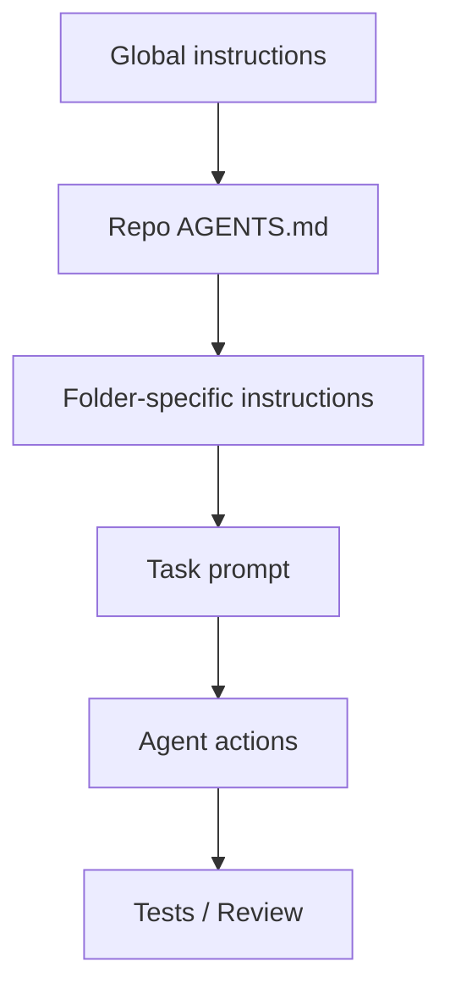
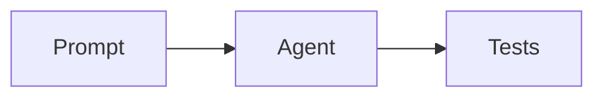

## הרעיון המרכזי

Agentic Engineering אינו "קסם פרומפטים". הוא הנדסת מפרטים:

- מה הפרויקט?
- איך בונים?
- איך בודקים?
- מה אסור לעשות?
- מה נחשב "גמור"?
- איזה סגנון כתיבה וקוד מקובל כאן?

{: .box-success}
Markdown הוא השפה הפשוטה ביותר לתיעוד כזה: קריא לבני אדם, קריא ל־agents, נכנס ל־Git, ונבנה לאתר.

## שכבות הוראות



## AGENTS.md

`AGENTS.md` הוא קובץ הוראות לפרויקט. לפי תיעוד Codex, הוא נטען כהקשר קבוע ומאפשר להגדיר מוסכמות עבודה, פקודות build/test, גבולות, ותנאי סיום.

תוכן מומלץ:

```md
# AGENTS.md

## Project layout
- Lessons live under `android/projectSteps`.
- Interactive pages live under `interactive`.

## Commands
- Build: `bundle exec jekyll build`

## Rules
- Keep edits scoped.
- Do not rewrite unrelated lessons.
- After editing, run the build.
```

## Skills

Skill הוא workflow ארוז. במקום לכתוב כל פעם:

```text
צור דף שאלון אינטראקטיבי לפי הדפוס של interactive/...
```

אפשר ליצור skill שמתאר:

- מתי להשתמש בו.
- אילו קבצים לקרוא כדוגמה.
- איזה מבנה front matter צריך.
- איך להריץ verification.

## Docs רגילים

לא כל דבר צריך להיות skill. לפעמים מספיק:

- `README.md`
- `docs/testing.md`
- `docs/deploy.md`
- `docs/code_review.md`
- `DIFF_RULES.md`

הכלל הפשוט:

| צורך | פתרון |
|---|---|
| כלל קבוע לכל repo | `AGENTS.md` |
| workflow שחוזר הרבה | skill |
| הסבר לבני אדם | Markdown doc |
| בדיקה אוטומטית | test / script |
{: .tabl-rl}

## Kramdown באתר הזה

באתר הזה אפשר להשתמש ביכולות שמעשירות הוראה:

```md
{: .box-note}
זוהי הערה חשובה לתלמידים.

{: .box-success}
זהו סיכום חיובי או checkpoint שעבר.
```

טבלה עם מחלקה:

```md
| עברית | English |
|---|---|
| בדיקה | Test |
{: .tabl-rl}
```

תרשים:

````md

````

## דף מפרט למשימה

לפני שמבקשים מ־agent לבנות משהו משמעותי, כתבו דף קצר:

```md
# Feature spec

## Goal

## User flow

## Constraints

## Done when

## Tests
```

{: .box-note}
מפרט טוב אינו ארוך בהכרח. הוא מדויק. עדיף חמישה סעיפים אמיתיים מעמוד של ניסוחים כלליים.

## קישור פנימי

ראו גם את [הסיפור מאחורי GitHub Pages](/2025-04-27-github-pages-story/) ואת הדוגמאות הקיימות לשימוש ב־Mermaid, תיבות וטבלאות ברחבי האתר.

## מקורות

- [OpenAI AGENTS.md guide](https://developers.openai.com/codex/guides/agents-md)
- [OpenAI Agent Skills](https://developers.openai.com/codex/skills)
- [GitHub Pages and Jekyll front matter](https://docs.github.com/github/working-with-github-pages/about-github-pages-and-jekyll)
