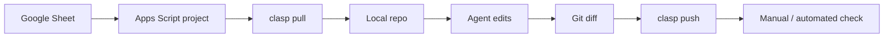



## למה דווקא Sheets?

הרבה מורים כבר עובדים עם Google Sheets: ציונים, נוכחות, משימות, קבוצות, קישורים, מעקב הגשות. לכן Apps Script הוא גשר טבעי בין "כלי משרדי" לבין engineering.

{: .box-note}
בסקירת האתר לא מצאתי עמוד קיים שמלמד Google Sheets / Apps Script / clasp, ולכן העמוד הזה נבנה כעמוד עבודה מעשי מהפקודות שסופקו כאן.

## מה זה clasp?

`clasp` הוא כלי command-line רשמי של Google לפיתוח וניהול Apps Script מהמחשב המקומי. לפי תיעוד Google, הוא מאפשר לעבוד מקומית, להשתמש ב־Git, לנהל גרסאות ו־deployments, ולסדר קוד בתיקיות.

## למה זה agentic?

Apps Script רגיל בדפדפן:

```text
פותחים editor, כותבים קוד, מריצים ידנית.
```

Apps Script עם clasp ו־agent:

```text
repo מקומי -> agent עורך קוד -> tests / lint -> git diff -> clasp push -> בדיקה ב-Sheets
```



## התקנה מלאה למורים / תלמידים ב-Windows

[סרטון הדרכה: שימוש ב-clasp](https://youtu.be/pWj0OJdWC60)

### 1. התקנת Node.js

```powershell
winget install --id OpenJS.NodeJS.LTS -e --source winget
```

בדיקה:

```powershell
node -v
npm -v
```

### 2. התקנת clasp

```powershell
npm i -g @google/clasp
```

בדיקה:

```powershell
clasp --version
```

{: .box-note}
אם `clasp` לא מזוהה אחרי ההתקנה, סגרו ופתחו מחדש terminal. לעיתים PATH מתעדכן רק ב־session חדש.

## יצירת תיקיית עבודה

```powershell
cd C:\Users\<user>\source\repos
mkdir SubmissionProcessor
cd SubmissionProcessor
```

בדוגמה המקורית הופיעו שני שמות: `SubmissionProcessor` ו־`AppScTestGrader`. בחרו שם אחד ושמרו עליו לאורך כל העבודה.
{: .box-note}

## התחברות ל-Google

```powershell
clasp login
```

הפקודה תפתח browser ותבקש הרשאה לחשבון Google שבו נמצא פרויקט Apps Script.

## Clone לפרויקט Apps Script קיים

```powershell
clasp clone 1ayD8nA5N9yz0QyS0JM30tCeSVjQz0KOaqU4v191DowZoTwJWiNcXvNgY
```

פלט צפוי:

```text
└─ appsscript.json
└─ Code.js
└─ ClassroomIntegration.js
Cloned 3 files.
```

אחרי clone אמורים להיות בתיקייה:

```text
SubmissionProcessor/
├── .clasp.json
├── appsscript.json
├── Code.js
└── ClassroomIntegration.js
```

## פקודות עבודה כלליות

| פקודה | שימוש |
|---|---|
| `clasp pull` | הורדה וסנכרון מ־Apps Script אל המחשב |
| `clasp push` | העלאת השינויים המקומיים חזרה ל־Apps Script |
| `clasp open` | פתיחת הפרויקט בעורך Apps Script בדפדפן |
| `git add -A` | הוספת כל השינויים ל־Git staging |
| `git commit -m "message"` | שמירת checkpoint מקומי |
| `git push` | דחיפה ל־GitHub |
{: .tabl-rl}

{: .box-success}
סדר העבודה הבריא הוא: `clasp pull`, עבודה מקומית, `git diff`, commit, ואז `clasp push`. כך לא דורסים בטעות עבודה שנעשתה בדפדפן.

## חיבור ל-GitHub CLI

מתקינים:

```powershell
winget install --id GitHub.cli -e
```

מתחברים:

```powershell
gh auth login
```

עכשיו אפשר לעבוד עם Git מקומי ו־GitHub מה־CLI.

## יצירת repo פרטי ב-GitHub ודחיפה ראשונה

מתוך תיקיית הפרויקט:

```powershell
git add -A
git commit -m "version capable of LLM feedback on all submissions"
```

יצירת repo מרוחק, הגדרת `origin`, ודחיפת הענף הנוכחי בפקודה אחת:

```powershell
gh repo create 3strategy/AppScTalEng --private --source . --remote origin --push
```

{: .box-note}
החליפו את `3strategy/AppScTalEng` בשם ה־GitHub organization/user וה־repo שלכם. לתרגול תלמידים מומלץ repo פרטי אם יש מידע רגיש או תוצרי בדיקה.

בהמשך העבודה:

```powershell
git add -A
git commit -m "msg"
git push
```

או, אחרי שכבר הוספתם קבצים ל־staging:

```powershell
git commit -m "msg" && git push
```

## מבנה repo מומלץ

```text
SubmissionProcessor/
├── AGENTS.md
├── .clasp.json
├── appsscript.json
├── Code.js
├── ClassroomIntegration.js
├── docs/
│   └── teacher-workflow.md
└── test-data/
    └── sample-grades.csv
```

## AGENTS.md לפרויקט Sheets

```md
# AGENTS.md

## Context
This repo contains Google Apps Script code managed with clasp.

## Rules
- Never hardcode student private data.
- Use sample data under `test-data/`.
- Before `clasp push`, show the diff and summarize changed functions.
- Prefer small pure helper functions that can be tested locally.

## Done when
- The script still opens the custom menu.
- The changed function has a small sample-input explanation.
- No real student data appears in the diff.
```

## דוגמת משימה למורה

```text
הפרויקט המקומי מחובר ל-Apps Script דרך clasp.
קרא את Code.js ואת ClassroomIntegration.js.
הוסף יכולת קטנה לעיבוד submissions.
לפני שינוי הרץ clasp pull.
אחרי שינוי הצג git diff.
אל תריץ clasp push לפני שסיכמת לי מה השתנה.
```

דוגמה ממוקדת יותר:

```text
הוסף פונקציה שמכינה משוב LLM לכל submission.
הפונקציה תקבל נתוני submission ותייצר אובייקט feedback.
אל תקרא ל-API אמיתי עדיין.
כתוב פונקציית helper טהורה שאפשר לבדוק עם sample data.
בסוף תן לי פקודות clasp/git להמשך.
```

## מה חשוב ללמד

| נושא | למה הוא חשוב |
|---|---|
| `winget install OpenJS.NodeJS.LTS` | בלי Node אין npm ואין clasp |
| `npm i -g @google/clasp` | התקנת כלי הסנכרון |
| `clasp login` | הרשאת גישה לחשבון Google |
| `clasp pull` לפני עבודה | לא לדרוס קוד שנערך בדפדפן |
| `clasp push` אחרי review | לא לשלוח קוד לא בדוק |
| `.clasp.json` | קישור ל־scriptId, לא לערבב פרויקטים |
| `appsscript.json` | הרשאות, timezone, runtime |
| `gh auth login` | חיבור נוח ליצירת repo ודחיפה |
| sample data | להגן על פרטיות תלמידים |
{: .tabl-rl}

## נקודות זהירות

- לא להכניס שמות תלמידים או מזהים אמיתיים לפרומפטים.
- לא להעלות `.clasp.json` אם מדיניות בית הספר לא מאפשרת חשיפת scriptId.
- לא לתת ל־agent הרשאה חופשית למחוק deployments.
- לא לדחוף בלי `git diff`.
- להעדיף פונקציות קטנות שמקבלות ערכים ומחזירות ערכים.
- לא לבצע `clasp push` בלי לוודא שאתם מחוברים לפרויקט הנכון.

## מקורות

- [Google Apps Script clasp documentation](https://developers.google.com/apps-script/guides/clasp)
- [Google Apps Script Spreadsheet service](https://developers.google.com/apps-script/reference/spreadsheet)
