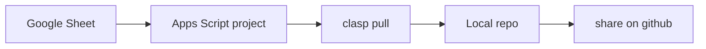
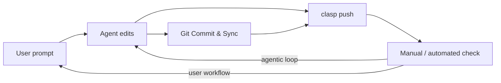
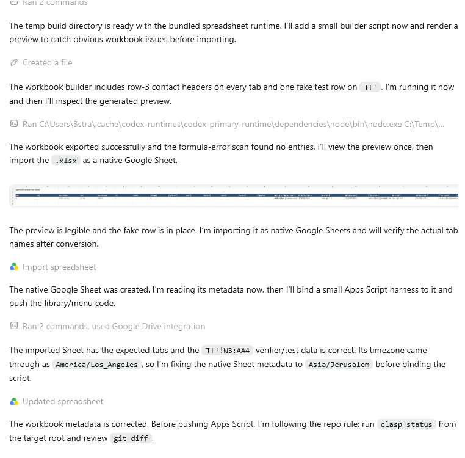
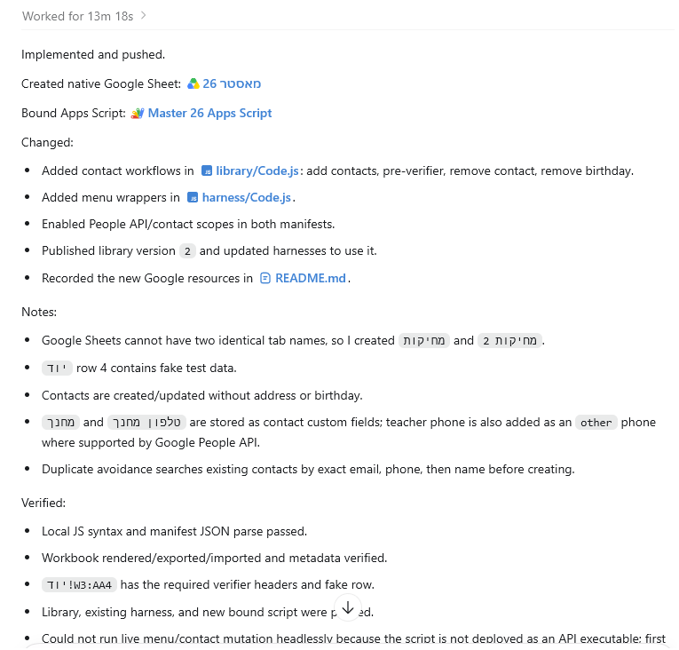
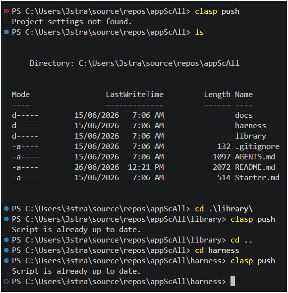
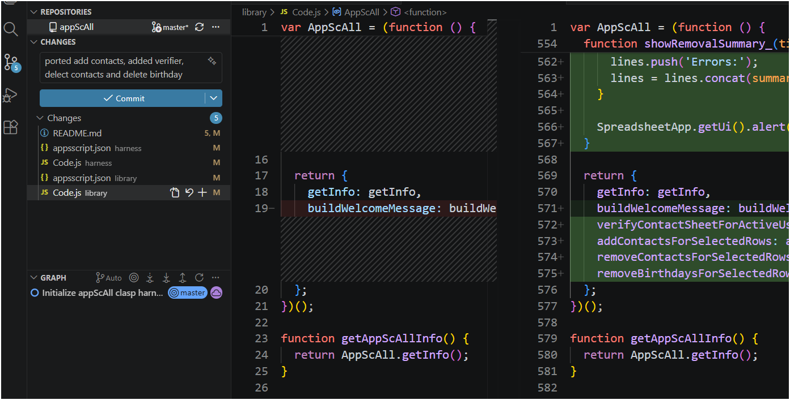

{: .box-note}
הרבה מורים כבר עובדים עם Google Sheets: ציונים, נוכחות, משימות, קבוצות, קישורים, מעקב הגשות. לכן Apps Script הוא גשר טבעי בין "כלי משרדי" לבין engineering.



## מה זה clasp?

`clasp` הוא כלי command-line רשמי של Google לפיתוח וניהול Apps Script מהמחשב המקומי. לפי תיעוד Google, הוא מאפשר לעבוד מקומית, להשתמש ב־Git, לנהל גרסאות ו־deployments, ולסדר קוד בתיקיות.

## למה זה agentic?

{: .table-rl}

| Apps Script רגיל בדפדפן | Apps Script עם clasp ו־agent|
| --- | --- |
| פותחים editor, כותבים קוד, מריצים ידנית | repo מקומי ⟶ agent עורך קוד ⟶ tests / lint ⟶ git diff ⟶ clasp push ⟶ בדיקה ב-Sheets |

## הכנת פרוייקט



## עבודה שוטפת



## התקנה מקוצרת - בעזרת ה-AGENT
כיוון שעבר הרבה זמן מאז שניסחתי את אוסף הפקודות בהמשך הדף אמרתי לעצמי שאפשר לנסות לתת ל-Agent לעשות הכל

<details markdown="1" ><summary>זה הפרומפט שנתתי לו כדי לבנות harness ולא סתם עוד סקריפט</summary>

<div class="english" markdown="1">
I want you to setup a clasp project from scratch:

- this project's folder is empty,
- no git no google sheets exist yet,
- clasp cli, node etc are installed on the machine.

I want you create the harness. It should have:

1. a new appScript project
2. initially, one google sheet (can start an empty one) connected to it.
3. This folder for local repo that will be used for clasp push mostly (probably initially a clasp pull once you have the appScript projectd ID)
4. a git repo on github where we will keep our repo's backup.

Before you begin, if you think this is just an outdated architecture, tell me.

This project will eventually centralize many differnt use case I have across sheets, that repeat every school year, but esenctially we repeat the same stuff on new students, new classrooms, and it's non-sensical to keep duplicating the code and managing new repos every year.

Capabilities such as classroom interaction, google contacts interaction, calendar interactions are the type of stuff that we will later add to the project, mostly taking exising code that's already here in various repos that are clasp repos.

also, I intend to repeat this process with teachers I'll teach. If there's a better shorter promt that will achieve what we are doing here, give it to me as Starter.md as part of your output.

Previously I intended to teach this thoroghly using the content I prepared here: \\wsl.localhost\Ubuntu\home\stra\repos\BeautifulMivney\agentic\04-apps-script-clasp-sheets.md but now, I have doubts and think Codex is simply capable of just doing this setup all on its own. In that sense, this prompt is also an agentic test.
</div>

</details>

<details markdown="1"><summary>דוגמא לפרומפט המשך</summary>

### הרבה דרישות, ירידה לפרטים, מחשבה על צריכים עתידיים וכלילת כל מה שקשור/באזור של הפונקציונליות המבוקשת

הגישה כאן - לצורך ההדגמה - מעט חסרת רחמים, אבל הגישה צריכה להיות לחלום בגדול. לדחוף את המעטפת. זה שאני יכולתי בכמה שניות ליצור בעצמי את ה-sheet לא מעניין, כי ככה לא אתקדם ולא אכיר איפה נמצאים הגבולות.

יש לגישה כזו מחירים יקרים ב-quota. במצב של מצוקה ב-quota ההתנהלות תהיה שונה לגמרי, ואשתדל לעשות מה שקל לי לעשות בעצמי, ולהשאיר לאייג'נט מה שבאמת יכול לעזור לי. הפרומפט הורץ ב-high. לגבי רמת המאמץ - בוחרים לפי אינטואיציה ונסיון.

{: .english}

1. Create a new gogole workbook called `מאסטר 26`, with sheets יוד, יא, יב, מחיקות, פרטי, השתלמות1, מבחנים, מחיקות and attach it to the library.
2. Port into the library the "1.add contacts" functionality from [https://docs.google.com/spreadsheets/d/1TwbWgoj6WBMOA4vUyfU4Imyhf8A_zX5U-AYukhnvo7w/edit?gid=0#gid=0](https://docs.google.com/spreadsheets/d/1TwbWgoj6WBMOA4vUyfU4Imyhf8A_zX5U-AYukhnvo7w/edit?gid=0#gid=0) that handles contacts.
3. Add `contact pre-verifier` (qualifier) that checks if the sheet includes columns W X Y Z AA containing מגמה,	תאריך עליה,	פנימיה,	מחנך,	טלפון מחנך headers in row 3. If missing the verifier will pop and alert (asking the user to export or otherwise provide the info),and the script will add these columns manually. Verifier should also check sheet is active on user 3strategy since all my contacts are manage through this account.
4. If needed, modify `add contacts` so that the contacts are added without address and without birthday (I believe this is already the case there)
5. Modify `add contacts` so that (as much as supported by google) you'll add the fields מחנך from Z and טלפון מחנך from AA to the contact.
6. Make sure add contacts tries to update and not creating duplicates for nothing. This should already be the case.
7. Add a `remove contact` that removes selected contact row(s) from google contacts.
8. Add a `remove birdthday` that removes a birthday from selected contact row(s) from the respective google contact(s).
9. You may write a fake data in row 4 of sheet יוד for testing your added functionality (if you think you can activate playwright or playwright cli on the menu functions you created). If not, I'll test, but alternatively you may try to fire the functions directly, headless (if that's even possible in google appscript)



**סיים אחרי 13 דקות כשהוא מציג לינקים פעילים שגם נוספו ל-README.**

**עלות:**

- 5h from 84% ⟶ 59%
- weekly from 98% ⟶ 94%



**קצת הרגלים ישנים שפתאום מיותרים?!**
קודקס כבר דחף לגוגל


ועוד הרגלים ישנים (ניהול גרסאות) שעליהם אני לא מוותר


</details>

## התקנה "ארוכה" כל השלבים כמו פעם-Windows

[סרטון הדרכה: שימוש ב-clasp](https://youtu.be/pWj0OJdWC60)

### 1. התקנת Node.js

```powershell
winget install --id OpenJS.NodeJS.LTS -e --source winget
```

בדיקה:

```powershell
node -v
npm -v
```

### 2. התקנת clasp

```powershell
npm i -g @google/clasp
```

בדיקה:

```powershell
clasp --version
```

{: .box-note}
אם `clasp` לא מזוהה אחרי ההתקנה, סגרו ופתחו מחדש terminal. לעיתים PATH מתעדכן רק ב־session חדש.

## יצירת תיקיית עבודה

```powershell
cd C:\Users\<user>\source\repos
mkdir SubmissionProcessor
cd SubmissionProcessor
```

בדוגמה המקורית הופיעו שני שמות: `SubmissionProcessor` ו־`AppScTestGrader`. בחרו שם אחד ושמרו עליו לאורך כל העבודה.
{: .box-note}

## התחברות ל-Google

```powershell
clasp login
```

הפקודה תפתח browser ותבקש הרשאה לחשבון Google שבו נמצא פרויקט Apps Script.

## Clone לפרויקט Apps Script קיים

```powershell
clasp clone 1ayD8nA5N9yz0QyS0JM30tCeSVjQz0KOaqU4v191DowZoTwJWiNcXvNgY
```

פלט צפוי:

```text
└─ appsscript.json
└─ Code.js
└─ ClassroomIntegration.js
Cloned 3 files.
```

אחרי clone אמורים להיות בתיקייה:

```text
SubmissionProcessor/
├── .clasp.json
├── appsscript.json
├── Code.js
└── ClassroomIntegration.js
```

## פקודות עבודה כלליות

| פקודה | שימוש |
|---|---|
| `clasp pull` | הורדה וסנכרון מ־Apps Script אל המחשב |
| `clasp push` | העלאת השינויים המקומיים חזרה ל־Apps Script |
| `clasp open` | פתיחת הפרויקט בעורך Apps Script בדפדפן |
| `git add -A` | הוספת כל השינויים ל־Git staging |
| `git commit -m "message"` | שמירת checkpoint מקומי |
| `git push` | דחיפה ל־GitHub |
{: .tabl-rl}

{: .box-success}
סדר העבודה הבריא הוא: `clasp pull`, עבודה מקומית, `git diff`, commit, ואז `clasp push`. כך לא דורסים בטעות עבודה שנעשתה בדפדפן.

## חיבור ל-GitHub CLI

**מתקינים:**

```powershell
winget install --id GitHub.cli -e
```

**מתחברים:**

```powershell
gh auth login
```

עכשיו אפשר לעבוד עם Git מקומי ו־GitHub מה־CLI.

## יצירת repo פרטי ב-GitHub ודחיפה ראשונה

מתוך תיקיית הפרויקט:

```powershell
git add -A
git commit -m "version capable of LLM feedback on all submissions"
```

יצירת repo מרוחק, הגדרת `origin`, ודחיפת הענף הנוכחי בפקודה אחת:

```powershell
gh repo create 3strategy/AppScTalEng --private --source . --remote origin --push
```

{: .box-note}
החליפו את `3strategy/AppScTalEng` בשם ה־GitHub organization/user וה־repo שלכם. לתרגול תלמידים מומלץ repo פרטי אם יש מידע רגיש או תוצרי בדיקה.

בהמשך העבודה:

```powershell
git add -A
git commit -m "msg"
git push
```

או, אחרי שכבר הוספתם קבצים ל־staging:

```powershell
git commit -m "msg" && git push
```

## מבנה repo מומלץ

```text
SubmissionProcessor/
├── AGENTS.md
├── .clasp.json
├── appsscript.json
├── Code.js
├── ClassroomIntegration.js
├── docs/
│   └── teacher-workflow.md
└── test-data/
    └── sample-grades.csv
```

## AGENTS.md לפרויקט Sheets

```md
# AGENTS.md

## Context
This repo contains Google Apps Script code managed with clasp.

## Rules
- Never hardcode student private data.
- Use sample data under `test-data/`.
- Before `clasp push`, show the diff and summarize changed functions.
- Prefer small pure helper functions that can be tested locally.

## Done when
- The script still opens the custom menu.
- The changed function has a small sample-input explanation.
- No real student data appears in the diff.
```

## דוגמת משימה למורה

```text
הפרויקט המקומי מחובר ל-Apps Script דרך clasp.
קרא את Code.js ואת ClassroomIntegration.js.
הוסף יכולת קטנה לעיבוד submissions.
לפני שינוי הרץ clasp pull.
אחרי שינוי הצג git diff.
אל תריץ clasp push לפני שסיכמת לי מה השתנה.
```

דוגמה ממוקדת יותר:

```text
הוסף פונקציה שמכינה משוב LLM לכל submission.
הפונקציה תקבל נתוני submission ותייצר אובייקט feedback.
אל תקרא ל-API אמיתי עדיין.
כתוב פונקציית helper טהורה שאפשר לבדוק עם sample data.
בסוף תן לי פקודות clasp/git להמשך.
```

## מה חשוב ללמד

| נושא | למה הוא חשוב |
|---|---|
| `winget install OpenJS.NodeJS.LTS` | בלי Node אין npm ואין clasp |
| `npm i -g @google/clasp` | התקנת כלי הסנכרון |
| `clasp login` | הרשאת גישה לחשבון Google |
| `clasp pull` לפני עבודה | לא לדרוס קוד שנערך בדפדפן |
| `clasp push` אחרי review | לא לשלוח קוד לא בדוק |
| `.clasp.json` | קישור ל־scriptId, לא לערבב פרויקטים |
| `appsscript.json` | הרשאות, timezone, runtime |
| `gh auth login` | חיבור נוח ליצירת repo ודחיפה |
| sample data | להגן על פרטיות תלמידים |
{: .tabl-rl}

## נקודות זהירות

- לא להכניס שמות תלמידים או מזהים אמיתיים לפרומפטים.
- לא להעלות `.clasp.json` אם מדיניות בית הספר לא מאפשרת חשיפת scriptId.
- לא לתת ל־agent הרשאה חופשית למחוק deployments.
- לא לדחוף בלי `git diff`.
- להעדיף פונקציות קטנות שמקבלות ערכים ומחזירות ערכים.
- לא לבצע `clasp push` בלי לוודא שאתם מחוברים לפרויקט הנכון.

## מקורות

- [Google Apps Script clasp documentation](https://developers.google.com/apps-script/guides/clasp)
- [Google Apps Script Spreadsheet service](https://developers.google.com/apps-script/reference/spreadsheet)
