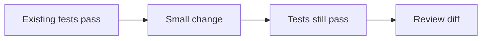
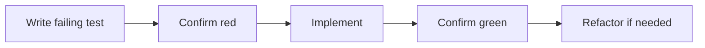

## הבעיה

Agent יכול לעבוד הרבה זמן. זו גם ההזדמנות וגם הסכנה. בלי בדיקות, עבודה ארוכה מגדילה את הסיכוי לסטייה. עם בדיקות, עבודה ארוכה יכולה להפוך למחזור תיקון עצמאי.

{: .box-success}
הדרך לגרום ל־agent לעבוד יותר זמן אינה "תמשיך עד שתצליח". הדרך היא לתת לו לולאת בדיקה.

## שתי לולאות TDD

### Green-green

מתאים לשינוי קטן במערכת קיימת:



### Red-green

מתאים לבאג או פיצ'ר:



## מה לבקש מה־agent

```text
עבוד בלולאת red-green:
1. כתוב בדיקה קטנה שנכשלת בגלל ההתנהגות החסרה.
2. הרץ אותה והראה שהיא נכשלת.
3. תקן את הקוד במינימום שינוי.
4. הרץ שוב והראה שהבדיקה עוברת.
5. הרץ את הבדיקות הרלוונטיות הרחבות יותר.
```

## Unit tests

Unit tests טובים ל:

- פונקציות טהורות.
- חישובים.
- parsing.
- validation.
- מודלים כמו משחק, רשימה, ניקוד, מצב.

בכיתה כדאי להתחיל מפונקציה פשוטה:

```js
function isPassingGrade(grade) {
  return grade >= 55;
}
```

ואז לבקש:

```text
כתוב בדיקות גבול ל-isPassingGrade:
54, 55, 100, ערך חסר.
```

## E2E tests

E2E בודק user flow שלם:

- פתיחת דף.
- לחיצה.
- מילוי טופס.
- בדיקת טקסט או מצב.
- צילום מסך או trace כשנכשל.

כאן Playwright נכנס לתמונה.

## רמות ראיה

| ראיה | מה היא מוכיחה | מה היא לא מוכיחה |
|---|---|---|
| `npm test` passed | לוגיקה נבדקה | UI אמיתי לא בהכרח נראה טוב |
| `bundle exec jekyll build` | האתר נבנה | לא ראינו layout בדפדפן |
| Playwright passed | flow בדפדפן עבד | לא כל עיצוב נבדק |
| screenshot | מצב חזותי ספציפי | לא מוכיח את כל המסלולים |
| manual review | שיקול דעת אנושי | קשה לשחזור |
{: .tabl-rl}

## Done when

כל משימה ארוכה צריכה לכלול `Done when`:

```md
## Done when
- Existing tests pass.
- A focused test covers the new behavior.
- The app builds.
- The changed screen was opened in browser.
- The final answer lists commands and results.
```

{: .box-note}
לתלמידים כדאי להגיד: "אל תגידו שה־AI פתר. תגידו איזו בדיקה גרמה לכם להאמין שהפתרון נכון."

## מקורות

- [OpenAI Codex best practices - testing and review](https://developers.openai.com/codex/learn/best-practices)
- [Playwright running and debugging tests](https://playwright.dev/docs/running-tests)
