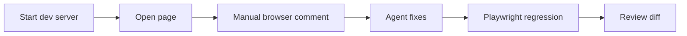

## למה Playwright?

Unit tests בודקים פונקציות. Playwright בודק התנהגות בדפדפן: האם הכפתור באמת לחיץ, האם הטופס עובד, האם הטקסט מופיע, האם המסך לא נשבר במובייל.

{: .box-success}
Playwright הוא אחד הכלים החשובים ביותר ל־Agentic Engineering, כי הוא נותן ל־agent דרך לראות תוצאה ולא רק לכתוב קוד.

## פקודות בסיסיות

```bash
npx playwright test
npx playwright test --headed
npx playwright test --ui
npx playwright show-report
```

לפי תיעוד Playwright, בדיקות רצות כברירת מחדל במקביל וב־headless. כדי לראות חלון דפדפן משתמשים ב־`--headed`, וכדי לדבג נוח יותר אפשר להשתמש ב־`--ui`.

## Headed מול Headless

| מצב | שימוש | יתרון | חיסרון |
|---|---|---|---|
| Headless | CI, ריצה מהירה, agent loop | מהיר ויציב | לא רואים בעין |
| Headed | דמו, debugging, הוראה | רואים את הדפדפן | איטי יותר |
| UI mode | חקירת כשל | trace וזמן ריצה נוח | פחות מתאים ל־CI |
{: .tabl-rl}

## Attach מול CDP

יש שתי משפחות חיבור:

- Playwright רגיל פותח ומנהל browser context משלו.
- CDP (`connectOverCDP`) מתחבר לדפדפן Chromium קיים דרך Chrome DevTools Protocol.

```js
const { chromium } = require("playwright");

const browser = await chromium.connectOverCDP("http://localhost:9222");
const context = browser.contexts()[0];
const page = context.pages()[0];
```

לפי תיעוד Playwright, CDP נתמך רק בדפדפני Chromium והוא נמוך יותר בנאמנות לעומת חיבור Playwright רגיל. לכן:

| צורך | בחירה מומלצת |
|---|---|
| בדיקות CI רגילות | Playwright רגיל |
| התחברות לדפדפן שכבר פתוח | CDP |
| שימוש ב־session מחובר | CDP או browser profile בזהירות |
| בדיקה יציבה לשיעור | Playwright רגיל + headed |
{: .tabl-rl}

## playwright-cli

יש גם CLI agentic ל־Playwright שמאפשר לפתוח, לצפות, ולצרף לדפדפן. לפי התיעוד שלו:

```bash
playwright-cli open https://example.com --headed
playwright-cli open --browser=chrome https://example.com
playwright-cli attach --cdp http://localhost:9222
```

## Codex in-app browser

ב־Codex app יש דפדפן פנימי שמאפשר לך ול־Codex לראות אותו עמוד בתוך thread. לפי תיעוד OpenAI, הוא מתאים ל:

- local development servers.
- file-backed previews.
- public pages ללא login.
- הערות חזותיות על אזורים בדף.
- browser use דרך Browser plugin: לחיצה, הקלדה, צילום מסך, בדיקה של תיקון.

מגבלה חשובה: הדפדפן הפנימי אינו משתמש בפרופיל הדפדפן הרגיל שלך, cookies, extensions או session מחובר. לדפים שדורשים login יש להשתמש בדפדפן רגיל או ב־Codex Chrome extension.

{: .box-note}
בהוראה זה יתרון: אפשר להראות בדיקה חזותית בלי להכניס את המורה או התלמיד לתוך חשבון אישי.

## Codex browser plugin

כאשר Browser plugin זמין, אפשר לבקש:

```text
Use the browser to open http://localhost:4000/agentic/00-opener,
check that the table and Mermaid diagram render, and report any layout issue.
```

עבור אתר מקומי:

```text
הפעל את שרת Jekyll, פתח את העמוד החדש בדפדפן הפנימי,
בדוק שאין overflow במובייל, ותקן רק בעיות layout.
```

## דפוס עבודה מומלץ



## תרגיל למורים

1. צרו דף HTML קטן עם טופס.
2. בקשו מה־agent להוסיף בדיקת Playwright.
3. שברו בכוונה selector.
4. בקשו מה־agent לתקן לפי trace.
5. פתחו בדפדפן הפנימי של Codex והשאירו הערה על כפתור צפוף.

## מקורות

- [Playwright running tests](https://playwright.dev/docs/running-tests)
- [Playwright connectOverCDP](https://playwright.dev/docs/api/class-browsertype#browser-type-connect-over-cdp)
- [Playwright CLI configuration](https://playwright.dev/agent-cli/configuration)
- [OpenAI Codex in-app browser](https://developers.openai.com/codex/app/browser)
