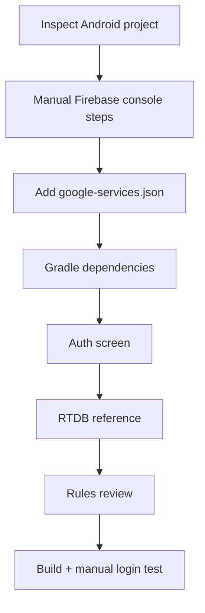

## הבעיה

Firebase הוא אזור שבו agents נוטים "להשלים מהראש": גרסאות Gradle, rules, שמות packages, `google-services.json`, Authentication, RTDB, Firestore. לכן צריך prompt ראשון שמגדיר גבולות.

{: .box-note}
באתר כבר קיימים מדריכים טובים ל־Firebase Android. העמוד הזה לא מחליף אותם, אלא מסביר איך לתת ל־agent משימה שלא תדרוס את הפרויקט.

## קישורים פנימיים

- [018b יצירת Firebase RTDB ואימות](/android/projectSteps/018b.FirebaseProjectRtdbAuthSetup)
- [018c לוגין לפיירבייס ו־FBRef](/android/projectSteps/018c.EmailPasswordLoginAndFBRef)
- [018d Google OAuth Login and SHA1](/android/projectSteps/018d.GoogleOAuthLoginAndSHA1)
- [185 Firebase FBRef חדש](/android/projectSteps/185newFBref)

## פרומפט ראשון טוב

```text
אני עובד בפרויקט Android קיים.
המטרה: להוסיף Firebase Authentication + Realtime Database בשלבים קטנים.

לפני שינוי:
1. קרא את build.gradle(.kts), AndroidManifest, package name, וקבצי Activity קיימים.
2. אל תיצור פרויקט Firebase אמיתי ואל תניח שיש google-services.json.
3. כתוב לי רשימת prerequisites ידנית שאני צריך לבצע בקונסולת Firebase.
4. אחרי אישור, שנה רק קבצי Gradle/Manifest/Activity הרלוונטיים.
5. אל תשים secrets בקוד.
6. בסוף הרץ build או הסבר בדיוק למה לא ניתן להריץ.
```

## סדר עבודה מומלץ



## מה לא לתת ל־agent לעשות לבד

- לפתוח rules ציבוריים בלי תאריך סיום.
- להמציא package name.
- למחוק dependencies קיימות.
- להכניס API keys לקבצי Markdown או screenshots.
- לערבב RTDB ו־Firestore בלי החלטה מפורשת.
- לדלג על בדיקת build.

## RTDB או Firestore?

| צורך | בחירה סבירה |
|---|---|
| נוכחות, חדרים, משחקים בזמן אמת | Realtime Database |
| שאילתות עשירות יותר ומודל מסמכים | Firestore |
| הוראה ראשונה של sync פשוט | RTDB |
| מערכת production מורכבת | החלטה ארכיטקטונית נפרדת |
{: .tabl-rl}

## prompt ל־FBRef

```text
הוסף מחלקת FBRef מרכזית.
לפני הכתיבה בדוק אם כבר קיימת מחלקה דומה.
המטרה היא שכל ה-Activities ישתמשו באותן הפניות:
- users
- games
- presence
אל תשנה את מבנה הנתונים בלי להסביר migration.
```

## prompt לבדיקת rules

```text
קרא את rules המוצעות.
מצא 3 דרכים שבהן תלמיד יכול לעקוף אותן.
הצע rules בטוחות יותר שמתאימות לשיעור, אבל אל תפרסם אותן בלי אישור.
```

## Done when

- הפרויקט נבנה.
- login ידני עובד.
- קריאה/כתיבה קטנה ל־RTDB עובדת.
- rules אינן public לכל העולם מעבר לשלב הדמו.
- יש צילום מסך או תיעוד של flow הבדיקה.

## מקורות

- [Firebase Android setup](https://firebase.google.com/docs/android/setup)
- [Firebase Realtime Database Android start](https://firebase.google.com/docs/database/android/start)
- [Firebase Realtime Database read and write](https://firebase.google.com/docs/database/android/read-and-write)
