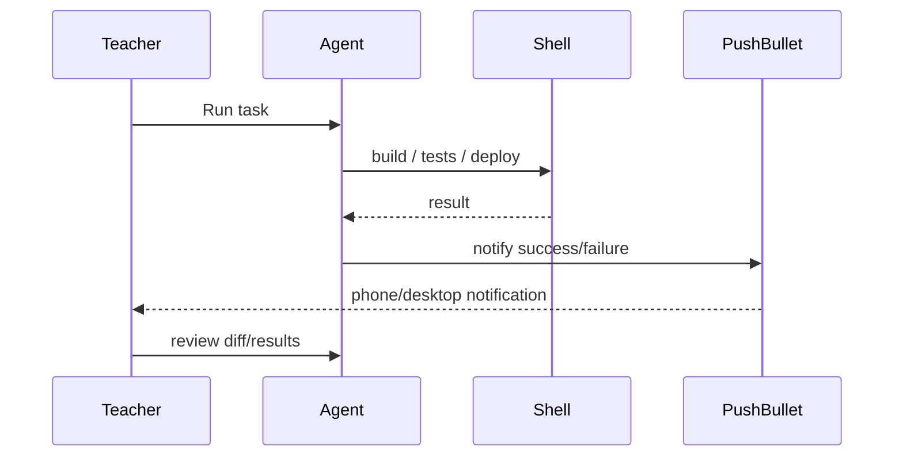

## למה צריך התראות?

Agentic workflow טוב אינו דורש ישיבה מול המסך כל הזמן. אם המשימה מריצה build, tests או Playwright, המורה יכול לעבור לעבודה אחרת ולקבל הודעה כשהמשימה הסתיימה.

{: .box-success}
התראה אינה במקום review. היא רק אומרת: "יש עכשיו משהו לבדוק".

## דפוס עבודה



## דוגמה לפרויקט הזה

בקובץ ההוראות של הפרויקט מוגדר להריץ בסוף כל prompt:

```powershell
.\notify.ps1 -Title "Codex - <project> - " -Message "<prompt title> Finished"
```

אם המשימה נכשלת, ההודעה צריכה לשקף כישלון:

```powershell
.\notify.ps1 -Title "Codex - BeautifulMivney - " -Message "Agentic pages Failed"
```

## מה הסקריפט אמור לקבל

| פרמטר | דוגמה | תפקיד |
|---|---|---|
| `-Title` | `Codex - BeautifulMivney -` | כותרת קבועה לזיהוי מקור |
| `-Message` | `Agentic pages Finished` | מצב המשימה |
| env var | `push_bullet_acc_token` | הטוקן שמאפשר שליחת התראה |
{: .tabl-rl}

## AGENTS.md טוב להתראות

```md
## Notifications
At the end of each user prompt, run:
`.codex/notify.ps1 -Title "Codex - Project - " -Message "Task Finished"`

If the task fails, still notify and include "Failed".
```

## מתי להודיע?

- אחרי build ארוך.
- אחרי Playwright suite.
- אחרי deployment preview.
- אחרי יצירת קבצים רבים.
- אחרי automation שרץ ברקע.

## מה לא לעשות

- לא להודיע "Finished" אם build נכשל.
- לא להכניס token לפרומפט.
- לא לשלוח מידע פרטי של תלמידים בהודעה.
- לא להפוך notification לראיה שהקוד נכון.

## הרחבה: Codex automations

ב־Codex app קיימות automations למשימות חוזרות או wake-up של thread. במונחי הוראה:

- כל בוקר: סכם commits אחרונים.
- פעם בשבוע: בדוק קישורים שבורים באתר.
- אחרי שיעור: צור draft של סיכום שיעור.

הכלל: skill מגדיר **איך** לבצע; automation מגדיר **מתי** לבצע.

## מקורות

- [OpenAI Codex automations](https://developers.openai.com/codex/app/automations)
- [OpenAI Codex best practices - automations](https://developers.openai.com/codex/learn/best-practices)
