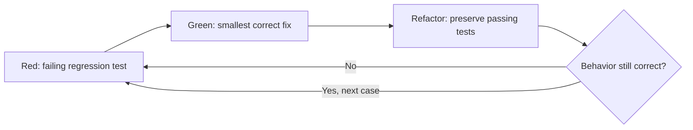
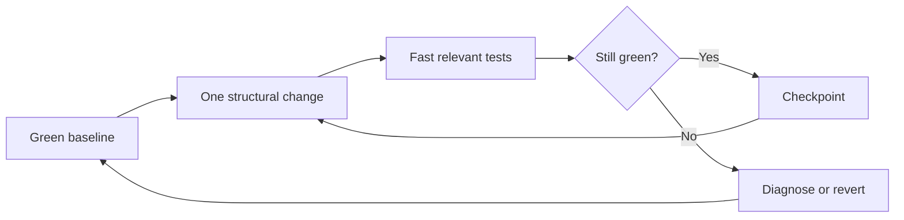
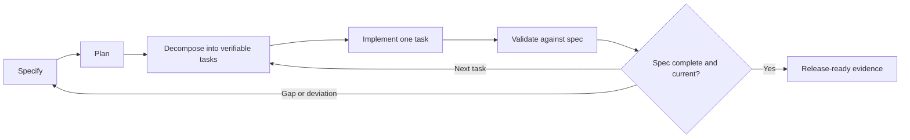
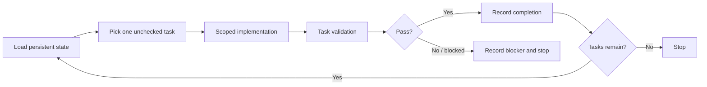
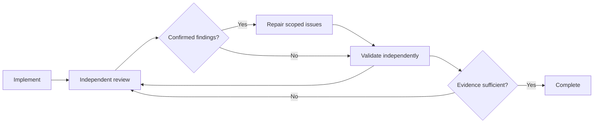
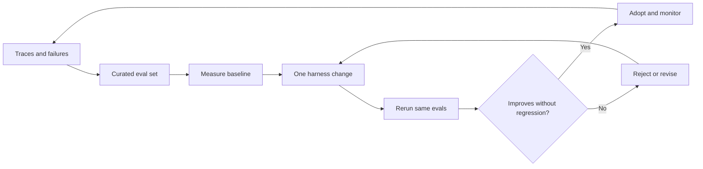
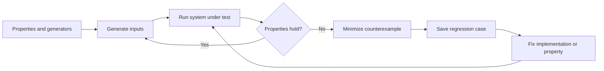
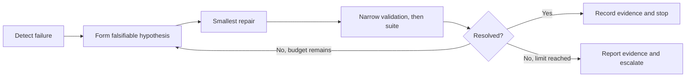

## Agentic Workflows: לולאות עבודה, TDD ו־Harness Engineering

מטרת המסמך היא לעבור מ־“תכתוב לי את הפיצ'ר” לעבודה שבה agent מקבל:

- יעד ברור;
- סביבת אימות;
- לולאת משוב;
- תנאי עצירה;
- גבולות הרשאה;
- דרך מסודרת להסביר מה הושלם ומה עדיין מסוכן.

המונחים באנגלית נשמרו כדי שיהיה קל לחפש חומר נוסף.

{: .box-note}
בכל workflow יש שני תוצרים: השינוי במוצר, ושיפור קטן ומבוקר ב־**harness** שמאפשר לסוכן הבא לעבוד טוב יותר. לפני שליחת פרומפט שאלו: *איזה מידע, oracle, כלי, בדיקה, כלל עצירה או תצפית חסרים כאן — ואיך הסוכן יכול להציע דרך ממוקדת לשמר אותם?* השיפור אינו אוטומטי: הסוכן מציע, מנמק ומאמת; האדם מחליט מה נכנס לתשתית הקבועה.

---

<details markdown="1"><summary>סולם בדיקות מוצע (T0–T4)</summary>

לפני בחירת workflow, הגדר רמת בדיקות. זה אינו תקן רשמי אלא שפה שימושית לצוות.

| רמה | משמעות | מתאים ל־ |
|---|---|---|
| **T0 — Inspect** | קריאה, ניתוח או שינוי טקסטואלי ללא הרצת קוד. | הסבר, docs, rename בטוח. |
| **T1 — Targeted** | בדיקה אחת ממוקדת, lint או typecheck רלוונטי. | שינוי מקומי בסיכון נמוך. |
| **T2 — Relevant Suite** | unit tests וה־integration tests של האזור שהשתנה. | feature או bug fix רגיל. |
| **T3 — Full Validation** | suite מלא, E2E או פקודת CI מקבילה. | שינוי רחב, release, migration. |
| **T4 — High Assurance** | T3 ובנוסף security, performance, migration rehearsal או human review. | auth, תשלומים, נתונים רגישים. |

בכל פרומפט כדאי לציין:

```text
Testing level: T2 during implementation, T3 before completion.
```

כך הסוכן אינו צריך לנחש אם “בדוק את העבודה” פירושו test יחיד או pipeline מלא.

</details>

---

## 2. Workflow ראשון: Just Prompt

### הרעיון

נותנים לסוכן משימה ישירה, יחד עם רמת בדיקות ו־Definition of Done.

מתאים כאשר:

- המשימה קטנה או בינונית;
- הקוד הקיים מובן;
- הסיכון נמוך;
- יש harness קיים;
- אין צורך לגלות דרישה עסקית חדשה.

<details markdown="1"><summary>תבנית בסיסית לפרומפט ודוגמה</summary>

### תבנית בסיסית


```text
Goal:
<מה צריך להשתנות>

Context:
<איפה להתחיל, התנהגות קיימת, קבצים או רכיבים רלוונטיים>

Constraints:
<מה אסור לשנות, תאימות, תלויות, אבטחה>

Done when:
<קריטריונים ניתנים לבדיקה>

Testing level:
<T0-T4>

Before finishing:
- Review the diff.
- Report tests run and tests not run.
- State remaining risks or assumptions.
- Propose one scoped harness improvement that would make a similar task safer or easier to validate.
```

{: .box-warning}
אני לא עובד ככה. אני כן משתדל להיות מאד ברור לגבי ההתנהגות הנדרשת, ההתנהגות הקיימת, ומגבלות על אופן המימוש אם יש לי. כן חושב וכותב כל מה שאני מוצא לנכון שנדרש באפיון. תוך כדי כתיבה מגבש החלטה **אם זה מספיק או שצריך להחליף מוד**

### דוגמה

```text
Goal:
When a user enters an expired reset token, show the existing
"link expired" state instead of a generic server error.

Context:
The reset page is under src/pages/reset-password.
The API already returns RESET_TOKEN_EXPIRED.

Constraints:
- Do not change the API.
- Preserve the current valid-token flow.
- Do not add a dependency.

Done when:
- The expired response is mapped to the correct UI state.
- A regression test covers it.
- Existing reset-password tests pass.

Testing level:
T2.
```

</details>

### זווית Agentic: שפרו את ה־harness תוך כדי המשימה

בפרומפט ישיר אין לולאה מובנית, לכן קל להשאיר את הלמידה רק בשיחה. הוסיפו דרישה אחת: שהסוכן יזהה מידע חוזר שהיה צריך להיות ב־`AGENTS.md`, בדיקה חסרה, או פקודת אימות שאינה מתועדת — ויציע שינוי ממוקד, בלי להרחיב את ה־scope של הפיצ'ר.

```text
לאחר השלמת השינוי במוצר, זהה פער אחד חוזר ב־harness שהקשה על הגדרת
ה־scope או על האימות. הצע עדכון מינימלי להנחיה, לבדיקה או לסקריפט האימות
הרלוונטיים. אל תיישם אותו אלא אם הוא בתחום המשימה וניתן לאמת אותו.
```

### חולשה מרכזית

Just Prompt נכשל כאשר המילים “מוכן”, “תקין” או “בדוק” אינן מוגדרות. לכן גם בפרומפט קצר יש לציין בדיקות ותנאי סיום.

---

<details markdown="1"><summary>נקודת החלטה לפני השליחה</summary>

### האם להישאר ב־Just Prompt, לנסח מחדש, או לעבור לתכנון?
תוך כדי כתיבת הפרומפט ובעיקר לקראת סיום, יש להחליט. האם הוא מדוייק או שעדיף לתת לבינה לעבות אותו. או שבכלל צריך לעבור למצב ==plan==?

</details>

## 3. Workflow שני: Red–Green–Refactor TDD

### המונח

**Red–Green–Refactor** הוא מחזור TDD הקלאסי:

1. **Red** — כתוב בדיקה שנכשלת מהסיבה הנכונה.
2. **Green** — כתוב את המימוש המינימלי שגורם לה לעבור.
3. **Refactor** — שפר את הקוד כאשר כל הבדיקות נשארות ירוקות.

זהו workflow חזק במיוחד ל־bug fixes, מפני שהוא מוכיח שהבדיקה באמת מזהה את הבאג.



### פרומפט מומלץ

```text
Use Red-Green-Refactor TDD.

1. Run the relevant existing tests and record the baseline.
2. Add the smallest regression test that demonstrates the bug.
3. Run it and confirm that it fails for the expected reason.
4. Do not weaken or remove the test to make it pass.
5. Implement the smallest correct fix.
6. Run the targeted test, then the relevant suite.
7. Refactor only while the suite remains green.
8. Report the red command/output summary and the final green commands.

Testing level:
T2 during the loop, T3 before completion.
```

### זווית Agentic: כל כשל הוא מועמד לשיפור harness

הבדיקה האדומה אינה רק שער למימוש; היא מידע על מה שהיה חסר ביכולת של הסוכן להגן על ההתנהגות. בקשו ממנו לבחון אם צריך להפוך את ה־fixture, כלי ה־test, נתון ה־seed או פקודת ההרצה לחלק חוזר מה־harness.

```text
לאחר הרצת ה־Red, בדוק אם השחזור חשף פער חוזר ב־harness: test helper,
fixture, seed דטרמיניסטי, פקודת בדיקה או invariant שחסרים. הצע את השיפור
החוזר הקטן ביותר והסבר כיצד הוא מונע תוצאה ירוקה־לכאורה דומה. השאר אותו
נפרד מתיקון הפרודקשן, אלא אם הוא נדרש לתיקון.
```

### דוגמה: duplicate email

```text
Bug:
Two concurrent requests can create two active invitations
for the same email and organization.

Use Red-Green-Refactor TDD.

Red:
Add an integration test that sends two concurrent creation attempts
and asserts that only one active invitation remains.

Green:
Implement protection at the correct consistency boundary.
Do not solve this only with a UI guard.

Refactor:
Remove duplication introduced by the fix while keeping all tests green.

Done when:
- The test fails on the original implementation.
- It passes after the fix.
- Existing invitation tests pass.
- The database behavior and remaining race assumptions are documented.
```

<details markdown="1"><summary>Guardrails נגד “רמאות” של הסוכן</summary>

כדאי לומר במפורש:

```text
- Do not change the expected result during the Green step.
- Do not skip the failing run.
- Do not replace the assertion with a weaker one.
- If the proposed test is invalid, stop and explain before rewriting it.
- Prefer a behavior-level assertion over implementation details.
```

</details>

<details markdown="1"><summary>מתי לא לבחור Red–Green</summary>

- refactor טהור שבו אין התנהגות חדשה;
- שינוי תשתית ללא oracle ברור;
- spike ניסויי;
- UI חזותי שבו קודם צריך להגדיר מהי התוצאה הרצויה;
- מערכת שאין לה עדיין seam שניתן לבדוק — במקרה כזה לעיתים מתחילים ב־characterization tests.

</details>

---

## 4. Workflow שלישי: Green–Green

### הבהרה על המונח

**Green–Green TDD** אינו שם תקני ומקובל כמו Red–Green–Refactor. המונחים המדויקים יותר הם:

- **Green-to-Green Refactoring**
- **Behavior-Preserving Refactoring**
- לעיתים: **Characterization-First Refactoring**

הרעיון: מתחילים ממצב ירוק, משנים את המבנה בלי לשנות התנהגות, ומסיימים שוב בירוק.



### מתאים ל־

- פירוק class גדול;
- שינוי שמות;
- מעבר בין ספריות עם אותה התנהגות;
- שיפור ארכיטקטורה;
- הסרת duplication;
- שינוי פנימי לפני feature עתידי;
- modernization הדרגתי.

### הלולאה

1. הרץ את הבדיקות וקבע **green baseline**.
2. אם הכיסוי חלש, הוסף **characterization tests** שמתעדים את ההתנהגות הקיימת.
3. בצע שינוי מבני קטן אחד.
4. הרץ בדיקה ממוקדת.
5. בצע commit או checkpoint.
6. חזור על הפעולה.
7. בסיום הרץ suite מלא יותר.

### פרומפט מומלץ

```text
Use a Green-to-Green, behavior-preserving refactoring workflow.

1. Establish a green baseline.
2. Identify behavior that is not protected by tests.
3. Add characterization tests only where needed.
4. Make one small structural change at a time.
5. After each step, run the fastest relevant tests.
6. Do not intentionally change public behavior, API contracts,
   serialized formats, database semantics, or error messages.
7. If behavior must change, stop and separate that change into
   a Red-Green task.
8. Finish with T3 validation and a diff review.
```

### זווית Agentic: הפכו ידע על התנהגות קיימת ל־harness קבוע

ב־refactor הסיכון הוא לא רק שינוי קוד אלא גילוי מאוחר מדי של התנהגות לא מתועדת. דרשו מהסוכן לשאול אילו דוגמאות, golden master, invariants או characterization tests צריכים להישאר לאחר המשימה כדי שה־harness יגן גם על הפירוק הבא.

```text
לפני כל extraction, זהה התנהגות שעדיין אינה מפורשת. עבור כל פער חשוב,
הצע תוספת עמידה ל־harness: characterization test, מקרה golden master,
invariant או פקודת אימות מתועדת. השאר רק תוספות שמגינות על refactors
עתידיים והסבר אילו מקרים הושמטו.
```

### דוגמה

```text
Refactor the order-pricing service into:
- discount policy;
- tax calculation;
- total aggregation.

Public behavior must remain identical.

Use Green-to-Green:
- first establish baseline results;
- add characterization tests for boundary values and rounding;
- extract one responsibility at a time;
- compare outputs before and after;
- stop if an output change is discovered.

Testing level:
T2 after each extraction, T3 at the end.
```

<details markdown="1"><summary>Harness משלים: Golden Master / Approval Testing</summary>

כאשר יש הרבה פלט קיים וקשה לכתוב assertion לכל פרט, אפשר לשמור פלט מאושר ולהשוות אליו:

- **Golden Master Testing**
- **Snapshot Testing**
- **Approval Testing**

הגישה מתאימה לדוחות, serializers, compilers, formatters ו־API responses מורכבים. יש לבדוק שה־snapshot אכן מייצג התנהגות רצויה, ולא לאשר אוטומטית שינוי עצום שהסוכן עצמו יצר.

</details>

---

## 5. Workflow רביעי: Spec-Driven Development

### המונח

**Spec-Driven Development (SDD)** או **Spec-First Development** מתחיל ממפרט, לא מקוד.

לולאה נפוצה:

```text
Specify → Plan → Decompose → Implement → Validate
```

GitHub Spec Kit משתמש בזרימה דומה:

```text
Spec → Plan → Tasks → Implement
```



### מתאים כאשר

- המשימה חוצה כמה שירותים;
- יש migration;
- קיימת עמימות עסקית;
- כמה agents או מפתחים עובדים במקביל;
- נדרש rollout;
- ה־API ציבורי;
- אי אפשר להחזיק את כל ההחלטות בצ'אט.

### דוגמה

```text
Read docs/specs/team-invitations.md.

First:
- identify contradictions, missing acceptance criteria, and open questions;
- do not implement unresolved product decisions.

Then:
- produce an implementation plan mapped to repository paths;
- split the plan into independently verifiable tasks;
- attach a test level and stop condition to each task.

During implementation:
- update the task list only when its validation passes;
- preserve the specification as the source of truth;
- record deviations under "Decisions".
```

### זווית Agentic: המפרט הוא חלק מהמוצר של ה־harness

ב־SDD השיפור המתמשך אינו תוספת צדדית: מפרט, decision log, task template ו־validation matrix הם ה־harness שמאפשרים לסוכנים עתידיים לעבוד מאותו מקור אמת. בקשו מהסוכן לזהות מה חסר במסמכים הללו, ולא רק מה חסר בקוד.

```text
לכל עמימות, אימות שנכשל או החלטה שהתגלו במשימה זו: החלט אם עליהם להפוך
לארטיפקט קבוע של ה־harness — acceptance criterion, decision record,
שדה בתבנית משימה, פקודת אימות או תנאי עצירה. הצע את העדכון המדויק וקשר
אותו לראיות במאגר. אל תשנה בשקט את המפרט כדי שיתאים למימוש.
```

### יתרון מרכזי

הסוכן יכול לאבד חלק מהקשר בשיחה ארוכה; מסמך מפרט נשאר במאגר וניתן לביקורת, version control ושיתוף.

<details markdown="1"><summary>סיכון: מפרט ישן</summary>

Spec ישן עלול להיות מסוכן יותר מהיעדר spec. הוסף:

```text
Status
Owner
Last updated
Supersedes
Open questions
```

</details>

---

## 6. Workflow חמישי: Ralph Loop

### המונח

**Ralph Loop** או **Ralph Wiggum Loop** הוא דפוס שבו מפעילים agent שוב ושוב, לרוב עם הקשר טרי, מול state מתמשך במאגר כגון:

- `TASKS.md`;
- spec;
- test suite;
- commits;
- logs או artifacts.

כל איטרציה משלימה יחידת עבודה קטנה ומאומתת.



### עקרונות

- משימה אחת מוגדרת בכל איטרציה;
- state נשמר בקבצים, לא רק בצ'אט;
- test gate קובע אם מותר לסמן משימה כגמורה;
- יש מספר איטרציות מרבי;
- יש stop condition אובייקטיבי;
- עבודה נעשית ב־branch או worktree מבודד;
- אין הרשאות פרודקשן.

### זווית Agentic: לולאה טובה משדרגת את עצמה דרך ה־state

כאשר אותה עמימות, חסם או בדיקה איטית חוזרים, הבעיה אינה רק במשימה הבודדת אלא ב־harness של הלולאה. בקשו מהסוכן לשמר את הלמידה בקובץ state או בתבנית task, כך שהאיטרציה הבאה לא תגלה אותה מחדש.

```text
בסוף כל איטרציה, זהה חיכוך חוזר בלולאה: משימה עמומה, אימות חסר, הנחיה
מיושנת, פקודה flaky או תנאי עצירה לא מועיל. הצע שינוי קטן ב־`TASKS.md`,
ב־`SPEC.md` או בפרומפט האיטרציה. יישם רק שינויים תחומים, ניתנים לביקורת
ולאימות.
```

<details markdown="1"><summary>דוגמה בטוחה ומוגבלת</summary>

```bash
for i in $(seq 1 12); do
  codex exec "
    Read AGENTS.md, SPEC.md, and TASKS.md.
    Complete exactly one unchecked task.
    Keep the change scoped.
    Run the validation listed for that task.
    Mark it complete only if validation passes.
    If blocked, record the blocker and stop.
    If all tasks are complete, stop.
  "

  grep -q '^- \[ \]' TASKS.md || break
done
```

זוהי דוגמה רעיונית. יש להתאים את הפקודות למערכת ההפעלה, ל־CI ולמדיניות ההרשאות.

</details>

<details markdown="1"><summary>דוגמת `TASKS.md`</summary>

```markdown
## Tasks

- [ ] Add database uniqueness protection
  - Validation: invitation integration tests
- [ ] Map conflict response in the API
  - Validation: API contract test
- [ ] Update the UI error state
  - Validation: component test and Playwright smoke test
- [ ] Run full validation
  - Validation: `pnpm validate`
```

</details>

<details markdown="1"><summary>Guardrails חיוניים</summary>

- `max iterations`;
- timeout לכל איטרציה;
- budget;
- clean branch/worktree;
- איסור force push;
- איסור שינוי secrets;
- no auto-deploy;
- test gate;
- human review לפני merge;
- קובץ `BLOCKED.md` או סימון ברור כאשר אין התקדמות.

Ralph Loop אינו תחליף לפירוק נכון. אם הפרומפט אומר “המשך עד שהכול מושלם”, אין לסוכן תנאי עצירה אמיתי.

</details>

---

## 7. Workflow שישי: Reviewer–Implementer / Generator–Critic

### המונחים

- **Generator–Critic Loop**
- **Implementer–Reviewer Loop**
- **Maker–Checker**
- **Review–Repair–Validate**

Agent אחד מממש; agent אחר או subagent בוחן את התוצאה מול spec, diff ובדיקות. לאחר מכן המממש מתקן וה־validator מאמת.

### לולאה

```text
Implement → Review → Repair → Validate
```



### דוגמה עם הפרדת תפקידים

```text
Implementer:
Make the smallest patch satisfying the acceptance criteria.
Run T2 validation.

Reviewer:
Review the diff read-only.
Check:
- behavior against the specification;
- missing tests;
- security and authorization;
- backward compatibility;
- unnecessary scope;
- error handling.
Return findings ranked by severity. Do not edit files.

Implementer:
Repair only confirmed findings.
Explain rejected findings.

Validator:
Run the required commands and verify the final diff.
```

### זווית Agentic: ביקורת צריכה לשפר גם את מנגנון הביקורת

אם reviewer מגלה שוב ושוב אותו סוג של פער, אין די בתיקון patch נקודתי. בקשו ממנו להציע בדיקת static analysis, כלל review, test template או checklist שישמרו את הלקח עבור סוכנים ומפתחים עתידיים.

```text
לכל ממצא מאומת, סווג אם מדובר בפגם חד־פעמי או בראיה לפער ב־harness. עבור
classes חוזרים, הצע guardrail מונע כגון תבנית בדיקה, כלל linter, פריט
ב־checklist של review או פקודת אימות. קשר כל הצעה לראיות; אל תוסיף תהליך
עבור רעש מבודד.
```

<details markdown="1"><summary>שימוש ב־Codex וב־subagents</summary>

אפשר להשתמש ב־`/review` לאחר המימוש, או להפעיל subagents לקריאה מקבילית, למשל:

```text
Spawn read-only reviewers for:
1. security and authorization;
2. test gaps and edge cases;
3. maintainability and unnecessary complexity.

Do not let reviewers edit files.
Aggregate duplicate findings and rank them by severity.
```

</details>

### מתי זה מועיל

- auth;
- migrations;
- concurrency;
- קוד שנוצר במהירות;
- patch גדול;
- שינוי שקשה לסקור תוך כדי כתיבה.

<details markdown="1"><summary>סיכון: הסכמה שגויה בין סוכנים</summary>

שני agents יכולים להסכים על אותה טעות. הביקורת חייבת להיות מחוברת ל־spec, tests, static analysis או מקור אמת אחר — לא רק לדעה של מודל נוסף.

</details>

---

## 8. Workflow שביעי: Eval-Driven Development

### המונח

**Eval-Driven Development (EDD)** מתאים במיוחד למערכות AI, agents, classifiers, extraction וזרימות לא דטרמיניסטיות.

במקום לשפר פרומפט לפי תחושת בטן:

1. אוספים traces ודוגמאות כשל.
2. הופכים אותן ל־eval cases.
3. מגדירים score או rubric.
4. משנים prompt, tools, routing או validation.
5. מריצים מחדש את אותו eval set.
6. מאמצים שינוי רק כאשר המדדים משתפרים בלי regression מהותי.

OpenAI מתארת לולאת שיפור שבה feedback ו־traces הופכים ל־evals, ומהם נגזרים שינויים ב־harness.



### מהו Harness בהקשר זה?

ה־harness אינו רק prompt. הוא כולל:

- instructions;
- tools;
- routing;
- retrieval;
- output schema;
- validation;
- retry policy;
- escalation;
- eval runner;
- observability.

### זווית Agentic: זהו ה־workflow שבו המוצר הוא גם ה־harness

כאן שאלת השיפור אינה אופציונלית: בכל שינוי במוצר או בהתנהגות הסוכן, שאלו מה צריך למדוד, לשמר ולהשוות בפעם הבאה. דרשו שינוי אחד ב־harness בכל איטרציה — או נימוק מבוסס מדוע לא נדרש שינוי כזה.

```text
עבור בקשה זו, הפרד בין התנהגות המוצר להתנהגות ה־harness. ציין איזה eval,
trace, metric, אימות, כלל routing או תצפית יש להוסיף או לשנות, כך שאיטרציות
עתידיות יוכלו לזהות הצלחה ו־regression. שנה ממד אחד של harness בכל פעם
והשווה מול ה־baseline.
```

### דוגמה

```text
We have 80 labeled support tickets.

Before changing the agent:
- run the current eval set;
- record accuracy by category;
- identify the five highest-impact failure clusters.

Propose one harness change at a time:
- instruction change;
- tool routing change;
- output validation;
- retrieval change.

After each change:
- rerun the same eval set;
- compare overall and per-category scores;
- reject the change if it improves one category by hiding regressions elsewhere.
```

<details markdown="1"><summary>מתי Eval-Driven Development מתאים</summary>

- “עובד בדוגמה שלי” אינו מספיק;
- הפלט הסתברותי;
- יש הרבה edge cases;
- משנים prompt או routing;
- נדרש מעקב איכות לאורך זמן.

</details>

---

## 9. Workflow שמיני: Property-Based Testing ו־Fuzzing

### המונחים

- **Property-Based Testing**
- **Generative Testing**
- **Fuzz Testing**
- **Metamorphic Testing**

במקום לתת כמה דוגמאות ידניות, מגדירים invariants וה־harness מייצר הרבה קלטים.

דוגמאות ל־properties:

```text
sort(xs) is ordered
sort(sort(xs)) == sort(xs)
decode(encode(x)) == x
balance never becomes NaN
a failed authorization request never changes state
```



### פרומפט לדוגמה

```text
Use property-based testing for the interval-merging function.

Properties:
- output intervals are ordered;
- output intervals do not overlap;
- every input point belongs to an output interval;
- applying merge twice is idempotent;
- permutation of input intervals does not change the result.

When a generated case fails:
- preserve the minimized counterexample as a regression test;
- fix the implementation;
- rerun both property and example-based tests.
```

### זווית Agentic: שפרו את ה־oracle, לא רק את המימוש

קלט שנוצר ושובר את המערכת הוא נכס ל־harness. בקשו מהסוכן להחליט אם הכשל חושף property חסר, generator צר מדי, seed שאינו נשמר או shrinker שאינו מסביר את הבעיה — ולהוסיף את הידע כך שהכשל הבא יהיה זול יותר לאבחון.

```text
עבור כל counterexample ממוזער, בדוק אם ה־harness צריך לשמור דוגמת regression,
property חזק יותר, כיסוי generator רחב יותר, seed קבוע או diagnostics טובים
יותר לכשל. הצע את השיפור הקבוע הקטן ביותר והסבר איזה מצב כשל עתידי הוא הופך
לנצפה.
```

<details markdown="1"><summary>Metamorphic Testing</summary>

מתאים כאשר קשה לדעת את התוצאה המדויקת, אך יודעים קשר בין שתי הרצות.

לדוגמה:

- שינוי סדר הקלט לא אמור לשנות תוצאה;
- הוספת whitespace לא אמורה לשנות parse;
- scaling של כל ערכי הקלט צריך להכפיל פלט מסוים;
- תרגום הלוך וחזור צריך לשמר מבנה מוגדר.

זהו harness חזק מאוד לסוכן, מפני שהוא מספק oracle שאינו תלוי בכך שהמודל “יחשוב” מהי התוצאה בכל דוגמה.

</details>

---

## 10. Workflow תשיעי: Closed-Loop Repair

### המונח

**Closed-Loop Repair** הוא תהליך אוטומטי יחסית:

```text
Detect → Diagnose → Repair → Validate → Repeat
```

OpenAI מציגה דפוס דומה של:

```text
Review → Repair → Validate
```

כאשר ממצאים שנותרו הופכים לקלט של האיטרציה הבאה.



### דוגמה

```text
Input:
- failing CI logs;
- current diff;
- repository instructions.

Loop:
1. Classify the failure as product, test, environment, or flaky.
2. Form one falsifiable hypothesis.
3. Make the smallest repair.
4. Run the narrowest command that can validate the hypothesis.
5. Run the relevant suite.
6. Stop after three failed hypotheses and report evidence.

Do not:
- disable the test;
- increase retries without evidence;
- suppress the error;
- change unrelated code.
```

### זווית Agentic: הפכו כשל חוזר לכלל מניעה

לולאת repair שמטפלת שוב באותו class של תקלות היא סימן ל־harness חסר. בקשו מהסוכן לעדכן את מנגנון הסיווג, בדיקת preflight, הכלי לאיסוף לוגים או תנאי העצירה — רק כאשר הראיות מצביעות על דפוס חוזר.

```text
כאשר class של כשל חוזר, הצע שינוי מניעה אחד ב־harness: סיווג כשל טוב יותר,
בדיקת preflight, איסוף לוגים, בדיקת regression או כלל escalation. ציין את
סף הראיות לאימוץ השינוי; אל תוסיף retries או תסתיר שגיאות כתחליף לאבחון.
```

הגבלת מספר ההשערות חשובה. בלי limit, agent יכול להמשיך לשנות קוד באופן אקראי.

---

## 11. כיצד לבחור Workflow

| מצב | Workflow מומלץ |
|---|---|
| שינוי מקומי וברור | Just Prompt + T1/T2 |
| bug שניתן לשחזר | Red–Green–Refactor |
| refactor ללא שינוי התנהגות | Green-to-Green |
| feature רחב או עמום | Spec-Driven Development |
| backlog של משימות קטנות ומבודדות | Ralph Loop מוגבל |
| שינוי מסוכן או patch גדול | Implementer–Reviewer |
| מערכת AI או פלט הסתברותי | Eval-Driven Development |
| אלגוריתם עם invariants | Property-Based Testing |
| CI שנכשל עם feedback ברור | Closed-Loop Repair |

אפשר לשלב:

```text
Spec-Driven
→ Red-Green לכל task
→ Reviewer–Implementer
→ T3 validation
```

או:

```text
Green-to-Green refactor
→ Red-Green feature
→ Playwright smoke
→ /review
```

---

<details markdown="1"><summary>הרחבה: Prompt-for-a-Prompt — מתי לבקש ממודל לנסח את הפרומפט?</summary>

## 12. Prompt-for-a-Prompt: מתי לבקש ממודל לכתוב את הפרומפט לסוכן?

### העיקרון

לפעמים כדאי להשתמש בצ'אט מקוון כדי לבנות brief טוב עבור coding agent. אך אין טעם להפוך כל בקשה פשוטה לשתי שכבות של prompt engineering.

כלל אצבע:

> בקש prompt עבור prompt כאשר עלות אי־הבנה גדולה מעלות סבב תכנון נוסף.

### כן — כאשר

- הדרישה עמומה או כוללת כמה מטרות;
- יש כמה מערכות, שירותים או repositories;
- מדובר ב־migration, auth, billing או נתונים;
- צריך prompt חוזר לצוות;
- רוצים workflow רב־שלבי;
- צריך להגדיר test matrix;
- יש הרבה non-goals וגבולות;
- צריך handoff מסודר בין אדם, chat model ו־coding agent;
- אתה רוצה שהמודל ישאל שאלות ויחשוף הנחות לפני שהסוכן נוגע בקוד.

### לא — כאשר

- התיקון קטן וברור;
- הסוכן יכול לקרוא את המאגר ולקבל הקשר מדויק יותר;
- הצ'אט החיצוני אינו מכיר paths, APIs או conventions;
- יצירת הפרומפט ארוכה יותר מהמשימה;
- כל הדרישות כבר נמצאות ב־issue טוב;
- מדובר בעובדה שאפשר לאמת ישירות בקוד.

### סכנה מרכזית

מודל מקוון שאין לו גישה למאגר עלול להמציא:

- שמות קבצים;
- APIs;
- ספריות;
- ארכיטקטורה;
- פקודות בדיקה;
- מגבלות שאינן קיימות.

לכן הפרומפט שנוצר הוא **טיוטת brief**, לא מקור אמת.

### תהליך דו־שלבי מומלץ

#### שלב א: בקש מהצ'אט לייצר prompt מסודר

```text
כתוב עבורי prompt ל-coding agent.

מטרת המערכת:
<תיאור>

השינוי הרצוי:
<תיאור>

הקשר ידוע:
<טכנולוגיה, רכיבים, התנהגות קיימת>

סיכונים:
<נתונים, אבטחה, תאימות, rollout>

החזר את הפרומפט במבנה:
1. Goal
2. Context the agent must verify in the repository
3. Constraints
4. Non-goals
5. Acceptance criteria
6. Suggested workflow
7. Testing level and commands to discover
8. Stop conditions
9. Questions or assumptions

כללים:
- אל תמציא paths, APIs או פקודות.
- סמן כל פרט לא מאומת כ-assumption.
- אל תכתוב את המימוש.
- בקש מה-agent לאמת את ה-repository לפני שינוי קוד.
```

#### שלב ב: תן ל־Codex לבדוק את הטיוטה מול המאגר

```text
/plan

Use the brief below as a working draft, not as repository truth.

Before implementation:
- verify every referenced path, command, API, and architectural assumption;
- identify contradictions with AGENTS.md, the code, and CI;
- replace invented or stale details;
- list unresolved product questions;
- propose a validation plan.

Do not modify files until the plan is grounded in the repository.

<DRAFT BRIEF>
...
</DRAFT BRIEF>
```

### מתי לבקש מהצ'אט לשאול אותך שאלות קודם

כאשר אתה עצמך עדיין לא יודע:

- מהו ה־non-goal;
- מהי תאימות נדרשת;
- מה ייחשב הצלחה;
- מהי רמת הסיכון;
- מהו ה־rollout;
- אילו מקרי קצה חשובים.

פרומפט:

```text
אל תכתוב עדיין prompt ל-agent.
ראיין אותי עד שיש מספיק מידע כדי להגדיר:
- goal;
- non-goals;
- acceptance criteria;
- risk;
- testing level;
- rollout and rollback;
- stop conditions.

בסוף החזר prompt אחד, קצר ומעשי.
```

### מה צריך להישאר מחוץ לפרומפט

מידע קבוע צריך לעבור למקום קבוע:

| מידע | מקום מתאים |
|---|---|
| פקודות build/test קבועות | `AGENTS.md` |
| conventions וארכיטקטורה | `AGENTS.md` / docs |
| דרישות feature | spec או issue |
| החלטה ארכיטקטונית | ADR |
| workflow חוזר | skill |
| מטרה זמנית | prompt |
| מצב משימות מתמשך | `TASKS.md` |

כך prompt-for-a-prompt אינו צריך לשכפל בכל פעם את כל ספר ההפעלה של הפרויקט.

</details>

---

<details markdown="1"><summary>דף עזר: תבניות קצרות לפי Workflow</summary>

## 13. תבניות קצרות לפי Workflow

### Just Prompt

```text
Implement <goal>.
Constraints: <constraints>.
Done when: <acceptance criteria>.
Testing level: T2.
Review the diff and report tests and risks.
```

### Red–Green

```text
Use Red-Green-Refactor.
First reproduce the bug with a failing test.
Confirm the failure reason.
Implement the smallest fix.
Keep the test unchanged unless it is demonstrably invalid.
Run T2, then T3 before completion.
```

### Green-to-Green

```text
Preserve behavior.
Establish a green baseline.
Add characterization tests where needed.
Refactor one small step at a time.
Stop if observable behavior changes.
Run T3 at the end.
```

### Spec-Driven

```text
Treat SPEC.md as the product source of truth.
First identify gaps and contradictions.
Produce a repository-grounded plan and task list.
Implement one verifiable task at a time.
Record deviations and decisions.
```

### Reviewer–Implementer

```text
Implement the scoped change.
Then perform a separate read-only review against the spec.
Repair confirmed findings only.
Validate independently and report residual risk.
```

### Bounded Ralph Loop

```text
Complete exactly one unchecked task per iteration.
Run its validation before marking it done.
Stop on blocker, repeated failure, budget limit, or completion.
Never deploy or use production credentials.
```

</details>

---

## 14. Checklist לסיום משימת Agent

- [ ] הוגדר Goal ברור.
- [ ] הוגדרו non-goals.
- [ ] נבחר workflow מתאים.
- [ ] נבחרה רמת בדיקות.
- [ ] ה־agent אימת את מבנה המאגר.
- [ ] יש oracle: בדיקה, spec, invariant או reviewer.
- [ ] יש stop condition.
- [ ] יש iteration/time/budget limit בלולאות אוטומטיות.
- [ ] לא נעשה שימוש בפרודקשן ללא הרשאה מפורשת.
- [ ] נבדק ה־diff.
- [ ] דווחו בדיקות שלא הורצו.
- [ ] נשארה רשימת סיכונים או assumptions.

---

<details markdown="1"><summary>מקורות ודוגמאות להמשך</summary>

## מקורות ודוגמאות להמשך

- OpenAI — Codex prompting:  
  https://developers.openai.com/codex/prompting
- OpenAI — Codex workflows:  
  https://developers.openai.com/codex/workflows
- OpenAI — Codex best practices:  
  https://developers.openai.com/codex/learn/best-practices
- OpenAI — Subagents:  
  https://developers.openai.com/codex/concepts/subagents
- OpenAI Cookbook — Iterative repair loops with Codex:  
  https://developers.openai.com/cookbook/examples/codex/build_iterative_repair_loops_with_codex
- OpenAI Cookbook — Agent improvement loop:  
  https://developers.openai.com/cookbook/examples/agents_sdk/agent_improvement_loop
- Simon Willison — Red/Green TDD for coding agents:  
  https://simonwillison.net/guides/agentic-engineering-patterns/red-green-tdd/
- XP123 — Green-to-green refactoring:  
  https://xp123.com/stoplight-the-testcode-cycle/
- GitHub Spec Kit — Spec-Driven Development:  
  https://github.github.com/spec-kit/
- Ralph Loop core concepts:  
  https://ralph-cli.dev/docs/core-concepts/ralph-loop/
- Hypothesis — Property-Based Testing:  
  https://hypothesis.readthedocs.io/
- Playwright — Best practices:  
  https://playwright.dev/docs/best-practices

</details>
