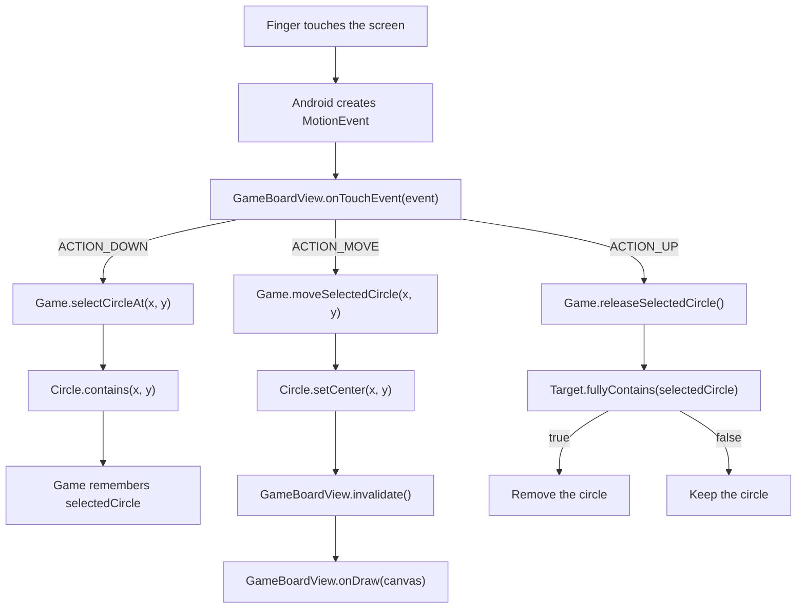

{: .box-note}
השיעור ממשיך ישירות מהגרסה הסטטית של
[CollectCircles 1]({{ '/android/CollectCircles/01.collect-circles-drawing' | relative_url }}).
בסופו יהיו על הלוח חמישה עיגולים אקראיים שאפשר לגרור אל המטרה. השעון, השיא והכפתור
הפעיל עדיין אינם חלק מהשלב הזה.

[חזרה ל-1](/android/CollectCircles/01.collect-circles-drawing)

## מה משתנה בשלב הזה

בשלב הקודם `GameBoardView` יצר מטרה ושלושה עיגולים במיקומים קבועים. כעת:

1. מחלקת `Game` תחזיק את המטרה, את רשימת העיגולים ואת חוקי המשחק.
2. `GameBoardView` תמשיך להיות אחראית לדברים ששייכים ל-Android:
   ציור וקבלת אירועי מגע.
3. ברגע שהלוח יודע מה גודלו, הוא יוצר משחק אוטומטית. כך הגרסה כבר ניתנת למשחק,
   אף שכפתור Start יופעל רק בשיעור הבא.

## 1. יוצרים את מחלקת `Game`

צרו את `Game.java`:

```java
package com.example.collectcircles;

import android.graphics.Canvas;
import android.graphics.Paint;

import java.util.ArrayList;
import java.util.List;
import java.util.Random;

public class Game {
    private static final int CIRCLE_COUNT = 5;

    private final Random random = new Random();
    private final Target target;
    private final List<Circle> circles = new ArrayList<>();
    private Circle selectedCircle;

    public Game(float boardWidth, float boardHeight, float targetRadius,
                int targetColor, int crossColor, float crossStrokeWidth,
                int circleColor) {
        target = new Target(
                boardWidth / 2f,
                boardHeight / 2f,
                targetRadius,
                targetColor,
                crossColor,
                crossStrokeWidth
        );

        createCircles(boardWidth, boardHeight, circleColor);
    }

    public void draw(Canvas canvas, Paint paint) {
        target.draw(canvas, paint);
        for (Circle circle : circles) {
            circle.draw(canvas, paint);
        }
    }

    public boolean selectCircleAt(float x, float y) {
        for (int i = circles.size() - 1; i >= 0; i--) {
            Circle circle = circles.get(i);
            if (circle.contains(x, y)) {
                selectedCircle = circle;
                return true;
            }
        }

        selectedCircle = null;
        return false;
    }

    public void moveSelectedCircle(float x, float y) {
        if (selectedCircle != null) {
            selectedCircle.setCenter(x, y);
        }
    }

    public boolean releaseSelectedCircle() {
        if (selectedCircle == null) {
            return false;
        }

        boolean collected = target.fullyContains(selectedCircle);
        if (collected) {
            circles.remove(selectedCircle);
        }
        selectedCircle = null;
        return collected;
    }

    public void cancelSelection() {
        selectedCircle = null;
    }

    public boolean isFinished() {
        return circles.isEmpty();
    }

    private void createCircles(float boardWidth, float boardHeight,
                               int circleColor) {
        float circleRadius = target.getRadius() / 2f;

        while (circles.size() < CIRCLE_COUNT) {
            float x = randomCoordinate(
                    circleRadius,
                    boardWidth - circleRadius
            );
            float y = randomCoordinate(
                    circleRadius,
                    boardHeight - circleRadius
            );
            Circle candidate =
                    new Circle(x, y, circleRadius, circleColor);

            if (!overlapsExistingCircle(candidate)) {
                circles.add(candidate);
            }
        }
    }

    private boolean overlapsExistingCircle(Circle candidate) {
        if (candidate.overlaps(target)) {
            return true;
        }

        for (Circle circle : circles) {
            if (candidate.overlaps(circle)) {
                return true;
            }
        }
        return false;
    }

    private float randomCoordinate(float minimum, float maximum) {
        return minimum + random.nextFloat() * (maximum - minimum);
    }
}
```

### כיצד נוצרים חמישה עיגולים חוקיים?

הרדיוס של כל עיגול ירוק הוא חצי מרדיוס המטרה:

```java
float circleRadius = target.getRadius() / 2f;
```

בכל סיבוב של הלולאה מוגרלים `x` ו-`y`. הגבולות מתחילים ברדיוס ומסתיימים
ברוחב או בגובה פחות הרדיוס, ולכן כל העיגול נשאר בתוך הלוח.

המועמד מתקבל רק אם:

- הוא אינו חופף למטרה;
- הוא אינו חופף לשום עיגול ירוק שכבר התקבל.

בשתי הבדיקות משתמשים בפעולה מהשיעור הקודם:

```text
distance < r1 + r2
```

אנחנו שומרים בכוונה על קוד קצר. בלוח ובגדלים שקבענו יש די מקום, ולכן הלולאה
ממשיכה עד שנמצאו חמישה עיגולים בלי להוסיף טיפול במצב של לוח קטן מדי.

## 2. תפיסה, תנועה ושחרור

`selectCircleAt` עוברת על הרשימה מהסוף להתחלה. העיגול האחרון ברשימה מצויר אחרון,
ולכן הוא נמצא "מעל" האחרים אם בזמן משחק הם חופפים.

`moveSelectedCircle` מעדכנת את מרכז העיגול לפי מקום האצבע.

בעת שחרור משתמשים בבדיקה המחמירה שיצרנו ב-`Target`:

```java
boolean collected = target.fullyContains(selectedCircle);
```

רק אם מתקיים:

```text
distance + smallRadius <= targetRadius
```

העיגול נמחק. עיגול שרק נוגע במטרה, או נמצא בה באופן חלקי, נשאר על הלוח.

## 3. מחליפים את תצוגת הדוגמה ב-`Game`

ב-`GameBoardView` הוסיפו:

```java
import android.view.MotionEvent;
```

החליפו את השדות של תצוגת הדוגמה:

```diff
 private final Paint paint = new Paint(Paint.ANTI_ALIAS_FLAG);

-private Target target;
-private Circle[] previewCircles = new Circle[0];
+private Game game;
```

החליפו את `onSizeChanged`. כעת גודל הלוח האמיתי מועבר ל-`Game`:

```java
@Override
protected void onSizeChanged(int width, int height,
                             int oldWidth, int oldHeight) {
    super.onSizeChanged(width, height, oldWidth, oldHeight);

    float targetRadius = Math.min(
            dp(TARGET_RADIUS_DP),
            Math.min(width, height) / 5f
    );
    game = new Game(
            width,
            height,
            targetRadius,
            color(R.color.target_red),
            color(R.color.target_cross),
            dp(2f),
            color(R.color.circle_green)
    );
}
```

המטרה נשארת במרכז. `Math.min` שומר על רדיוס של `64dp` במסך רגיל, אך מקטין אותו
אם הלוח צר או נמוך במיוחד.

גם `onDraw` מתקצרת:

```java
@Override
protected void onDraw(Canvas canvas) {
    super.onDraw(canvas);

    if (game == null) {
        return;
    }

    game.draw(canvas, paint);
}
```

## 4. מטפלים באירועי מגע

הוסיפו ל-`GameBoardView`:

```java
@Override
public boolean onTouchEvent(MotionEvent event) {
    if (game == null) {
        return false;
    }

    switch (event.getActionMasked()) {
        case MotionEvent.ACTION_DOWN:
            boolean selected =
                    game.selectCircleAt(event.getX(), event.getY());
            if (selected) {
                getParent().requestDisallowInterceptTouchEvent(true);
            }
            return selected;

        case MotionEvent.ACTION_MOVE:
            game.moveSelectedCircle(event.getX(), event.getY());
            invalidate();
            return true;

        case MotionEvent.ACTION_UP:
            game.moveSelectedCircle(event.getX(), event.getY());
            game.releaseSelectedCircle();
            getParent().requestDisallowInterceptTouchEvent(false);
            invalidate();
            performClick();
            return true;

        case MotionEvent.ACTION_CANCEL:
            game.cancelSelection();
            getParent().requestDisallowInterceptTouchEvent(false);
            invalidate();
            return true;

        default:
            return super.onTouchEvent(event);
    }
}
```

`MotionEvent` מתאר רצף מגע:

- `ACTION_DOWN` - האצבע נגעה במסך; מחפשים עיגול שמכיל את נקודת המגע.
- `ACTION_MOVE` - האצבע זזה; מרכז העיגול עוקב אחריה.
- `ACTION_UP` - האצבע שוחררה; בודקים אם העיגול נאסף.
- `ACTION_CANCEL` - Android ביטלה את הרצף; משחררים את הבחירה בלי לאסוף.

`invalidate()` מבקשת מ-Android לקרוא שוב ל-`onDraw`. אין צורך בלולאת ציור
שרצה כל הזמן: מציירים מחדש רק כאשר העיגול זז או משתנה.

`requestDisallowInterceptTouchEvent(true)` מבקשת מן ההורה לא לקחת לעצמו את
אירועי ההמשך באמצע גרירה.

### מי מקבל את המגע?

`Circle` אינה יורשת מ-`View`, ולכן Android אינה שולחת אליה אירועי מגע ישירות.
זה מכוון: יש לנו `GameBoardView` אחד שמייצג את כל לוח המשחק, והוא מצייר בתוכו
את כל העיגולים. כאשר מגיע מגע, הלוח שואל את `Game` איזה `Circle` מכיל את
נקודת המגע.



החלוקה הזו שומרת על תפקידים פשוטים:

- `GameBoardView` מכירה את מנגנון המגע והציור של Android.
- `Game` מנהלת את רשימת העיגולים ואת העיגול שנבחר.
- `Circle` יודעת לחשב אם נקודה נמצאת בתוכה ולעדכן את המרכז שלה.
- `Target` יודעת לבדוק אם עיגול נמצא בתוכה במלואו.

אפשר היה ליצור `View` נפרד לכל עיגול, אך אז היינו צריכים לנהל חמישה רכיבי UI,
מיקומים ו-listeners נפרדים. במשחק קטן שמצויר על `Canvas`, לוח יחיד הוא הפתרון
הקצר והטבעי יותר.

הוסיפו גם:

```java
@Override
public boolean performClick() {
    super.performClick();
    return true;
}
```

הקריאה מתוך `ACTION_UP` שומרת על החוזה של `View` גם עבור כלי נגישות.

## 5. בונים ובודקים

```powershell
$env:JAVA_HOME = 'C:\Program Files\Android\Android Studio\jbr'
.\gradlew.bat testDebugUnitTest assembleDebug
```

## 6. בדיקה ידנית

1. הפעילו את היישום. חמישה עיגולים צריכים להופיע מיד.
2. ודאו שאף עיגול אינו מתחיל על המטרה או על עיגול אחר.
3. גררו עיגול ושימו לב שהוא עוקב אחר האצבע.
4. שחררו אותו כשהוא חופף רק לחלק מן המטרה - הוא צריך להישאר.
5. גררו אותו כך שיהיה כולו בתוך המטרה - הוא צריך להיעלם.
6. אספו את כל החמישה. בשלב זה הלוח נשאר ריק; הודעת הסיום תתווסף בשיעור הבא.

{: .box-success}
הגרסה כעת ניתנת למשחק מתחילתו ועד סופו. נשאר להוסיף התחלה מחדש, מדידת זמן,
שמירת שיא והודעת סיום.

---

## השיעור הבא

- [CollectCircles 3 - זמן, שיא וסיום המשחק](/android/CollectCircles/03.collect-circles-finish)
