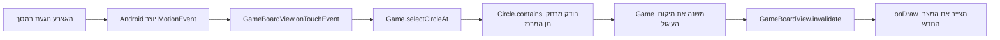

{: .box-note}
זהו פרק למחשבה אחרי השלמת המשחק. אין בו שינוי שצריך לבצע בקוד. מטרתו לבדוק באופן ביקורתי את
הבחירות שעשינו, ולא להפוך אותן לכללי ברזל.

## השאלה הטובה: מדוע `Circle` אינו יורש מ־`View`?

במשחק שלנו רק `GameBoardView` הוא רכיב UI של Android. הוא מקבל את אירועי המגע ומצייר את כל
המשחק. `Circle` ו־`Target` הם אובייקטים רגילים שאינם נמצאים בעץ ה־Views.

זו אינה טעות. ב־Android אירוע מגע נשלח ל־`View` שנמצא בעץ המסך, ולא לכל אובייקט מצויר. עיגול
שצויר על `Canvas` הוא בסך הכול פיקסלים; מערכת ההפעלה אינה יודעת שנוצר שם "עיגול לחיץ". לכן
`GameBoardView` מקבל את האירוע ומתרגם אותו לפעולה בעולם המשחק:



כלומר, `Circle` כן משתתף בתגובה למגע, אך באמצעות **העברת אחריות** ולא מפני שהוא מקבל את
האירוע ישירות.

## האם זה דומה ל־Blobby?

ב־[pygameBlobby](https://github.com/3strategy/pygameBlobby) נבנתה שרשרת דומה לזו:

```text
pygame.sprite.Sprite ← SharedSprite ← Player
```

זו בחירה הגיונית ב־Pygame: המחלקה `pygame.sprite.Sprite` היא חלק ממנגנון המשחק. היא משתלבת
בקבוצות Sprites, בעדכון ובציור. אפשר לראות זאת ב־
[`Shared.py`](https://github.com/3strategy/pygameBlobby/blob/master/Shared.py)
וב־[`player.py`](https://github.com/3strategy/pygameBlobby/blob/master/player.py).

אבל `pygame.sprite.Sprite` אינו המקביל המדויק של Android `View`. הוא קרוב יותר ל"אובייקט
בסצנת המשחק". `View`, לעומתו, הוא רכיב במערכת ממשק מלאה: יש לו מדידה, פריסה, מיקוד, נגישות,
עץ הורים וילדים ומנגנון הפצת אירועים.

לכן הרעיון שמאחורי Blobby נכון גם כאן — אובייקט משחק צריך להשתלב במנגנון המשחק — אך אין מכך
מסקנה שכל עיגול חייב לרשת מ־`View`. אצלנו המנגנון הוא `Game` יחד עם `GameBoardView`.

## שלוש דרכים נכונות, למטרות שונות

{: .table-he}

| תכנון | יתרון | מחיר | מתי מתאים |
|---|---|---|---|
| `Circle extends View` | כל עיגול מקבל אירועים, מיקום ונגישות של View | יותר קוד, המרות קואורדינטות, ניהול שכבות ופריסה | מעט רכיבי UI עצמאיים |
| `GameBoardView` אחד ואובייקטי משחק רגילים | ציור, סדר שכבות וגרירה נשארים פשוטים | צריך לבצע בעצמנו hit testing ונגישות | משחק Canvas עם עצמים נעים |
| מודל טהור + מצייר נפרד | קל לבדוק את חוקי המשחק בלי Android | עוד מחלקות והעברת נתונים | משחק גדול או קוד שצריך בדיקות רבות |

במשחק הקטן שלנו הייתי נשאר עם `GameBoardView` יחיד. חמישה `CircleView`-ים היו אפשריים, אך
לא היו מלמדים בהכרח OOP טוב יותר. הם היו מוסיפים בעיקר פרטי Android. בנוסף, הגבול של View
הוא מלבן, ולכן גם אז היינו צריכים לכתוב בדיקה מיוחדת כדי לדעת אם האצבע נמצאת בתוך העיגול
עצמו.

{: .box-warning}
ביישום אמיתי שבו כל עיגול הוא גם פקד עצמאי — למשל צריך להגיע אליו בעזרת מקלדת או קורא מסך —
ייתכן ש־View נפרד יהיה הבחירה הטובה יותר. במשחק Canvas ייצור נגישות דורש עבודה מפורשת.

## ביקורת חשובה על הקוד הנוכחי

`Circle` הוא **מחלקת Java רגילה**, אך הוא אינו **מודל טהור**. הוא מייבא `Canvas` ו־`Paint`
ויודע לצייר את עצמו. גם `Game` מקבל `Canvas` ו־`Paint`. לכן המשפט "כל הציור נשאר
ב־`GameBoardView`" אינו מדויק לחלוטין.

הקוד הנוכחי הוא פשרה לימודית:

- המיקום, הרדיוס וחישובי הגאומטריה נמצאים ליד העיגול.
- העיגול יודע כיצד לצייר את עצמו.
- ה־View מטפל במחזור החיים ובאירועי Android.
- `Game` מרכז את אוסף העצמים ואת חוקי האיסוף.

לפרויקט קטן של תלמידי תיכון זו פשרה סבירה: מעט מחלקות, מעט קוד וחלוקת אחריות שניתן לראות.
אם המטרה הייתה מודל טהור, `Circle` היה מכיל רק נתונים וגאומטריה, והציור היה עובר למחלקת
`Renderer` או ל־`GameBoardView`. זה היה נקי יותר מבחינה אדריכלית, אך גם מוסיף שכבה שאינה
נחוצה עדיין.

## ומה לגבי `Target extends Circle`?

כרגע הירושה מועילה: מטרה היא עיגול מבחינה גאומטרית, ולכן היא משתמשת במרכז, ברדיוס,
ב־`distanceTo` ובציור הבסיסי. היא מוסיפה צלב ובדיקה אם עיגול אחר נמצא כולו בתוכה.

עם זאת, המשפט "מטרה היא עיגול" אינו מספיק לבדו. צריך לשאול אם אפשר להשתמש ב־`Target` בכל
מקום שמצפה ל־`Circle` בלי להפתיע. במשחק הנוכחי התשובה כמעט תמיד כן, ולכן הירושה סבירה.

אם בעתיד לעיגולים הנגררים יהיו מהירות, ניקוד והתנהגות מגע, ואילו למטרה יהיו חוקים שונים
לחלוטין, עדיף אולי ששניהם **יכילו** גאומטריית מעגל משותפת במקום שאחד יירש מן האחר. זהו
הרעיון של composition over inheritance: משתפים יכולת, לא מכריחים קשר משפחתי.

## OOP אינו אומר "כל דבר שרואים חייב לרשת מרכיב UI"

ירושה אמורה לבטא יחס אמיתי של **is-a** והתאמה להתנהגות של מחלקת האב. היא אינה פרס שמקבלים
על כך שיצרנו מחלקה.

- `Player is a pygame Sprite` — מתאים, כי הוא משתתף במנגנון ה־Sprites.
- `GameBoardView is an Android View` — מתאים, כי הוא משתתף במדידה, בציור ובהפצת מגע.
- `Circle is an Android View` — לפעמים מתאים, אך לא כאשר הוא רק עצם בתוך ציור Canvas.
- `Target is a Circle` — מתאים כרגע מבחינה גאומטרית, אך ראוי לבדוק שוב אם התפקידים יתרחקו.

תכנון OOP טוב נקבע לפי אחריות ושינוי צפוי, לא לפי מספר מחלקות האב.

## ומה למדנו מ־TicTacMenu?

ב־`TicTacMenu` ההפרדה של `TicTacToeModel` מוצדקת יותר באופן טבעי. לוח איקס־עיגול וחוקיו
אינם תלויים ב־Android: חוקיות מהלך, תור, ניצחון ותיקו צריכים להיות זהים אם התצוגה היא תשעה
כפתורים, Canvas, אתר או משחק רשת. הכפתורים הם באמת רכיבי UI, ואילו הלוח הוא מצב המשחק.

אבל עצם יצירת תיקייה בשם `models` אינה מוכיחה שההפרדה טובה. בקוד הנוכחי:

- `checkWin()` ו־`isTie()` עדיין אינם ממומשים, ולכן המודל עדיין אינו מחזיק באמת בכל חוקי המשחק.
- הפעילות בודקת חוקיות, מבצעת מהלך, מעדכנת כפתור ומחליפה שחקן בכמה צעדים נפרדים.
- `makeMove()` ו־`setMove()` מבצעות תפקידים דומים.
- זרימת המשחק משוכפלת בין `MainActivity` ובין `Main2Activity`.
- `"X"` ו־`"O"` הן מחרוזות חופשיות במקום טיפוס שמגביל את הערכים האפשריים.

אין צורך לתקן את כל אלה בשלב הראשון. דווקא כדאי לראות בהם סימנים לשאלה הבאה: כאשר מוסיפים
ניצחון, תיקו ומשחק רשת, איזו אחריות מתחילה להשתכפל או לברוח מן המודל?

בגרסה בשלה יותר הייתי מבקש מן המודל פעולה אחת בסגנון "נסה לבצע מהלך", ומקבל בחזרה תוצאה:
מהלך לא חוקי, המשחק ממשיך, ניצחון או תיקו. הפעילות הייתה מתרגמת את התוצאה לתצוגה. כך המודל
מגן על חוקיו בעצמו, וה־UI אינו צריך לדעת באיזה סדר להפעיל אותם.

## כלל אצבע לתלמידים

לפני שיוצרים ירושה או מחלקת Model, שאלו:

1. מה משתנה כאשר חוקי המשחק משתנים?
2. מה משתנה כאשר רק העיצוב או Android משתנים?
3. מי מקבל את האירוע, ומי רק מחליט מה משמעותו?
4. האם מחלקת הבן באמת יכולה להחליף את מחלקת האב?
5. האם ההפרדה חוסכת כפילות או מאפשרת בדיקה, או שהיא רק מוסיפה קבצים?

{: .box-success}
המסקנה אינה שהפתרון של CollectCircles הוא "הפתרון הנכון", אלא שהוא פתרון קטן ומתאים לשלב
הלימודי. הדיוק החשוב הוא לקרוא לו **אובייקטי משחק בתוך View מצייר**, ולא "מודל טהור".
ב־TicTacMenu כדאי לשמור על מודל נפרד, אך גם לדרוש ממנו להחזיק באמת את חוקי המשחק ולא רק את
מערך התאים.

[קישור למדריך notification](/android/CollectCircles/05.collect-circles-local-notification)
