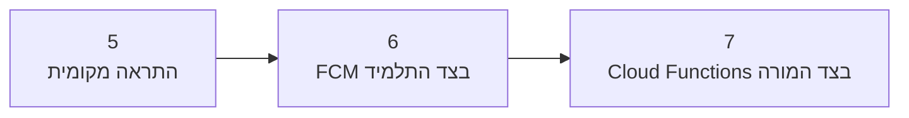

[חזרה לפרק 3: זמן, שיא וסיום המשחק](/android/CollectCircles/03.collect-circles-finish)

{: .box-note}
המשחק כבר שלם בסוף פרק 3. בפרקים 5–7 לא נשנה את חוקי המשחק; נשתמש בו כדי ללמוד שלוש שכבות של התראות. בכל פרק נוסיף רק חוליה אחת למסלול, ולכן אפשר להריץ ולבדוק תוצאה לפני שממשיכים.

## התמונה הגדולה

- בפרק 5 היישום מציג התראה **באותו טלפון**.
- בפרק 6 הודעה עוברת דרך FCM ויכולה להגיע **לטלפונים אחרים**.
- בפרק 7 נלמד מי מפעיל את התהליך בענן וכיצד המורה פורס את הפונקציות.

## [פרק 5 — התראה מקומית](/android/CollectCircles/05.collect-circles-local-notification)

נתחיל במסלול הקצר ביותר: לחיצה ביישום בונה התראה ומוסרת אותה ישירות ל־Android באותו מכשיר. נוסיף הרשאת התראות, `NotificationChannel` וכפתור בדיקה.

**מה נראה בסוף?** לוחצים על `LocalNotif` ומקבלים מיד התראה בטלפון שלנו.

{: .box-success}
זהו checkpoint עצמאי: אם ההתראה המקומית עובדת, כבר הבנו הרשאה, ערוץ והצגה. עדיין אין צורך ב־Firebase או בחיבור לרשת.

## [פרק 6 — התראות דרך FCM](/android/CollectCircles/06.collect-circles-fcm-invitations)

נחבר את היישום ל־Firebase, נירשם ל־topics ונקבל הודעות שמגיעות דרך Firebase Cloud Messaging. נכיר את ההבדל בין הודעת `notification` לבין הודעת `data`, ונראה מה קורה כשהיישום בחזית או ברקע.

**מה נראה בסוף?** מכשיר אחד יכול ליזום הזמנה, ו־FCM מעביר אותה למכשירים הרשומים — כולל המכשיר השולח לצורך בדיקה.

עבור רוב התלמידים זהו סוף המסלול המעשי:

- צד Android מחובר ועובד.
- אפשר לשלוח ולקבל הודעות דרך התשתית שהמורה פרס.
- אין צורך בהרשאות לפרויקט Firebase או בפרטי גישה לשרת.

## [פרק 7 — תשתית הענן](/android/CollectCircles/07.collect-circles-cloud-infrastructure)

פרק זה מיועד למורה או לתלמיד שמנהל את פרויקט Firebase. ניצור ונפרוס Cloud Functions שמקבלות בקשה, בונות הודעה בטוחה ומבקשות מ־FCM להפיץ אותה.

**מה נראה בסוף?** המסלול המלא עובד: יישום או בקשה חיצונית פונים לפונקציה, הפונקציה פונה ל־FCM, וההתראה מגיעה למכשירים.

{: .box-warning}
אין צורך שכל תלמיד יפרוס פונקציה. כדאי להבין את המסלול ואת חלוקת האחריות, אך מפתחות, הרשאות, חיוב וטקסט שנשלח לכולם נשארים בשליטת בעל פרויקט Firebase.

## מי אחראי על מה?

| שכבה | אחריות |
|---|---|
| Android | הרשאה, ערוץ, הרשמה ל־topic וקבלת ההודעה |
| Cloud Function | בדיקת הבקשה והחלטה איזה תוכן מותר לשלוח |
| FCM | ניתוב והעברת ההודעה למכשירים הרשומים |

{: .box-note}
אחרי פרק 6 אפשר לבחור: להמשיך לפרק 7 כדי להבין ולנהל את צד הענן, או לעבור אל [מפת הדרך לפרקים 8–18](/android/CollectCircles/08-18.student-roadmap) ולהתחיל להפוך את המשחק למשחק Idle.

## המשך

[קישור למדריך 5: Notification](/android/CollectCircles/05.collect-circles-local-notification)

<!-- gemini-tutor-links:start -->

## מורה־עזר ב־Gemini

{: .box-note}
[פתחו את Gem: מעבדת התראות CollectCircles](https://gemini.google.com/gem/1gjXRaD60MfNq2FDXVuZxsud9-8bjKDrE?usp=sharing) כדי לקבל רמזים, שאלות אבחון והסברים המתאימים לשלב שבו אתם נמצאים.

<!-- gemini-tutor-links:end -->
