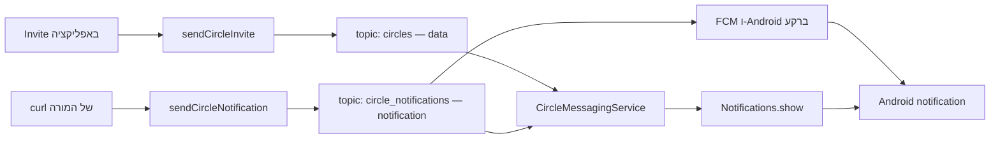

{: .box-note}
ב־[פרק 5]({{ '/android/CollectCircles/05.collect-circles-local-notification' | relative_url }})
יצרנו ערוץ, ביקשנו הרשאה והצגנו התראה מקומית. בפרק זה משלימים את **כל צד התלמיד**:
מחברים את היישום ל־Firebase, נרשמים לשני נושאי FCM ומקבלים את שני סוגי ההודעות שהשרת של
המורה כבר יודע לשלוח. התלמיד אינו יוצר, משנה או פורס פונקציות serverless.

[חזרה למדריך 5 notification](/android/CollectCircles/05.collect-circles-local-notification)




{: .box-error}
הפרויקט חייב להיקרא **`CollectCircles`**, וה־package חייב להיות בדיוק
**`com.example.collectcircles`**. זהו היישום שנרשם אצל המורה; package אחר לא יתאים להגדרות
הלקוח ולמגבלות נקודות הקצה.

## לפני שמתחילים: מה המורה נותן ומה התלמיד עושה

המורה כבר הכין:

- Firebase project ויישום Android רשום בשם `com.example.collectcircles`.
- שתי callable functions:‏ `sendCircleInvite` ו־`sendCircleNotification`.
- שני נושאים קבועים: `circles` ו־`circle_notifications`.
- ארבעה ערכי הגדרת לקוח לכל תלמיד.

התלמיד מבצע רק את השינויים בפרק זה ומעתיק את ארבעת הערכים שהמורה נתן. אין להכניס ליישום
service-account key,‏ Admin SDK credential או סוד שרת אחר.

{: .box-note}
כמו בפרק 5, בכל שינוי מופיעים המיקום המדויק ו־diff קטן מול הקוד בסוף הפרק הקודם. `-` מסמן
שורה שמוחקים, `+` מסמן שורה שמוסיפים, ושורות ללא סימן הן הקשר קיים.

## 1. מכינים את הגדרת Firebase המקומית

### א. מונעים העלאה של הערכים המקומיים

בחלון **Project**, עברו לתצוגת **Project** ופתחו את `.gitignore` שבשורש הפרויקט, לצד
`settings.gradle.kts`. הוסיפו:

```diff
 /local.properties
+/firebase.properties
 /.idea/caches
```

### ב. יוצרים קובץ דוגמה

לחצו לחיצה ימנית על שורש הפרויקט **CollectCircles**, בחרו **New > File** וצרו:

`firebase.properties.example`

תוכנו:

```properties
# Register com.example.collectcircles in the Firebase project, then copy this
# file to firebase.properties and replace all four values.
FIREBASE_APPLICATION_ID=replace_with_mobile_sdk_app_id
FIREBASE_API_KEY=replace_with_firebase_api_key
FIREBASE_PROJECT_ID=yourFirebaseProjectName
FIREBASE_SENDER_ID=replace_with_project_number
```

### ג. יוצרים את קובץ התלמיד

לחצו שוב לחיצה ימנית על שורש הפרויקט ובחרו **New > File**. צרו:

`firebase.properties`

העתיקו אליו את המבנה הבא והחליפו את ארבעת הערכים בערכים שקיבלתם מהמורה:

```properties
FIREBASE_APPLICATION_ID=<mobilesdk_app_id>
FIREBASE_API_KEY=<firebase_api_key>
FIREBASE_PROJECT_ID=<firebase_project_id>
FIREBASE_SENDER_ID=<project_number>
```

`firebase.properties` הוא קובץ מקומי שאינו נכנס ל־Git. הערכים הם הגדרת **לקוח** של Firebase,
לא הרשאת Admin. אין להעתיק `google-services.json` מיישום Android אחר: לכל יישום רשום יש
`mobilesdk_app_id` משלו.

## 2. מוסיפים את ספריות Firebase ל־version catalog

בחלון **Project**, פתחו:

`Gradle Scripts > libs.versions.toml (Version Catalog)`

זהו הקובץ `gradle/libs.versions.toml`. הוסיפו את גרסת ה־BoM תחת `[versions]`:

```diff
 constraintlayout = "2.2.1"
+firebaseBom = "34.17.0"

 [libraries]
```

תחת `[libraries]` הוסיפו את שלוש ההגדרות:

```diff
 constraintlayout = { group = "androidx.constraintlayout", name = "constraintlayout", version.ref = "constraintlayout" }
+firebase-bom = { group = "com.google.firebase", name = "firebase-bom", version.ref = "firebaseBom" }
+firebase-messaging = { group = "com.google.firebase", name = "firebase-messaging" }
+firebase-functions = { group = "com.google.firebase", name = "firebase-functions" }

 [plugins]
```

ה־BoM בוחר גרסאות תואמות ל־Messaging ול־Functions, ולכן לשתי הספריות אין מספר גרסה נפרד.

## 3. מלמדים את Gradle לקרוא את ארבעת הערכים

בחלון **Project**, פתחו:

`Gradle Scripts > build.gradle.kts (Module :app)`

זהו `app/build.gradle.kts`.

### א. קוראים את קובץ ה־properties

בראש הקובץ, לפני `plugins`, הוסיפו את הקוד הבא:

```diff
+import java.util.Properties
+
 plugins {
     alias(libs.plugins.android.application)
 }
+
+// firebase.properties מכיל רק את ארבעת ערכי הלקוח שסיפק המורה.
+// קובץ הדוגמה מאפשר ל-Gradle להסביר מה חסר גם לפני יצירת הקובץ המקומי.
+val firebaseProperties = Properties().apply {
+    val localFile = rootProject.file("firebase.properties")
+    val sourceFile = if (localFile.exists()) {
+        localFile
+    } else {
+        rootProject.file("firebase.properties.example")
+    }
+    sourceFile.inputStream().use(::load)
+}
+
+fun firebaseValue(name: String): String =
+    firebaseProperties.getProperty(name)
+        ?: error("Missing $name in firebase.properties")
```

### ב. הופכים את הערכים למשאבי Android

בתוך `defaultConfig`, אחרי `testInstrumentationRunner`, הוסיפו:

```diff
         testInstrumentationRunner = "androidx.test.runner.AndroidJUnitRunner"
+
+        resValue("string", "google_app_id", firebaseValue("FIREBASE_APPLICATION_ID"))
+        resValue("string", "google_api_key", firebaseValue("FIREBASE_API_KEY"))
+        resValue("string", "project_id", firebaseValue("FIREBASE_PROJECT_ID"))
+        resValue("string", "gcm_defaultSenderId", firebaseValue("FIREBASE_SENDER_ID"))
     }
```

אלה השמות ש־Firebase SDK מחפש. לכן אין צורך להפעיל Google Services plugin ואין צורך
להוסיף `google-services.json`.

### ג. מוסיפים את התלויות

בתוך `dependencies`, אחרי ספריות Android הקיימות, הוסיפו:

```diff
     implementation(libs.activity)
     implementation(libs.constraintlayout)
+    implementation(platform(libs.firebase.bom))
+    implementation(libs.firebase.messaging)
+    implementation(libs.firebase.functions)
     testImplementation(libs.junit)
```

לחצו **Sync Now** והמתינו לסיום Gradle Sync לפני שממשיכים.

## 4. מכינים את הערוץ גם להודעת notification ברקע

בפרק 5 הערוץ נוצר רק כאשר הקוד שלנו קרא `Notifications.show`. בהודעת FCM מסוג
`notification`, כשהיישום ברקע, FCM ו־Android עשויים להציג את ההתראה בעצמם. לכן בפרק זה
נותנים לערוץ מזהה כמשאב ויוצרים אותו כבר בפתיחת היישום.

### א. מוסיפים את מזהה הערוץ

פתחו:

`app > res > values > strings.xml`

```diff
     <string name="notification_channel_name">Circle invitations</string>
     <string name="notification_channel_description">Notifications about Collect Circles invitations</string>
+    <string name="notification_channel_id" translatable="false">circle_invitations</string>
     <string name="notification_title">Collect Circles</string>
```

### ב. מפרידים יצירת ערוץ מהצגת התראה

פתחו:

`app > java > com.example.collectcircles > Notifications`

זהו `app/src/main/java/com/example/collectcircles/Notifications.java`. החליפו את הקטע הבא:

```diff
 public final class Notifications {

-    private static final String CHANNEL_ID = "circle_invitations";
     private static final int NOTIFICATION_ID = 1;

     private Notifications() {
         // זוהי מחלקת עזר בלבד. אין צורך ליצור ממנה אובייקטים.
     }

-    public static void show(Context context) {
+    public static void createChannel(Context context) {
         NotificationManager manager = context.getSystemService(NotificationManager.class);

         NotificationChannel channel = new NotificationChannel(
-                CHANNEL_ID,
+                context.getString(R.string.notification_channel_id),
                 context.getString(R.string.notification_channel_name),
                 NotificationManager.IMPORTANCE_HIGH
         );
         channel.setDescription(
                 context.getString(R.string.notification_channel_description)
         );
         manager.createNotificationChannel(channel);
+    }
+
+    public static void show(Context context) {
+        createChannel(context);
+        NotificationManager manager = context.getSystemService(NotificationManager.class);

-        Notification notification = new Notification.Builder(context, CHANNEL_ID)
+        Notification notification = new Notification.Builder(
+                context,
+                context.getString(R.string.notification_channel_id)
+        )
                 .setSmallIcon(R.drawable.ic_launcher_foreground)
```

## 5. רושמים את שירות FCM ב־Manifest

פתחו:

`app > manifests > AndroidManifest.xml`

בתוך `application`, מיד אחרי שורת ה־theme, הוסיפו metadata שמספר ל־FCM באיזה ערוץ להשתמש
להודעת notification ברקע. אחרי תגית ה־`activity`, הוסיפו את השירות:

```diff
         android:roundIcon="@mipmap/ic_launcher_round"
         android:supportsRtl="true"
         android:theme="@style/Theme.CollectCircles">
+        <meta-data
+            android:name="com.google.firebase.messaging.default_notification_channel_id"
+            android:value="@string/notification_channel_id" />
+
         <activity
             android:name=".MainActivity"
             android:exported="true">
             <intent-filter>
                 <action android:name="android.intent.action.MAIN" />

                 <category android:name="android.intent.category.LAUNCHER" />
             </intent-filter>
         </activity>
+
+        <service
+            android:name=".CircleMessagingService"
+            android:exported="false">
+            <intent-filter>
+                <action android:name="com.google.firebase.MESSAGING_EVENT" />
+            </intent-filter>
+        </service>
     </application>
```

`android:exported="false"` מונע מיישומים רגילים להפעיל את השירות. ה־intent filter מאפשר ל־FCM
למסור אליו הודעות.

## 6. יוצרים `CircleMessagingService` ונרשמים לשני topics

בחלון **Project**, עברו אל:

`app > java > com.example.collectcircles`

לחצו לחיצה ימנית על החבילה **`com.example.collectcircles`**, בחרו
**New > Java Class**, הקלידו `CircleMessagingService` ובחרו **Class**. Android Studio ייצור:

`app/src/main/java/com/example/collectcircles/CircleMessagingService.java`

החליפו את תוכנו בקוד הבא:

```java
package com.example.collectcircles;

import com.google.firebase.messaging.FirebaseMessaging;
import com.google.firebase.messaging.FirebaseMessagingService;
import com.google.firebase.messaging.RemoteMessage;

public class CircleMessagingService extends FirebaseMessagingService {

    static final String DATA_TOPIC = "circles";
    static final String NOTIFICATION_TOPIC = "circle_notifications";

    @Override
    public void onMessageReceived(RemoteMessage message) {
        super.onMessageReceived(message);

        // endpoint ראשון: הודעת data. השירות שלנו בוחר אם להציג אותה.
        if ("circle_invite".equals(message.getData().get("event"))) {
            Notifications.show(this);
        }

        // endpoint שני: notification payload. ברקע FCM מציג אותו בעצמו;
        // בחזית הוא מגיע לכאן ואנו מציגים את אותה התראה קבועה.
        if (message.getNotification() != null) {
            Notifications.show(this);
        }
    }

    @Override
    public void onNewToken(String token) {
        super.onNewToken(token);

        // ה-token עשוי להתחלף. רושמים שוב את שני המנויים; הפעולה בטוחה וחוזרת.
        FirebaseMessaging.getInstance().subscribeToTopic(DATA_TOPIC);
        FirebaseMessaging.getInstance().subscribeToTopic(NOTIFICATION_TOPIC);
    }
}
```

{: .box-success}
זהו המקום הראשון שבו מוגדרים **שני** הנושאים: `DATA_TOPIC = "circles"` עבור
`sendCircleInvite`, ו־`NOTIFICATION_TOPIC = "circle_notifications"` עבור
`sendCircleNotification`. בתוך `onNewToken` נרשמים מחדש **לשניהם יחד**, מפני ש־FCM token
של התקנה עשוי להתחלף.

## 7. מאתחלים Firebase ונרשמים לשני topics בפתיחת היישום

ההרשמה ב־`onNewToken` מתקנת מנוי כאשר token מתחלף, אבל אינה תחליף להרשמה הראשונה בזמן פתיחת
היישום. לכן נרשמים לשני הנושאים גם ב־`MainActivity`.

פתחו:

`app > java > com.example.collectcircles > MainActivity`

זהו `app/src/main/java/com/example/collectcircles/MainActivity.java`.

### א. מוסיפים imports

```diff
 import com.example.collectcircles.databinding.ActivityMainBinding;
+import com.google.firebase.FirebaseApp;
+import com.google.firebase.functions.FirebaseFunctions;
+import com.google.firebase.messaging.FirebaseMessaging;
 import com.google.android.material.dialog.MaterialAlertDialogBuilder;
```

### ב. מאתחלים, יוצרים ערוץ ונרשמים

בתוך `onCreate`, מיד אחרי רישום `notificationPermissionLauncher` ולפני
`getSharedPreferences`, הוסיפו את כל הקטע הבא:

```diff
         notificationPermissionLauncher = registerForActivityResult(
                 new ActivityResultContracts.RequestPermission(),
                 permissionGranted -> {
                     if (permissionGranted) {
                         Notifications.show(this);
                     } else {
                         Toast.makeText(
                                 this,
                                 R.string.notification_permission_denied,
                                 Toast.LENGTH_SHORT
                         ).show();
                     }
                 }
         );

+        // ארבעת ערכי הלקוח נקראו מ-firebase.properties על-ידי Gradle.
+        FirebaseApp.initializeApp(this);
+
+        // FCM יכול להציג notification payload ברקע בלי לקרוא ל-show שלנו.
+        // לכן הערוץ חייב להתקיים כבר אחרי הפתיחה הראשונה של היישום.
+        Notifications.createChannel(this);
+
+        // הרשמה ראשונה לשני ה-topics. הרשמה חוזרת אינה יוצרת מנוי כפול.
+        FirebaseMessaging.getInstance().subscribeToTopic(
+                CircleMessagingService.DATA_TOPIC
+        );
+        FirebaseMessaging.getInstance().subscribeToTopic(
+                CircleMessagingService.NOTIFICATION_TOPIC
+        );
+
         preferences = getSharedPreferences(PREFERENCES_NAME, MODE_PRIVATE);
```

{: .box-warning}
`subscribeToTopic` **אינה** בקשת הרשאת התראות. היא רק אומרת ל־FCM אילו הודעות למסור להתקנה.
הרשאת `POST_NOTIFICATIONS` עדיין נדרשת כדי שהמשתמש יראה אותן.

`subscribeToTopic` אסינכרונית. FCM שומר את ההרשמה ומנסה שוב לאחר תקלה זמנית. אין צורך לשמור
boolean משלנו. בקשה חוזרת לאותו topic אינה יוצרת מנוי כפול.

## 8. מוסיפים כפתור Invite עבור הודעת data

### א. מעדכנים את המסך

פתחו:

`app > res > layout > activity_main.xml`

הוסיפו את `inviteButton` אחרי `localNotifButton`, ושנו את ה־constraint של הלוח:

```diff
     <com.example.collectcircles.GameBoardView
         android:id="@+id/gameBoard"
         android:layout_width="0dp"
         android:layout_height="0dp"
         android:layout_marginTop="16dp"
         android:layout_marginBottom="20dp"
         android:minHeight="320dp"
         app:layout_constraintBottom_toBottomOf="parent"
         app:layout_constraintEnd_toEndOf="parent"
         app:layout_constraintStart_toStartOf="parent"
-        app:layout_constraintTop_toBottomOf="@id/localNotifButton"
+        app:layout_constraintTop_toBottomOf="@id/inviteButton"
         tools:background="@color/board_background" />

     <com.google.android.material.button.MaterialButton
         android:id="@+id/localNotifButton"
         android:layout_width="0dp"
         android:layout_height="wrap_content"
         android:layout_marginTop="8dp"
         android:text="@string/local_notification"
         app:cornerRadius="14dp"
         app:layout_constraintEnd_toEndOf="parent"
         app:layout_constraintStart_toStartOf="parent"
         app:layout_constraintTop_toBottomOf="@id/startButton" />
+
+    <com.google.android.material.button.MaterialButton
+        android:id="@+id/inviteButton"
+        android:layout_width="0dp"
+        android:layout_height="wrap_content"
+        android:layout_marginTop="8dp"
+        android:text="@string/invite"
+        app:cornerRadius="14dp"
+        app:layout_constraintEnd_toEndOf="parent"
+        app:layout_constraintStart_toStartOf="parent"
+        app:layout_constraintTop_toBottomOf="@id/localNotifButton" />

 </androidx.constraintlayout.widget.ConstraintLayout>
```

### ב. מוסיפים טקסטים

פתחו `app > res > values > strings.xml` והוסיפו:

```diff
     <string name="local_notification">LocalNotif</string>
+    <string name="invite">Invite</string>
     <string name="restart">Restart</string>
```

ובהמשך אותו קובץ, לפני `</resources>`:

```diff
     <string name="notification_permission_denied">Notification permission is required</string>
+    <string name="invite_sent">Invitation sent</string>
+    <string name="invite_failed">Invitation could not be sent</string>
 </resources>
```

### ג. מחברים את הכפתור לפונקציה שהמורה פרס

ב־`MainActivity`, אחרי ה־listener של `localNotifButton`, הוסיפו:

```diff
         binding.localNotifButton.setOnClickListener(
                 view -> requestPermissionAndShowNotification()
         );
+        binding.inviteButton.setOnClickListener(view -> sendInvite());
         binding.gameBoard.setOnGameFinishedListener(this::finishGame);
```

מיד אחרי `onCreate` ולפני `requestPermissionAndShowNotification`, הוסיפו:

```diff
     }

+    private void sendInvite() {
+        binding.inviteButton.setEnabled(false);
+
+        FirebaseFunctions.getInstance()
+                .getHttpsCallable("sendCircleInvite")
+                .call()
+                .addOnCompleteListener(task -> {
+                    binding.inviteButton.setEnabled(true);
+                    int message = task.isSuccessful()
+                            ? R.string.invite_sent
+                            : R.string.invite_failed;
+                    Toast.makeText(this, message, Toast.LENGTH_SHORT).show();
+                });
+    }
+
     private void requestPermissionAndShowNotification() {
```

הכפתור מושבת בזמן הקריאה כדי למנוע לחיצות מקבילות מאותו מסך. השרת הוא שבוחר את ה־topic ואת
תוכן ההודעה; הלקוח אינו שולח topic או טקסט חופשי.

## 9. מתי בדיוק הטלפון מבקש הרשאת התראות?

FCM **אינו** מציג לנו אוטומטית את חלון `POST_NOTIFICATIONS` כאשר נרשמים ל־topic או כאשר
מפעילים curl. בפרויקט שלנו הבקשה כבר נכתבה בפרק 5, והיא מופעלת כאשר לוחצים לראשונה על
`LocalNotif`.

לכן, לפני בדיקת FCM ב־Android 13 ומעלה:

1. הפעילו את היישום לפחות פעם אחת — כך Firebase מאותחל, שני המנויים נשמרים והערוץ נוצר.
2. לחצו `LocalNotif` ואשרו את בקשת ההתראות.
3. רק אחר כך העבירו את היישום לרקע ובדקו את ה־curl או את `Invite`.

{: .box-error}
אם לא לחצתם `LocalNotif` ולא אישרתם את ההרשאה, המכשיר עדיין עשוי להיות רשום לשני topics ואף
לקבל את הודעת FCM, אבל Android לא יציג אותה למשתמש. curl מפעיל את השרת; הוא אינו יכול ללחוץ
בשם המשתמש על חלון הרשאה בטלפון.

אם היינו מלמדים FCM בלי תרחיש הכפתור המקומי, עדיין היינו חייבים להוסיף ליישום מסך או פעולה
שקוראים ל־`notificationPermissionLauncher.launch(Manifest.permission.POST_NOTIFICATIONS)`
ברגע מתאים. ההרשאה שייכת ליכולת **להציג התראה בטלפון**, ולא למקור האירוע שגרם לה.

## 10. ההבדל בין שני הנתיבים

| נקודת קצה | topic | payload | כשהיישום בחזית | כשהיישום ברקע |
|---|---|---|---|---|
| `sendCircleInvite` | `circles` | `data` | השירות קורא `Notifications.show` | השירות קורא `Notifications.show` |
| `sendCircleNotification` | `circle_notifications` | `notification` | ההודעה מגיעה לשירות, והוא קורא `Notifications.show` | FCM ו־Android מציגים ישירות בערוץ שהוגדר |

הנתיב השני הוא הסיבה לשלושה פרטים שקל לפספס:

- נרשמים גם ל־`circle_notifications`, ולא רק ל־`circles`.
- יוצרים את הערוץ כבר בפתיחת היישום.
- מגדירים ב־Manifest את `default_notification_channel_id`.

סגירה רגילה או הסרה ממסך היישומים האחרונים אינה Force stop. הודעת notification יכולה להופיע
גם כאשר `MainActivity` אינה פתוחה, לאחר שהיישום הופעל ונרשם לפחות פעם אחת. לעומת זאת, לאחר
**Force stop** מכוון Android חוסם מסירה עד שהמשתמש פותח שוב את היישום. אחרי אתחול הטלפון
ייתכן עיכוב עד ששירותי Google Play והמערכת משלימים את האתחול.

## 11. בדיקת צד התלמיד

### בדיקה א — הכנה והרשמה

1. בצעו **Build > Make Project**.
2. התקינו והפעילו את היישום על מכשיר עם Google Play services וחיבור רשת.
3. לחצו `LocalNotif`, אשרו התראות וודאו שההתראה המקומית מופיעה.
4. המתינו כמה שניות כדי לאפשר לשתי פעולות `subscribeToTopic` להסתיים.

### בדיקה ב — data דרך הכפתור

1. הפעילו את היישום בשני מכשירים והשלימו את בדיקה א בשניהם.
2. לחצו `Invite` במכשיר אחד.
3. ודאו שמופיע Toast בשם **Invitation sent**.
4. ודאו ששני המכשירים מקבלים התראה דרך `circles`.

### בדיקה ג — notification דרך curl של המורה

השאירו את היישום ברקע, אך אל תבצעו Force stop. המורה מפעיל את פקודת ה־curl שסופקה עבור
`sendCircleNotification`. אין להעתיק מן המורה credentials או קוד serverless אל פרויקט Android.

ודאו שההתראה מגיעה דרך `circle_notifications` גם כשהמסך של CollectCircles אינו פתוח. פתחו
לאחר מכן את היישום ובקשו מהמורה להפעיל שוב את הפקודה; בחזית ההודעה אמורה להגיע
ל־`CircleMessagingService`, שמפעיל `Notifications.show`.

## אם הבדיקה אינה מצליחה

- **Toast של כישלון ב־Invite:** בדקו שכל ארבעת ערכי `firebase.properties` שייכים ליישום
  `com.example.collectcircles` וש־Gradle Sync הסתיים.
- **השרת מדווח הצלחה אבל אין התראה:** בדקו הרשאת Notifications בהגדרות היישום ואת הגדרות
  הערוץ **Circle invitations**.
- **רק נתיב data עובד:** ודאו שקיימים גם המנוי ל־`NOTIFICATION_TOPIC`, גם ה־metadata ב־Manifest
  וגם `Notifications.createChannel(this)` בפתיחה.
- **רק נתיב notification עובד ברקע:** בדקו את `onMessageReceived`, את הערך
  `circle_invite` ואת רישום השירות ב־Manifest.
- **לאחר Force stop אין דבר:** זו התנהגות Android צפויה. פתחו את היישום שוב.

{: .box-success}
בסוף הפרק כל התקנה נרשמת **בפתיחה ובכל החלפת token** גם ל־`circles` וגם
ל־`circle_notifications`. היא יכולה לקבל הודעת data שהקוד שלנו מציג, וגם הודעת notification
ש־FCM ו־Android מציגים ישירות ברקע — ושתיהן כפופות לאותה הרשאת התראות של המשתמש.

## מקורות רשמיים

- [FirebaseMessaging.subscribeToTopic](https://firebase.google.com/docs/reference/android/com/google/firebase/messaging/FirebaseMessaging)
- [Receiving Android messages](https://firebase.google.com/docs/cloud-messaging/android/receive)
- [Notification runtime permission](https://developer.android.com/develop/ui/views/notifications/notification-permission)
- [Callable Functions from Android](https://firebase.google.com/docs/functions/callable)

[למורה: תשתית ה־serverless](/android/CollectCircles/07.collect-circles-cloud-infrastructure)
