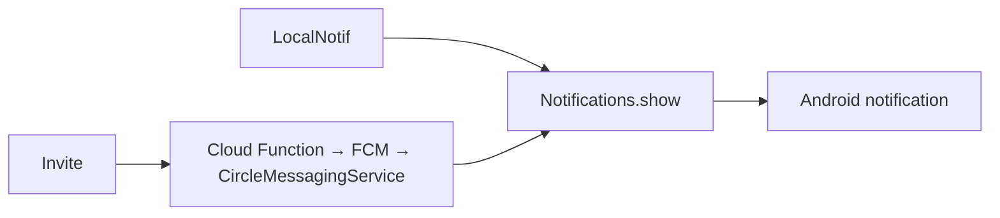

ב־[פרק 5]({{ '/android/CollectCircles/05.collect-circles-local-notification' | relative_url }})
לחיצה מקומית הפעילה את `Notifications.show`. כעת נוסיף מקור אירוע שני: הודעת data שמגיעה
מ־Firebase Cloud Messaging. שני המקורות אינם שתי מערכות התראה; הם שתי דרכים להגיע לאותה
פעולת תצוגה.



## מה נוסיף

- חיבור של CollectCircles לפרויקט Firebase הקיים `yourFirebaseProjectName`.
- הרשמה של כל התקנה לנושא הקבוע `circles`.
- `FirebaseMessagingService` שמקבל אירוע הזמנה ומציג את ההתראה שכבר בנינו.
- כפתור `Invite` שקורא ל־callable Cloud Function.

גם כאן אין תזמון. אין `AlarmManager`,‏ `JobScheduler` או `WorkManager`: לחיצה על Invite יוצרת
אירוע עכשיו, והודעת FCM שמגיעה יוצרת אירוע עכשיו.

## 1. לא מעתיקים את google-services.json של יישום אחר

בפרויקט Firebase אחד יכולים להיות כמה יישומי Android. לכל יישום יש `mobilesdk_app_id` משלו,
ולכן אין להשתמש במזהה של TicTacMenu או של FBFinal. בפרק 7 נרשום ידנית יישום חדש עם package:

```text
com.example.collectcircles
```

הקובץ המלא שהורד מן המסוף מכיל כמה לקוחות ושירותים שאינם דרושים כאן. במקום להכניס אותו
לפרויקט, יצרנו `firebase.properties` מקומי ובו ארבעה ערכי לקוח בלבד:

```properties
FIREBASE_APPLICATION_ID=<mobilesdk_app_id של com.example.collectcircles>
FIREBASE_API_KEY=<api_key של אותו client>
FIREBASE_PROJECT_ID=yourFirebaseProjectName
FIREBASE_SENDER_ID=<project_number של הפרויקט>
```

`firebase.properties` נמצא ב־`.gitignore`. אין בו הרשאת Admin ואין בו מפתח service account.
מפתח ה־API של Firebase הוא מזהה לקוח, לא סוד שרת; עדיין נכון להגביל אותו במסוף לפרויקט וליישום
המתאימים. קובץ `firebase.properties.example` מתעד את המבנה בלי לשמור את הערכים המקומיים.

ב־`app/build.gradle.kts` קראנו את הקובץ והפכנו את ארבעת הערכים למשאבי Android בשמות ש־Firebase
SDK מכיר:

```kotlin
resValue("string", "google_app_id", firebaseValue("FIREBASE_APPLICATION_ID"))
resValue("string", "google_api_key", firebaseValue("FIREBASE_API_KEY"))
resValue("string", "project_id", firebaseValue("FIREBASE_PROJECT_ID"))
resValue("string", "gcm_defaultSenderId", firebaseValue("FIREBASE_SENDER_ID"))
```

לכן אין בפרויקט Google Services plugin ואין צורך ב־`google-services.json` של יישום אחר.

## 2. מוסיפים רק את ספריות Firebase הדרושות

ב־version catalog הוספנו Firebase BoM ואת שתי הספריות הדרושות, Messaging ו־Functions. ב־
`app/build.gradle.kts` התלויות הן:

```kotlin
implementation(platform(libs.firebase.bom))
implementation(libs.firebase.messaging)
implementation(libs.firebase.functions)
```

ה־BoM בוחר גרסאות תואמות לשתי הספריות. אין הבדל בין debug ל־release בחיבור ל־Firebase.
בפרק 7 נראה אילו מגבלות השרת מציב על נקודת הקצה הציבורית.

## 3. מאתחלים Firebase ונרשמים לנושא

ב־`MainActivity`, לפני הפנייה הראשונה ל־Firebase, הוספנו:

```java
// את Firebase מאתחלים בעזרת ארבעת ערכי הלקוח ש-Gradle קרא מן הקובץ
// firebase.properties. זהו מידע זיהוי של יישום לקוח, ולא סיסמה או הרשאת שרת.
FirebaseApp.initializeApp(this);

// ההרשמה לנושא נשמרת על-ידי FCM. לכן בטוח לבקש אותה בכל פתיחת מסך:
// אם המכשיר כבר רשום לא ייווצר מנוי כפול, ואם אין רשת FCM ינסה שוב.
FirebaseMessaging.getInstance().subscribeToTopic(CircleMessagingService.TOPIC);
```

`subscribeToTopic` היא פעולה אסינכרונית. FCM שומר את ההרשמה ומנסה שוב במקרה של תקלה זמנית;
אין צורך לשמור boolean משלנו ואין צורך ליצור תזמון.

## 4. מקבלים אירוע FCM

הוספנו ל־Manifest שירות שאינו חשוף ליישומים אחרים:

```xml
<service
    android:name=".CircleMessagingService"
    android:exported="false">
    <intent-filter>
        <action android:name="com.google.firebase.MESSAGING_EVENT" />
    </intent-filter>
</service>
```

המחלקה עצמה קצרה:

```java
public class CircleMessagingService extends FirebaseMessagingService {

    static final String TOPIC = "circles";

    @Override
    public void onMessageReceived(RemoteMessage message) {
        super.onMessageReceived(message);

        // השרת שולח הודעת data קטנה עם סוג אירוע קבוע. אנחנו לא נותנים לשרת
        // לבחור כותרת או טקסט חופשיים: אם זהו אירוע הזמנה מוכר, מפעילים את
        // אותה פעולת תצוגה שכפתור LocalNotif כבר הפעיל בשיעור הקודם.
        if ("circle_invite".equals(message.getData().get("event"))) {
            Notifications.show(this);
        }
    }

    @Override
    public void onNewToken(String token) {
        super.onNewToken(token);

        // token של התקנת FCM עשוי להתחלף. ההרשמה היא פעולה בטוחה וחוזרת,
        // ולכן מבקשים שוב את אותו topic בלי לשמור או להדפיס את ה-token עצמו.
        FirebaseMessaging.getInstance().subscribeToTopic(TOPIC);
    }
}
```

השרת שולח **data message**, לא `notification payload`. לכן הקוד שלנו מקבל את האירוע וקורא
במפורש ל־`Notifications.show`. כך נשמרת אותה התנהגות כשהיישום פתוח או ברקע, והכותרת, הטקסט,
הערוץ והסמל נשארים במקום אחד.

### כיצד זה עובד כשהיישום ״סגור״?

כשאומרים בשיחה רגילה שהיישום סגור, מתכוונים בדרך כלל ש־`MainActivity` אינה מוצגת: יצאנו ממנה,
הסרנו אותה ממסך היישומים האחרונים, ולעיתים Android כבר סיים גם את תהליך היישום. אין פירוש הדבר
שצריך להשאיר Activity או תהליך שלנו רצים כל הזמן.

שירותי Google Play מחזיקים את החיבור ל־FCM עבור המכשיר. כאשר מגיעה הודעת data, Android רואה
את הצהרת `CircleMessagingService` ב־Manifest. אם תהליך CollectCircles אינו קיים באותו רגע,
המערכת יכולה ליצור אותו, ליצור מופע של השירות ולקרוא ל־`onMessageReceived`. היא אינה פותחת את
`MainActivity`, ולכן המשתמש אינו רואה פתאום את מסך המשחק. השירות רק קורא ל־
`Notifications.show`, וההתראה עוברת למגש ההתראות שמנוהל על־ידי מערכת ההפעלה. לאחר שהפעולה
הקצרה מסתיימת, Android רשאי שוב לסיים את התהליך; ההתראה שכבר הוצגה נשארת במגש.

הטבלה הרשמית של FCM מסבירה את ההבדל: הודעת **data** מועברת ל־`onMessageReceived` גם כאשר
היישום ברקע. לעומת זאת, ב־`notification message` המגיע ברקע, FCM מציג בעצמו התראה במגש ולא
קורא למסלול הקוד שלנו באותה צורה. בחרנו data message דווקא כדי שגם בחזית וגם ברקע הקוד שלנו
יגיע לאותה `Notifications.show`.

בשרת סימנו את ההודעה כ־`high` priority. זוהי בקשה מ־FCM לנסות למסור במהירות אירוע שעתיד להציג
דבר למשתמש, ואף להעיר מכשיר שנמצא ב־Doze לזמן עיבוד קצר. זו אינה הבטחה למסירה מיידית: חוסר רשת,
מצב סוללה והגבלות של המכשיר עדיין יכולים לעכב הודעה. לכן `onMessageReceived` מקבלת חלון עבודה
קצר בלבד. הקוד שלנו מתאים לכך משום שהוא אינו מוריד תמונה, אינו פונה שוב לשרת ואינו מבצע עבודה
ארוכה; הוא בודק מחרוזת ומציג מיד התראה מקומית.

{: .box-warning}
סגירה רגילה אינה זהה ל־**Force stop** מתוך Settings. לאחר Force stop מכוון, Android חוסם את
היישום עד שהמשתמש פותח אותו שוב, ולכן אין לצפות לקבלת FCM בזמן הזה. גם הסרת היישום מוחקת את
ההתקנה ואת רישום ה־FCM. בכל המצבים, `POST_NOTIFICATIONS` והגדרות ערוץ ההתראות עדיין קובעות אם
מותר להציג למשתמש את ההתראה בפועל.

## 5. מוסיפים את Invite

ב־XML הוספנו `inviteButton` מתחת ל־`localNotifButton`, ושינינו את ה־constraint העליון של
לוח המשחק כך שיתחיל מתחת ל־Invite. ב־`strings.xml` הוספנו:

```xml
<string name="invite">Invite</string>
<string name="invite_sent">Invitation sent</string>
<string name="invite_failed">Invitation could not be sent</string>
```

ב־`onCreate` חיברנו את הלחיצה:

```java
binding.inviteButton.setOnClickListener(view -> sendInvite());
```

והפעולה שקוראת לפונקציה היא:

```java
private void sendInvite() {
    binding.inviteButton.setEnabled(false);

    FirebaseFunctions.getInstance()
            .getHttpsCallable("sendCircleInvite")
            .call()
            .addOnCompleteListener(task -> {
                binding.inviteButton.setEnabled(true);
                int message = task.isSuccessful()
                        ? R.string.invite_sent
                        : R.string.invite_failed;
                Toast.makeText(this, message, Toast.LENGTH_SHORT).show();
            });
}
```

הכפתור מושבת בזמן הקריאה כדי למנוע כמה לחיצות מקבילות מאותו מסך. השרת הוא שבוחר את הנושא ואת
תוכן האירוע, והוא מוסיף קצב מרבי בסיסי לכל הפרויקט. פרטי ההגבלה והפריסה נמצאים בפרק 7.

## זרימת ההזמנה המלאה

1. התקנה של CollectCircles נרשמת לנושא `circles`; אם ה־token מתחלף, היא מבקשת שוב את אותו מנוי.
2. משתמש לוחץ Invite.
3. Firebase Functions SDK קורא ל־`sendCircleInvite` באזור ברירת המחדל `us-central1`.
4. הפונקציה שולחת אל FCM הודעת data לנושא הקבוע `circles`.
5. FCM מעביר אותה לכל ההתקנות הרשומות.
6. `CircleMessagingService` מזהה `circle_invite`.
7. השירות קורא לאותה `Notifications.show` שבה השתמש LocalNotif.

{: .box-note}
FCM יכול למסור את האירוע גם כשהיישום ברקע, אך Android עדיין מכבד את הרשאת ההתראות ואת הגדרות
הערוץ של המשתמש. אם המשתמש לא אישר `POST_NOTIFICATIONS`, הקוד יכול לקבל אירוע אך אסור לו
להציג התראה.

## לפני בדיקת Invite

השלימו את [פרק 7]({{ '/android/CollectCircles/07.collect-circles-cloud-infrastructure' | relative_url }}):
רישום היישום, בדיקת הפרויקט הפעיל ופריסת הפונקציה. לאחר מכן הפעילו את היישום בשני
מכשירים, אשרו התראות, המתינו לסיום ההרשמה לנושא ולחצו Invite במכשיר אחד.

## מקורות רשמיים

- [FirebaseMessaging.subscribeToTopic](https://firebase.google.com/docs/reference/android/com/google/firebase/messaging/FirebaseMessaging)
- [Receiving Android messages](https://firebase.google.com/docs/cloud-messaging/android/receive)
- [Android message priority](https://firebase.google.com/docs/cloud-messaging/android-message-priority)
- [Callable Functions from Android](https://firebase.google.com/docs/functions/callable)


## המשך notification

[קישור ליצירת המנגנון בשרת](/android/CollectCircles/07.collect-circles-cloud-infrastructure)
