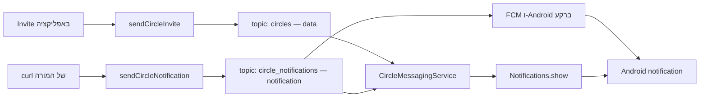

{: .box-note}
ב־[פרק 5]({{ '/android/CollectCircles/05.collect-circles-local-notification' | relative_url }})
יצרנו ערוץ, ביקשנו הרשאה והצגנו התראה מקומית. בפרק זה משלימים את **כל צד התלמיד**:
מחברים את היישום ל־Firebase, נרשמים לשני נושאי FCM ומקבלים את שני סוגי ההודעות שהשרת של
המורה כבר יודע לשלוח. התלמיד אינו יוצר, משנה או פורס פונקציות serverless.

[חזרה למדריך 5 notification](/android/CollectCircles/05.collect-circles-local-notification)

[המשך לפרק 7: תשתית הענן של המורה](/android/CollectCircles/07.collect-circles-cloud-infrastructure)

[מפת הדרך לפרקים 8–18: ממשחק קצר למשחק Idle](/android/CollectCircles/08-18.student-roadmap)



{: .box-error}
הפרויקט חייב להיקרא **`CollectCircles`**, וה־package חייב להיות בדיוק
**`com.example.collectcircles`**. כאן "package" פירושו בעיקר Gradle `applicationId`: זהו
ה־**Android package name** שנרשם ב־Firebase. זהו היישום שנרשם אצל המורה; `applicationId`
אחר לא יתאים להגדרות הלקוח ולמגבלות נקודות הקצה. אם התחלתם מפרויקט בשם אחר, בצעו תחילה את
[מדריך שינוי שם הפרויקט וה־package]({{ '/android/projectSteps/191renameProject' | relative_url }}).

## לפני שמתחילים: מה המורה נותן ומה התלמיד עושה

המורה כבר הכין:

- Firebase project ויישום Android רשום בשם `com.example.collectcircles`.
- שתי callable functions:‏ `sendCircleInvite` ו־`sendCircleNotification`.
- שני נושאים קבועים: `circles` ו־`circle_notifications`.
- ארבעה ערכי הגדרת לקוח לכל תלמיד.

התלמיד מבצע רק את השינויים בפרק זה ומעתיק את ארבעת הערכים שהמורה נתן. אין להכניס ליישום
service-account key,‏ Admin SDK credential או סוד שרת אחר.

{: .box-note}
כמו בפרק 5, בכל שינוי מופיעים המיקום המדויק ו־diff קטן מול הקוד בסוף הפרק הקודם. `-` מסמן
שורה שמוחקים, `+` מסמן שורה שמוסיפים, ושורות ללא סימן הן הקשר קיים.

## 1. מכינים את הגדרת Firebase המקומית

### א. מונעים העלאה של הערכים המקומיים

פתחו את `.gitignore` שבשורש הפרויקט באמצעות **Search Everywhere** (לחיצה כפולה על
`Shift`). הקובץ נמצא לצד `settings.gradle.kts` ולכן קל להגיע באמצעות right click > show in explorer. לחילופין יש לעבור לתצוגת Project. אחרי חלק ב' נחזור לתצוגת אנדרואיד.

**הוסיפו:**

```diff
 /local.properties
+/firebase.properties
 /.idea/caches
```

### ב. יוצרים את קובץ התלמיד

צרו לצד `settings.gradle.kts`, קובץ חדש בשם:

`firebase.properties`

{: .box-warning}
ניצור את הקובץ **בשורש הפרויקט - אז שוב מתצוגת Project**, ומשם right click on the top line > new > file. זה לא נוח אבל זו הדרך הכי נקיה ליצור שם קובץ. ניתן ליצור גם מסייר הקבצים. לאחר היצירה והעריכה נחזור לתצוגת Android.

העתיקו אליו את המבנה הבא והחליפו את ארבעת הערכים בערכים שקיבלתם מהמורה:

```properties
FIREBASE_APPLICATION_ID=<mobilesdk_app_id>
FIREBASE_API_KEY=<firebase_api_key>
FIREBASE_PROJECT_ID=<firebase_project_id>
FIREBASE_SENDER_ID=<project_number>
```

אם הכל תקין, הקובץ לא יופיע לכם כקובץ ב-git (בעקבות ה-ignore)

{: .box-warning}
`firebase.properties` מכיל רק את **ערכי ההגדרה של לקוח Firebase**; ה־Firebase SDK עצמו אינו
נמצא בקובץ הזה, ואת ספריות ה־SDK נוסיף בסעיף הבא. השם `mobilesdk_app_id` שבסוגריים המשולשים
הוא שם הערך שקיבלתם מהמורה: מעתיקים את הערך שלו אחרי `FIREBASE_APPLICATION_ID=`.
הערכים אינם הרשאת Admin, אך עדיין שומרים אותם מחוץ ל־Git: מי שישיג אותם יוכל לבנות יישום
מתחזה עם אותו `applicationId` של `CollectCircles`, לחבר אותו לפרויקט Firebase של המורה,
להשתמש ב־FCM ולהפעיל לרעה את פונקציות ה־callable של המורה. לכן אין לפרסם גם את
`google-services.json`, שמכיל את אותם פרטי חיבור, ואין להעתיק קובץ כזה מיישום Android אחר.

## 2. מוסיפים את ספריות Firebase ל־version catalog

{: .box-success}
חיזרו כעת לתצוגת Android.

בחלון **Android**, פתחו:

`Gradle Scripts > libs.versions.toml (Version Catalog)`

בקובץ זה הוסיפו את גרסת ה־BoM תחת `[versions]`:

```diff
 constraintlayout = "2.2.1"
+firebaseBom = "34.17.0"

 [libraries]
```

תחת `[libraries]` הוסיפו את שלוש ההגדרות:

```diff
 constraintlayout = { group = "androidx.constraintlayout", name = "constraintlayout", version.ref = "constraintlayout" }
+firebase-bom = { group = "com.google.firebase", name = "firebase-bom", version.ref = "firebaseBom" }
+firebase-messaging = { group = "com.google.firebase", name = "firebase-messaging" }
+firebase-functions = { group = "com.google.firebase", name = "firebase-functions" }

 [plugins]
```

ה־BoM בוחר גרסאות תואמות ל־Messaging ול־Functions, ולכן לשתי הספריות אין מספר גרסה נפרד.

## 3. מלמדים את Gradle לקרוא את ארבעת הערכים

בחלון **Android**, פתחו:

`Gradle Scripts > build.gradle.kts (Module :app)`

### א. קוראים את קובץ ה־properties

בראש הקובץ, לפני `plugins`, הוסיפו את הקוד הבא:

```diff
+import java.util.Properties
+
 plugins {
     alias(libs.plugins.android.application)
 }
+
+// firebase.properties מכיל רק את ארבעת ערכי הלקוח שסיפק המורה.
+val firebaseProperties = Properties().apply {
+    val localFile = rootProject.file("firebase.properties")
+    localFile.inputStream().use(::load)
+}
+
+fun firebaseValue(name: String): String =
+    firebaseProperties.getProperty(name)
+        ?: error("Missing $name in firebase.properties")
```

### ב. הופכים את הערכים למשאבי Android

באותו קובץ, בתוך `buildFeatures`, הפעילו גם יצירת משאבי Android:

```diff
     buildFeatures {
         viewBinding = true
+        resValues = true
     }
```

החל מ־Android Gradle Plugin 9 יצירת משאבים מותאמים באמצעות `resValue` אינה מופעלת כברירת
מחדל בפרויקט Java בלבד. בלי השורה הזאת Gradle אינו יכול ליצור את ארבעת משאבי המחרוזת
שנוסיף באמצעות `resValue`.

כעת, בתוך `defaultConfig`, אחרי `testInstrumentationRunner`, הוסיפו:

```diff
         testInstrumentationRunner = "androidx.test.runner.AndroidJUnitRunner"
+
+        resValue("string", "google_app_id", firebaseValue("FIREBASE_APPLICATION_ID"))
+        resValue("string", "google_api_key", firebaseValue("FIREBASE_API_KEY"))
+        resValue("string", "project_id", firebaseValue("FIREBASE_PROJECT_ID"))
+        resValue("string", "gcm_defaultSenderId", firebaseValue("FIREBASE_SENDER_ID"))
     }
```

אלה השמות ש־Firebase SDK מחפש. לכן אין צורך להפעיל Google Services plugin ואין צורך
להוסיף `google-services.json`. הספרייה מוסיפה ליישום `FirebaseInitProvider`, שקורא את המשאבים
האלה לפני פתיחת `MainActivity`; לכן גם אין צורך לקרוא בעצמנו ל־`FirebaseApp.initializeApp`.

### ג. מוסיפים את התלויות

בתוך `dependencies`, אחרי ספריות Android הקיימות, הוסיפו:

```diff
     implementation(libs.activity)
     implementation(libs.constraintlayout)
+    implementation(platform(libs.firebase.bom))
+    implementation(libs.firebase.messaging)
+    implementation(libs.firebase.functions)
     testImplementation(libs.junit)
```

לחצו **Sync Now** והמתינו לסיום Gradle Sync לפני שממשיכים.

## 5. יוצרים `CircleMessagingService` ונרשמים לשני topics

<div markdown="1" class="box-note">

### למה צריך להירשם ל־topics?

הודעת FCM אינה נשלחת אוטומטית לכל מי שהתקין את המשחק. השולח מכוון את ההודעה ל־**topic** —
מעין ערוץ שידור — ורק התקנות שנרשמו לערוץ הזה מקבלות אותה. בפרויקט שלנו יש שני מסלולים,
ולכן נרשום כל התקנה לשני topics:

- `circles` הוא ערוץ ההזמנות בין שחקנים. `sendCircleInvite` שולחת אליו הודעת **data**;
  הקוד שלנו מקבל את הנתונים ומחליט אם להציג התראה.
- `circle_notifications` הוא ערוץ ההודעות של המורה. `sendCircleNotification` שולחת אליו
  הודעת **notification**. היתרון במסלול הזה הוא ש־FCM ו־Android יכולים להציג את ההתראה גם
  כאשר ה־Activity אינה פתוחה ואפילו כאשר תהליך היישום אינו פועל.

אין כאן שני טיפולים מקבילים וגם לא `intercept`. עבור הודעת **notification**,‏ FCM בוחר מסלול
לפי מצב היישום בזמן המסירה:

- **ברקע:** FCM ו־Android מוסרים את ההודעה ישירות למגש ההתראות; `onMessageReceived()` שלנו
  אינו נקרא, וקוד היישום אינו מטפל בה לפני שהמשתמש לוחץ עליה.
- **בחזית:** FCM אינו מציג את ההודעה אוטומטית, אלא מוסר אותה ל־`onMessageReceived()`. כעת
  מופעל callback מיוחד בשם `onMessageReceived()`, שאותו נממש מיד במחלקה החדשה. בפרק הזה
  ה־callback יציג את ההתראה בעצמו באמצעות `Notifications.show(this)`.

חשוב להבין ש־`onMessageReceived()` אינו מפיץ את ההודעה למשתמשים האחרים. שרתי FCM כבר
מפיצים אותה לכל ההתקנות הרשומות ל־topic, וכל התקנה מטפלת בעותק שקיבלה לפי מצבה. אילו היינו
משאירים את ה־callback ריק, הודעות `circle_notifications` עדיין היו מופיעות אצל כל משתמש
רשום שהיישום שלו ברקע; רק משתמש שהיישום שלו בחזית לא היה רואה התראה. לעומת זאת, הודעות
ה־**data** של `circles` כן זקוקות לקוד שב־`onMessageReceived()` כדי להציג התראה. במובן הזה
הן תלויות יותר בקוד שלנו, אבל **לא** בכך שהיישום כבר פועל ברקע: FCM יכול להפעיל את תהליך
היישום ואת `FirebaseMessagingService` כדי למסור הודעת data. ההבדל הוא שאין לה תצוגה
אוטומטית כגיבוי; אם הקוד אינו מציג התראה, המשתמש לא יראה אחת.

המנוי ל־topic נשמר לאחר ההרשמה. לכן בהמשך, כשהמשחק יעבוד במצב offline, המשתמש יוכל לקבל
הודעות גם אם לא פתח את CollectCircles מאז reboot — כל עוד היישום נרשם בעבר, לא בוצע לו
**Force stop**, הרשאת ההתראות עדיין מאושרת ויש חיבור לרשת.

</div>

{: .box-success}
ניצור כעת מחלקה שיורשת מ־`FirebaseMessagingService`: היא תרשום את התקנת המשחק לשני
ערוצי השידור ותטפל בהודעות שנמסרות לקוד שלנו — ובהן הודעת notification שמגיעה בחזית.

בחלון **Android**, עברו אל:

`app > kotlin+java > com.example.collectcircles`

לחצו לחיצה ימנית על החבילה **`com.example.collectcircles`**, בחרו
**New > Java Class**, הקלידו `CircleMessagingService` ובחרו **Class**. המחלקה החדשה תופיע
באותו package בשם `CircleMessagingService`.

החליפו את תוכנו בקוד הבא:

```java
package com.example.collectcircles;

import com.google.firebase.messaging.FirebaseMessaging;
import com.google.firebase.messaging.FirebaseMessagingService;
import com.google.firebase.messaging.RemoteMessage;

public class CircleMessagingService extends FirebaseMessagingService {

    static final String DATA_TOPIC = "circles";
    static final String NOTIFICATION_TOPIC = "circle_notifications";

    @Override
    public void onMessageReceived(RemoteMessage message) {
        super.onMessageReceived(message);

        // endpoint ראשון: הודעת data. השירות שלנו בוחר אם להציג אותה.
        if ("circle_invite".equals(message.getData().get("event"))) {
            Notifications.show(this);
        }

        // endpoint שני: notification payload. ברקע FCM מציג אותו בעצמו;
        // בחזית הוא מגיע לכאן ואנו מציגים את אותה התראה קבועה.
        if (message.getNotification() != null) {
            Notifications.show(this);
        }
    }

    @Override
    public void onRegistered(String installationId) {
        super.onRegistered(installationId);

        // מזהה התקנת Firebase עשוי להתחלף. רושמים שוב את שני המנויים;
        // הפעולה בטוחה וחוזרת, ואין צורך לשמור או להדפיס את המזהה עצמו.
        FirebaseMessaging.getInstance().subscribeToTopic(DATA_TOPIC);
        FirebaseMessaging.getInstance().subscribeToTopic(NOTIFICATION_TOPIC);
    }
}
```

{: .box-success}
זהו המקום הראשון שבו מוגדרים **שני** הנושאים: `DATA_TOPIC = "circles"` עבור
`sendCircleInvite`, ו־`NOTIFICATION_TOPIC = "circle_notifications"` עבור
`sendCircleNotification`. בתוך `onRegistered` נרשמים מחדש **לשניהם יחד** כאשר ההתקנה נרשמת
ב־FCM או כאשר Firebase Installation ID שלה מתחלף.

בשלב זה האפליקציה אמורה לרוץ (אבל ללא שיפור נראה לעין)

## 6. רושמים את השירות ואת מצב הרישום ב־Manifest

רק אחרי שהמחלקה קיימת, פתחו:

`app > manifests > AndroidManifest.xml`

בתוך `application`, מיד אחרי שורת ה־theme, הוסיפו שני ערכי metadata:

- הראשון מספר ל־FCM באיזה ערוץ להשתמש להודעת notification ברקע;
- השני מפעיל את רישום FCM העדכני המבוסס על Firebase Installation ID, שבו השתמשנו
  ב־`onRegistered`.

אחרי תגית ה־`activity`, רשמו את השירות שכבר יצרנו:

```diff
         android:roundIcon="@mipmap/ic_launcher_round"
         android:supportsRtl="true"
         android:theme="@style/Theme.CollectCircles">
+        <!-- Lesson 5 created this channel for Notifications.show(). -->
+        <!-- Without this default, background FCM uses its own fallback channel. -->
+        <!-- Our channel's name, sound, and importance settings would not apply. -->
+        <meta-data
+            android:name="com.google.firebase.messaging.default_notification_channel_id"
+            android:value="circle_invitations" />
+
+        <!-- Enable registration callbacks based on Firebase Installation ID. -->
+        <meta-data
+            android:name="firebase_messaging_installation_id_enabled"
+            android:value="true" />
+
         <activity
             android:name=".MainActivity"
             android:exported="true">
             <intent-filter>
                 <action android:name="android.intent.action.MAIN" />

                 <category android:name="android.intent.category.LAUNCHER" />
             </intent-filter>
         </activity>
+
+        <!-- Register our service for messages that FCM delivers to app code. -->
+        <!-- exported=false prevents other apps from starting it directly. -->
+        <service
+            android:name=".CircleMessagingService"
+            android:exported="false">
+            <intent-filter>
+                <!-- Route incoming FCM messages to this service. -->
+                <action android:name="com.google.firebase.MESSAGING_EVENT" />
+            </intent-filter>
+        </service>
     </application>
```

`android:exported="false"` מונע מיישומים רגילים להפעיל את השירות. ה־intent filter מאפשר ל־FCM
למסור אליו הודעות.

## 7. נרשמים לשני topics בפתיחת היישום

ההרשמה ב־`onRegistered` מטפלת ברישום ובהחלפת Firebase Installation ID, אבל אינה תחליף
לבקשת המנוי המפורשת בזמן פתיחת היישום. לכן נרשמים לשני הנושאים גם ב־`MainActivity`.

פתחו:

`app > kotlin+java > com.example.collectcircles > MainActivity`

### א. מוסיפים imports

 ```diff
 import com.example.collectcircles.databinding.ActivityMainBinding;
+import com.google.firebase.messaging.FirebaseMessaging;
 import com.google.android.material.dialog.MaterialAlertDialogBuilder;
```

### ב. נרשמים לשני הנושאים

בתוך `onCreate`, מיד אחרי רישום `notificationPermissionLauncher` ולפני
`getSharedPreferences`, הוסיפו את כל הקטע הבא:

```diff
         notificationPermissionLauncher = registerForActivityResult(
                 new ActivityResultContracts.RequestPermission(),
                 permissionGranted -> {
                     if (permissionGranted) {
                         Notifications.show(this);
                     } else {
                         Toast.makeText(
                                 this,
                                 R.string.notification_permission_denied,
                                 Toast.LENGTH_SHORT
                         ).show();
                     }
                 }
         );

+        // הרשמה ראשונה לשני ה-topics. הרשמה חוזרת אינה יוצרת מנוי כפול.
+        FirebaseMessaging.getInstance().subscribeToTopic(
+                CircleMessagingService.DATA_TOPIC
+        );
+        FirebaseMessaging.getInstance().subscribeToTopic(
+                CircleMessagingService.NOTIFICATION_TOPIC
+        );
+
         preferences = getSharedPreferences(PREFERENCES_NAME, MODE_PRIVATE);
```

{: .box-note}
ההרשמה לשני ה־topics מתבצעת כאן בלי לפתוח חלון הרשאה ובלי ליצור ערוץ. לפני בדיקת הודעה
חיצונית, כל מכשיר מקבל צריך להשלים פעם אחת את בדיקת `LocalNotif` מפרק 5: הכפתור הזה מבקש את
הרשאת המשתמש, ולאחר האישור `Notifications.show` יוצר את הערוץ. `Invite` רק שולח הזמנה ולכן
אינו מבקש הרשאה. ראו
[היכן ומתי מבקשים הרשאת התראות]({{ '/android/CollectCircles/05.collect-circles-local-notification' | relative_url }}#id-notification-permission).

`subscribeToTopic` אסינכרונית. FCM שומר את ההרשמה ומנסה שוב לאחר תקלה זמנית. אין צורך לשמור
boolean משלנו. בקשה חוזרת לאותו topic אינה יוצרת מנוי כפול.

## 8. מוסיפים כפתור Invite עבור הודעת data

### א. מעדכנים את המסך

פתחו:

`app > res > layout > activity_main.xml`

הוסיפו את `inviteButton` אחרי `localNotifButton`, ושנו את ה־constraint של הלוח:

```diff
     <com.example.collectcircles.GameBoardView
         android:id="@+id/gameBoard"
         android:layout_width="0dp"
         android:layout_height="0dp"
         android:layout_marginTop="16dp"
         android:layout_marginBottom="20dp"
         android:minHeight="320dp"
         app:layout_constraintBottom_toBottomOf="parent"
         app:layout_constraintEnd_toEndOf="parent"
         app:layout_constraintStart_toStartOf="parent"
-        app:layout_constraintTop_toBottomOf="@id/localNotifButton"
+        app:layout_constraintTop_toBottomOf="@id/inviteButton"
         tools:background="@color/board_background" />

     <com.google.android.material.button.MaterialButton
         android:id="@+id/localNotifButton"
         android:layout_width="0dp"
         android:layout_height="wrap_content"
         android:layout_marginTop="8dp"
         android:text="@string/local_notification"
         app:cornerRadius="14dp"
         app:layout_constraintEnd_toEndOf="parent"
         app:layout_constraintStart_toStartOf="parent"
         app:layout_constraintTop_toBottomOf="@id/startButton" />
+
+    <com.google.android.material.button.MaterialButton
+        android:id="@+id/inviteButton"
+        android:layout_width="0dp"
+        android:layout_height="wrap_content"
+        android:layout_marginTop="8dp"
+        android:text="@string/invite"
+        app:cornerRadius="14dp"
+        app:layout_constraintEnd_toEndOf="parent"
+        app:layout_constraintStart_toStartOf="parent"
+        app:layout_constraintTop_toBottomOf="@id/localNotifButton" />

 </androidx.constraintlayout.widget.ConstraintLayout>
```

### ב. מוסיפים טקסטים

פתחו `app > res > values > strings.xml` והוסיפו:

```diff
     <string name="local_notification">LocalNotif</string>
+    <string name="invite">Invite</string>
     <string name="restart">Restart</string>
```

ובהמשך אותו קובץ, לפני `</resources>`:

```diff
     <string name="notification_permission_denied">Notification permission is required</string>
+    <string name="invite_sent">Invitation sent</string>
+    <string name="invite_failed">Invitation could not be sent</string>
 </resources>
```

### ג. מוסיפים import ומחברים את הכפתור לפונקציה שהמורה פרס

רק עכשיו, כאשר עומדים להשתמש ב־Functions, הוסיפו בראש `MainActivity`:

```diff
 import com.example.collectcircles.databinding.ActivityMainBinding;
+import com.google.firebase.functions.FirebaseFunctions;
 import com.google.firebase.messaging.FirebaseMessaging;
```

ב־`MainActivity`, אחרי ה־listener של `localNotifButton`, הוסיפו:

```diff
         binding.localNotifButton.setOnClickListener(
                 view -> requestPermissionAndShowNotification()
         );
+        binding.inviteButton.setOnClickListener(view -> sendInvite());
         binding.gameBoard.setOnGameFinishedListener(this::finishGame);
```

מיד אחרי `onCreate` ולפני `requestPermissionAndShowNotification`, הוסיפו:

```diff
     }

+    private void sendInvite() {
+        binding.inviteButton.setEnabled(false);
+
+        FirebaseFunctions.getInstance()
+                .getHttpsCallable("sendCircleInvite")
+                .call()
+                .addOnCompleteListener(task -> {
+                    binding.inviteButton.setEnabled(true);
+                    int message = task.isSuccessful()
+                            ? R.string.invite_sent
+                            : R.string.invite_failed;
+                    Toast.makeText(this, message, Toast.LENGTH_SHORT).show();
+                });
+    }
+
     private void requestPermissionAndShowNotification() {
```

הכפתור מושבת בזמן הקריאה כדי למנוע לחיצות מקבילות מאותו מסך. השרת הוא שבוחר את ה־topic ואת
תוכן ההודעה; הלקוח אינו שולח topic או טקסט חופשי.

## 10. ההבדל בין שני הנתיבים

| נקודת קצה | topic | payload | כשהיישום בחזית | כשהיישום ברקע |
| --- | --- | --- | --- | --- |
| `sendCircleInvite` | `circles` | `data` | השירות קורא `Notifications.show` | השירות קורא `Notifications.show` |
| `sendCircleNotification` | `circle_notifications` | `notification` | ההודעה מגיעה לשירות, והוא קורא `Notifications.show` | FCM ו־Android מציגים ישירות בערוץ שהוגדר |

הנתיב השני הוא הסיבה לשלושה פרטים שקל לפספס:

- נרשמים גם ל־`circle_notifications`, ולא רק ל־`circles`.
- משלימים פעם אחת את בדיקת `LocalNotif` מפרק 5, שיוצרת את הערוץ לאחר אישור ההרשאה.
- מגדירים ב־Manifest את `default_notification_channel_id` באותו מזהה ערוץ.

סגירה רגילה או הסרה ממסך היישומים האחרונים אינה Force stop. הודעת notification יכולה להופיע
גם כאשר `MainActivity` אינה פתוחה, לאחר שהיישום הופעל ונרשם לפחות פעם אחת. לעומת זאת, לאחר
**Force stop** מכוון Android חוסם מסירה עד שהמשתמש פותח שוב את היישום. אחרי אתחול הטלפון
ייתכן עיכוב עד ששירותי Google Play והמערכת משלימים את האתחול.

## 11. בדיקת צד התלמיד

### בדיקה א — הכנה והרשמה

1. בצעו **Build > Make Project**.
2. התקינו והפעילו את היישום על מכשיר עם Google Play services וחיבור רשת.
3. לחצו `LocalNotif`, אשרו התראות וודאו שההתראה המקומית מופיעה.
4. המתינו כמה שניות כדי לאפשר לשתי פעולות `subscribeToTopic` להסתיים.

### בדיקה ב — data דרך הכפתור

1. הפעילו את היישום בשני מכשירים והשלימו את בדיקה א בשניהם.
2. לחצו `Invite` במכשיר אחד.
3. ודאו שמופיע Toast בשם **Invitation sent**.
4. ודאו ששני המכשירים מקבלים התראה דרך `circles`.

### בדיקה ג — notification דרך curl של המורה

השאירו את היישום ברקע, אך אל תבצעו Force stop. המורה מפעיל את פקודת ה־curl שסופקה עבור
`sendCircleNotification`. אין להעתיק מן המורה credentials או קוד serverless אל פרויקט Android.

ודאו שההתראה מגיעה דרך `circle_notifications` גם כשהמסך של CollectCircles אינו פתוח. פתחו
לאחר מכן את היישום ובקשו מהמורה להפעיל שוב את הפקודה; בחזית ההודעה אמורה להגיע
ל־`CircleMessagingService`, שמפעיל `Notifications.show`.

## אם הבדיקה אינה מצליחה

- **Toast של כישלון ב־Invite:** בדקו שכל ארבעת ערכי `firebase.properties` שייכים ליישום
  `com.example.collectcircles` וש־Gradle Sync הסתיים.
- **השרת מדווח הצלחה אבל אין התראה:** בדקו הרשאת Notifications בהגדרות היישום ואת הגדרות
  הערוץ **Circle invitations**.
- **רק נתיב data עובד:** ודאו שקיימים גם המנוי ל־`NOTIFICATION_TOPIC`, גם ה־metadata ב־Manifest
  וגם שהשלמתם פעם אחת את בדיקת `LocalNotif`, שיוצרת את ערוץ ההתראות.
- **רק נתיב notification עובד ברקע:** בדקו את `onMessageReceived`, את הערך
  `circle_invite` ואת רישום השירות ב־Manifest.
- **לאחר Force stop אין דבר:** זו התנהגות Android צפויה. פתחו את היישום שוב.

{: .box-success}
בסוף הפרק כל התקנה נרשמת **בפתיחה ובכל רישום או החלפת Firebase Installation ID** גם ל־`circles` וגם
ל־`circle_notifications`. היא יכולה לקבל הודעת data שהקוד שלנו מציג, וגם הודעת notification
ש־FCM ו־Android מציגים ישירות ברקע — ושתיהן כפופות לאותה הרשאת התראות של המשתמש.

## משלוח הודעה באמצעות curl

ה-Notification השני מבין אלו שיצרנו כאן, תומך בהודעות שמקורן חיצוני לגמרי (כלומר לא מטלפון. דמיינו החלטה בצד שרת)

תוכלו להדביק את הפקודה הבאה כדי לראות זאת. (בקשו מהמורה את הפקודה המלאה הכוללת uri מלא)

```powershell
'{"data":{}}' | curl.exe -sS --fail-with-body `
  -H "Content-Type: application/json" `
  --data-binary "@-" `
  "https://teachers-firebase-name.cloudfunctions.net/the-function-name"
```

שימו לב שמדובר בהודעה ריקה. תוכן ההודעה נשלט לגמרי בפונקציות ה-serverless (cloud functions)

## מקורות רשמיים

- [FirebaseMessaging.subscribeToTopic](https://firebase.google.com/docs/reference/android/com/google/firebase/messaging/FirebaseMessaging)
- [Receiving Android messages](https://firebase.google.com/docs/cloud-messaging/android/receive)
- [Notification runtime permission](https://developer.android.com/develop/ui/views/notifications/notification-permission)
- [Callable Functions from Android](https://firebase.google.com/docs/functions/callable)

## המשך

- [מפת הדרכים לפרקים 8-18 - משחק אופליין ו-work manager](/android/CollectCircles/08-18.student-roadmap)
- [המשך למדריך-8 (תלמיד): חיסכון שנשמר ונצבר](/android/CollectCircles/08.collect-circles-persistent-economy)
- [למורה: המשך למדריך 7: תשתית ה־serverless](/android/CollectCircles/07.collect-circles-cloud-infrastructure)

<!-- gemini-tutor-links:start -->
<div markdown="1" class="hebrew">

## מורה־עזר ב־Gemini

{: .box-note}
[פתחו את Gem: מעבדת התראות CollectCircles](https://gemini.google.com/gem/1gjXRaD60MfNq2FDXVuZxsud9-8bjKDrE?usp=sharing) כדי לקבל רמזים, שאלות אבחון והסברים המתאימים לשלב שבו אתם נמצאים.

</div>
<!-- gemini-tutor-links:end -->
