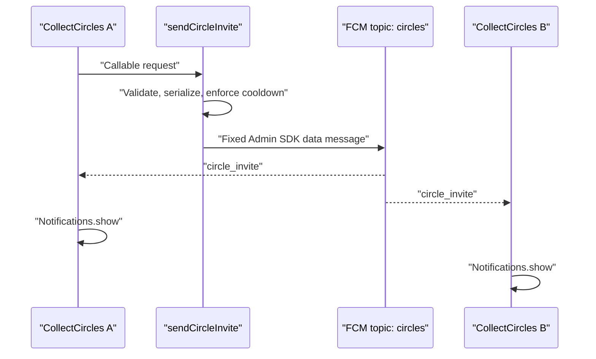

{: .box-note .english}
This chapter is for a teacher or any student who owns the Firebase project (upgraded to **BLAZE** pay as you go account). A student who only runs the Android side of the exercise does not need cloud permissions, Firebase CLI, or any server credential, and will simply send request to the serverless endpoint.

## מטרה

{: .hebrew}
יצירת פונקציות Serverless (ללא שרת). במקרה שלנו - אלו פונקציות serverless **מסוג מיוחד**, ששולחות הודעות ל-  **FCM** backend. ה-FCM (Firebase Cloud Messaging) שולח notifications. זה מאפשר להראות תהליך מלא של push notification שמגיע למספר מכשירים, ומקורו חיצוני (או אחד המכשירים).

[חזרה ל-6: מדריך תלמיד להתראות FCM לטלפונים אחרים](/android/CollectCircles/06.collect-circles-fcm-invitations)


```text
[ User / external trigger ]
  │
  │ (1) HTTP post to serverless endpoint
  ▼
[ App Server / Cloud Functions ] ──(2) Send API request⟶ [ FCM Backend ]
                                                              │
                                                              │ (4) Routes & delivers
                                                              ▼
                                                   [ iOS / Android / Web Client ]
```

<div markdown="1" class="english">

{: .box-success}
**for first time installers I recomend following this [video by Roee](https://video.wixstatic.com/video/427848_7794573bf6834244ab0aae0a8d4bce3d/1080p/mp4/file.mp4)**


## Trust boundary

The Android app must never contain an Admin SDK credential. Its Firebase application ID and API key identify the client; they do not grant permission to send an FCM message. Only the Cloud Function runs with the dedicated cloud identity that
may send through the FCM Admin API.



The callable endpoint is public, but its action is deliberately narrow. The client cannot choose a topic, device token,
notification title, text, or arbitrary data. The function always sends one fixed event to the fixed `circles` topic.
It accepts only an empty request, processes one call at a time, runs at most one instance, and allows one successful send
per ten seconds while that instance remains warm. These are teaching-project limits, not production authentication or a
durable quota.

## 1. Files the teacher gives a student

### Android files

These files from the current Android change belong in the teaching repository. The paths below match Android Studio's
**Android** view; root files can be opened with **Search Everywhere**:

```text
Project root: .gitignore
Gradle Scripts > build.gradle.kts (Module :app)
app > manifests > AndroidManifest.xml
app > kotlin+java > com.example.collectcircles > MainActivity
app > kotlin+java > com.example.collectcircles > CircleMessagingService
app > res > layout > activity_main.xml
app > res > values > strings.xml
Gradle Scripts > libs.versions.toml (Version Catalog)
Project root: firebase.properties.example
```

The repository must also already contain the chapter 5 implementation, especially:

```text
app > kotlin+java > com.example.collectcircles > Notifications
```

The teacher privately supplies one local file containing the four Firebase client values:

```text
Project root: firebase.properties
```

That file is ignored by Git. It is client configuration, not an Admin credential, but keeping the public tutorial generic
avoids advertising the classroom project. Do not supply `google-services.json`, a service-account JSON file, a private
key, or an FCM server credential.

If the teacher has already deployed the function, this is everything an ordinary student needs. Opening the app
subscribes the installation to `circles`; pressing `Invite` calls the already deployed function.

### Server files

Only a teacher or student who will deploy a function needs these additional files:

```text
C:\Users\3stra\AndroidStudioProjects\CollectCircles\.firebaserc
C:\Users\3stra\AndroidStudioProjects\CollectCircles\firebase.json
C:\Users\3stra\AndroidStudioProjects\CollectCircles\functions\index.js
C:\Users\3stra\AndroidStudioProjects\CollectCircles\functions\package.json
C:\Users\3stra\AndroidStudioProjects\CollectCircles\functions\package-lock.json
```

Do not copy this generated directory:

```text
C:\Users\3stra\AndroidStudioProjects\CollectCircles\functions\node_modules
```

The recipient recreates it with `npm install`. A student using a different Firebase project must update the project in
`.firebaserc` and the service-account email in `functions\index.js`.

## 2. Configure the Android client

In Firebase Console, select the correct project and choose **Project settings → General → Add app → Android**. Register:

```text
com.example.collectcircles
```

A SHA certificate is not required merely to obtain an FCM token. Download `google-services.json` temporarily, locate
the client whose package name is `com.example.collectcircles`, and extract only these values into the ignored
`firebase.properties`:

| Local property | Downloaded JSON value |
|---|---|
| `FIREBASE_APPLICATION_ID` | matching client → `client_info.mobilesdk_app_id` |
| `FIREBASE_API_KEY` | matching client → `api_key[0].current_key` |
| `FIREBASE_PROJECT_ID` | `project_info.project_id` |
| `FIREBASE_SENDER_ID` | `project_info.project_number` |

```properties
FIREBASE_APPLICATION_ID=<matching mobile SDK app ID>
FIREBASE_API_KEY=<matching Firebase API key>
FIREBASE_PROJECT_ID=yourFirebaseProjectName
FIREBASE_SENDER_ID=<Firebase project number>
```

The Gradle script exposes these values under the resource names expected by Firebase Android SDK. No Google Services
Gradle plugin is needed, and the complete downloaded JSON does not enter this Android project.

In **Project settings → Cloud Messaging**, confirm that **Firebase Cloud Messaging API (HTTP v1)** is enabled.

## 3. Create the cloud runtime identity

Cloud Functions requires the Firebase project to use the Blaze plan. Configure the desired billing controls before
deployment. An ordinary budget alert warns but does not stop charges; verify separately if the project has an actual
spend cap for covered services.

In **Google Cloud Console → IAM & Admin → Service Accounts**, with the intended project selected:

1. Choose **Create service account**.
2. Set the service account ID to `collect-circles-inviter`.
3. Grant only **Firebase Cloud Messaging API Admin** (`roles/firebasecloudmessaging.admin`).
4. Leave **Principals with access** empty unless a real deployer lacks permission to use this identity.
5. Do not create or download a service-account key.

The resulting email has this form:

```text
collect-circles-inviter@yourFirebaseProjectName.iam.gserviceaccount.com
```

Put that email in the `serviceAccount` option in:

```text
C:\Users\3stra\AndroidStudioProjects\CollectCircles\functions\index.js
```

The Android app never receives this identity. Cloud Functions attaches it directly to the deployed function. If
deployment says that the signed-in user cannot act as this account, grant that deployer **Service Account User** on this
one account. Do not grant Service Account Admin and do not download a key.

## 4. Understand the prepared function

The prepared `functions\index.js`:

- initializes Firebase Admin using the attached cloud identity;
- accepts only an empty callable request;
- hard-codes topic `circles` and event `circle_invite`;
- serializes requests with `maxInstances: 1` and `concurrency: 1`;
- applies a ten-second in-memory cooldown;
- sends a high-priority data message;
- updates the cooldown only after FCM accepts the send.

The core deployment options are:

```javascript
{
  serviceAccount:
      "collect-circles-inviter@yourFirebaseProjectName.iam.gserviceaccount.com",
  maxInstances: 1,
  concurrency: 1,
  timeoutSeconds: 30,
  memory: "256MiB",
}
```

No `region` option is specified, so Firebase deploys to the default `us-central1`. The Android client uses
`FirebaseFunctions.getInstance()`, which calls the same default region.

## 5. Install the local tools

Install Node.js 22 and Firebase CLI once on a machine that will deploy:

```powershell
npm install -g firebase-tools
firebase login
```

From the prepared project root, recreate the function dependencies and run the syntax check:

```powershell
cd C:\Users\3stra\AndroidStudioProjects\CollectCircles
npm install --prefix functions
npm run check --prefix functions
```

`npm install --prefix functions` reads `functions\package.json` and `functions\package-lock.json`; it creates
`functions\node_modules`. Do not transfer or commit that generated directory.

Because the prepared repository already contains `.firebaserc`, `firebase.json`, and `functions\`, do not run
`firebase init` again. Check the selected project:

```powershell
firebase projects:list
firebase use
Get-Content .firebaserc
```

All three views must identify `yourFirebaseProjectName`. Stop if they disagree.

### If the prepared server files were not supplied

Run the wizard once:

```powershell
firebase init functions
```

Choose **Use an existing project**, select the intended Firebase project, choose JavaScript, and use Node.js 22. Then
replace the generated handler and package files with the prepared lesson files, set the service-account email, and run
`npm install --prefix functions`.

## 6. Deploy

From the CollectCircles root:

```powershell
firebase deploy --only functions --project yourFirebaseProjectName
```

The first deployment takes longer because Firebase CLI checks or enables Cloud Functions, Cloud Build, Artifact
Registry, Cloud Run, Eventarc, Pub/Sub, Storage, and related service identities. Read the project ID shown by the CLI
before accepting automatic activation.

The important final portion should look like this on the first attempt:

```text
+  functions: functions source uploaded successfully
i  functions: creating Node.js 22 (2nd Gen) function sendCircleInvite(us-central1)...
+  functions[sendCircleInvite(us-central1)] Successful create operation.
!  functions: No cleanup policy detected for repositories in us-central1.
?  How many days do you want to keep container images before they're deleted? 1
i  functions: Configuring cleanup policy for repository in us-central1.
i  functions: Configured cleanup policy for repository in us-central1.

+  Deploy complete!
```

For this small teaching project, one day is a reasonable cleanup answer. It removes old Artifact Registry build images;
it does not delete or stop the running function.

Verify:

```powershell
firebase functions:list --project yourFirebaseProjectName
```

Confirm that `sendCircleInvite` is callable, generation 2, Node.js 22, and located in `us-central1`.

## 7. End-to-end test

1. Build and install CollectCircles on one or two Android devices with Google Play services.
2. Open the app so it subscribes to `circles`.
3. Use `LocalNotif` to grant notification permission and verify the local notification path.
4. Wait a few seconds for the topic subscription.
5. Press `Invite`.
6. The caller should show **Invitation sent**.
7. Every subscribed device, including the caller, should receive the same **Collect Circles** notification.
8. A second press within ten seconds should fail because of the server cooldown.

The confirmed test also works when the activity is closed. FCM can start the declared
`CircleMessagingService`, which calls `Notifications.show` without reopening `MainActivity`. Chapter 6 explains that
lifecycle in detail.

For server logs:

```powershell
firebase functions:log --only sendCircleInvite --project yourFirebaseProjectName
```

If delivery fails, check: `firebase.properties`, active project, deployed function name/region, FCM HTTP v1 API, runtime
service-account role, notification permission, and topic subscription.

## Exact relationship between the files and services

- `firebase.properties` identifies the Android client; it grants no Admin authority.
- Firebase Installations and FCM create a token for each installed app instance.
- `subscribeToTopic("circles")` associates the installation with the FCM topic.
- `Invite` invokes the callable function; it never calls the FCM send API directly.
- Cloud Functions runs `functions\index.js` as `collect-circles-inviter`.
- That cloud identity is allowed to send the fixed FCM event.
- FCM delivers the event to topic subscribers.
- `CircleMessagingService` converts it into the same local notification used by `LocalNotif`.

## Official references

- [Add Firebase to Android](https://firebase.google.com/docs/android/setup)
- [Subscribe an Android client to a topic](https://firebase.google.com/docs/reference/android/com/google/firebase/messaging/FirebaseMessaging)
- [Receive FCM messages on Android](https://firebase.google.com/docs/cloud-messaging/android/receive)
- [Send FCM topic messages with Admin SDK](https://firebase.google.com/docs/cloud-messaging/send-topic-messages)
- [Call Cloud Functions from Android](https://firebase.google.com/docs/functions/callable)
- [Get started with Cloud Functions](https://firebase.google.com/docs/functions/get-started)
- [Cloud Functions runtimes and scaling](https://firebase.google.com/docs/functions/manage-functions)

</div>

## Continue

- [Student roadmap for chapters 8–18: from a short game to an Idle game](/android/CollectCircles/08-18.student-roadmap)

<!-- gemini-tutor-links:start -->
<div markdown="1" class="hebrew">

## מורה־עזר ב־Gemini

{: .box-note}
[פתחו את Gem: מעבדת התראות CollectCircles](https://gemini.google.com/gem/1gjXRaD60MfNq2FDXVuZxsud9-8bjKDrE?usp=sharing) כדי לקבל רמזים, שאלות אבחון והסברים המתאימים לשלב שבו אתם נמצאים.

</div>
<!-- gemini-tutor-links:end -->
