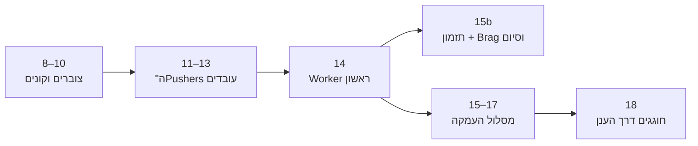

[חזרה לפרק 6: התראות דרך FCM](/android/CollectCircles/06.collect-circles-fcm-invitations)

{: .box-note}
בפרקים 8–14 נהפוך את CollectCircles בהדרגה ממשחק קצר של חמישה עיגולים למשחק Idle קטן: נצבור משאבים, נקנה Pushers, נראה אותם עובדים ונקבל התקדמות לאחר שהיישום היה סגור. לאחר פרק 14 נבחר בין מסלול קצר שמסתיים בהתראה מחזורית, לבין פרקי העמקה על תזמון, JSON וסנכרון. **לא חייבים לבצע את שני המסלולים.**

## לאן אנחנו הולכים?

בסיום הרצף יהיו במשחק:

- שני מצבים: משחק מהיר ומצב Auto אינסופי;
- יתרת עיגולים, מונה Lifetime וחנות Pushers;
- דמויות קטנות שהולכות אל עיגולים ודוחפות אותם למטרה;
- התקדמות שמחושבת גם לאחר זמן שבו היישום היה סגור;
- בדיקות רקע שמתחשבות בסוללה ובמטען;
- הודעת Brag כיתתית פשוטה לאחר קניית Pusher;
- במסלול ההעמקה בלבד: מערכת שעות, סנכרון כתיבה ו־Brag עשיר יותר עם שם שחקן.

לא חייבים לחכות לפרק 18 כדי להרגיש שהצלחנו:

- אחרי פרק 10 כבר יש כלכלה וחנות.
- אחרי פרק 12 כבר רואים כמה Pushers עובדים לצד השחקן.
- אחרי פרק 13 כבר יש משחק Idle בסיסי שעובד גם אחרי שסוגרים ופותחים את היישום.
- אחרי פרק 15b כבר יש Worker מחזורי, התראת זכאות ו־Brag קבוצתי, ואפשר לסיים.
- פרקים 15–18 במסלול הארוך מוסיפים חומר העמקה אופציונלי.

## תחנה ראשונה: צוברים וקונים

### [פרק 8 — חיסכון שנשמר ונצבר](/android/CollectCircles/08.collect-circles-persistent-economy)

נוסיף `Circles`,‏ `Lifetime` ו־`Pushers`. נלמד מדוע יתרה שאפשר לבזבז שונה ממונה שאינו יורד לעולם, ונשמור את שניהם גם לאחר סגירת היישום.

**מה נראה בסוף?** כל עיגול שאוספים מעדכן את שורת המצב, והמספרים נשארים לאחר פתיחה מחדש.

### [פרק 9 — מצב אוטונומי](/android/CollectCircles/09.collect-circles-autonomous-mode)

נוסיף מתג Auto שנשמר. במצב זה עיגולים ממשיכים להופיע, אבל מספרם על הלוח מוגבל כדי שהמשחק יישאר נוח ויציב.

**מה נראה בסוף?** לוח אינסופי שאפשר להמשיך לשחק בו בלי ללחוץ שוב על Start.

### [פרק 10 — חנות ה־Pushers](/android/CollectCircles/10.collect-circles-pusher-shop)

ניתן ליתרה שימוש אמיתי. ה־Pusher הראשון יעלה 64 עיגולים, הבא 128, אחריו 256 וכן הלאה. קנייה תקטין את היתרה, אך לא את Lifetime.

**מה נראה בסוף?** דיאלוג חנות, מחיר שעולה בחזקות של 2 וקנייה שנשמרת.

{: .box-success}
נקודת עצירה טובה: בשלב הזה כבר בנינו את לולאת המשחק הכלכלית — משחקים, מרוויחים וקונים שדרוג.

## תחנה שנייה: העובדים מתעוררים לחיים

### [פרק 11 — מציירים Pusher הולך](/android/CollectCircles/11.collect-circles-draw-pusher)

נצייר דמות קטנה ישירות על ה־Canvas ונניע את הידיים והרגליים שלה. נשתמש בזמן שעבר כדי שהתנועה לא תהיה תלויה במהירות המכשיר.

**מה נראה בסוף?** כל Pusher שקנינו הופך לדמות הולכת על הלוח.

### [פרק 12 — ה־Pushers מתחילים לעבוד](/android/CollectCircles/12.collect-circles-pushers-work)

כל Pusher יבחר עיגול פנוי, ילך אליו, ייצמד אליו וידחוף אותו אל המטרה. כמה Pushers יכולים להיות בשלבים שונים של העבודה באותו פריים, ובאותו זמן המשתמש עדיין יכול לגרור עיגול בעצמו.

**מה נראה בסוף?** השחקן וה־Pushers אוספים עיגולים יחד בלי ששני עובדים יבחרו אותו עיגול.

### [פרק 13 — התקדמות בזמן שהיישום סגור](/android/CollectCircles/13.collect-circles-offline-progress)

לא נשאיר משחק ואנימציה רצים כל הלילה. במקום זאת נשמור זמן, ובפתיחה הבאה נחשב כמה עיגולים העובדים היו יכולים לאסוף. נשמור גם שברי עיגול כדי לא לאבד התקדמות קטנה.

**מה נראה בסוף?** סוגרים את היישום, מחכים, פותחים — ומקבלים את העבודה שהצטברה.

{: .box-success}
הישג מרכזי: בסוף פרק 13 כבר יש לנו משחק Idle שלם ופשוט. מכאן אנחנו משתמשים בו כדי ללמוד כיצד Android מנהלת עבודות רקע אמיתיות.

## תחנה שלישית: Android בודקת בזמן הנכון

### [פרק 14 — Worker ראשון](/android/CollectCircles/14.collect-circles-first-worker)

ניצור בדיקת זכאות קצרה: האם יש מספיק עיגולים לקנות Pusher נוסף? בהתחלה נפעיל אותה בלחיצה כדי לראות תוצאה מיד ולהכיר `Worker` ו־`WorkRequest` בלי לחכות.

**מה נראה בסוף?** בדיקה שרצה דרך WorkManager ומסוגלת להציג התראת קנייה.

## אחרי פרק 14 בוחרים מסלול אחד

### [המסלול הקצר — פרק 15b: התראה מחזורית, Brag וסיום](/android/CollectCircles/15b.collect-circles-notification-only)

בפרק אחד נהפוך את הבדיקה הקיימת למחזורית: בדיקה רגילה שמתחשבת בסוללה ובדיקה תכופה יותר בזמן טעינה. `canBuyPusher()` תחשב כמה עיגולים היו קיימים אילו המשתמש פתח עכשיו את היישום, ואותו Worker מפרק 14 יישאר ללא שינוי.

**מה נראה בסוף?** התזמון המחזורי יכול להודיע על זכאות שנוצרה בזמן שהיישום היה סגור, וקניית Pusher שולחת Brag אנונימי לכל הקבוצה — בלי JSON ובלי Worker שכותב התקדמות אופליין.

זהו מסלול הסיום המומלץ כאשר המטרה היא להשלים משחק עובד בלי להעמיס נושאים נוספים.

מסלול העמקה אופציונלי: פרקים 15–18

### [פרק 15 — עבודה מחזורית](/android/CollectCircles/15.collect-circles-periodic-work)

נהפוך את הבדיקה למחזורית בשני מסלולים: מסלול רגיל המתחשב בסוללה ומסלול תכוף יותר בזמן טעינה. נלמד ש־WorkManager מבטיח עבודה מתאימה, אך לא שעת הפעלה מדויקת.

**מה נראה בסוף?** שתי בקשות בעלות שמות ואילוצים שונים ב־Background Task Inspector.

### [פרק 16 — מערכת שעות ב־JSON](/android/CollectCircles/16.collect-circles-json-schedule)

נוסיף ל־Worker שער זמן. ללא מטען נבדוק רק בזמן שיעורי מדעי המחשב; בזמן טעינה נאפשר בדיקות כל 15 דקות בחלון הרחב 08:00–24:00. מערכת השעות תישמר כ־JSON שאפשר להחליף.

**מה נראה בסוף?** ההתראה מופיעה רק כאשר גם הזכאות, גם מצב הסוללה וגם חלון הזמן מתאימים.

### [פרק 17 — כתיבה בטוחה מן ה־Worker](/android/CollectCircles/17.collect-circles-worker-settlement)

כעת גם מסך המשחק וגם Worker עלולים לעדכן את אותה התקדמות. נלמד כיצד `synchronized`,‏ snapshot טרי ו־`volatile` מונעים ספירה כפולה או דריסה כאשר ה־UI והעבודה ברקע נפגשים.

**מה נראה בסוף?** ה־Worker יכול לסכם התקדמות אופליין לפני בדיקת הזכאות בלי לפגוע בפעולות שהמשתמש מבצע.

{: .box-warning}
פרקים 15–17 עוסקים ברקע ובתזמון לעומק, ולכן הם פחות חזותיים ומוסיפים הרבה יותר קוד. בחרו בהם רק אם רוצים ללמוד במפורש מערכת שעות, כמה כותבים וסנכרון; הם אינם דרושים למסלול הקצר.

## תחנה אחרונה: משתפים את ההישג

### [פרק 18 — Brag לאחר קנייה](/android/CollectCircles/18.collect-circles-pusher-brag)

לאחר קנייה מוצלחת נשלח ל־Cloud Function שם, מספר Pushers ו־Lifetime. הקוד של המורה יבדוק את הנתונים, ינסח את ההודעה וישלח אותה לכל חברי הקבוצה — כולל למכשיר השולח, כדי שקל יהיה לבדוק.

**מה נראה בסוף?** קונים Pusher ומקבלים הודעת הישג שהטקסט שלה נשלט בצד השרת.

## איך לעבוד בלי לאבד סבלנות

1. מריצים את היישום בסוף כל פרק ורואים את השינוי לפני שממשיכים.
2. בודקים בכל פעם רק את התכונה החדשה; אין צורך לחזור על כל בדיקות המשחק בכל שיעור.
3. שומרים checkpoint עובד. אם הפרק הבא מסתבך, תמיד אפשר לחזור לתוצאה שכבר הצליחה.
4. בפרקי הרקע משתמשים בכפתורי הבדיקה וב־Background Task Inspector במקום להמתין שעות.
5. לאחר פרק 14 בוחרים מסלול אחד. אין צורך לבצע את 15 הרגיל לפני 15b.
6. כשמופיע קוד של thread או פעולה אסינכרונית, עוצרים ושואלים: **מי מריץ את הקוד, מתי הוא מסתיים, ואילו נתונים משותפים לו עם ה־UI?**

{: .box-note}
המטרה אינה רק לסיים משחק. במסלול הקצר המשחק מדגים שמירת מצב, אנימציה, מכונת מצבים, חישוב אופליין ועבודה מחזורית ברקע. סנכרון בין כמה כותבים ותקשורת נוספת עם השרת נשארים כהעמקה למי שבוחר במסלול הארוך.

## המשך

[פרק 8 — חיסכון שנצבר ונשמר](/android/CollectCircles/08.collect-circles-persistent-economy)

<!-- gemini-tutor-links:start -->

## מורי־עזר ב־Gemini

בחרו את המורה המתאים לפרק שבו אתם נמצאים:

- [Gem: מעבדת Idle CollectCircles](https://gemini.google.com/gem/1xIrpd_3BdKX5rEl9cuvSjfqKCJ3GYnzV?usp=sharing)
- [Gem: מאמן רקע CollectCircles](https://gemini.google.com/gem/1QiC7WZPzbDpNaSbBjiX_Y8JqusBIXwQG?usp=sharing)

<!-- gemini-tutor-links:end -->
