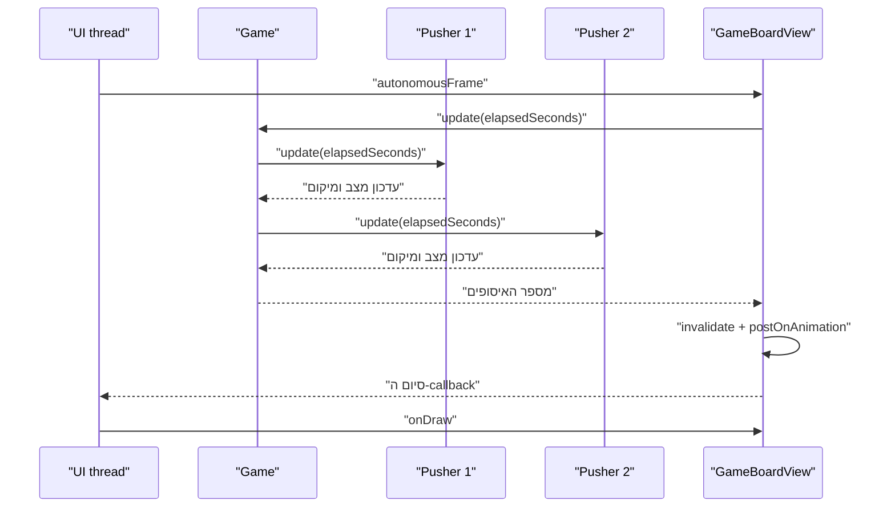

{: .box-note}
ה־Pushers שלנו כבר הולכים, אבל אינם מועילים לכלכלה. בשלב הזה כל אחד יבחר עיגול פנוי, ילך אליו, ייצמד מאחוריו וידחוף אותו אל מרכז המטרה. המשתמש עדיין יכול לאסוף כל עיגול בעצמו — ואם הוא לוקח עיגול שעובד כבר בחר, ה־Pusher מוותר עליו ומחפש עבודה אחרת.

[חזרה לפרק 11: מציירים Pusher הולך](/android/CollectCircles/11.collect-circles-draw-pusher)

## מחזור עבודה קבוע

מחזור אחד נמשך חמש שניות:

1. שתי שניות הליכה מן המקום הנוכחי אל מאחורי העיגול.
2. שלוש שניות דחיפה מן המקום ההתחלתי של העיגול אל מרכז המטרה.

לכן הביצועים הידועים של כל Pusher הם:

```text
1 circle / 5 seconds = 0.20 circles per second
```

הקצב בפועל יכול להיות קטן יותר רק כאשר אין עיגול פנוי. נדאג שקצב היצירה יהיה מעט גדול מקצב העבודה, כדי שה־Pushers לא יישארו ללא משימה.

## 1. מחליפים סיור חופשי במכונת מצבים

פתחו `Pusher.java`. הוסיפו את הקבועים ואת המצבים:

```java
/** Known production rate of one Pusher while work is available. */
static final double CIRCLES_PER_SECOND = 0.20;

// A complete task lasts five seconds: two walking and three pushing.
private static final double TASK_DURATION_SECONDS = 1.0 / CIRCLES_PER_SECOND;
private static final double WALK_DURATION_SECONDS = 2.0;

/** Phases of one Pusher's work cycle. */
private enum State {
    IDLE,
    WALKING,
    PUSHING
}
```

החליפו את `centerY` לשדה שאפשר לשנות והוסיפו את נתוני המשימה:

```java
private float centerY;
private State state = State.IDLE;
private Circle assignedCircle;
private double taskElapsedSeconds;

// Positions captured at assignment time and reused throughout the task.
private float pusherStartX;
private float pusherStartY;
private float circleStartX;
private float circleStartY;
private float targetX;
private float targetY;
private float attachX;
private float attachY;
private float finishX;
private float finishY;
```

<div class="two-columns">
<div markdown="1" class="column">

### לפני: סיור

```java
/**
 * Advances the old patrol movement by one frame.
 *
 * @param elapsedSeconds seconds since the previous frame
 * @param boardWidth current width of the board
 */
public void update(double elapsedSeconds,
                   float boardWidth) {
    centerX += direction * speed * elapsedSeconds;

    if (centerX > rightEdge) {
        centerX = rightEdge;
        direction = -1;
    } else if (centerX < leftEdge) {
        centerX = leftEdge;
        direction = 1;
    }
}
```

היעד הוא רק קצה הלוח.

</div>
<div markdown="1" class="column">

### אחרי: משימה

```java
/**
 * Advances the current work assignment by one frame.
 *
 * @param elapsedSeconds seconds since the previous frame
 * @return the completed circle, or null while the task is still running
 */
public Circle update(double elapsedSeconds) {
    if (assignedCircle == null) {
        return null;
    }

    taskElapsedSeconds += elapsedSeconds;
    if (taskElapsedSeconds < WALK_DURATION_SECONDS) {
        updateWalkingPosition();
        return null;
    }

    state = State.PUSHING;
    updatePushingPosition();
    if (taskElapsedSeconds < TASK_DURATION_SECONDS) {
        return null;
    }

    return finishTask();
}
```

היעד נקבע לפי העיגול והמטרה.

</div>
</div>

{: .box-warning}
מרגע שהחלפתם את `Pusher.update` ועד שתשלימו את **שלב 6**, הפרויקט צפוי **לא להתקמפל**. בשלב הביניים הזה `Game.java` עדיין קורא לגרסה הישנה, `pusher.update(elapsedSeconds, boardWidth)`, אף שהפעולה החדשה מקבלת רק `elapsedSeconds`. שלב 6 יעדכן את הקריאה ב־`Game` ויחזיר את הפרויקט למצב מתקמפל.

## 2. מקבלים משימה ומתמקמים מאחורי העיגול

הוסיפו:

```java
/**
 * Assigns a circle and calculates the path from the Pusher to the target.
 *
 * @param circle circle to push
 * @param target destination target
 * @return true when the assignment is accepted; false when already busy
 */
public boolean assign(Circle circle, Target target) {
    if (assignedCircle != null) {
        return false;
    }

    assignedCircle = circle;
    state = State.WALKING;
    pusherStartX = centerX;
    pusherStartY = centerY;
    circleStartX = circle.getCenterX();
    circleStartY = circle.getCenterY();
    targetX = target.getCenterX();
    targetY = target.getCenterY();

    // Normalize the direction from the circle to the target.
    float dx = targetX - circleStartX;
    float dy = targetY - circleStartY;
    float distance = (float) Math.sqrt(dx * dx + dy * dy);
    // Use a stable default direction when the circle is already at the target.
    float unitX = distance == 0 ? 1f : dx / distance;
    float unitY = distance == 0 ? 0f : dy / distance;
    float behindDistance = circle.getRadius() + height * 0.15f;

    attachX = circleStartX - unitX * behindDistance;
    attachY = circleStartY - unitY * behindDistance;
    finishX = targetX - unitX * behindDistance;
    finishY = targetY - unitY * behindDistance;
    updateDirection(attachX - centerX);
    return true;
}
```

הווקטור `(unitX, unitY)` מצביע מן העיגול אל המטרה ואורכו 1. כדי להציב את הדמות **מאחורי** העיגול, מתקדמים בכיוון ההפוך לאורך רדיוס העיגול ועוד מרווח קטן לגוף.

הוסיפו פעולות עזר:

```java
/**
 * Updates the direction only when horizontal movement is meaningful.
 *
 * @param horizontalMovement signed horizontal movement; positive means right
 */
private void updateDirection(float horizontalMovement) {
    if (horizontalMovement > 0.001f) {
        direction = 1;
    } else if (horizontalMovement < -0.001f) {
        direction = -1;
    }
}

/**
 * Finds a position between two endpoints.
 *
 * @param start position at progress 0
 * @param end position at progress 1
 * @param progress fraction of the movement already completed
 * @return interpolated position
 */
private float interpolate(float start, float end, float progress) {
    return start + (end - start) * progress;
}
```

## 3. הולכים, דוחפים ומסיימים

הוסיפו את `update()` מן ההשוואה הקודמת ואת הפעולות הבאות:

```java
/** Moves the Pusher from its starting point to the attachment point. */
private void updateWalkingPosition() {
    float progress = (float) (taskElapsedSeconds / WALK_DURATION_SECONDS);
    centerX = interpolate(pusherStartX, attachX, progress);
    centerY = interpolate(pusherStartY, attachY, progress);
}

/** Moves the assigned circle and its Pusher toward the target together. */
private void updatePushingPosition() {
    double pushingSeconds = taskElapsedSeconds - WALK_DURATION_SECONDS;
    double pushingDuration = TASK_DURATION_SECONDS - WALK_DURATION_SECONDS;
    float progress = (float) Math.min(1.0, pushingSeconds / pushingDuration);

    assignedCircle.setCenter(
            interpolate(circleStartX, targetX, progress),
            interpolate(circleStartY, targetY, progress)
    );
    centerX = interpolate(attachX, finishX, progress);
    centerY = interpolate(attachY, finishY, progress);
    updateDirection(targetX - circleStartX);
}

/**
 * Releases the completed assignment while preserving fractional extra time.
 *
 * @return circle that reached the target
 */
private Circle finishTask() {
    Circle completedCircle = assignedCircle;
    assignedCircle = null;
    state = State.IDLE;
    taskElapsedSeconds -= TASK_DURATION_SECONDS;
    return completedCircle;
}
```

בסיום, מרכז העיגול נמצא בדיוק במרכז המטרה. לכן מתקיים גם התנאי הגאומטרי הישן:

```text
distance + smallRadius <= targetRadius
```

החיסור במקום איפוס של `taskElapsedSeconds` שומר שבריר שנוצר כאשר פריים עבר מעט מעבר לחמש שניות. כך שגיאות של כמה אלפיות שנייה אינן מצטברות ומאטות את העובד לאורך זמן.

## 4. מאפשרים למשתמש לקחת את העיגול

הוסיפו ל־`Pusher`:

```java
/**
 * Checks whether this Pusher owns a particular assignment.
 *
 * @param circle circle to check by object identity
 * @return true when this Pusher is assigned to that circle
 */
public boolean isAssignedTo(Circle circle) {
    return assignedCircle == circle;
}

/** @return true when this Pusher currently has work */
public boolean hasAssignment() {
    return assignedCircle != null;
}

/**
 * Cancels this Pusher's assignment when it matches the supplied circle.
 *
 * @param circle circle taken by the user
 */
public void cancelAssignment(Circle circle) {
    if (assignedCircle != circle) {
        return;
    }
    assignedCircle = null;
    state = State.IDLE;
    taskElapsedSeconds = 0;
}
```

ביטול שמגיע מן המשתמש כן מאפס את זמן המשימה: ה־Pusher לא השלים עבודה ולכן אין זמן עודף להעביר למשימה אחרת.

## 5. משנים את ציור הידיים בזמן דחיפה

בתוך `draw`, החליפו את שני קווי הידיים בתנאי:

```java
// Pushing uses two forward arms; walking keeps the alternating swing.
if (state == State.PUSHING) {
    float handsX = centerX + direction * height * 0.32f;
    canvas.drawLine(centerX, shouldersY, handsX, centerY, paint);
    canvas.drawLine(centerX, shouldersY + height * 0.05f,
            handsX, centerY + height * 0.05f, paint);
} else {
    canvas.drawLine(centerX, shouldersY,
            centerX + direction * swing, centerY + height * 0.05f, paint);
    canvas.drawLine(centerX, shouldersY,
            centerX - direction * swing, centerY + height * 0.05f, paint);
}
```

בהליכה הידיים מתחלפות. בדחיפה שתיהן נשלחות קדימה ונוגעות בצד האחורי של העיגול.

## 6. `Game` מחלק עבודה בלי כפילויות

קצב היצירה יותאם לכוח העבודה:

```java
// Keep autonomous mode alive even before the first Pusher is purchased.
private static final double BASE_SPAWN_RATE = 0.20;

// Spawn 10% faster than the workers' known maximum production rate.
private static final double SPAWN_RATE_PER_PUSHER =
        Pusher.CIRCLES_PER_SECOND * 1.10;
```

הוסיפו פעולה שמחשבת את קצב יצירת העיגולים הנוכחי:

```java
/** @return current circle spawn rate per second */
private double getSpawnRate() {
    return Math.max(BASE_SPAWN_RATE, pushers.size() * SPAWN_RATE_PER_PUSHER);
}
```

כעת שנו את `Game.update` כך שיחזיר כמה עיגולים העובדים אספו בפריים:

<div class="two-columns before-after">
<div markdown="1" class="column">

### לפני

    
/**
- * Updates circle spawning, then advances every Pusher on the board.
 *
 * @param elapsedSeconds time since the previous frame, in seconds
 * @param boardWidth current board width, in pixels
 * @param boardHeight current board height, in pixels
 * @param circleColor color used for newly spawned circles
 */
-public void update(double elapsedSeconds, float boardWidth,
-                   float boardHeight, int circleColor) {
    if (!autonomous) {
-        return;
    }

-    spawnProgress += elapsedSeconds * AUTONOMOUS_SPAWN_RATE;
    while (spawnProgress >= 1.0 && circles.size() < MAX_CIRCLE_COUNT) {
        createCircles(circles.size() + 1, boardWidth, boardHeight, circleColor);
        spawnProgress -= 1.0;
    }

    if (circles.size() == MAX_CIRCLE_COUNT) {
        spawnProgress = Math.min(spawnProgress, 1.0);
    }
    // Advance each Pusher by the same elapsed frame time.
    for (Pusher pusher : pushers) {
-        pusher.update(elapsedSeconds, boardWidth);
    }
}
    

</div>
<div markdown="1" class="column">

### אחרי

    
/**
+ * Advances autonomous mode and lets every Pusher perform one frame of work.
 *
 * @param elapsedSeconds time since the previous frame, in seconds
 * @param boardWidth current board width, in pixels
 * @param boardHeight current board height, in pixels
 * @param circleColor color used for newly spawned circles
+ * @return number of circles completed by Pushers during this frame
 */
+public int update(double elapsedSeconds, float boardWidth,
+                  float boardHeight, int circleColor) {
    if (!autonomous) {
+        return 0;
    }

+    spawnProgress += elapsedSeconds * getSpawnRate();
    while (spawnProgress >= 1.0 && circles.size() < MAX_CIRCLE_COUNT) {
        createCircles(circles.size() + 1, boardWidth, boardHeight, circleColor);
        spawnProgress -= 1.0;
    }

    if (circles.size() == MAX_CIRCLE_COUNT) {
        spawnProgress = Math.min(spawnProgress, 1.0);
    }
    // Advance each Pusher by the same elapsed frame time.
+    int collectedCount = 0;
    for (Pusher pusher : pushers) {
+        assignCircleIfNeeded(pusher);
+        Circle completed = pusher.update(elapsedSeconds);
+        if (completed != null && circles.remove(completed)) {
+            collectedCount++;
+        }
    }
+    return collectedCount;
}
    

</div>
</div>

`Game.update` קוראת כעת ל־`getSpawnRate()` במקום להשתמש ישירות בקבוע הישן `AUTONOMOUS_SPAWN_RATE`. כך קצב היצירה מתאים את עצמו למספר ה־Pushers שנרכשו.

כאשר המשחק אינו אוטונומי, `Game.update` מחזירה 0 מפני שאף עובד לא השלים איסוף בפריים הזה.

הוסיפו את חלוקת העבודה:

```java
/**
 * Assigns the first available circle when a Pusher is idle.
 *
 * @param pusher worker that may need a new assignment
 */
private void assignCircleIfNeeded(Pusher pusher) {
    if (pusher.hasAssignment()) {
        return;
    }

    // Skip the user's circle and every circle owned by another Pusher.
    for (Circle circle : circles) {
        if (circle != selectedCircle && !isAssigned(circle)) {
            pusher.assign(circle, target);
            return;
        }
    }
}

/**
 * Checks whether another Pusher already owns a circle.
 *
 * @param circle circle being considered for assignment
 * @return true when the circle is already assigned
 */
private boolean isAssigned(Circle circle) {
    for (Pusher pusher : pushers) {
        if (pusher.isAssignedTo(circle)) {
            return true;
        }
    }
    return false;
}
```

`selectedCircle` אינו מוצע לעובדים בזמן שהמשתמש גורר אותו, וכל עיגול אחר יכול להיות משויך לעובד אחד בלבד.

{: .box-success}
בסיום שלב 6 הפרויקט אמור לחזור להתקמפל וגם לעבוד, **כך שה-pusher עובד ודוחף עיגולים**. אם עדיין מופיעה שגיאה, בדקו שהקריאה הישנה `pusher.update(elapsedSeconds, boardWidth)` הוחלפה בקריאה `pusher.update(elapsedSeconds)` שבתוך הלולאה החדשה.

## 7. כיצד כמה Pushers "עובדים במקביל"? {#id-parallel-pushers}

<div markdown="1" class="box-warning">

בפרויקט הזה **לא יוצרים Thread לכל Pusher** ולא מפעילים עבורם `Service`. כל שינוי במודל הלוח המצויר — `Game`,‏ `Circle` ו־`Pusher` — כל אירוע מגע וכל ציור מתבצעים ב־UI thread היחיד של Android.

זהו המבנה הסופי של לולאת האנימציה בפרויקט: בכל פריים `Game.update` קוראת ל־`Pusher.update` של כל עובד, כל קריאה מחשבת את המצב הבא ומחזירה מיד, ואחר כך `onDraw` מציירת את המצב שהתקבל. פעולות אלה אינן מבצעות `sleep`,‏ I/O של רשת או כתיבת דיסק סינכרונית. מנגנוני הרקע שנוסיף בהמשך אינם מריצים או מזיזים Pushers ואינם מחליפים את לולאת הפריימים; הם מחשבים באופן דטרמיניסטי התקדמות אופליין מתוך נתונים שמורים, בלי ליצור את אובייקטי הלוח המצויר.

</div>

`postOnAnimation(autonomousFrame)` אינו מריץ את ה־Runnable מיד ואינו יוצר thread. הוא מבקש מ־Android להכניס את ה־Runnable לתור לקראת פריים המסך הבא. כאשר תורו מגיע, UI thread מריץ אותו עד הסוף:

1. מחשבים כמה זמן עבר מאז הפריים הקודם.
2. `Game.update` מעדכן את Pusher 1.
3. אותה פעולה מעדכנת את Pusher 2, אחר כך את Pusher 3 וכן הלאה.
4. callback של כל איסוף שהושלם מעדכן את הכלכלה.
5. `invalidate()` מבקש ציור חדש; הוא **אינו** קורא מיד ל־`onDraw`.
6. ה־Runnable מזמין את הפריים הבא ומחזיר שליטה ל־Android.
7. Android קורא ל־`onDraw` בזמן המתאים ומצייר את המצב החדש של כולם.

{: .box-note}
לדוגמה, עם 15 Pushers, בכל פריים `Game.update` נקראת פעם אחת ובתוכה `Pusher.update` נקראת 15 פעמים. לאחר מכן קוראים ל־`invalidate()` פעם אחת, ו־Android מצייר את כל הלוח בקריאה אחת ל־`onDraw` — לא קריאה נפרדת לכל Pusher. בקצב של כ־60 פריימים לשנייה נקבל בערך 60 קריאות ל־`onDraw`, אך 900 קריאות ל־`Pusher.update` בכל שנייה.



העדכונים מתבצעים זה אחר זה, אבל כל אחד קצר מאוד והמסך מצויר רק לאחר שכולם עודכנו. לעין נראה שכל הדמויות זזו יחד. זהו **שיתוף זמן על thread אחד**, לא ביצוע מקביל אמיתי על כמה ליבות.

### לכל Pusher יש שעון מצב משלו

השדה `taskElapsedSeconds` שייך לאובייקט `Pusher`, לא ל־`Game`. לדוגמה:

- Pusher 1 התחיל לדחוף כאשר השעון שלו כבר על 2.0 שניות.
- שתי שניות אחר כך נוצר עיגול פנוי ו־Pusher 2 התחיל ללכת עם שעון משלו שמתחיל ב־0.
- בפריים הבא שניהם מקבלים אותו `elapsedSeconds`, למשל `0.016`, אבל מוסיפים אותו לערכים שונים.
- לכן Pusher 1 יכול לסיים את הדחיפה בזמן ש־Pusher 2 עדיין הולך אל העיגול שלו.

אסור להוסיף `sleep` בתוך `update`: הוא היה עוצר את UI thread, מקפיא את **כל** ה־Pushers ומונע מן המשתמש לגרור. במקום להמתין, כל אובייקט שומר מצב וזמן, מבצע מעט עבודה בכל פריים ומחזיר שליטה.

### היכן נכנסת הגרירה של המשתמש?

אירועי `ACTION_DOWN`,‏ `ACTION_MOVE` ו־`ACTION_UP` נכנסים לאותו תור של UI thread בין callbacks של פריימים. Android אינו מפעיל `onTouchEvent` באמצע `Game.update`. סדר אפשרי הוא:

```text
frame 20: update לכל ה-Pushers → ציור
ACTION_DOWN: ביטול השיוך ובחירת העיגול
ACTION_MOVE: המשתמש מזיז את העיגול
frame 21: העובדים מעדכנים עיגולים אחרים; selectedCircle אינו מוצע להם
ACTION_UP: איסוף ידני או שחרור
frame 22: העיגול שוב פנוי לעובד אם לא נאסף
```

מכיוון שכל הפעולות שמשנות את `Circle`,‏ `Pusher` ו־`Game` נשארות על אותו thread, לא נדרש עבורן `synchronized` ואין race condition בין היד של המשתמש לעובד. כלל זה נשאר נכון לאורך כל הפרויקט. כאשר נוסיף בהמשך `WorkManager`, ה־Worker לא ייגש לאובייקטי הלוח האלה; הוא ייגש רק לכלכלה השמורה ב־`GameProgress`. התיאום בין threads שנוסיף שם יגן על ההתקדמות השמורה, לא על האנימציה ולא על לולאת הפריימים.

## 8. מבטלים שיוך כאשר המשתמש בוחר עיגול

ב־`selectCircleAt`, רגע לפני `selectedCircle = circle`, הוסיפו:

```java
cancelPusherAssignment(circle);
```

והוסיפו:

```java
/**
 * Releases a circle from any Pusher before the user starts dragging it.
 *
 * @param circle circle selected by the user
 */
private void cancelPusherAssignment(Circle circle) {
    for (Pusher pusher : pushers) {
        pusher.cancelAssignment(circle);
    }
}
```

כל הקוד רץ ב־UI thread, ולכן אין מצב שבו המשתמש וה־Pusher משנים את אותו עיגול בו־זמנית באמצע פריים.

## 9. מדווחים על איסופים אוטומטיים

ב־Runnable של `GameBoardView`, קבלו את הערך החדש:

```java
int collectedCount = game.update(
        elapsedSeconds,
        getWidth(),
        getHeight(),
        color(R.color.circle_green)
);

// Report automatic collections through the same callback as manual ones.
for (int i = 0; i < collectedCount; i++) {
    if (onCircleCollected != null) {
        onCircleCollected.run();
    }
}
```

זהו אותו callback שבו משתמש איסוף ידני. לכן אין שני מסלולים שונים לעדכון Circles ו־Lifetime.

הקריאה `onCircleCollected.run()` כאן היא קריאה רגילה וסינכרונית: היא מסתיימת לפני שהלולאה ממשיכה. לעומתה, `SharedPreferences.apply()` מעדכנת מיד את העותק בזיכרון ומתזמנת את כתיבת הקובץ לדיסק באופן אסינכרוני, כדי לא לעכב את UI thread. המסך יכול לקרוא מיד את הערכים החדשים; Android משלים את כתיבת הדיסק מאוחר יותר.

## 10. בדיקה ממוקדת

החליפו את בדיקת הסיור הישנה בבדיקה של מחזור העבודה:

```java
/** Verifies that one Pusher completes exactly one five-second task. */
@Test
public void pusherCompletesOneCircleAfterFiveSeconds() {
    Pusher pusher = new Pusher(20, 20, 40, 0, 0);
    Circle circle = new Circle(100, 100, 20, 0);
    Target target = new Target(200, 200, 50, 0, 0, 1);

    assertTrue(pusher.assign(circle, target));
    assertNull(pusher.update(4.9));
    assertSame(circle, pusher.update(0.1));
    assertEquals(target.getCenterX(), circle.getCenterX(), 0.001);
    assertEquals(target.getCenterY(), circle.getCenterY(), 0.001);
}
```

הריצו פעם אחת:

```powershell
.\gradlew.bat testDebugUnitTest assembleDebug
```

## 11. בדיקה ידנית

1. הפעילו Auto עם Pusher אחד וצפו בו בוחר עיגול, הולך אליו ודוחף אותו למטרה.
2. ודאו שהידיים נשלחות קדימה בזמן הדחיפה ושכל המחזור נמשך כחמש שניות.
3. בדקו ש־Circles ו־Lifetime גדלים כאשר העובד מסיים.
4. עם שני Pushers, ודאו שהם אינם נדבקים לאותו עיגול.
5. בזמן שעובד הולך או דוחף, געו בעיגול שלו וגררו אותו. העובד צריך לעזוב אותו ולבחור עיגול אחר.
6. אספו עיגולים ידנית במקביל וודאו שאין איסוף כפול.
7. השאירו את המשחק עד 12 עיגולים: העובדים צריכים להמשיך לעבוד, והלוח אינו עובר את התקרה.
8. נסו להתחיל שני Pushers בזמנים שונים והסבירו בעל־פה מדוע הם נראים מקבילים אף ששניהם מתעדכנים באותו UI thread.

{: .box-success}
המשחק פועל כעת גם ללא גרירה: יצירת העיגולים מזינה את כוח העבודה, והעובדים ממירים אותם להתקדמות בקצב ידוע. בפרק הבא נשתמש בדיוק בקצב הזה כדי לחשב כמה עיגולים נאספו כאשר היישום היה סגור.

[המשך לפרק 13: התקדמות בזמן שהיישום סגור](/android/CollectCircles/13.collect-circles-offline-progress)
