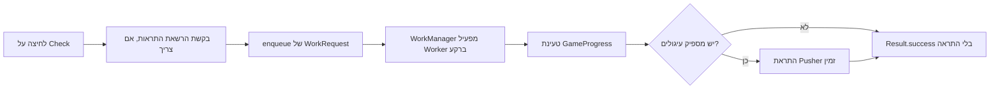
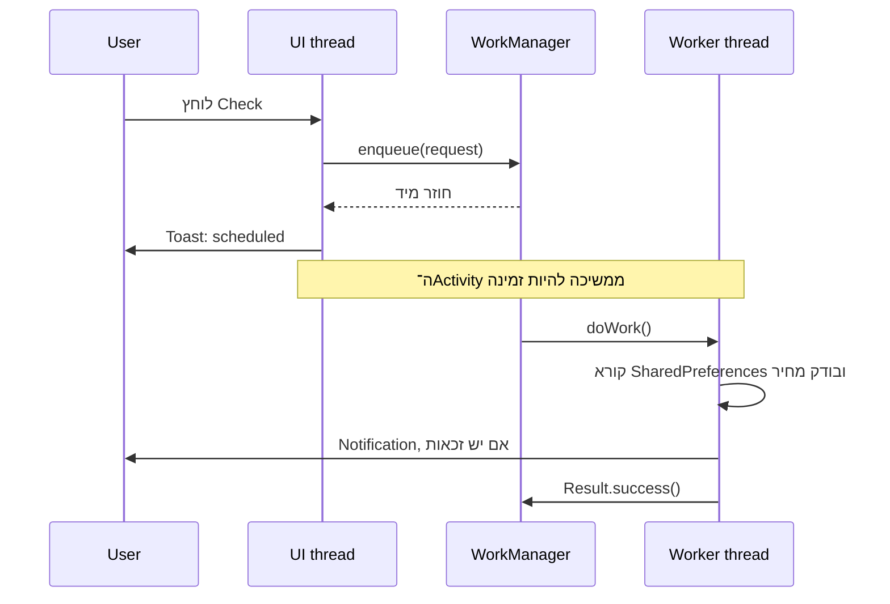

{: .box-note}
בפרק הקודם חישבנו התקדמות רק כאשר ה־Activity חזרה למסך. כעת נמסור ל־Android יחידת עבודה קצרה: לבדוק אם היתרה מספיקה לקניית Pusher ולהציג התראה. בשלב הראשון נריץ אותה בלחיצה כדי לקבל תוצאה מהירה; בפרק הבא נהפוך אותה למחזורית.

[חזרה לפרק 13: התקדמות בזמן שהיישום סגור](/android/CollectCircles/13.collect-circles-offline-progress)

{: .box-warning}
`Worker` אינו thread שאנחנו יוצרים ומנהלים. אנחנו מתארים עבודה ושולחים `WorkRequest`;‏ WorkManager בוחר מתי להריץ אותה ומספק לה thread רקע. אין הבטחה שהעבודה תתחיל בדיוק ברגע הלחיצה.

## מפת הזרימה



ה־Activity רק מבקשת ומוסרת עבודה. ה־Worker אינו מחזיק הפניה ל־Activity ואינו נוגע ב־View.

## 1. מוסיפים את WorkManager לפרויקט

גרסת WorkManager שבה נשתמש היא `2.11.2`. בחלון **Android** פתחו
`Gradle Scripts > libs.versions.toml (Version Catalog)` והוסיפו:

<div class="two-columns">
<div markdown="1" class="column">

### באזור `[versions]`

```toml
work = "2.11.2"
```

</div>
<div markdown="1" class="column">

### באזור `[libraries]`

```toml
work-runtime = { group = "androidx.work", name = "work-runtime", version.ref = "work"}
```

</div>
</div>

לאחר מכן פתחו `Gradle Scripts > build.gradle.kts (Module :app)` והוסיפו בתוך
`dependencies`:

```diff
 implementation(libs.constraintlayout)
+implementation(libs.work.runtime)
 implementation(platform(libs.firebase.bom))
```

`work-runtime` הוא המימוש המתאים ל־Java. איננו מוסיפים כאן `work-runtime-ktx`, מפני שהפרויקט אינו משתמש ב־Kotlin coroutines.

{: .box-warning}
לאחר שינוי קובצי Gradle בצעו **File → Sync Project with Gradle Files**. אם Android Studio מסמן `Cannot resolve symbol 'work'` או `OneTimeWorkRequest` אבל Gradle מצליח לבנות את היישום, בדרך כלל הקוד תקין וה־index של סביבת הפיתוח עדיין לא הסתנכרן. אפשר גם ללחוץ `Ctrl+Shift+A` ולחפש `Sync Project with Gradle Files`.

לפי [התיעוד הרשמי של WorkManager](https://developer.android.com/develop/background-work/background-tasks/persistent/getting-started),‏ `doWork()` של `Worker` רגיל מופעל באופן אסינכרוני על thread רקע שמספק WorkManager.

## 2. נותנים גם ל־Worker לטעון את ההתקדמות

שם קובץ ההעדפות נמצא כרגע כשדה פרטי ב־`MainActivity`. העבירו אותו אל `GameProgress`:

```java
static final String PREFERENCES_NAME = "collect_circles_preferences";
```

והוסיפו פעולת יצירה משותפת:

```java
/**
 * Loads the shared game progress used by Activities and Workers.
 *
 * @param context context used to open the SharedPreferences file
 * @return game progress backed by the shared preferences
 */
public static GameProgress load(Context context) {
    SharedPreferences preferences = context.getSharedPreferences(
            PREFERENCES_NAME,
            Context.MODE_PRIVATE
    );
    return new GameProgress(preferences);
}
```

הוסיפו גם את ה־import:

```java
import android.content.Context;
```

כעת ה־Activity וה־Worker אינם צריכים להעתיק מחרוזת. שניהם פותחים בדיוק את אותו קובץ `SharedPreferences`.

ב־`MainActivity` הסירו את `PREFERENCES_NAME` והחליפו את האתחול:

```diff
-preferences = getSharedPreferences(PREFERENCES_NAME, MODE_PRIVATE);
-gameProgress = new GameProgress(preferences);
+preferences = getSharedPreferences(
+        GameProgress.PREFERENCES_NAME,
+        MODE_PRIVATE
+);
+gameProgress = GameProgress.load(this);
```

עדיין שומרים את `preferences` ב־Activity מפני שגם השיא של המשחק המתוזמן שמור בו.

## 3. מוסיפים התראה ייעודית לזכאות

ב־`strings.xml` הוסיפו:

```xml
<string name="pusher_available_title">A new pusher is available!</string>
<string name="pusher_available_text">You have enough circles for the next pusher (%1$d).</string>
<string name="pusher_check_scheduled">Pusher check scheduled</string>
<string name="check_pusher">Check</string>
```

ב־`Notifications` הוסיפו מזהה נפרד:

```java
private static final int PUSHER_NOTIFICATION_ID = 2;
```

<div class="two-columns">
<div markdown="1" class="column">

### ההתראה הישנה

```java
public static void show(Context context) {
    createChannel(context);
    // invitation notification...
    manager.notify(NOTIFICATION_ID, notification);
}
```

</div>
<div markdown="1" class="column">

### ההתראה החדשה (בנוסף)

```java
/**
 * Shows a notification that the player can afford the next Pusher.
 *
 * @param context application or Activity context
 * @param price price displayed in the notification
 */
public static void showPusherAvailable(
        Context context,
        long price
) {
    createChannel(context);
    NotificationManager manager = context.getSystemService(
            NotificationManager.class
    );
    Notification notification = new Notification.Builder(
            context,
            CHANNEL_ID
    )
            .setSmallIcon(R.drawable.ic_launcher_foreground)
            .setContentTitle(context.getString(
                    R.string.pusher_available_title
            ))
            .setContentText(context.getString(
                    R.string.pusher_available_text,
                    price
            ))
            .setAutoCancel(true)
            .build();

    manager.notify(PUSHER_NOTIFICATION_ID, notification);
}
```

</div>
</div>

מזהים שונים מאפשרים להתראת ההזמנה ולהתראת הקנייה להתקיים בנפרד. שימוש חוזר במזהה `2` מחליף התראת קנייה קודמת במקום ליצור ערימה של התראות זהות.

## 4. יוצרים Worker קטן

בחלון **Android**, תחת `app > kotlin+java > com.example.collectcircles`, צרו **Java Class**
בשם `PusherEligibilityWorker`:

```java
package com.example.collectcircles;

import android.content.Context;

import androidx.annotation.NonNull;
import androidx.work.Worker;
import androidx.work.WorkerParameters;

public class PusherEligibilityWorker extends Worker {

    /**
     * Creates the Worker with the data supplied by WorkManager.
     *
     * @param appContext application context supplied by WorkManager
     * @param workerParameters input and runtime parameters for this work
     */
    public PusherEligibilityWorker(
            @NonNull Context appContext,
            @NonNull WorkerParameters workerParameters
    ) {
        super(appContext, workerParameters);
    }

    /**
     * Checks the saved balance and notifies the player when a Pusher is affordable.
     *
     * @return success after the eligibility check finishes
     */
    @NonNull
    @Override
    public Result doWork() {
        Context context = getApplicationContext();
        GameProgress progress = GameProgress.load(context);

        if (progress.canBuyPusher() && Notifications.canShow(context)) {
            Notifications.showPusherAvailable(
                    context,
                    progress.getNextPusherPrice()
            );
        }

        return Result.success();
    }
}
```

### מה עושה כל חלק?

- הבנאי מקבל `application Context`, שחי בלי קשר למסך מסוים.
- `doWork()` היא יחידת העבודה ש־WorkManager מפעיל על thread רקע.
- ה־Worker קורא נתונים קצרים שכבר נמצאים ב־`SharedPreferences`; הוא אינו נוגע ב־View Binding או ב־Toast.
- `canShow()` מונע ניסיון לפרסם אם המשתמש ביטל בינתיים את הרשאת ההתראות בהגדרות.
- `Result.success()` אומר שהבדיקה הסתיימה. הוא אינו אומר שנשלחה התראה — מצב שבו עדיין אין מספיק עיגולים הוא תוצאה תקינה.

לצורך הבדיקה האחרונה הוסיפו ל־`Notifications`:

```java
/**
 * Checks whether notifications are currently enabled for the app.
 *
 * @param context context used to access NotificationManager
 * @return true when the app may show notifications
 */
public static boolean canShow(Context context) {
    NotificationManager manager = context.getSystemService(
            NotificationManager.class
    );
    return manager.areNotificationsEnabled();
}
```

{: .box-error}
אל תעבירו `Activity`,‏ `binding` או `View` אל Worker. ייתכן שהמסך כבר נהרס לפני שהעבודה תתחיל. `getApplicationContext()` הוא ההקשר המתאים לעבודה שאינה שייכת למסך.

## 5. שולחים בקשת עבודה חד־פעמית

ב־`MainActivity` הוסיפו imports:

```java
import androidx.work.OneTimeWorkRequest;
import androidx.work.WorkManager;
```

הוסיפו פעולה:

```java
/** Enqueues one background eligibility check and confirms its scheduling. */
private void enqueuePusherCheck() {
    OneTimeWorkRequest request =
            new OneTimeWorkRequest.Builder(
                    PusherEligibilityWorker.class
            ).build();

    WorkManager.getInstance(this).enqueue(request);
    Toast.makeText(
            this,
            R.string.pusher_check_scheduled,
            Toast.LENGTH_SHORT
    ).show();
}
```

`enqueue()` מחזירה שליטה מיד. היא אינה קוראת ל־`doWork()` כמו לפונקציה רגילה ואינה ממתינה לתוצאה. מרגע המסירה WorkManager אחראי לשמור את הבקשה ולבחור thread וזמן מתאימים.

## 6. מחברים להרשאת ההתראות

הכפתור הקיים כבר יודע לבקש הרשאה ב־Android 13 ומעלה. נשנה רק את הפעולה שמתרחשת לאחר אישור.

<div class="two-columns before-after">
<div markdown="1" class="column">

### לפני

    
if (permissionGranted) {
-    Notifications.show(this);
}

⁞
⁞

binding.localNotifButton.setOnClickListener(
-        view -> requestPermissionAndShowNotification()
);
    

</div>
<div markdown="1" class="column">

### אחרי

    
if (permissionGranted) {
+    enqueuePusherCheck();
}

⁞
⁞

binding.localNotifButton.setOnClickListener(
+        view -> requestPermissionAndCheckPusher()
);
    

</div>
</div>

שנו גם את שם הפעולה ואת סופה:

```java
/** Requests notification permission when needed, then schedules the check. */
private void requestPermissionAndCheckPusher() {
    if (Build.VERSION.SDK_INT >= Build.VERSION_CODES.TIRAMISU
            && checkSelfPermission(Manifest.permission.POST_NOTIFICATIONS)
            != PackageManager.PERMISSION_GRANTED) {
        notificationPermissionLauncher.launch(
                Manifest.permission.POST_NOTIFICATIONS
        );
        return;
    }

    enqueuePusherCheck();
}
```

ולבסוף, ב־`activity_main.xml`, החליפו את טקסט הכפתור:

```diff
-android:text="@string/local_notification_tiny"
+android:text="@string/check_pusher"
```

ה־Activity היא המקום היחיד שמציג את חלון בקשת ההרשאה. Worker יכול לפרסם התראה לאחר שניתנה הרשאה, אך אסור לו לפתוח למשתמש חלון הרשאה מתוך הרקע.

## 7. שני צירי זמן, שני threads



ה־Toast וה־Views שייכים ל־UI thread. לעומתם `doWork()` של `Worker` רגיל רץ על executor ברקע שמנוהל על־ידי WorkManager. שתי הפעולות עשויות לחפוף בזמן: המשתמש יכול לגרור עיגול בזמן שה־Worker קורא את היתרה.

בפרק הזה ה־Worker **רק קורא** snapshot של כלכלת המשחק ומחליט אם להציג notification. אם המשתמש אוסף עיגול בדיוק בזמן הקריאה, לכל היותר הבדיקה הנוכחית תשתמש ביתרה ישנה מעט וההתראה תידחה לבדיקה הבאה; שום התקדמות אינה יכולה ללכת לאיבוד, מפני שה־Worker אינו כותב דבר.

בשני מסלולי ההמשך נשלח את אותה בדיקה גם באופן מחזורי. פרק 15b הוא המסלול הקצר: `GameProgress` יחשב עבור ה־Worker זכאות צפויה בזיכרון, אך רק `MainActivity.onStart` תמשיך לשמור את התקדמות האופליין. כך כל רכיב נשאר בתפקיד שלו.

`SharedPreferences.apply()` מן הפרקים הקודמים מעדכן את העותק בזיכרון מיד ואז מתזמן את הכתיבה לדיסק. לכן Worker באותו process רואה את הערך החדש גם אם פעולת ה־I/O טרם הסתיימה.

## 8. מדוע עדיין לא עבודה מחזורית?

עבודה מחזורית מוסיפה בבת אחת מרווחים, constraints, שמות ייחודיים, ביטול ותזמון שאינו מדויק. קודם נוודא שהיחידה הקטנה נכונה:

```text
input: balance + current pusher count
output: notification only when balance >= next price
```

בכל אחד משני מסלולי ההמשך נשתמש באותו Worker בשתי תוכניות: כל שלוש שעות כאשר הסוללה אינה חלשה, וכל 30 דקות כאשר המכשיר בטעינה. WorkManager מבטיח מרווח מינימלי ולא שעת הפעלה מדויקת.

## 9. בדיקה ידנית קצרה

1. פתחו את החנות ורשמו את מחיר ה־Pusher הבא.
2. אם היתרה עדיין קטנה מן המחיר, לחצו **Check**. יופיע Toast שהבדיקה נמסרה, אך לא התראת זכאות. אם כבר יש זכאות, אפשר לדלג על בדיקה זו; אין צורך לנסות להקטין את מספר העובדים.
3. אספו או המתינו עד שהיתרה מספיקה למחיר הבא.
4. לחצו **Check** שוב. ה־Toast מופיע מיד, וההתראה אמורה להגיע מעט אחריו.
5. בזמן הבדיקה המשיכו לגרור עיגול. המסך צריך להישאר מגיב, מפני שה־Worker אינו רץ על UI thread.
6. אם הרשאת ההתראות כבויה, הפעילו אותה דרך הבקשה של הכפתור לפני הבדיקה.

{: .box-note}
מספר ה־Pushers אינו צריך להשתנות לצורך הבדיקה. מחיר היעד הוא תמיד המחיר שמופיע כרגע בחנות.

הריצו פעם אחת:

```powershell
.\gradlew.bat testDebugUnitTest assembleDebug
```

{: .box-success}
יצרנו יחידת עבודה אמיתית שאינה תלויה בחיי ה־Activity. מכאן בוחרים מסלול אחד:

- [מסלול קצר וסיום — פרק 15b: התראה מחזורית](/android/CollectCircles/15b.collect-circles-notification-only)
- [מסלול העמקה — פרק 15: עבודה מחזורית עם אילוצי סוללה](/android/CollectCircles/15.collect-circles-periodic-work)
