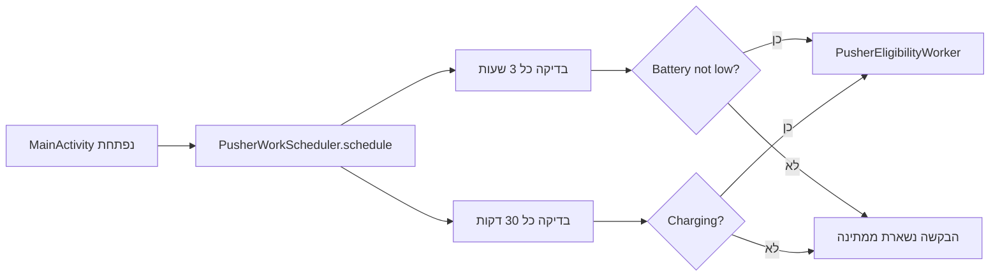

{: .box-note}
בפרק 14 הכפתור מסר בדיקת זכאות חד־פעמית. כעת נמסור את אותה יחידת עבודה בשתי תוכניות מחזוריות: פעם בשלוש שעות כאשר הסוללה אינה חלשה, ופעם ב־30 דקות כאשר המכשיר מחובר למטען.

[חזרה לפרק 14: בדיקת זכאות ראשונה עם WorkManager](/android/CollectCircles/14.collect-circles-first-worker)

{: .box-warning}
WorkManager אינו שעון מעורר מדויק. `30 minutes` פירושו **לפחות** 30 דקות בין הרצות. Android רשאית לדחות עבודה בגלל constraint,‏ Doze או אופטימיזציה של המערכת.

## מה נבנה?



שתי הבקשות מפנות לאותה מחלקת Worker. ההבדל הוא **מתי מותר** ל־WorkManager להפעיל אותה.

## 1. מפרידים בין Worker לבין WorkRequest

- `PusherEligibilityWorker` מגדיר **מה לעשות**: לקרוא התקדמות, לבדוק מחיר, ואולי לפרסם התראה.
- `PeriodicWorkRequest` מגדיר **מתי מותר לנסות**: מרווח זמן ו־constraints.
- `WorkManager` שומר ומתזמן את הבקשה באמצעות שירותי המערכת.

לפי [התיעוד הרשמי של periodic work](https://developer.android.com/develop/background-work/background-tasks/persistent/getting-started/define-work#schedule_periodic_work), המרווח הוא זמן מינימלי ולא מועד מדויק, והמרווח המחזורי הקטן ביותר שמותר הוא 15 דקות. לכן 30 דקות הוא ערך חוקי.

## 2. יוצרים מחלקת תזמון

בחלון **Android**, תחת `app > kotlin+java > com.example.collectcircles`, צרו **Java Class**
בשם `PusherWorkScheduler`:

```java
package com.example.collectcircles;

import android.content.Context;

import androidx.work.Constraints;
import androidx.work.ExistingPeriodicWorkPolicy;
import androidx.work.PeriodicWorkRequest;
import androidx.work.WorkManager;

import java.util.concurrent.TimeUnit;

public final class PusherWorkScheduler {

    private static final String BATTERY_WORK_NAME =
            "pusher_check_battery";
    private static final String CHARGING_WORK_NAME =
            "pusher_check_charging";

    private PusherWorkScheduler() {
    }

    public static void schedule(Context context) {
        WorkManager workManager = WorkManager.getInstance(context);

        PeriodicWorkRequest batteryRequest = createBatteryRequest();
        PeriodicWorkRequest chargingRequest = createChargingRequest();

        workManager.enqueueUniquePeriodicWork(
                BATTERY_WORK_NAME,
                ExistingPeriodicWorkPolicy.KEEP,
                batteryRequest
        );
        workManager.enqueueUniquePeriodicWork(
                CHARGING_WORK_NAME,
                ExistingPeriodicWorkPolicy.KEEP,
                chargingRequest
        );
    }

    private static PeriodicWorkRequest createBatteryRequest() {
        Constraints constraints = new Constraints.Builder()
                .setRequiresBatteryNotLow(true)
                .build();

        return new PeriodicWorkRequest.Builder(
                PusherEligibilityWorker.class,
                3,
                TimeUnit.HOURS
        )
                .setConstraints(constraints)
                .build();
    }

    private static PeriodicWorkRequest createChargingRequest() {
        Constraints constraints = new Constraints.Builder()
                .setRequiresCharging(true)
                .build();

        return new PeriodicWorkRequest.Builder(
                PusherEligibilityWorker.class,
                30,
                TimeUnit.MINUTES
        )
                .setConstraints(constraints)
                .build();
    }
}
```

המחלקה אינה Activity,‏ Service או Worker. היא רק בונה שתי בקשות ומוסרת אותן למנהל.

## 3. משווים בין שתי הבקשות

<div class="two-columns">
<div markdown="1" class="column">

### מסלול סוללה

```java
Constraints constraints = new Constraints.Builder()
        .setRequiresBatteryNotLow(true)
        .build();

return new PeriodicWorkRequest.Builder(
        PusherEligibilityWorker.class,
        3,
        TimeUnit.HOURS
)
        .setConstraints(constraints)
        .build();
```

- מרווח מינימלי: 3 שעות
- מותר כשהסוללה אינה חלשה
- אינו דורש מטען

</div>
<div markdown="1" class="column">

### מסלול מטען

```java
Constraints constraints = new Constraints.Builder()
        .setRequiresCharging(true)
        .build();

return new PeriodicWorkRequest.Builder(
        PusherEligibilityWorker.class,
        30,
        TimeUnit.MINUTES
)
        .setConstraints(constraints)
        .build();
```

- מרווח מינימלי: 30 דקות
- מותר רק בזמן טעינה
- מתאים לבדיקה תכופה יותר

</div>
</div>

אם המכשיר בטעינה והסוללה אינה חלשה, שני ה־constraints עשויים להיות נכונים. זו אינה תקלה: שתי התוכניות עצמאיות, ובשתיהן אותה התראה משתמשת באותו notification ID ולכן ההתראה החדשה מחליפה את הקודמת.

{: .box-note}
בפרק מאוחר יותר שער מערכת השעות יחליט אם זהו בכלל זמן מתאים להודעה. כרגע אנחנו בודקים רק את מנגנון התזמון.

## 4. מדוע משתמשים בשמות ייחודיים?

`schedule()` תיקרא בכל פתיחת Activity. בלי שם ייחודי, כל פתיחה הייתה מוסיפה עוד שתי תוכניות זהות:

<div class="two-columns">
<div markdown="1" class="column">

### enqueue רגיל — לא מתאים כאן

```java
workManager.enqueue(batteryRequest);
```

פתיחה ראשונה: תוכנית אחת<br>
פתיחה שנייה: שתי תוכניות<br>
פתיחה עשירית: עשר תוכניות

</div>
<div markdown="1" class="column">

### enqueue ייחודי

```java
workManager.enqueueUniquePeriodicWork(
        BATTERY_WORK_NAME,
        ExistingPeriodicWorkPolicy.KEEP,
        batteryRequest
);
```

כל הפתיחות מתייחסות לאותה תוכנית בשם `pusher_check_battery`.

</div>
</div>

`KEEP` אומר: אם כבר קיימת עבודה מחזורית פעילה בשם הזה, שמרו אותה ואל תחליפו אותה בבקשה חדשה. כך פתיחת המסך אינה מאפסת את הספירה ואינה יוצרת כפילויות.

[התיעוד הרשמי לניהול עבודה ייחודית](https://developer.android.com/develop/background-work/background-tasks/persistent/how-to/manage-work#unique-work) ממליץ על שמות ייחודיים כאשר צריך למנוע enqueue כפול של אותה משימה.

## 5. מפעילים את התזמון פעם בכל פתיחת process

ב־`MainActivity.onCreate`, לאחר טעינת `GameProgress`, הוסיפו:

```diff
 gameProgress = GameProgress.load(this);
+PusherWorkScheduler.schedule(this);
 bestTimeMillis = preferences.getLong(BEST_TIME_KEY, NO_BEST_TIME);
```

אין צורך להמתין לתוצאה. `schedule()` מוסרת את התוכניות ל־WorkManager, וה־Activity ממשיכה להיבנות.

<div class="two-columns">
<div markdown="1" class="column">

### חיי ה־Activity

```text
onCreate
onStart
onResume
...
onStop
onDestroy
```

המסך יכול להיסגר דקות לאחר התזמון.

</div>
<div markdown="1" class="column">

### חיי העבודה

```text
ENQUEUED
  ↓ כשהמרווח וה־constraint מאפשרים
RUNNING
  ↓ Result.success()
ENQUEUED למחזור הבא
```

העבודה נשמרת גם לאחר שה־Activity נהרסת.

</div>
</div>

## 6. מה קורה מאחורי הקלעים?

1. ה־UI thread קורא ל־`schedule()` ול־`enqueueUniquePeriodicWork()`.
2. WorkManager שומר את תיאור העבודה במסד הנתונים הפנימי שלו. הקריאה אינה מפעילה מיד את `doWork()` ואינה חוסמת עד להרצה.
3. Android בוחרת זמן מתאים לפי המרווח, מצב הסוללה, המטען ואופטימיזציות מערכת.
4. אם process היישום אינו קיים, המערכת יכולה ליצור אותו כדי ש־WorkManager יפעיל את ה־Worker.
5. `doWork()` רצה על thread רקע שמספק WorkManager.
6. בעבודה מחזורית, `Result.success()` מסיים את **המחזור הנוכחי**; הבקשה חוזרת למצב המתנה למחזור הבא.

{: .box-warning}
אין כאן thread שחי שלוש שעות ואין לולאה שעושה `sleep`. שמירת thread כזה הייתה מבזבזת משאבים ונשברת כאשר Android הורגת את process היישום. WorkManager שומר תיאור קטן של עבודה ומבקש מן המערכת להפעיל אותה מאוחר יותר.

### ומה לגבי Service?

אנחנו לא כותבים `Service`. WorkManager משתמש במנגנוני התזמון המתאימים של Android מאחורי API אחד. הקוד שלנו נשאר `Worker` קצר, שנועד להסתיים במהירות. עבודה ארוכה או מדויקת בזמן דורשת פתרון אחר; בדיקת כמה ערכים והתראה מתאימה בדיוק ל־WorkManager.

## 7. האם שני Workers יכולים לרוץ במקביל?

כן. תיאורטית מחזור של שלוש שעות ומחזור של 30 דקות יכולים להיות זכאים באותו זמן, ו־WorkManager רשאי להריץ יותר מעבודה אחת על executor הרקע שלו.

בשלב הזה `PusherEligibilityWorker` רק:

- יוצר snapshot חדש של `GameProgress` מתוך `SharedPreferences`;
- קורא יתרה ומחיר;
- מפרסם התראה.

הוא אינו מפחית יתרה, קונה Pusher או מסכם התקדמות אופליין. לכן שתי קריאות מקבילות אינן יכולות לאבד עדכון כלכלי. ייתכן ששתיהן יבקשו לפרסם, אך אותו notification ID גורם להתראה השנייה להחליף את הראשונה.

{: .box-warning}
כאשר נרצה שה־Worker גם יכתוב התקדמות אופליין, קריאה וכתיבה נפרדות כבר לא יספיקו. נצטרך להגן על פעולת read-modify-write כיחידה אחת. לא נוסיף כתיבה ברקע לפני שנסביר וניישם את התיאום הזה.

## 8. אילו הבטחות WorkManager אינו נותן?

- הוא אינו מבטיח הרצה בדיוק בכל `22:00`,‏ `22:30` וכן הלאה.
- constraint שהפך ללא־תקין יכול לדחות הרצה.
- Doze ואופטימיזציות יצרן יכולות לדחות עבודה נוספת.
- force-stop מפורש של היישום עוצר עבודות עד שהמשתמש מפעיל שוב את היישום.
- עבודה מחזורית אינה מיועדת לאנימציה, טיימר מסך או משחק שפועל 60 פעמים בשנייה.

הוא כן מתאים לעבודה שאפשר לדחות ושצריכה לשרוד יציאה מן המסך, כמו בדיקת זכאות קצרה.

## 9. בדיקה בלי להמתין שלוש שעות

1. הפעילו את היישום פעם אחת כדי ש־`schedule()` תיקרא.
2. בתפריט Android Studio בחרו **View → Tool Windows → App Inspection**.
3. בחלון שנפתח בחרו בלשונית **Background Task Inspector**, ואז בחרו למעלה את ה־emulator ואת process היישום `com.example.collectcircles`.
4. חפשו שתי שורות של `PusherEligibilityWorker`. בגרסת הפרק הבא נוסיף tags שיציגו במפורש `pusher_check_battery` ו־`pusher_check_charging`.
5. בדקו שלאחת מרווח של 3 שעות ו־Battery Not Low, ולשנייה 30 דקות ו־Charging.
6. סגרו ופתחו את ה־Activity שוב. מספר התוכניות צריך להישאר שתיים ולא לגדול.
7. לבדיקת ההתראה המיידית המשיכו להשתמש בכפתור **Check** מפרק 14; אין צורך להמתין למחזור אמיתי בכל שינוי קוד.

אם הלשונית ריקה, ודאו שהיישום עדיין רץ על emulator ב־API 26 ומעלה ושבחרתם את process היישום הנכון. WorkManager מציג כאן את שם מחלקת ה־Worker, לא בהכרח את השם הייחודי שנמסר ל־enqueue.

{: .box-note}
בדיקה במכשיר של זמן ההרצה המדויק אינה יציבה, מפני שדחייה היא התנהגות חוקית. בפרק הזה בודקים שהתוכניות, המרווחים וה־constraints נשמרו נכון.

הריצו פעם אחת:

```powershell
.\gradlew.bat testDebugUnitTest assembleDebug
```

{: .box-success}
למשחק יש כעת שתי תוכניות רקע עמידות שאינן מוכפלות בכל פתיחה. בפרק הבא נשמור מערכת שעות כ־JSON ונאפשר ל־Worker להטריד רק במהלך שיעורי מדעי המחשב.

[המשך לפרק 16: מערכת שעות ב־JSON](/android/CollectCircles/16.collect-circles-json-schedule)
