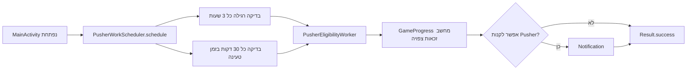

{: .box-note}
זהו מסלול חלופי ומקוצר לפרק 15. הוא מתחיל ישירות בסיום פרק 14, הופך את בדיקת הזכאות למחזורית וסוגר את נושא ה־WorkManager. אין צורך לבצע גם את פרק 15 הרגיל לפניו.

[חזרה לפרק 14: בדיקת זכאות ראשונה עם WorkManager](/android/CollectCircles/14.collect-circles-first-worker)

## מה נבנה?



כל רכיב מקבל תפקיד אחד:

- `PusherWorkScheduler` מחליט מתי מותר לבדוק.
- `GameProgress` מחשב את מצב המשחק הצפוי.
- `PusherEligibilityWorker` מציג notification כאשר קיימת זכאות.
- `MainActivity.onStart` נשאר המקום היחיד שמסכם ושומר התקדמות אופליין.

{: .box-warning}
WorkManager אינו שעון מדויק. 30 דקות או 3 שעות הן מרווחים מינימליים; Android רשאית לדחות עבודה בגלל מצב המכשיר, Doze או אופטימיזציות סוללה.

## 1. יוצרים מתזמן קטן

בחלון **Android**, תחת `app > kotlin+java > com.example.collectcircles`, צרו **Java Class** בשם `PusherWorkScheduler`:

```java
package com.example.collectcircles;

import android.content.Context;

import androidx.work.Constraints;
import androidx.work.ExistingPeriodicWorkPolicy;
import androidx.work.PeriodicWorkRequest;
import androidx.work.WorkManager;

import java.util.concurrent.TimeUnit;

public final class PusherWorkScheduler {

    private static final String BATTERY_WORK_NAME =
            "pusher_check_battery";
    private static final String CHARGING_WORK_NAME =
            "pusher_check_charging";

    /** Prevents creating objects from this utility class. */
    private PusherWorkScheduler() {
    }

    /**
     * Keeps one regular check and one charging check scheduled.
     *
     * @param context context used to access WorkManager
     */
    public static void schedule(Context context) {
        WorkManager workManager = WorkManager.getInstance(context);

        workManager.enqueueUniquePeriodicWork(
                BATTERY_WORK_NAME,
                ExistingPeriodicWorkPolicy.KEEP,
                createBatteryRequest()
        );
        workManager.enqueueUniquePeriodicWork(
                CHARGING_WORK_NAME,
                ExistingPeriodicWorkPolicy.KEEP,
                createChargingRequest()
        );
    }

    /** @return a regular check that avoids a low battery */
    private static PeriodicWorkRequest createBatteryRequest() {
        Constraints constraints = new Constraints.Builder()
                .setRequiresBatteryNotLow(true)
                .build();

        return new PeriodicWorkRequest.Builder(
                PusherEligibilityWorker.class,
                3,
                TimeUnit.HOURS
        )
                .setConstraints(constraints)
                .build();
    }

    /** @return a more frequent check that runs only while charging */
    private static PeriodicWorkRequest createChargingRequest() {
        Constraints constraints = new Constraints.Builder()
                .setRequiresCharging(true)
                .build();

        return new PeriodicWorkRequest.Builder(
                PusherEligibilityWorker.class,
                30,
                TimeUnit.MINUTES
        )
                .setConstraints(constraints)
                .build();
    }
}
```

ללא טעינה, רק הבקשה הרגילה יכולה לבדוק — וגם היא ממתינה אם הסוללה חלשה. בזמן טעינה מותרת גם הבדיקה התכופה. ייתכן ששתי הבקשות יהיו זכאיות באותו זמן, אבל הן מפעילות אותה בדיקה קצרה ומשתמשות באותו notification ID; הודעה חדשה מחליפה את הקודמת.

השמות הייחודיים ו־`KEEP` מונעים יצירת תוכנית נוספת בכל פתיחת Activity. אין כאן thread שממתין שלוש שעות ואין לולאת `sleep`;‏ WorkManager שומר את הבקשות ומפעיל אותן בזמן שהמערכת מאפשרת.

## 2. מחשבים זכאות עדכנית בלי לכתוב

ה־Worker של פרק 14 בדק רק יתרה שכבר נשמרה. בזמן שהיישום סגור ה־Pushers יכולים לצבור מספיק עיגולים, אף על פי שהיתרה השמורה תתעדכן רק בפתיחה הבאה.

לצורך notification אין צורך לשמור את ההתקדמות. ב־`GameProgress` הוסיפו פעולה שמחשבת תחזית זמנית:

```java
/**
 * Finds the next affordable Pusher as if offline progress were settled now.
 * This method does not change fields or SharedPreferences.
 *
 * @param nowMillis current wall-clock time, in milliseconds
 * @return next Pusher price, or -1 when the projected balance is too small
 */
public long getProjectedEligiblePusherPrice(long nowMillis) {
    long projectedBalance = circlesBalance;

    if (autonomousMode && pusherCount > 0) {
        long elapsedMillis = Math.max(
                0,
                nowMillis - lastProgressUpdateMillis
        );
        OfflineProgressCalculator.Result result =
                OfflineProgressCalculator.calculate(
                        elapsedMillis,
                        pusherCount,
                        fractionalProgress
                );
        projectedBalance = addWithSaturation(
                circlesBalance,
                result.getWholeCircles()
        );
    }

    long nextPusherPrice = getNextPusherPrice();
    return projectedBalance >= nextPusherPrice
            ? nextPusherPrice
            : -1;
}
```

הפעולה משתמשת בחישוב מפרק 13, אך אינה קוראת ל־`preferences.edit()` ואינה משנה שדה. כאשר המשתמש יפתח את היישום, `onStart` תחשב ותשמור את כל ההתקדמות עד רגע הפתיחה. התחזית של ה־Worker לא נשמרה, ולכן אין ספירה כפולה.

## 3. ה־Worker נשאר אחראי רק להתראה

ב־`PusherEligibilityWorker.doWork()` החליפו את בדיקת הזכאות:

```diff
 Context context = getApplicationContext();
 GameProgress progress = GameProgress.load(context);
+long eligiblePrice = progress.getProjectedEligiblePusherPrice(
+        System.currentTimeMillis()
+);
 
-if (progress.canBuyPusher() && Notifications.canShow(context)) {
+if (eligiblePrice >= 0 && Notifications.canShow(context)) {
     Notifications.showPusherAvailable(
             context,
-            progress.getNextPusherPrice()
+            eligiblePrice
     );
 }
 
 return Result.success();
```

המסלול נשאר קצר וברור:

```text
load snapshot → ask GameProgress for eligibility → maybe notify
```

ה־Worker אינו משנה יתרה, Lifetime, שבר או חותמת זמן. לכן אין כאן כותב נוסף לכלכלת המשחק ואין צורך ב־`synchronized`,‏ `volatile`,‏ lock משותף או `reload()` מיוחד.

## 4. מפעילים את התזמון

ב־`MainActivity.onCreate`, מיד לאחר טעינת `GameProgress`, הוסיפו:

```diff
 gameProgress = GameProgress.load(this);
+PusherWorkScheduler.schedule(this);
 bestTimeMillis = preferences.getLong(BEST_TIME_KEY, NO_BEST_TIME);
```

`schedule()` חוזרת מיד. WorkManager אחראי לשמור את שתי התוכניות ולהפעיל את ה־Worker על thread רקע כאשר המרווח וה־constraint מאפשרים זאת.

## 5. בדיקה וסיום

1. הפעילו Auto ודאגו שיש לפחות Pusher אחד.
2. השאירו את היתרה מעט מתחת למחיר הבא והעבירו את היישום לרקע.
3. פתחו **View → Tool Windows → App Inspection → Background Task Inspector** וודאו שקיימות שתי עבודות `PusherEligibilityWorker`.
4. ודאו שלאחת מרווח של 3 שעות ו־Battery Not Low, ולשנייה 30 דקות ו־Charging.
5. חברו מטען. בקשת הטעינה רשאית לבדוק בתדירות גבוהה יותר.
6. כאשר היתרה הצפויה עוברת את המחיר, אמורה להופיע התראה גם בלי פתיחה מחדש של היישום.
7. פתחו את היישום. `onStart` תשמור את ההתקדמות עד רגע הפתיחה.
8. לחצו על **Check** וודאו שהבדיקה החד־פעמית מפרק 14 עדיין עובדת ואינה משנה את היתרה.

הריצו פעם אחת:

```powershell
.\gradlew.bat testDebugUnitTest assembleDebug
```

{: .box-success}
אפשר לעצור כאן. המשחק משתמש ב־Worker מחזורי, בודק בתדירות גבוהה יותר בזמן טעינה ומודיע על Pusher זמין — בלי מערכת שעות ב־JSON ובלי כתיבה מיותרת לנתוני המשחק.

<details markdown="1"><summary>מה נשאר במסלול הארוך?</summary>

[פרק 15 הרגיל](/android/CollectCircles/15.collect-circles-periodic-work) ממשיך למסלול ההעמקה הקיים של מערכת שעות, JSON וסנכרון בין כמה כותבים. אין צורך לבצע אותו לאחר שסיימתם את 15b.

</details>
