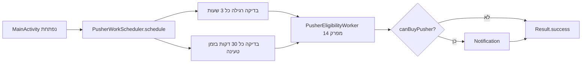
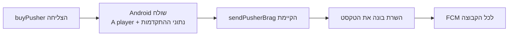

{: .box-note}
זהו מסלול חלופי ומקוצר לפרק 15. הוא מתחיל ישירות בסיום פרק 14, הופך את בדיקת הזכאות הקיימת למחזורית וסוגר את נושא ה־WorkManager. אין צורך לבצע גם את פרק 15 הרגיל לפניו.

[חזרה לפרק 14: בדיקת זכאות ראשונה עם WorkManager](/android/CollectCircles/14.collect-circles-first-worker)

## מה נבנה?



החלוקה נשארת פשוטה:

- `PusherWorkScheduler` מחליט מתי מותר לבדוק.
- `PusherEligibilityWorker` מבצע את בדיקת הזכאות הקיימת ומציג notification.
- `GameProgress` מחזיק את כלכלת המשחק ומחשב את הזכאות התיאורטית הנוכחית.
- `MainActivity.onStart` ממשיכה להיות המקום שמסכם ושומר התקדמות אופליין.

{: .box-warning}
WorkManager אינו שעון מדויק. המרווח המחזורי הקטן ביותר ש־`PeriodicWorkRequest` מאפשר הוא **15 דקות**. אם נזין ערך קטן יותר, למשל 3 דקות, WorkManager יעלה אותו אוטומטית ל־15 דקות. גם 30 דקות או 3 שעות הן מרווחים מינימליים בלבד; Android רשאית לדחות עבודה בגלל מצב המכשיר, Doze או אופטימיזציות סוללה.

{: .box-warning}
לכן אי אפשר לקצר את ההמתנה לבדיקה באמצעות מחזור של 3 דקות. לצורך בדיקה מיידית השתמשו בכפתור **Check** מפרק 14; לבדיקת התזמון המחזורי עצמו יש להמתין לפחות 15 דקות, כאשר כל ה־constraints מתקיימים.

## 1. יוצרים מתזמן קטן

בחלון **Android**, תחת `app > kotlin+java > com.example.collectcircles`, צרו **Java Class** בשם `PusherWorkScheduler`:

```java
package com.example.collectcircles;

import android.content.Context;

import androidx.work.Constraints;
import androidx.work.ExistingPeriodicWorkPolicy;
import androidx.work.PeriodicWorkRequest;
import androidx.work.WorkManager;

import java.util.concurrent.TimeUnit;

public final class PusherWorkScheduler {

    private static final String BATTERY_WORK_NAME =
            "pusher_check_battery";
    private static final String CHARGING_WORK_NAME =
            "pusher_check_charging";

    /** Prevents creating objects from this utility class. */
    private PusherWorkScheduler() {
    }

    /**
     * Keeps one regular check and one charging check scheduled.
     *
     * @param context context used to access WorkManager
     */
    public static void schedule(Context context) {
        WorkManager workManager = WorkManager.getInstance(context);

        workManager.enqueueUniquePeriodicWork(
                BATTERY_WORK_NAME,
                ExistingPeriodicWorkPolicy.KEEP,
                createBatteryRequest()
        );
        workManager.enqueueUniquePeriodicWork(
                CHARGING_WORK_NAME,
                ExistingPeriodicWorkPolicy.KEEP,
                createChargingRequest()
        );
    }

    /** @return a regular check that avoids a low battery */
    private static PeriodicWorkRequest createBatteryRequest() {
        Constraints constraints = new Constraints.Builder()
                .setRequiresBatteryNotLow(true)
                .build();

        return new PeriodicWorkRequest.Builder(
                PusherEligibilityWorker.class,
                3,
                TimeUnit.HOURS
        )
                .setConstraints(constraints)
                .build();
    }

    /** @return a more frequent check that runs only while charging */
    private static PeriodicWorkRequest createChargingRequest() {
        Constraints constraints = new Constraints.Builder()
                .setRequiresCharging(true)
                .build();

        return new PeriodicWorkRequest.Builder(
                PusherEligibilityWorker.class,
                15,
                TimeUnit.MINUTES
        )
                .setConstraints(constraints)
                .build();
    }
}
```

ללא טעינה, רק הבקשה הרגילה יכולה לבדוק — וגם היא ממתינה אם הסוללה חלשה. בזמן טעינה מותרת גם הבדיקה התכופה. ייתכן ששתי הבקשות יהיו זכאיות באותו זמן, אבל הן מפעילות אותה בדיקה קצרה ומשתמשות באותו notification ID; הודעה חדשה מחליפה את הקודמת.

השמות הייחודיים ו־`KEEP` מונעים יצירת תוכנית נוספת בכל פתיחת Activity. אין כאן thread שממתין שלוש שעות ואין לולאת `sleep`;‏ WorkManager שומר את הבקשות ומפעיל אותן בזמן שהמערכת מאפשרת.

## 2. מלמדים את `canBuyPusher()` לחשב את המצב הנוכחי

ה־Worker כבר שואל את `GameProgress` אם אפשר לקנות Pusher. נשאיר את אותה שאלה ואת אותו API, ונשפר רק את התשובה של `canBuyPusher()`:

    
/**
- * Checks whether the saved balance can cover the next Pusher's price.
+ * Checks whether the balance, including theoretical offline progress,
+ * can cover the next Pusher's price.
 *
- * @return true when the saved balance is large enough
+ * @return true when the theoretical current balance is large enough
 */
public boolean canBuyPusher() {
-    return circlesBalance >= getNextPusherPrice();
+    long projectedBalance = circlesBalance;
+
+    if (autonomousMode && pusherCount > 0) {
+        long elapsedMillis = Math.max(
+                0,
+                System.currentTimeMillis() - lastProgressUpdateMillis
+        );
+        OfflineProgressCalculator.Result result =
+                OfflineProgressCalculator.calculate(
+                        elapsedMillis,
+                        pusherCount,
+                        fractionalProgress
+                );
+        projectedBalance = addWithSaturation(
+                circlesBalance,
+                result.getWholeCircles()
+        );
+    }
+
+    return projectedBalance >= getNextPusherPrice();
}
    

הפעולה מחשבת כמה עיגולים שלמים היו מתווספים אילו המשתמש פתח עכשיו את היישום. היא משתמשת באותו `OfflineProgressCalculator` מפרק 13, אבל אינה משנה שדה ואינה קוראת ל־`preferences.edit()`.

כאשר המשתמש באמת פותח את היישום, `MainActivity.onStart` עדיין קוראת ל־`settleOfflineProgress()` ושומרת את התוצאה. חישוב הזכאות הקודם היה תחזית בלבד, ולכן אין ספירה כפולה.

## 3. מפעילים את התזמון

ב־`MainActivity.onCreate`, מיד לאחר טעינת `GameProgress`, הוסיפו:

```diff
 gameProgress = GameProgress.load(this);
+PusherWorkScheduler.schedule(this);
 bestTimeMillis = preferences.getLong(BEST_TIME_KEY, NO_BEST_TIME);
```

`schedule()` חוזרת מיד. WorkManager אחראי לשמור את שתי התוכניות ולהפעיל את ה־Worker על thread רקע כאשר המרווח וה־constraint מאפשרים זאת.


## מצב לאחר סעיף 3

{: .box-success}

בשלב זה אמורים לקבל notification על זמינות רכש חדש גם כשהאפליקציה לא פעילה אם צברנו מספיק, (כל עוד הרצנו אותה מאז ה-reboot האחרון).

## 4. סוגרים במשהו שרואים: Brag לאחר קנייה

ה־Worker המחזורי עוסק רק בתזכורת מקומית. כעת נחזור לרגע ל־Firebase מפרק 6: כאשר קנייה מצליחה, נשלח אירוע קטן לפונקציה של המורה והיא תודיע לכל המנויים שמישהו קנה Pusher.



לא נוסיף שם שחקן או מסך נוסף. ההודעה תהיה אנונימית, למשל: `A player now employs 3 pushers after collecting 240 circles.` כך נקבל סיום חברתי בכמות קוד קטנה.

### א. מוסיפים טקסטים ופעולת שליחה

ב־`strings.xml` הוסיפו:

```xml
<string name="brag_sent">Brag sent!</string>
<string name="brag_failed">Pusher hired, but the brag could not be sent</string>
```

ב־`MainActivity` הוסיפו imports:

```java
import java.util.HashMap;
import java.util.Map;
```

`FirebaseFunctions` כבר נמצא בפרויקט מפרק 6. הוסיפו ל־`MainActivity`:

```java
/** Sends the latest Pusher achievement to the teacher-owned function. */
private void sendPusherBrag() {
    Map<String, Object> data = new HashMap<>();
    data.put("name", "A player");
    data.put("pusherCount", gameProgress.getPusherCount());
    data.put("lifetimeCircles", gameProgress.getLifetimeCircles());

    FirebaseFunctions.getInstance()
            .getHttpsCallable("sendPusherBrag")
            .call(data)
            .addOnCompleteListener(task -> {
                int message = task.isSuccessful()
                        ? R.string.brag_sent
                        : R.string.brag_failed;
                Toast.makeText(
                        this,
                        message,
                        Toast.LENGTH_SHORT
                ).show();
            });
}
```

אנחנו משתמשים ב־`sendPusherBrag` שכבר נכתבה ופורסמה עבור ה־tutorial. הפונקציה הקיימת דורשת גם `name`, ולכן המסלול הקצר שולח את הערך הקבוע `A player` במקום להוסיף מסך להזנת שם. הלקוח אינו שולח title,‏ body או topic.

### ב. שולחים רק לאחר קנייה מוצלחת

בתוך ה־listener של כפתור הקנייה, הוסיפו קריאה אחת:

```diff
 if (gameProgress.buyPusher()) {
     showProgress();
     // Sync the active board with the updated saved Pusher count.
     binding.gameBoard.setPusherCount(gameProgress.getPusherCount());
     Toast.makeText(this, R.string.pusher_hired, Toast.LENGTH_SHORT).show();
+    sendPusherBrag();
     dialog.dismiss();
 }
```

הקנייה המקומית מתבצעת לפני קריאת הרשת. אם השליחה נכשלת, ה־Pusher נשאר בבעלות המשתמש; הודעת Brag אינה סיבה לבטל קנייה תקינה.

### ג. מציגים את טקסט השרת גם כשהיישום בחזית

ב־`Notifications` הוסיפו מזהה ופעולה כללית להתראה שמגיעה מן השרת:

```java
private static final int REMOTE_NOTIFICATION_ID = 3;

/**
 * Shows notification text supplied by the trusted classroom function.
 *
 * @param context context used to access NotificationManager
 * @param title notification title supplied through FCM
 * @param body notification body supplied through FCM
 */
public static void showRemote(
        Context context,
        String title,
        String body
) {
    createChannel(context);
    NotificationManager manager = context.getSystemService(
            NotificationManager.class
    );
    Notification notification = new Notification.Builder(
            context,
            CHANNEL_ID
    )
            .setSmallIcon(R.drawable.ic_launcher_foreground)
            .setContentTitle(title)
            .setContentText(body)
            .setAutoCancel(true)
            .build();
    manager.notify(REMOTE_NOTIFICATION_ID, notification);
}
```

ב־`CircleMessagingService.onMessageReceived()` החליפו:

```diff
 if (message.getNotification() != null) {
-    Notifications.show(this);
+    Notifications.showRemote(
+            this,
+            message.getNotification().getTitle(),
+            message.getNotification().getBody()
+    );
 }
```

כשהיישום ברקע, Android מציגה notification payload בעצמה. כשהיישום בחזית, השירות מקבל אותו ומציג את אותו title ו־body דרך `showRemote()`.

{: .box-note}
אין צורך להוסיף או לפרסם Cloud Function חדשה. גם `Invite` וגם `Check` אינם תנאי לשליחת ה־Brag: ההרשמה ל־topic מתבצעת ב־`onCreate`, והקנייה קוראת ישירות ל־`sendPusherBrag` הקיימת.

## 5. בדיקה וסיום

1. הפעילו Auto ודאגו שיש לפחות Pusher אחד.
2. השאירו את היתרה מעט מתחת למחיר הבא והעבירו את היישום לרקע.
3. פתחו **View → Tool Windows → App Inspection → Background Task Inspector** וודאו שקיימות שתי עבודות `PusherEligibilityWorker`.
4. ודאו שלאחת מרווח של 3 שעות ו־Battery Not Low, ולשנייה 30 דקות ו־Charging.
5. חברו מטען. בקשת הטעינה רשאית לבצע את אותה בדיקה בתדירות גבוהה יותר.
6. לאחר שחלף מספיק זמן תיאורטי לרכישה, הפעילו את ה־Worker דרך כלי הבדיקה. אמורה להופיע התראה אף שהיתרה החדשה טרם נשמרה.
7. פתחו שוב את היישום וודאו ש־`onStart` שומרת את התקדמות האופליין פעם אחת בלבד.
8. קנו Pusher ובדקו שמופיע Toast על שליחת ה־Brag.
9. ודאו שמכשיר נוסף שמנוי ל־topic מקבל את הודעת הקנייה. בדקו גם פעם כשהיישום המקבל בחזית.

הריצו פעם אחת:

```powershell
.\gradlew.bat testDebugUnitTest assembleDebug
```

{: .box-success}
אפשר לעצור כאן. המשחק משתמש באותו Worker מפרק 14 בשתי תוכניות מחזוריות, מתחשב במצב הסוללה והטעינה וחוגג קניית Pusher עם כל הקבוצה — בלי מערכת שעות ב־JSON ובלי להוסיף ל־Worker אחריות על נתוני המשחק.

<details markdown="1"><summary>מה נשאר במסלול הארוך?</summary>

- [פרק 15 הרגיל](/android/CollectCircles/15.collect-circles-periodic-work) ממשיך למסלול ההעמקה הקיים של מערכת שעות, JSON וסנכרון בין כמה כותבים. פרק 18 מוסיף גרסת Brag עשירה יותר עם שם שחקן. אין צורך לבצע אותם לאחר שסיימתם את 15b.

- [SQL with requery](/android/sqlite/01.requery-student)

</details>

<!-- gemini-tutor-links:start -->
<div markdown="1" class="hebrew">

## מורה־עזר ב־Gemini

{: .box-note}
[פתחו את Gem: מאמן רקע CollectCircles](https://gemini.google.com/gem/1QiC7WZPzbDpNaSbBjiX_Y8JqusBIXwQG?usp=sharing) כדי לקבל רמזים, שאלות אבחון והסברים המתאימים לשלב שבו אתם נמצאים.

</div>
<!-- gemini-tutor-links:end -->
