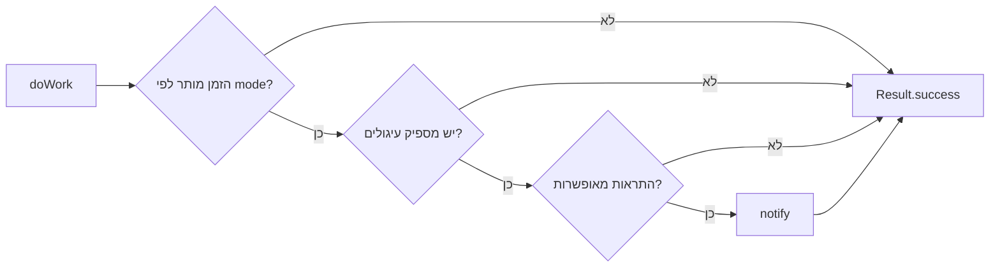

{: .box-note}
שתי התוכניות המחזוריות כבר יודעות מתי הסוללה מאפשרת עבודה. כעת נוסיף שער שני: תוכנית הסוללה תודיע רק בשיעורי מדעי המחשב המדויקים, ואילו תוכנית המטען תוכל לבדוק כל 15 דקות בין 08:00 ל־24:00 בכל יום.

[חזרה לפרק 15: עבודה מחזורית עם אילוצי סוללה](/android/CollectCircles/15.collect-circles-periodic-work)

## המדיניות המדויקת

<div class="two-columns">
<div markdown="1" class="column">

### ללא דרישת מטען

- Worker כל 3 שעות
- constraint: הסוללה אינה חלשה
- הודעה מותרת רק בשיעורים:
  - ראשון 15:50–17:15
  - שני 08:15–12:10
  - שלישי 13:40–17:15

</div>
<div markdown="1" class="column">

### בזמן טעינה

- Worker כל 15 דקות
- constraint: המכשיר בטעינה
- הודעה מותרת בכל יום:
  - 08:00–24:00

</div>
</div>

{: .box-warning}
החלון 08:00–24:00 מסתיים בחצות ואינו כולל את 00:00 של היום הבא. בקוד נשתמש בכלל `start <= now < end`: ההתחלה כלולה והסיום אינו כלול.

## 1. מוסיפים קובץ JSON אמיתי לפרויקט

בחלון **Android**, תחת `app > res`, צרו **Android Resource Directory** מסוג `raw`. לאחר
מכן צרו בתיקייה `app > res > raw` את הקובץ `notification_schedule.json`:

```json
{
  "lessonWindows": [
    { "day": "SUNDAY", "start": "15:50", "end": "17:15" },
    { "day": "MONDAY", "start": "08:15", "end": "12:10" },
    { "day": "TUESDAY", "start": "13:40", "end": "17:15" }
  ],
  "chargingWindow": {
    "start": "08:00",
    "end": "24:00"
  }
}
```

זהו מקור ברירת המחדל שנשמר ב־Git וקל לקרוא או לשנות. בשמות הימים משתמשים בערכי `DayOfWeek` באנגלית כדי שהקוד לא יהיה תלוי בשפת המכשיר.

## 2. מעתיקים את JSON אל SharedPreferences

תחת `app > kotlin+java > com.example.collectcircles` צרו **Java Class** בשם
`NotificationSchedule` והתחילו בקבועים:

```java
package com.example.collectcircles;

import android.content.Context;
import android.content.SharedPreferences;

import org.json.JSONArray;
import org.json.JSONException;
import org.json.JSONObject;

import java.io.InputStream;
import java.time.DayOfWeek;
import java.time.Instant;
import java.time.ZoneId;
import java.time.ZonedDateTime;
import java.util.Scanner;

public final class NotificationSchedule {

    public static final String LESSON_MODE = "lessons";
    public static final String CHARGING_MODE = "charging";

    private static final String SCHEDULE_KEY = "notification_schedule_json";

    private NotificationSchedule() {
    }
}
```

הוסיפו את פעולות הטעינה:

```java
public static void ensureStored(Context context) {
    getJson(context);
}

private static String getJson(Context context) {
    SharedPreferences preferences = context.getSharedPreferences(
            GameProgress.PREFERENCES_NAME,
            Context.MODE_PRIVATE
    );
    String storedJson = preferences.getString(SCHEDULE_KEY, null);
    if (storedJson != null) {
        return storedJson;
    }

    String defaultJson = readDefaultJson(context);
    preferences.edit()
            .putString(SCHEDULE_KEY, defaultJson)
            .apply();
    return defaultJson;
}

private static String readDefaultJson(Context context) {
    InputStream input = context.getResources().openRawResource(
            R.raw.notification_schedule
    );
    try (Scanner scanner = new Scanner(input).useDelimiter("\\A")) {
        return scanner.hasNext() ? scanner.next() : "{}";
    }
}
```

בפעם הראשונה קוראים את המשאב הקטן ומעתיקים אותו ל־SharedPreferences. מהפעם השנייה `getJson()` מחזירה את העותק השמור.

{: .box-note}
ה־JSON נשמר כהגדרה ולא כמצב משחק. לכן אפשר בעתיד לבנות מסך עריכה או להוריד מערכת שעות חדשה ולשמור אותה תחת אותו מפתח, בלי לשנות את קוד הבדיקה.

## 3. בודקים חלון זמן

הוסיפו ל־`NotificationSchedule`:

```java
private static boolean isInsideWindow(
        int currentMinutes,
        String start,
        String end
) {
    int startMinutes = parseMinutes(start);
    int endMinutes = parseMinutes(end);

    if (startMinutes <= endMinutes) {
        return currentMinutes >= startMinutes
                && currentMinutes < endMinutes;
    }
    return currentMinutes >= startMinutes
            || currentMinutes < endMinutes;
}

private static int parseMinutes(String time) {
    String[] parts = time.split(":");
    if (parts.length != 2) {
        throw new IllegalArgumentException("Time must be HH:mm");
    }

    int hour = Integer.parseInt(parts[0]);
    int minute = Integer.parseInt(parts[1]);
    if (hour == 24 && minute == 0) {
        return 24 * 60;
    }
    if (hour < 0 || hour > 23 || minute < 0 || minute > 59) {
        throw new IllegalArgumentException("Invalid time: " + time);
    }
    return hour * 60 + minute;
}
```

`LocalTime.parse("24:00")` אינו מקבל את סימון סוף היום, ולכן אנחנו ממירים שעות לדקות בעצמנו. `24:00` הופך ל־`1440`.

הענף השני ב־`isInsideWindow` תומך גם בחלון עתידי שחוצה חצות, למשל `22:00–02:00`.

## 4. בוחרים את השער לפי מצב העבודה

הוסיפו את הפעולה הציבורית:

```java
public static boolean allows(
        Context context,
        String mode,
        long nowMillis
) {
    ZonedDateTime now = Instant.ofEpochMilli(nowMillis)
            .atZone(ZoneId.systemDefault());

    try {
        JSONObject schedule = new JSONObject(getJson(context));
        if (CHARGING_MODE.equals(mode)) {
            return allowsCharging(schedule, now);
        }
        if (LESSON_MODE.equals(mode)) {
            return allowsLesson(schedule, now);
        }
    } catch (JSONException | IllegalArgumentException exception) {
        return false;
    }
    return false;
}
```

והוסיפו את שני המסלולים:

<div class="two-columns">
<div markdown="1" class="column">

### שער שיעורים

```java
private static boolean allowsLesson(
        JSONObject schedule,
        ZonedDateTime now
) throws JSONException {
    JSONArray windows = schedule.getJSONArray(
            "lessonWindows"
    );
    for (int i = 0; i < windows.length(); i++) {
        JSONObject window = windows.getJSONObject(i);
        DayOfWeek day = DayOfWeek.valueOf(
                window.getString("day")
        );
        if (now.getDayOfWeek() == day
                && isInsideWindow(
                        minutesOfDay(now),
                        window.getString("start"),
                        window.getString("end")
                )) {
            return true;
        }
    }
    return false;
}
```

</div>
<div markdown="1" class="column">

### שער טעינה

```java
private static boolean allowsCharging(
        JSONObject schedule,
        ZonedDateTime now
) throws JSONException {
    JSONObject window = schedule.getJSONObject(
            "chargingWindow"
    );
    return isInsideWindow(
            minutesOfDay(now),
            window.getString("start"),
            window.getString("end")
    );
}
```

</div>
</div>

לשניהם דרושה פעולת עזר:

```java
private static int minutesOfDay(ZonedDateTime time) {
    return time.getHour() * 60 + time.getMinute();
}
```

אם JSON פגום, יום אינו חוקי או שעה אינה תקינה, `allows()` מחזירה `false`. זוהי התנהגות **fail closed**: עדיף להחמיץ התראה מאשר להטריד מחוץ לחלון שהוגדר.

## 5. מצרפים mode לכל WorkRequest

ב־`PusherWorkScheduler` הוסיפו:

```java
import androidx.work.Data;
```

ושדה שמשותף ל־Scheduler ול־Worker:

```java
static final String SCHEDULE_MODE_KEY = "schedule_mode";
```

בתחילת `schedule()` ודאו שברירת המחדל נשמרה:

```java
NotificationSchedule.ensureStored(context);
```

<div class="two-columns">
<div markdown="1" class="column">

### בקשת הסוללה

```java
Data input = new Data.Builder()
        .putString(
                SCHEDULE_MODE_KEY,
                NotificationSchedule.LESSON_MODE
        )
        .build();

return new PeriodicWorkRequest.Builder(
        PusherEligibilityWorker.class,
        3,
        TimeUnit.HOURS
)
        .setConstraints(constraints)
        .setInputData(input)
        .addTag(BATTERY_WORK_NAME)
        .build();
```

</div>
<div markdown="1" class="column">

### בקשת המטען

```java
Data input = new Data.Builder()
        .putString(
                SCHEDULE_MODE_KEY,
                NotificationSchedule.CHARGING_MODE
        )
        .build();

return new PeriodicWorkRequest.Builder(
        PusherEligibilityWorker.class,
        15,
        TimeUnit.MINUTES
)
        .setConstraints(constraints)
        .setInputData(input)
        .addTag(CHARGING_WORK_NAME)
        .build();
```

</div>
</div>

`Data` היא חבילת קלט קטנה שנשמרת יחד עם בקשת העבודה. אין כאן קריאה לפונקציה של Worker ואין אובייקט Java משותף שחייב להישאר בזיכרון. ה־tag אינו משנה את התזמון; הוא מאפשר לזהות ב־Background Task Inspector איזו משתי השורות היא בדיקת הסוללה ואיזו בדיקת המטען, אף ששתיהן מפעילות את אותה מחלקת Worker.

## 6. מעדכנים עבודה שכבר נשמרה

בפרק 15 השתמשנו ב־`KEEP`. אבל במכשיר כבר קיימת תוכנית טעינה של 30 דקות; `KEEP` ישאיר אותה ללא שינוי ויתעלם מן הבקשה החדשה של 15 דקות.

החליפו בשתי קריאות ה־enqueue:

```diff
-ExistingPeriodicWorkPolicy.KEEP,
+ExistingPeriodicWorkPolicy.UPDATE,
```

`UPDATE` מעדכן את המפרט של עבודה בעלת אותו שם בלי ליצור עותק נוסף. לפי [התיעוד הרשמי](https://developer.android.com/reference/androidx/work/ExistingPeriodicWorkPolicy#UPDATE), הוא שומר את זמן ה־enqueue המקורי; אם Worker כבר רץ, הריצה הנוכחית ממשיכה עם המפרט הישן והעדכון חל במחזור הבא.

כך ההתקנה הקיימת מקבלת גם את המרווח החדש וגם את `schedule_mode`.

## 7. ה־Worker בודק את השער לפני הזכאות

בתחילת `doWork()` הוסיפו:

```java
String scheduleMode = getInputData().getString(
        PusherWorkScheduler.SCHEDULE_MODE_KEY
);
if (scheduleMode != null
        && !NotificationSchedule.allows(
                context,
                scheduleMode,
                System.currentTimeMillis()
        )) {
    return Result.success();
}
```

הפעולה המלאה בנויה כעת משלושה שערים:



עבור כפתור **Check** מפרק 14 אין `schedule_mode`, ולכן הוא נשאר בדיקה ידנית שאינה תלויה בשעה. רק שתי הבקשות המחזוריות מקבלות mode ונחסמות מחוץ לחלון שלהן.

## 8. threads, אחסון וזמן

- `schedule()` נקראת ב־UI thread. קריאת משאב ה־JSON מתרחשת רק בפעם הראשונה, והקובץ זעיר ומקומי; אין רשת. בפרויקט גדול היינו מעבירים גם I/O מקומי משמעותי מן ה־UI thread.
- `enqueueUniquePeriodicWork()` מוסרת תיאור עבודה וחוזרת; היא אינה ממתינה 15 דקות ואינה מחזיקה thread ישן.
- `doWork()` וקריאת ה־JSON מ־SharedPreferences מתרחשות ב־thread הרקע שמספק WorkManager.
- `System.currentTimeMillis()` הוא שעון קיר. אנחנו ממירים אותו ל־`ZoneId.systemDefault()`, ולכן שינוי אזור הזמן במכשיר משנה מיד את חלון ההודעה המקומי.
- `SharedPreferences.apply()` מעדכן את הזיכרון מיד וכותב לדיסק באופן אסינכרוני.

### האם ה־JSON יכול להשתנות בזמן שה־Worker קורא אותו?

`SharedPreferences` מחזיר לכל קריאה ערך `String` שלם; Worker אינו קורא חצי מחרוזת. אם בעתיד מסך הגדרות ישמור JSON חדש במקביל, Worker מסוים ישתמש בגרסה שקיבל באותה קריאה, וההרצה הבאה תראה את הגרסה החדשה.

אין צורך ב־lock בשלב הזה, מפני שה־Worker עדיין אינו משנה את יתרת העיגולים. עדכון JSON שלם אינו פעולת read-modify-write על הכלכלה.

## 9. מגבלה חשובה של חלון השיעור

ה־Worker של הסוללה נבדק רק בערך פעם בשלוש שעות, ואילו חלק מחלונות השיעור קצרים משלוש שעות. WorkManager עלול להריץ אותו לפני השיעור ואחריו, בלי הרצה בתוך החלון. ה־JSON מונע הודעות בזמן שגוי, אך אינו מבטיח שתתקבל הודעה בכל שיעור.

המסלול המחובר למטען פועל כל 15 דקות בחלון הרחב ולכן קל יותר לבדיקה ומקטין מאוד את הסיכוי להחמיץ ערב לימודים. אם נרצה בעתיד התראה מדויקת בתחילת כל שיעור, נלמד לתזמן OneTimeWorkRequest מחושב או נשקול AlarmManager — עם מגבלות הסוללה וההרשאות שלו.

## 10. בדיקה ידנית

1. חברו את המכשיר למטען ופתחו את היישום בין 08:00 ל־24:00. פתיחה זו מעדכנת את העבודה הקיימת מ־30 ל־15 דקות.
2. ב־Background Task Inspector ייתכן ששתי השורות ייקראו `PusherEligibilityWorker`. בחרו שורה ובדקו את ה־tag ב־Work Details כדי לזהות אותה.
3. ודאו של־tag‏ `pusher_check_charging` יש מרווח 15 דקות, constraint של Charging ו־input בשם `schedule_mode` שערכו `charging`.
4. ודאו של־tag‏ `pusher_check_battery` נשאר מרווח 3 שעות, Battery Not Low ו־mode בשם `lessons`.
5. אם יש זכאות ל־Pusher הבא, אפשר להשאיר את המכשיר בטעינה ולבדוק אם ההתראה מגיעה במחזור מתאים. גם 15 דקות הן מינימום, ולכן דחייה נוספת חוקית.
6. לחצו **Check** כדי לוודא מיד שמנגנון הזכאות וההתראה עדיין עובד ללא תלות בשעה.
7. לצורך בדיקת גבולות, אפשר לערוך זמנית את JSON ב־SharedPreferences דרך debugger או לנקות את נתוני היישום ולקבוע בקובץ raw חלון קצר סביב השעה הנוכחית.

{: .box-warning}
ניקוי נתוני היישום מוחק גם את היתרה, מספר ה־Pushers והשיא. עשו זאת רק במכשיר בדיקה או השתמשו ב־debugger לעריכת מפתח המערכת.

הריצו פעם אחת:

```powershell
.\gradlew.bat testDebugUnitTest assembleDebug
```

{: .box-success}
ההתראות המחזוריות כפופות כעת למדיניות שאפשר לקרוא ולשנות כ־JSON: שעות שיעור מדויקות במסלול הסוללה, וחלון יומי רחב במסלול הטעינה.

[המשך לפרק 17: כתיבה בטוחה מן ה־Worker](/android/CollectCircles/17.collect-circles-worker-settlement)

<!-- gemini-tutor-links:start -->
<div markdown="1" dir="rtl">

## מורה־עזר ב־Gemini

{: .box-note}
[פתחו את Gem: מאמן רקע CollectCircles](https://gemini.google.com/gem/1QiC7WZPzbDpNaSbBjiX_Y8JqusBIXwQG?usp=sharing) כדי לקבל רמזים, שאלות אבחון והסברים המתאימים לשלב שבו אתם נמצאים.

</div>
<!-- gemini-tutor-links:end -->
