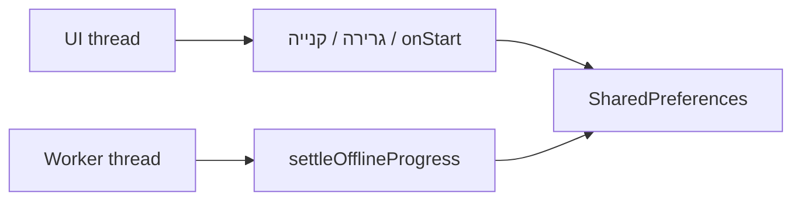
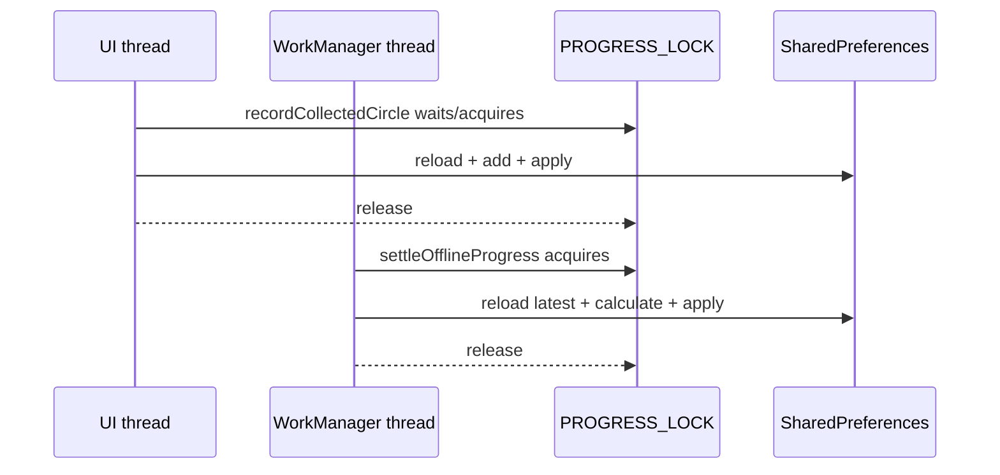

{: .box-note}
עד עכשיו ה־Worker רק קרא את היתרה. לכן הוא לא היה יכול להודיע שה־Pushers עברו את מחיר הקנייה בזמן שהיישום נשאר סגור. בפרק הזה הוא יסכם את הייצור האופליין לפני בדיקת הזכאות — אבל רק לאחר שנגן על הנתונים מפני שני כותבים שפועלים במקביל.

[חזרה לפרק 16: מערכת שעות ב־JSON](/android/CollectCircles/16.collect-circles-json-schedule)

## הבעיה: שתי דרכי כתיבה לאותה כלכלה



`SharedPreferences` מאפשר קריאות וכתיבות מכמה threads, אבל רצף של **קרא → חשב → כתוב** אינו הופך אוטומטית לפעולה אחת.

לדוגמה:

```text
balance = 100

UI reads 100
Worker reads 100
UI adds 1 and writes 101
Worker adds 20 and writes 120

final balance = 120, although it should be 121
```

זהו lost update. שום שורה בודדת אינה שבורה; השילוב בין שני צירי הזמן שובר את התוצאה.

## 1. מוסיפים lock אחד לכל מופעי GameProgress

ב־`GameProgress` הוסיפו:

```java
private static final Object PROGRESS_LOCK = new Object();
```

ה־lock הוא `static`, ולכן גם ה־`GameProgress` של ה־Activity וגם אובייקט חדש שה־Worker טוען משתמשים באותו מנעול בתוך process היישום.

{: .box-warning}
`synchronized (this)` לא היה מספיק. לכל אחד משני האובייקטים יש `this` אחר, ולכן שני threads עדיין היו יכולים להיכנס בו־זמנית.

## 2. טוענים snapshot טרי בתוך הנעילה

העבירו את כל הקריאות מן הבנאי לפעולה חדשה:

<div class="two-columns">
<div markdown="1" class="column">

### לפני

```java
public GameProgress(SharedPreferences preferences) {
    this.preferences = preferences;
    circlesBalance = preferences.getLong(
            CIRCLES_BALANCE_KEY,
            0
    );
    // load the remaining fields...
}
```

</div>
<div markdown="1" class="column">

### אחרי

```java
public GameProgress(SharedPreferences preferences) {
    this.preferences = preferences;
    reload();
}

private void reload() {
    circlesBalance = preferences.getLong(
            CIRCLES_BALANCE_KEY,
            0
    );
    lifetimeCircles = preferences.getLong(
            LIFETIME_CIRCLES_KEY,
            0
    );
    pusherCount = preferences.getInt(
            PUSHER_COUNT_KEY,
            0
    );
    autonomousMode = preferences.getBoolean(
            AUTONOMOUS_MODE_KEY,
            false
    );
    lastProgressUpdateMillis = preferences.getLong(
            LAST_PROGRESS_UPDATE_KEY,
            System.currentTimeMillis()
    );
    fractionalProgress = Double.longBitsToDouble(
            preferences.getLong(
                    FRACTIONAL_PROGRESS_KEY,
                    Double.doubleToRawLongBits(0)
            )
    );
}
```

</div>
</div>

יצירת האובייקט עדיין טוענת מצב מיד. ההבדל הוא שכעת כל פעולת שינוי יכולה לקרוא שוב את הערכים העדכניים **לאחר** שקיבלה את ה־lock.

## 3. עוטפים פעולות read-modify-write

שנו את `recordCollectedCircles`:

<div class="two-columns">
<div markdown="1" class="column">

### לפני

```java
circlesBalance = addWithSaturation(
        circlesBalance,
        count
);
lifetimeCircles = addWithSaturation(
        lifetimeCircles,
        count
);
preferences.edit()
        .putLong(CIRCLES_BALANCE_KEY, circlesBalance)
        .putLong(LIFETIME_CIRCLES_KEY, lifetimeCircles)
        .apply();
```

</div>
<div markdown="1" class="column">

### אחרי

```java
synchronized (PROGRESS_LOCK) {
    reload();
    circlesBalance = addWithSaturation(
            circlesBalance,
            count
    );
    lifetimeCircles = addWithSaturation(
            lifetimeCircles,
            count
    );
    preferences.edit()
            .putLong(
                    CIRCLES_BALANCE_KEY,
                    circlesBalance
            )
            .putLong(
                    LIFETIME_CIRCLES_KEY,
                    lifetimeCircles
            )
            .apply();
}
```

</div>
</div>

השתמשו באותו מבנה גם בפעולות הבאות:

- `buyPusher()`
- `setAutonomousMode(...)`
- `settleOfflineProgress(...)`
- `markBackgroundStarted(...)`
- בדיקת הזכאות — כדי שה־Worker יקבל snapshot עדכני לאחר הסיכום

לדוגמה, `buyPusher()` נעשית:

```java
public boolean buyPusher() {
    synchronized (PROGRESS_LOCK) {
        reload();
        long price = getNextPusherPrice();
        if (circlesBalance < price) {
            return false;
        }

        circlesBalance -= price;
        pusherCount++;
        preferences.edit()
                .putLong(CIRCLES_BALANCE_KEY, circlesBalance)
                .putInt(PUSHER_COUNT_KEY, pusherCount)
                .apply();
        return true;
    }
}
```

כדי שהבדיקה והמחיר להתראה יגיעו מאותו snapshot, הוסיפו:

```java
public long getEligiblePusherPrice() {
    synchronized (PROGRESS_LOCK) {
        reload();
        long price = getNextPusherPrice();
        return circlesBalance >= price ? price : -1;
    }
}

public boolean canBuyPusher() {
    return getEligiblePusherPrice() >= 0;
}
```

הערך `-1` פירושו שאין זכאות. כל מחיר חוקי הוא חיובי, ולכן אין התנגשות. אם Worker היה קורא קודם `canBuyPusher()` ואחר כך מחיר בפעולה נפרדת, רכישה ב־UI הייתה יכולה לשנות את מספר העובדים בין שתי הקריאות.

### מדוע reload נמצא בתוך synchronized?

אם היינו טוענים לפני קבלת ה־lock, thread אחר היה יכול לכתוב ערך חדש בין הטעינה לבין הנעילה. הסדר הנכון הוא:

```text
lock → reload → calculate → edit/apply → unlock
```

`apply()` מעדכנת את מפת SharedPreferences בזיכרון לפני שה־lock משתחרר; הכתיבה לדיסק מתוזמנת לאחר מכן. לכן הפעולה הבאה באותו process תטען את הערכים החדשים.

## 4. מגינים גם על settleOfflineProgress

עטפו את גוף הפעולה הקיימת:

```java
public long settleOfflineProgress(long nowMillis) {
    synchronized (PROGRESS_LOCK) {
        reload();

        long elapsedMillis = Math.max(
                0,
                nowMillis - lastProgressUpdateMillis
        );
        lastProgressUpdateMillis = nowMillis;

        long collectedCircles = 0;
        if (autonomousMode && pusherCount > 0) {
            OfflineProgressCalculator.Result result =
                    OfflineProgressCalculator.calculate(
                            elapsedMillis,
                            pusherCount,
                            fractionalProgress
                    );
            collectedCircles = result.getWholeCircles();
            fractionalProgress = result.getFraction();
            circlesBalance = addWithSaturation(
                    circlesBalance,
                    collectedCircles
            );
            lifetimeCircles = addWithSaturation(
                    lifetimeCircles,
                    collectedCircles
            );
        }

        preferences.edit()
                .putLong(CIRCLES_BALANCE_KEY, circlesBalance)
                .putLong(LIFETIME_CIRCLES_KEY, lifetimeCircles)
                .putLong(
                        LAST_PROGRESS_UPDATE_KEY,
                        lastProgressUpdateMillis
                )
                .putLong(
                        FRACTIONAL_PROGRESS_KEY,
                        Double.doubleToRawLongBits(
                                fractionalProgress
                        )
                )
                .apply();
        return collectedCircles;
    }
}
```

אם `onStart` ו־Worker מגיעים יחד, הראשון שמקבל את ה־lock מסכם את הזמן ומעדכן את חותמת הזמן. השני טוען את החותמת החדשה ולכן מקבל כמעט אפס זמן — לא את כל פרק האופליין שוב.

## 5. לא סופרים זמן מסך כזמן אופליין

WorkManager רשאי להריץ Worker גם כאשר ה־Activity פתוחה. במקרה כזה העיגולים המצוירים כבר מזכים את המשתמש דרך callback. אסור ל־Worker לזכות שוב לפי השעון.

בחלון **Android**, תחת `app > kotlin+java > com.example.collectcircles`, צרו **Java Class**
בשם `AppVisibility`:

```java
package com.example.collectcircles;

public final class AppVisibility {

    private static volatile boolean activityVisible;

    private AppVisibility() {
    }

    public static void enterForeground() {
        activityVisible = true;
    }

    public static void enterBackground() {
        activityVisible = false;
    }

    public static boolean isActivityVisible() {
        return activityVisible;
    }
}
```

### מה volatile מבטיח?

`volatile` מבטיח ש־Worker thread יקרא את ערך הנראות האחרון שכתב UI thread, במקום להמשיך להשתמש בעותק ישן שנשמר ב־cache של thread.

`volatile` **אינו** הופך רצף של פעולות כלכליות לאטומי. הוא מתאים לדגל יחיד של קריאה/כתיבה; יתרה, Lifetime, שבר וחותמת זמן עדיין דורשים את ה־lock.

<div class="two-columns">
<div markdown="1" class="column">

### `onStart`

```java
protected void onStart() {
    super.onStart();
    AppVisibility.enterForeground();

    long offlineCircles =
            gameProgress.settleOfflineProgress(
                    System.currentTimeMillis()
            );
    // refresh UI...
}
```

מסמנים foreground **לפני** הסיכום כדי ש־Worker חדש לא יתחיל לצבור זמן מסך.

</div>
<div markdown="1" class="column">

### `onStop`

```java
protected void onStop() {
    // pause UI callbacks...
    gameProgress.markBackgroundStarted(
            System.currentTimeMillis()
    );
    AppVisibility.enterBackground();
    enteredBackground = true;
    super.onStop();
}
```

שומרים חותמת זמן **לפני** שמאפשרים ל־Worker לראות background.

</div>
</div>

## 6. ה־Worker מסכם רק בקשה מחזורית וברקע

עדכנו את `doWork()`:

```java
Context context = getApplicationContext();
String scheduleMode = getInputData().getString(
        PusherWorkScheduler.SCHEDULE_MODE_KEY
);
boolean periodicCheck = scheduleMode != null;

if (periodicCheck && AppVisibility.isActivityVisible()) {
    return Result.success();
}

long nowMillis = System.currentTimeMillis();
if (periodicCheck
        && !NotificationSchedule.allows(
                context,
                scheduleMode,
                nowMillis
        )) {
    return Result.success();
}

GameProgress progress = GameProgress.load(context);
if (periodicCheck) {
    progress.settleOfflineProgress(nowMillis);

    if (AppVisibility.isActivityVisible()) {
        return Result.success();
    }
}

long eligiblePrice = progress.getEligiblePusherPrice();
if (eligiblePrice >= 0 && Notifications.canShow(context)) {
    Notifications.showPusherAvailable(
            context,
            eligiblePrice
    );
}
return Result.success();
```

כפתור **Check** יוצר `OneTimeWorkRequest` ללא `schedule_mode`. לכן הוא נשאר בדיקת קריאה ידנית ואינו מייצר זמן אופליין בזמן שהמסך פתוח.

הבדיקה השנייה של `AppVisibility` מטפלת במקרה שבו המשתמש פתח את Activity בזמן שה־Worker חיכה ל־lock. הסיכום נשאר בטוח, אבל אין צורך לשלוח התראה בדיוק כשהמשתמש כבר רואה את היתרה במסך.

## 7. האם Worker ו־Activity באמת רצים במקביל?

כן. אלו שני executors שונים:



הם יכולים להתקדם במקביל בקוד שאינו נעול. רק הקטע הקצר שמשנה את כלכלת המשחק מתבצע אחד בכל פעם.

אין thread נפרד לכל Pusher: אנימציית כל ה־Pushers עדיין מתעדכנת על UI thread אחד. ה־Worker הוא thread רקע נפרד שמופעל לעיתים רחוקות לצורך חשבון והתראה, לא לציור.

## 8. גבולות הפתרון

- ה־lock הוא `static` ופועל בתוך process אחד. זה מתאים לפרויקט, מפני שלא הגדרנו Worker ב־process נפרד.
- אם בעתיד יהיו כמה processes או מסד נתונים משותף בין מכשירים, נשתמש ב־Room transaction או במנגנון שרת — lock בזיכרון לא יספיק.
- `AppVisibility` מתחיל כ־`false` בכל process חדש. זה מתאים: process ש־WorkManager הפעיל בלי Activity נמצא ברקע.
- Android עדיין יכולה להרוג process. מצב המשחק נשמר ב־SharedPreferences ולא תלוי בכך שה־lock או האובייקטים יישארו בחיים.

## 9. בדיקה ידנית

1. הפעילו Auto עם לפחות Pusher אחד ודאגו שהיתרה נמוכה מן המחיר הבא.
2. בתוך חלון הטעינה 08:00–24:00, חברו את המכשיר למטען והעבירו את היישום לרקע.
3. לאחר מחזור Worker מתאים, חפשו התראת זכאות. 15 דקות הן מינימום ו־Android רשאית לדחות.
4. פתחו את היישום. היתרה ו־Lifetime צריכים לכלול את העיגולים שה־Worker כבר סיכם; ה־Toast בחזרה צריך להציג רק עיגולים שנצברו מאז אותו סיכום, אם היו כאלה.
5. השאירו את המסך פתוח ועבדו ידנית. Worker מחזורי שמגיע בזמן הזה צריך להסתיים בלי להוסיף ייצור אופליין.
6. לחצו **Check** כשהמסך פתוח. הבדיקה הידנית עדיין יכולה לשלוח התראה אם קיימת זכאות, אך אינה משנה יתרה.

{: .box-note}
אם כבר קיימת זכאות, אפשר לקנות Pusher כדי לעבור למחיר הבא ורק אז להתחיל את בדיקת הצבירה. מספר העובדים עולה בלבד; אין צורך להקטין אותו.

הריצו פעם אחת:

```powershell
.\gradlew.bat testDebugUnitTest assembleDebug
```

{: .box-success}
ה־Worker מסוגל כעת להפוך זמן אופליין לעיגולים ולהודיע על זכאות גם לפני פתיחת היישום, בלי לאבד איסוף של המשתמש ובלי לספור את האנימציה פעמיים.

[המשך לפרק 18: Brag לאחר קניית Pusher](/android/CollectCircles/18.collect-circles-pusher-brag)

<!-- gemini-tutor-links:start -->
<div markdown="1" class="hebrew">

## מורה־עזר ב־Gemini

{: .box-note}
[פתחו את Gem: מאמן רקע CollectCircles](https://gemini.google.com/gem/1QiC7WZPzbDpNaSbBjiX_Y8JqusBIXwQG?usp=sharing) כדי לקבל רמזים, שאלות אבחון והסברים המתאימים לשלב שבו אתם נמצאים.

</div>
<!-- gemini-tutor-links:end -->
