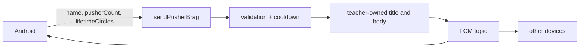

{: .box-note}
זהו הפרק האחרון ברצף המשחק. כאשר קנייה בחנות מצליחה, היישום ישמור שם שחקן וישלח ל־Cloud Function שלושה ערכים בלבד: שם, מספר Pushers ו־Lifetime. הפונקציה של המורה תכתוב את הכותרת והטקסט ותשלח אותם לכל מי שמנוי ל־topic — כולל המכשיר ששלח, כדי שיהיה קל לבדוק.

[חזרה לפרק 17: כתיבה בטוחה מן ה־Worker](/android/CollectCircles/17.collect-circles-worker-settlement)

## גבול האחריות



הלקוח אינו שולח `title`,‏ `body` או topic. לכן תלמיד יכול לבחור את הערכים שהחוזה מאפשר, אבל אינו יכול להפוך את הפונקציה לשירות ששולח טקסט חופשי לכל הכיתה.

{: .box-warning}
הערכים עדיין מגיעים ממכשיר המשתמש ואינם הוכחה להישג אמיתי. בלי Authentication ומסד נתונים סמכותי אפשר לשנות לקוח ולשקר. זה מתאים ל־brag לימודי, לא לטבלת שיאים תחרותית.

## 1. מוסיפים שם לחלון החנות

צרו `res/layout/dialog_pusher_shop.xml`:

```xml
<?xml version="1.0" encoding="utf-8"?>
<LinearLayout xmlns:android="http://schemas.android.com/apk/res/android"
    xmlns:app="http://schemas.android.com/apk/res-auto"
    android:layout_width="match_parent"
    android:layout_height="wrap_content"
    android:orientation="vertical"
    android:paddingHorizontal="24dp"
    android:paddingTop="8dp"
    android:paddingBottom="4dp">

    <TextView
        android:id="@+id/shopDetailsText"
        android:layout_width="match_parent"
        android:layout_height="wrap_content"
        android:layout_marginBottom="12dp" />

    <com.google.android.material.textfield.TextInputLayout
        android:id="@+id/playerNameLayout"
        android:layout_width="match_parent"
        android:layout_height="wrap_content"
        android:hint="@string/player_name_hint"
        app:counterEnabled="true"
        app:counterMaxLength="30">

        <com.google.android.material.textfield.TextInputEditText
            android:id="@+id/playerNameInput"
            android:layout_width="match_parent"
            android:layout_height="wrap_content"
            android:inputType="textPersonName"
            android:maxLength="30"
            android:singleLine="true" />

    </com.google.android.material.textfield.TextInputLayout>

</LinearLayout>
```

וב־`strings.xml`:

```xml
<string name="player_name_hint">Player name</string>
<string name="player_name_required">Enter a name before hiring</string>
<string name="brag_sent">Brag sent!</string>
<string name="brag_failed">Pusher hired, but the brag could not be sent</string>
```

השם נמצא בתוך חלון שכבר שייך לאירוע הקנייה, ולכן איננו מוסיפים עוד Activity או שורת כפתורים למסך הצפוף.

## 2. מחליפים את הודעת החנות ב־View Binding

ב־`MainActivity` הוסיפו:

```java
import com.example.collectcircles.databinding.DialogPusherShopBinding;
```

ושדה מפתח:

```java
private static final String PLAYER_NAME_KEY = "player_name";
```

<div class="two-columns">
<div markdown="1" class="column">

### לפני

```java
AlertDialog dialog =
        new MaterialAlertDialogBuilder(this)
                .setTitle(R.string.shop_title)
                .setMessage(getString(
                        R.string.shop_message,
                        gameProgress.getPusherCount(),
                        gameProgress.getCirclesBalance(),
                        gameProgress.getNextPusherPrice()
                ))
                .setNegativeButton(R.string.close, null)
                .setPositiveButton(R.string.hire_pusher, null)
                .create();
```

</div>
<div markdown="1" class="column">

### אחרי

```java
DialogPusherShopBinding shopBinding =
        DialogPusherShopBinding.inflate(
                getLayoutInflater()
        );
shopBinding.shopDetailsText.setText(getString(
        R.string.shop_message,
        gameProgress.getPusherCount(),
        gameProgress.getCirclesBalance(),
        gameProgress.getNextPusherPrice()
));
shopBinding.playerNameInput.setText(
        preferences.getString(PLAYER_NAME_KEY, "")
);

AlertDialog dialog =
        new MaterialAlertDialogBuilder(this)
                .setTitle(R.string.shop_title)
                .setView(shopBinding.getRoot())
                .setNegativeButton(R.string.close, null)
                .setPositiveButton(R.string.hire_pusher, null)
                .create();
```

</div>
</div>

View Binding נוצר אוטומטית גם לקובץ layout של dialog. אין צורך ב־`findViewById`.

## 3. בודקים ושומרים שם רק בקנייה מוצלחת

בתוך listener של הכפתור החיובי, לפני `buyPusher()`, קראו את השם:

```java
String playerName = String.valueOf(
        shopBinding.playerNameInput.getText()
).trim();
if (playerName.isEmpty()) {
    shopBinding.playerNameLayout.setError(
            getString(R.string.player_name_required)
    );
    return;
}
shopBinding.playerNameLayout.setError(null);
```

לאחר שהקנייה הצליחה:

```java
preferences.edit()
        .putString(PLAYER_NAME_KEY, playerName)
        .apply();
```

אם אין מספיק עיגולים הכפתור ממילא disabled. אם שם חסר, לא קונים ולא שולחים. כך כל brag מתאים לאירוע קנייה שהתרחש באותו מסך.

## 4. ה־Callable הראשון שמקבל נתונים

הוסיפו imports:

```java
import java.util.HashMap;
import java.util.Map;
```

והוסיפו ל־`MainActivity`:

```java
private void sendPusherBrag(String playerName) {
    Map<String, Object> data = new HashMap<>();
    data.put("name", playerName);
    data.put("pusherCount", gameProgress.getPusherCount());
    data.put(
            "lifetimeCircles",
            gameProgress.getLifetimeCircles()
    );

    FirebaseFunctions.getInstance()
            .getHttpsCallable("sendPusherBrag")
            .call(data)
            .addOnCompleteListener(task -> {
                int message = task.isSuccessful()
                        ? R.string.brag_sent
                        : R.string.brag_failed;
                Toast.makeText(
                        this,
                        message,
                        Toast.LENGTH_SHORT
                ).show();
            });
}
```

[ב־Callable הרשמי של Firebase](https://firebase.google.com/docs/functions/callable), ה־Map שנמסר ל־`call(data)` מגיע בצד השרת בתור `request.data`.

{: .box-error}
אל תוסיפו ל־Map כותרת, תוכן הודעה או topic. שלושת המפתחות הם חוזה הנתונים כולו; המורה שולט בניסוח וביעד מן הפונקציה.

## 5. מחברים לאירוע הקנייה

<div class="two-columns">
<div markdown="1" class="column">

### לפני

```java
if (gameProgress.buyPusher()) {
    showProgress();
    binding.gameBoard.setPusherCount(
            gameProgress.getPusherCount()
    );
    Toast.makeText(
            this,
            R.string.pusher_hired,
            Toast.LENGTH_SHORT
    ).show();
    dialog.dismiss();
}
```

</div>
<div markdown="1" class="column">

### אחרי

```java
if (gameProgress.buyPusher()) {
    preferences.edit()
            .putString(PLAYER_NAME_KEY, playerName)
            .apply();
    showProgress();
    binding.gameBoard.setPusherCount(
            gameProgress.getPusherCount()
    );
    Toast.makeText(
            this,
            R.string.pusher_hired,
            Toast.LENGTH_SHORT
    ).show();
    sendPusherBrag(playerName);
    dialog.dismiss();
}
```

</div>
</div>

הקנייה המקומית קודמת לקריאת הרשת. אם ה־Callable נכשל, ה־Pusher נשאר בבעלות המשתמש; אין היגיון לבטל רכישה מקומית תקינה בגלל בעיית תקשורת זמנית.

## 6. מה אסינכרוני כאן?

```mermaid
sequenceDiagram
    participant U as User
    participant UI as UI thread
    participant F as Firebase client
    participant C as Cloud Function
    participant M as FCM topic

    U->>UI: Hire pusher
    UI->>UI: validate name + buy + persist
    UI->>F: call(data)
    F-->>UI: returns a Task immediately
    Note over UI: dialog closes; game remains responsive
    F->>C: HTTPS callable request
    C->>C: validate + create text
    C->>M: send notification
    C-->>F: sent result
    F->>UI: onComplete callback
```

- לחיצה, בדיקת השם, הקנייה ועדכון Views מתבצעים על UI thread.
- `call(data)` מתחילה I/O אסינכרוני ומחזירה `Task`; היא אינה חוסמת את המסך עד שהשרת עונה.
- Cloud Function רצה ב־Node.js process בענן, לא בטלפון.
- `addOnCompleteListener` רץ לאחר סיום ה־Task ומציג Toast קצר.
- FCM fanout הוא פעולה נפרדת: ייתכן שה־Callable כבר הצליח אך הגעת ההתראה למכשירים תידחה.

אין `Thread` חדש בקוד ה־Activity, ואין צורך ב־WorkManager: brag שייך ללחיצה בזמן שהיישום פתוח. אם process נהרג לאחר הקנייה ולפני סיום הקריאה, איננו מבטיחים retry — זו פשרה מתאימה להודעה חברתית שאינה נתון קריטי.

## 7. פונקציית המורה

בחלק זה התלמיד צריך להבין את החוזה, אך המורה שומר ומפרסם את הקוד.

הוסיפו ל־`functions/index.js`:

```javascript
const BRAG_COOLDOWN_MILLIS = 10_000;
let lastBragTime = 0;

function readBragData(request) {
  const data = request.data;
  if (data === null || typeof data !== "object" || Array.isArray(data)) {
    throw new HttpsError("invalid-argument", "Brag data must be an object.");
  }

  const allowedKeys = ["name", "pusherCount", "lifetimeCircles"];
  if (Object.keys(data).some((key) => !allowedKeys.includes(key))) {
    throw new HttpsError("invalid-argument", "Unexpected brag field.");
  }

  const name = typeof data.name === "string" ? data.name.trim() : "";
  if (name.length < 1 || name.length > 30 || /[\r\n]/u.test(name)) {
    throw new HttpsError("invalid-argument", "Invalid player name.");
  }
  if (!Number.isSafeInteger(data.pusherCount) ||
      data.pusherCount < 1 || data.pusherCount > 58) {
    throw new HttpsError("invalid-argument", "Invalid pusher count.");
  }
  if (!Number.isSafeInteger(data.lifetimeCircles) ||
      data.lifetimeCircles < 0) {
    throw new HttpsError("invalid-argument", "Invalid lifetime total.");
  }

  return {
    name,
    pusherCount: data.pusherCount,
    lifetimeCircles: data.lifetimeCircles,
  };
}

exports.sendPusherBrag = onCall(FUNCTION_OPTIONS, async (request) => {
  const brag = readBragData(request);
  const now = Date.now();
  if (now - lastBragTime < BRAG_COOLDOWN_MILLIS) {
    throw new HttpsError(
        "resource-exhausted",
        "Please wait before sending another brag.",
    );
  }

  const messageId = await getMessaging().send({
    topic: NOTIFICATION_TOPIC,
    notification: {
      title: "A new pusher joined the crew!",
      body: `${brag.name} now employs ${brag.pusherCount} pushers ` +
          `after collecting ${brag.lifetimeCircles} circles.`,
    },
    android: {
      priority: "high",
      notification: {
        channelId: "circle_invitations",
        icon: "ic_launcher_foreground",
      },
    },
  });

  lastBragTime = now;
  return {sent: true, messageId};
});
```

הפונקציה:

- מקבלת רק שלושה שדות מוכרים;
- מגבילה שם ל־30 תווים ואוסרת שורות חדשות;
- דורשת מספרים שלמים ובטווח בטוח של JavaScript;
- בונה את כל הטקסט בשרת;
- שולחת ל־`circle_notifications`, שאליו גם השולח כבר רשום;
- מגבילה קריאות צפופות באותו server instance.

ה־cooldown אינו מנגנון אבטחה מלא ויכול להתאפס ב־cold start. ההגנה האמיתית בפרויקט עתידי תהיה App Check,‏ Authentication ומצב סמכותי בשרת. כאן הוא guardrail פשוט נוסף לקנייה יקרה שמתרחשת לעיתים רחוקות.

## 8. שומרים על טקסט השרת גם בחזית

כאשר היישום ברקע, Android מציגה notification payload בעצמה. כאשר הוא בחזית, `onMessageReceived()` מופעל. הקוד הישן קורא `Notifications.show(this)` ולכן מחליף את ה־brag בטקסט ההזמנה הקבוע.

הוסיפו ל־`Notifications`:

```java
private static final int REMOTE_NOTIFICATION_ID = 3;

public static void showRemote(
        Context context,
        String title,
        String body
) {
    createChannel(context);
    NotificationManager manager = context.getSystemService(
            NotificationManager.class
    );
    Notification notification = new Notification.Builder(
            context,
            CHANNEL_ID
    )
            .setSmallIcon(R.drawable.ic_launcher_foreground)
            .setContentTitle(title)
            .setContentText(body)
            .setAutoCancel(true)
            .build();
    manager.notify(REMOTE_NOTIFICATION_ID, notification);
}
```

וב־`CircleMessagingService` החליפו:

```diff
 if (message.getNotification() != null) {
-    Notifications.show(this);
+    Notifications.showRemote(
+            this,
+            message.getNotification().getTitle(),
+            message.getNotification().getBody()
+    );
 }
```

כאן אנחנו מאפשרים טקסט מרוחק מפני שהוא מגיע מ־FCM ומפונקציית המורה, לא ישירות משדה טקסט שנשלח אל topic מן הטלפון.

## 9. בדיקות ופריסה

בדיקת תחביר לפונקציות:

```powershell
cd functions
npm run check
```

פרסו רק את הפונקציה החדשה:

```powershell
firebase deploy --only functions:sendPusherBrag
```

פריסה ממוקדת אינה משנה או מוחקת את פונקציות ההזמנה שכבר פועלות. זהו גם [דפוס הפריסה הממוקדת שממליצה Firebase](https://firebase.google.com/docs/functions/manage-functions#deploy_functions).

אפשר לבדוק את ה־validation בלי לשלוח הודעה אמיתית: קריאה עם שם ריק צריכה להחזיר `INVALID_ARGUMENT` לפני פעולת FCM. אין צורך לבצע קריאת הצלחה אוטומטית, מפני שהיא תשדר מיד לכל המנויים.

לאחר הפריסה:

1. פתחו את החנות כאשר יש מספיק עיגולים.
2. הזינו שם וקנו Pusher.
3. ודאו שה־Pusher נוסף מיד, גם לפני תשובת הרשת.
4. ודאו שמופיע Toast של הצלחה או כשל בשליחת ה־brag.
5. בדקו שהמכשיר השולח מקבל התראה עם שם, מספר Pushers ו־Lifetime.
6. בדקו פעם כשהיישום בחזית ופעם כשהוא ברקע; הטקסט שמקורו בשרת צריך להישמר בשני המצבים.
7. אם יש מכשיר נוסף שמנוי ל־topic, ודאו שגם הוא מקבל אותה התראה.

הריצו גם פעם אחת:

```powershell
.\gradlew.bat testDebugUnitTest assembleDebug
```

{: .box-success}
המשחק הושלם כרצף לימודי: משחק ידני, כלכלה שמורה, Pushers מונפשים, ייצור אופליין, WorkManager מתוזמן ו־brag קבוצתי שבו הלקוח שולח נתונים והשרת שולט במסר.
