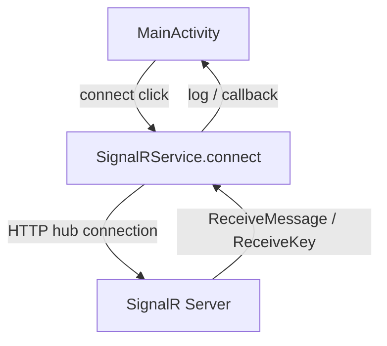

{: .box-note}
במדריך זה נלמד כיצד להרחיב את אפליקציית ה־Tic Tac Toe (איקס עיגול) כך ששני מכשירי אנדרואיד יוכלו לשחק אחד מול השני דרך שרת **SignalR**.

נחלק את העבודה לשלושה שלבים עיקריים, שכל אחד מהם תואם לקומיט שבוצע ב־Git:

1. **חיבור ל־SignalR + הגדרת אבטחה ל־HTTP**  
2. **שליחת מהלך (Send Key)**  
3. **קבלת מהלך ושילובו בלוגיקת המשחק**

---

## שלב 1 – התחברות ל־SignalR
{: .box-note}
בשלב זה נגדיר את כל התשתית להתחברות לשרת SignalR דרך כתובת IP מקומית, ונאפשר תקשורת **HTTP** רגילה (לא מאובטחת) לצורכי פיתוח.

### קבצים שעודכנו
- `MainActivity.java`
- `SignalRService.java`
- `activity_main.xml`
- `network_security_config.xml`
- `AndroidManifest.xml`
- `build.gradle`

### תרשים תהליך

