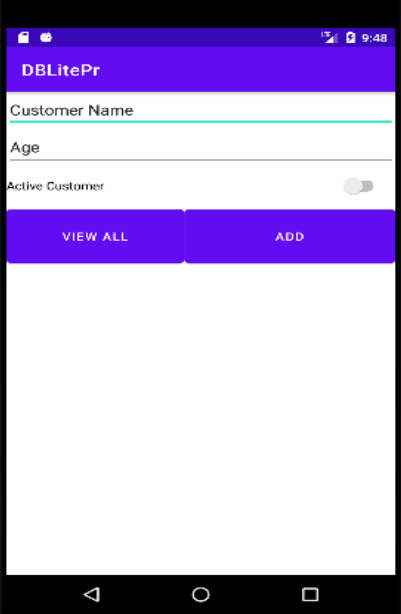

<!-- https://docs.google.com/document/d/1efpXd73opJqsxQMIID1os5vMbmQ1NDQFzVdpM6TSq5c/edit?tab=t.0 -->

{: .box-note}
מעבדה: עבודה עם בסיס נתונים SQLite באנדרואיד באדיבות אמג'ד טרודי

## נלמד לעבוד עם שני סוגי DB:

- **DBLite (SQLite)**
- **Firestore**

במעבדה זו נתמקד בבניית **DBLite**.

🎬 **קישור לסרטון הסבר על הפרויקט:**
[https://www.youtube.com/watch?v=hDSVInZ2JCs](https://www.youtube.com/watch?v=hDSVInZ2JCs)

---

## שלב 1: יצירת מסך האפליקציה



מתחת ללחצנים יש `ListView`.

### בקובץ XML:

```xml
<LinearLayout
    android:layout_width="match_parent"
    android:layout_height="match_parent"
    android:orientation="vertical"
    tools:layout_editor_absoluteX="77dp"
    tools:layout_editor_absoluteY="16dp">

    <EditText
        android:id="@+id/customerName"
        android:layout_width="match_parent"
        android:layout_height="wrap_content"
        android:ems="10"
        android:inputType="textPersonName"
        android:text="Customer Name" />

    <EditText
        android:id="@+id/age"
        android:layout_width="match_parent"
        android:layout_height="wrap_content"
        android:ems="10"
        android:inputType="number"
        android:minHeight="48dp"
        android:text="Age" />

    <Switch
        android:id="@+id/swActive"
        android:layout_width="400dp"
        android:layout_height="48dp"
        android:text="Active Customer" />

    <LinearLayout
        android:layout_width="match_parent"
        android:layout_height="78dp"
        android:orientation="horizontal">

        <Button
            android:id="@+id/viewAll"
            android:layout_width="188dp"
            android:layout_height="match_parent"
            android:text="View All" />

        <Button
            android:id="@+id/add"
            android:layout_width="120dp"
            android:layout_height="match_parent"
            android:layout_weight="1"
            android:text="Add" />
    </LinearLayout>

    <ListView
        android:id="@+id/customersList"
        android:layout_width="match_parent"
        android:layout_height="match_parent" />
</LinearLayout>
```

---

## שלב 2: יצירת ה-Model

```java
public class CustomerModel {
    private int id;
    private String name;
    private int age;
    private boolean isActive;

    public CustomerModel(int id, String name, int age, boolean isActive) {
        this.id = id;
        this.name = name;
        this.age = age;
        this.isActive = isActive;
    }

    public CustomerModel() { }

    public int getId() { return id; }
    public String getName() { return name; }
    public int getAge() { return age; }
    public boolean isActive() { return isActive; }

    public void setId(int id) { this.id = id; }
    public void setName(String name) { this.name = name; }
    public void setAge(int age) { this.age = age; }
    public void setActive(boolean active) { isActive = active; }

    @Override
    public String toString() {
        return "CustomerModel{" +
               "id=" + id +
               ", name='" + name + '\'' +
               ", age=" + age +
               ", isActive=" + isActive +
               '}';
    }
}
```

---

## שלב 3: כתיבת ה-MainActivity הבסיסית

```java
public class MainActivity extends AppCompatActivity {

    Button add, viewAll;
    EditText customerName, age;
    Switch swActive;
    ListView customersList;

    @Override
    protected void onCreate(Bundle savedInstanceState) {
        super.onCreate(savedInstanceState);
        setContentView(R.layout.activity_main);

        add = findViewById(R.id.add);
        viewAll = findViewById(R.id.viewAll);
        age = findViewById(R.id.age);
        customerName = findViewById(R.id.customerName);
        swActive = findViewById(R.id.swActive);
        customersList = findViewById(R.id.customersList);

        add.setOnClickListener(new View.OnClickListener() {
            @Override
            public void onClick(View v) {
                CustomerModel customerModel1;
                try {
                    customerModel1 = new CustomerModel(-1,
                        customerName.getText().toString(),
                        Integer.parseInt(age.getText().toString()),
                        swActive.isChecked());
                    Toast.makeText(MainActivity.this, customerModel1.getName(), Toast.LENGTH_SHORT).show();
                } catch (Exception e) {
                    Toast.makeText(MainActivity.this, "invalid age insered", Toast.LENGTH_SHORT).show();
                }
            }
        });

        viewAll.setOnClickListener(new View.OnClickListener() {
            @Override
            public void onClick(View v) {
                Toast.makeText(MainActivity.this, "View ALL CLICKED", Toast.LENGTH_SHORT).show();
            }
        });
    }
}
```

**הסבר:**
כדי למנוע קריסה במצב שבו השדה `age` ריק, נשתמש ב-`try/catch` לטיפול בשגיאה.

---

## שלב 4: יצירת המחלקה DataBaseHelper

```java
public class DataBaseHelper extends SQLiteOpenHelper {

    private static final String DATABASENAME = "customers.db";
    private static final String TABLE_RECORD = "tblresult";
    private static final int DATABASEVERSION = 1;

    private static final String COLUMN_ID = "_id";
    private static final String COLUMN_NAME = "name";
    private static final String COLUMN_AGE = "age";
    private static final String COLUMN_ACTIVE = "isActive";

    private static final String CREATE_TABLE_USER = "CREATE TABLE IF NOT EXISTS " +
            TABLE_RECORD + "(" +
            COLUMN_ID + " INTEGER PRIMARY KEY AUTOINCREMENT," +
            COLUMN_NAME + " TEXT," +
            COLUMN_AGE + " INT," +
            COLUMN_ACTIVE + " BOOL) ";

    private static final String[] allColumns = {COLUMN_ID, COLUMN_NAME, COLUMN_AGE, COLUMN_ACTIVE};

    public DataBaseHelper(@Nullable Context context) {
        super(context, "customers.db", null, 1);
    }

    @Override
    public void onCreate(SQLiteDatabase db) {
        db.execSQL(CREATE_TABLE_USER);
    }

    @Override
    public void onUpgrade(SQLiteDatabase db, int oldVersion, int newVersion) {
        db.execSQL("DROP TABLE IF EXISTS " + TABLE_RECORD);
        onCreate(db);
    }
}
```

---

## שלב 5: הוספת משתמש לטבלה

ב-`MainActivity` נוסיף:

```java
DataBaseHelper dataBaseHelper = new DataBaseHelper(MainActivity.this);

add.setOnClickListener(new View.OnClickListener() {
    @Override
    public void onClick(View v) {
        CustomerModel customerModel1;
        try {
            customerModel1 = new CustomerModel(-1,
                customerName.getText().toString(),
                Integer.parseInt(age.getText().toString()),
                swActive.isChecked());
        } catch (Exception e) {
            customerModel1 = new CustomerModel(-1, "error", 0, false);
        }

        DataBaseHelper dataBaseHelper = new DataBaseHelper(MainActivity.this);
        boolean success = dataBaseHelper.addOne(customerModel1);
        Toast.makeText(MainActivity.this, "Success is: " + success, Toast.LENGTH_SHORT).show();
    }
});
```

ייבוא הספרייה הדרושה:

```java
import android.database.sqlite.SQLiteOpenHelper;
```

---

## מתודת `addOne` ב-DataBaseHelper

```java
public boolean addOne(CustomerModel customerModel) {
    SQLiteDatabase db = this.getWritableDatabase();
    ContentValues cv = new ContentValues();

    cv.put(COLUMN_NAME, customerModel.getName());
    cv.put(COLUMN_AGE, customerModel.getAge());
    cv.put(COLUMN_ACTIVE, customerModel.isActive());

    long insert = db.insert(TABLE_RECORD, null, cv);
    return insert != -1;
}
```

---

## שלב 7: צפייה במסד הנתונים

התקנת תוכנה לצפייה בטבלאות:
👉 [https://sqlitebrowser.org/dl/](https://sqlitebrowser.org/dl/)

1. גשו לנתיב `data/data/<שם הפרויקט>/databases`
2. הורידו את קובץ ה-DB למחשב
3. פתחו את הקובץ בתוכנה וצפו בתוכן הטבלה

---

## שלב 8: הצגת הנתונים ברשימה במסך הראשי

### הוספה ל-DataBaseHelper

```java
public List<CustomerModel> getEveryone() {
    List<CustomerModel> returnList = new ArrayList<>();
    String queryString = "SELECT * FROM " + TABLE_RECORD;
    SQLiteDatabase db = this.getReadableDatabase();
    Cursor cursor = db.rawQuery(queryString, null);

    if (cursor.moveToFirst()) {
        do {
            int id = cursor.getInt(0);
            String name = cursor.getString(1);
            int age = cursor.getInt(2);
            boolean active = cursor.getInt(3) == 1;
            CustomerModel newCustomer = new CustomerModel(id, name, age, active);
            returnList.add(newCustomer);
        } while (cursor.moveToNext());
    }

    cursor.close();
    db.close();
    return returnList;
}
```

### הוספה ל-MainActivity

```java
viewAll.setOnClickListener(new View.OnClickListener() {
    @Override
    public void onClick(View v) {
        DataBaseHelper dataBaseHelper = new DataBaseHelper(MainActivity.this);
        List<CustomerModel> everyone = dataBaseHelper.getEveryone();

        ArrayAdapter customerArrayAdapter = new ArrayAdapter<>(
            MainActivity.this,
            android.R.layout.simple_list_item_1,
            everyone);

        customersList.setAdapter(customerArrayAdapter);
    }
});
```

---

## שלב 9: עבודה עצמאית

צרו מסך חדש הכולל:

* תיבת טקסט להזנת **ID** של משתמש
* לחצן למחיקת המשתמש לפי ה-ID
* לחצן לחזרה למסך הראשי

בדקו שאכן הרשומה נמחקה מה-DB.

---

🎯 **בהצלחה רבה!**

---

רוצה שאוסיף לזה עיצוב הוראה עם צבעים ותיבות (למשל בלוקים של `: .box-note`, או הפרדת שלבים עם סימון 📘)?
