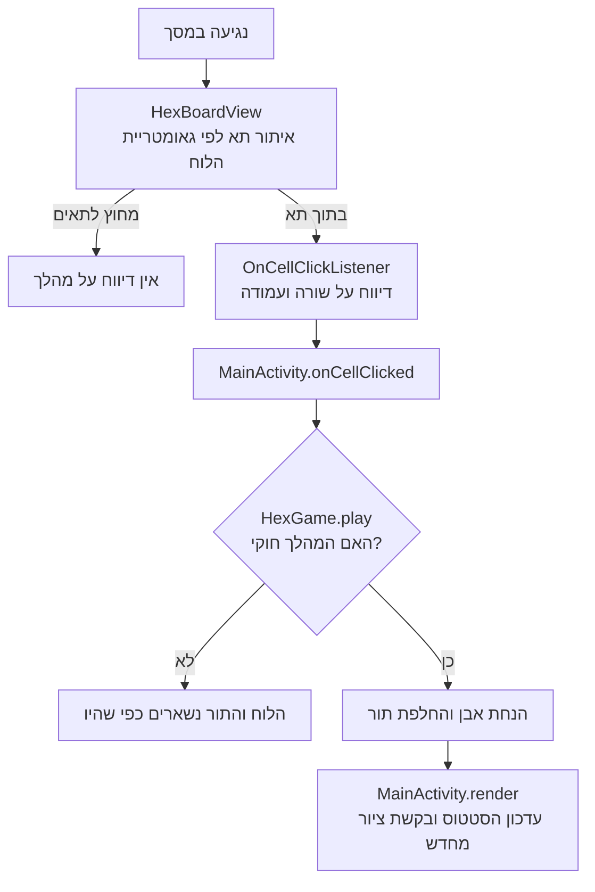

[מפת המסלול]({{ '/android/hex/' | relative_url }}) · [הפרק הקודם]({{ '/android/hex/01-board/' | relative_url }}) · [הפרק הבא]({{ '/android/hex/03-win-detection/' | relative_url }}) ·


{: .box-success}
**בסוף הפרק:** שני אנשים מניחים אבנים בתור; נגיעה מחוץ ללוח או בתא תפוס אינה משנה את התור.

## הרעיון

המצב עובר ל־`HexGame`, מחלקת Java ללא תלות ב־Android. תא נשמר במערך לפי `row * 7 + column`. רק `play` משנה את המערך ואת התור. ה־View מחזיר שורה ועמודה דרך `OnCellClickListener` ואינו מחליט אם מותר לשחק. אותו חישוב מרכז משמש לציור ולבדיקת מגע; `containsPoint` דוחה נגיעה ברווח שבין משושים. `performClick()` ממלא את חוזה הנגישות של View.

## מנגיעה למהלך ולציור מחדש {#move-flow}

נגיעה היא **בקשה לשחק בתא**. ה־View מתרגמת את מיקום האצבע לשורה ועמודה; רק מחלקת המשחק מחליטה אם הבקשה חוקית. לאחר מהלך חוקי ה־Activity מעדכנת את התצוגה מתוך המצב החדש.

<div markdown="1" class="hex-diagram">



</div>

אותו חישוב מרכזים משמש לציור ולזיהוי התא שנלחץ. לעומת זאת, בדיקת תא תפוס עובדת על מערך התאים ב־`HexGame`, בלי תלות בגודל המסך. חלוקת האחריות הזו תאפשר בהמשך למחשב לבקש מהלך באמצעות אותם חוקים.

{: .box-note}
**לפני הקוד:** מדוע נגיעה בתא תפוס אינה אמורה להעביר את התור? באיזה חלק בתרשים נקבעת התשובה?

## עורכים את הקבצים

עבדו לפי סדר התלות: משאבים לפני קוד שמפנה אליהם; מחלקת החוקים לפני ה־Activity.

### strings.xml

**מיקום:** app > res > values. המשאב מרכז צבעים, מחרוזות או theme שהמסך משתמש בהם. שנו רק את השורות המוצגות.

```diff
     <string name="red_goal">RED · TOP ↕ BOTTOM</string>
     <string name="blue_goal">BLUE · LEFT ↔ RIGHT</string>
     <string name="board_description">Seven by seven Hex board</string>
+    <string name="status_red_turn">Red to move</string>
+    <string name="status_blue_turn">Blue to move</string>
 </resources>
```

### HexGame.java

**מיקום:** app > kotlin+java > com.example.hex. צרו קובץ `HexGame.java` חדש והעתיקו את בלוק הקוד המלא. זו מחלקת החוקים העצמאית; בחנו היכן המשחק משנה מצב והיכן הוא רק קורא אותו.

```java
package com.example.hex;

import java.util.Arrays;

/**
 * Stores a 7x7 Hex position and its game rules.
 *
 * <p>This class is pure Java and has no Android or rendering dependencies. Red connects the
 * top and bottom edges; Blue connects the left and right edges.
 */
public final class HexGame {
    /** Number of rows and columns on the square board. */
    public static final int SIZE = 7;
    /** Total number of cells on the board. */
    public static final int CELL_COUNT = SIZE * SIZE;
    /** Cell value used for an unoccupied cell. */
    public static final int EMPTY = 0;
    /** Player value for Red, whose goal is to connect top to bottom. */
    public static final int RED = 1;
    /** Player value for Blue, whose goal is to connect left to right. */
    public static final int BLUE = 2;

    private final int[] cells = new int[CELL_COUNT];
    private int currentPlayer = RED;

    /**
     * Places the current player's stone and advances the turn when the move is legal.
     *
     * <p>TWIN-ID: HEX.APPLY_MOVE
     *
     * @param row zero-based board row
     * @param column zero-based board column
     * @return {@code true} if the move was played; {@code false} if the rules reject it,
     *         leaving the board and turn unchanged
     */
    public boolean play(int row, int column) {
        if (isOutside(row, column)) {
            return false;
        }
        int index = index(row, column);
        if (cells[index] != EMPTY) {
            return false;
        }

        cells[index] = currentPlayer;
        currentPlayer = otherPlayer(currentPlayer);
        return true;
    }

    /**
     * Returns the value stored at one board coordinate.
     *
     * @param row zero-based board row
     * @param column zero-based board column
     * @return {@link #EMPTY}, {@link #RED}, or {@link #BLUE}
     * @throws IndexOutOfBoundsException if the coordinate is outside the board
     */
    public int getCell(int row, int column) {
        if (isOutside(row, column)) {
            throw new IndexOutOfBoundsException("Cell is outside the 7x7 board");
        }
        return cells[index(row, column)];
    }

    /**
     * Copies all board cells in row-major order.
     *
     * @return an independent 49-element array
     */
    public int[] getCells() {
        return Arrays.copyOf(cells, CELL_COUNT);
    }

    /** @return the player that will make the next move */
    public int getCurrentPlayer() {
        return currentPlayer;
    }

    /**
     * Returns the opponent of a player.
     *
     * @param player {@link #RED} or {@link #BLUE}
     * @return the other player
     * @throws IllegalArgumentException if {@code player} is not a player value
     */
    public static int otherPlayer(int player) {
        if (player == RED) {
            return BLUE;
        }
        if (player == BLUE) {
            return RED;
        }
        throw new IllegalArgumentException("Player must be RED or BLUE");
    }

    private static int index(int row, int column) {
        return row * SIZE + column;
    }

    private static boolean isOutside(int row, int column) {
        return row < 0 || row >= SIZE || column < 0 || column >= SIZE;
    }
}
```

### HexBoardView.java

**מיקום:** app > kotlin+java > com.example.hex. מחלקת הציור מקבלת כעת משחק, callback ובדיקת מגע. בצעו את השינויים לפי הסדר. שאר הקוד נשאר כפי שנכתב בפרק 1.

```diff
 import android.graphics.Canvas;
 import android.graphics.Paint;
 import android.graphics.Path;
 import android.util.AttributeSet;
+import android.view.MotionEvent;
 import android.view.View;
 
 import androidx.annotation.NonNull;
 import androidx.annotation.Nullable;
 import androidx.core.content.ContextCompat;
 
-/** Draws the fixed 7×7 board; game rules will live in a separate class. */
+/**
+ * Draws a Hex board on a {@link Canvas} and translates taps into board coordinates.
+ *
+ * <p>This view contains rendering and input logic only. All game rules remain in
+ * {@link HexGame}.
+ */
 public final class HexBoardView extends View {
-    private static final int SIZE = 7;
+    /** Receives taps that land inside a board cell. */
+    public interface OnCellClickListener {
+        /**
+         * Called after the user taps a cell.
+         *
+         * @param row zero-based board row
+         * @param column zero-based board column
+         */
+        void onCellClick(int row, int column);
+    }
+
     private static final float SQRT_THREE = (float) Math.sqrt(3.0);
 
     private final Paint fillPaint = new Paint(Paint.ANTI_ALIAS_FLAG);
     private final Paint strokePaint = new Paint(Paint.ANTI_ALIAS_FLAG);
     private final Paint sidePaint = new Paint(Paint.ANTI_ALIAS_FLAG);
     private final Path hexPath = new Path();
 
+    private HexGame game = new HexGame();
+    private OnCellClickListener listener;
     private float radius;
     private float startX;
     private float startY;
 
```

```diff
         strokePaint.setStyle(Paint.Style.STROKE);
         strokePaint.setStrokeJoin(Paint.Join.ROUND);
         sidePaint.setStyle(Paint.Style.STROKE);
         sidePaint.setStrokeCap(Paint.Cap.ROUND);
+        setClickable(true);
+        setFocusable(true);
+    }
+
+    /**
+     * Sets the game position to render and schedules a redraw.
+     *
+     * @param game game whose current board should be displayed
+     */
+    public void setGame(HexGame game) {
+        this.game = game;
+        invalidate();
+    }
+
+    /**
+     * Sets the listener notified when the user taps a board cell.
+     *
+     * @param listener listener to notify, or {@code null} to stop reporting taps
+     */
+    public void setOnCellClickListener(OnCellClickListener listener) {
+        this.listener = listener;
     }
 
     @Override
     protected void onDraw(@NonNull Canvas canvas) {
```

```diff
         drawGoalSides(canvas);
 
         strokePaint.setColor(lineColor);
         strokePaint.setStrokeWidth(dp(1.5f));
-        for (int row = 0; row < SIZE; row++) {
-            for (int column = 0; column < SIZE; column++) {
+        for (int row = 0; row < HexGame.SIZE; row++) {
+            for (int column = 0; column < HexGame.SIZE; column++) {
                 float centerX = centerX(row, column);
                 float centerY = centerY(row);
                 makeHexagon(centerX, centerY);
-                fillPaint.setColor(emptyColor);
+                int cell = game.getCell(row, column);
+                fillPaint.setColor(cell == HexGame.RED
+                        ? redColor : cell == HexGame.BLUE ? blueColor : emptyColor);
                 fillPaint.setStyle(Paint.Style.FILL);
                 canvas.drawPath(hexPath, fillPaint);
                 canvas.drawPath(hexPath, strokePaint);
             }
```


     private void drawGoalSides(Canvas canvas) {
         sidePaint.setStrokeWidth(Math.max(dp(4), radius * 0.18f));
 
         sidePaint.setColor(redColor);
         canvas.drawLine(centerX(0, 0), centerY(0) - radius * 1.18f,
-                centerX(0, SIZE - 1), centerY(0) - radius * 1.18f, sidePaint);
-        canvas.drawLine(centerX(SIZE - 1, 0), centerY(SIZE - 1) + radius * 1.18f,
-                centerX(SIZE - 1, SIZE - 1),
-                centerY(SIZE - 1) + radius * 1.18f, sidePaint);
+                centerX(0, HexGame.SIZE - 1), centerY(0) - radius * 1.18f, sidePaint);
+        canvas.drawLine(centerX(HexGame.SIZE - 1, 0), centerY(HexGame.SIZE - 1) + radius * 1.18f,
+                centerX(HexGame.SIZE - 1, HexGame.SIZE - 1),
+                centerY(HexGame.SIZE - 1) + radius * 1.18f, sidePaint);
 
         sidePaint.setColor(blueColor);
         canvas.drawLine(centerX(0, 0) - radius, centerY(0),
-                centerX(SIZE - 1, 0) - radius, centerY(SIZE - 1), sidePaint);
-        canvas.drawLine(centerX(0, SIZE - 1) + radius, centerY(0),
-                centerX(SIZE - 1, SIZE - 1) + radius,
-                centerY(SIZE - 1), sidePaint);
+                centerX(HexGame.SIZE - 1, 0) - radius, centerY(HexGame.SIZE - 1), sidePaint);
+        canvas.drawLine(centerX(0, HexGame.SIZE - 1) + radius, centerY(0),
+                centerX(HexGame.SIZE - 1, HexGame.SIZE - 1) + radius,
+                centerY(HexGame.SIZE - 1), sidePaint);
     }


```diff
         }
         hexPath.close();
     }
 
+    @Override
+    public boolean onTouchEvent(@NonNull MotionEvent event) {
+        if (!isEnabled()) {
+            return false;
+        }
+        if (event.getAction() == MotionEvent.ACTION_UP) {
+            calculateGeometry();
+            int bestRow = -1;
+            int bestColumn = -1;
+            float bestDistance = Float.MAX_VALUE;
+            for (int row = 0; row < HexGame.SIZE; row++) {
+                for (int column = 0; column < HexGame.SIZE; column++) {
+                    float dx = event.getX() - centerX(row, column);
+                    float dy = event.getY() - centerY(row);
+                    float distance = dx * dx + dy * dy;
+                    if (containsPoint(dx, dy) && distance < bestDistance) {
+                        bestDistance = distance;
+                        bestRow = row;
+                        bestColumn = column;
+                    }
+                }
+            }
+            if (bestRow >= 0 && listener != null) {
+                listener.onCellClick(bestRow, bestColumn);
+                performClick();
+            }
+            return true;
+        }
+        return event.getAction() == MotionEvent.ACTION_DOWN || super.onTouchEvent(event);
+    }
+
+    private boolean containsPoint(float dx, float dy) {
+        float absX = Math.abs(dx);
+        float absY = Math.abs(dy);
+        return absX <= SQRT_THREE * radius / 2.0f
+                && absY <= radius
+                && SQRT_THREE * absY + absX <= SQRT_THREE * radius;
+    }
+
+    @Override
+    public boolean performClick() {
+        super.performClick();
+        return true;
+    }
+
     private float centerX(int row, int column) {
         return startX + SQRT_THREE * radius * (column + row * 0.5f);
     }
 
```

### activity_main.xml

**מיקום:** app > res > layout. עורכים דרך app > res > layout בתצוגת Code. אין למחוק רכיבי תבנית שאינם ב־diff.

```diff
             android:layout_height="wrap_content"
             android:text="@string/title_hex"
             android:textSize="34sp" />
+        <TextView
+            android:id="@+id/statusText"
+            android:layout_width="wrap_content"
+            android:layout_height="wrap_content"
+            android:layout_marginTop="16dp"
+            android:layout_marginBottom="16dp"
+            android:textSize="18sp" />
         <TextView
             android:layout_width="wrap_content"
             android:layout_height="wrap_content"
```

### MainActivity.java

**מיקום:** app > kotlin+java > com.example.hex. ה־Activity מחברת בין View Binding, המשחק והמסך. הוסיפו את חיבור הלוח ואת המתודות החדשות במקומות המוצגים.

```diff
 import androidx.core.view.WindowInsetsCompat;
 
 import com.example.hex.databinding.ActivityMainBinding;
 
-public class MainActivity extends AppCompatActivity {
+/** Connects board taps to the independent game state. */
+public final class MainActivity extends AppCompatActivity {
     private ActivityMainBinding binding;
+    private HexGame game;
+
     @Override
     protected void onCreate(Bundle savedInstanceState) {
         super.onCreate(savedInstanceState);
         EdgeToEdge.enable(this);
```

```diff
             Insets systemBars = insets.getInsets(WindowInsetsCompat.Type.systemBars());
             v.setPadding(systemBars.left, systemBars.top, systemBars.right, systemBars.bottom);
             return insets;
         });
+
+        game = new HexGame();
+        binding.boardView.setGame(game);
+        binding.boardView.setOnCellClickListener(this::onCellClicked);
+        render();
+    }
+
+    private void onCellClicked(int row, int column) {
+        if (game.play(row, column)) {
+            render();
+        }
+    }
+
+    private void render() {
+        binding.boardView.setGame(game);
+        binding.statusText.setText(game.getCurrentPlayer() == HexGame.RED
+                ? R.string.status_red_turn : R.string.status_blue_turn);
     }
 }
```

## מריצים ומוודאים

בצעו Sync אם שיניתם Gradle,  ואז הפעילו את האפליקציה. הניחו שתי אבנים, געו שוב בתא תפוס וברווח שמחוץ ללוח. מספר האבנים והתור לא משתנים במגע לא חוקי.

**שאלת הבנה:** למה נגיעה בתא תפוס אינה מעבירה תור?
