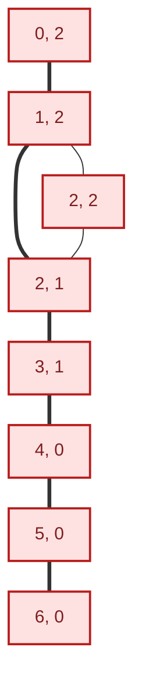

[מפת המסלול]({{ '/android/hex/' | relative_url }}) · [הפרק הקודם]({{ '/android/hex/02-moves-and-turns/' | relative_url }}) · [הפרק הבא]({{ '/android/hex/04-local-two-player/' | relative_url }}) · 


{: .box-success}
**בסוף הפרק:** חיבור אדום מלמעלה למטה או כחול משמאל לימין מוכרז כניצחון, ומשחק נוסף נחסם.

## הרעיון

שכני תא הם ההיסטים `(-1,0)`, `(-1,+1)`, `(0,-1)`, `(0,+1)`, `(+1,-1)`, `(+1,0)`. נתחיל בתאי שפת הפתיחה של השחקן ונעבור בעזרת `ArrayDeque` רק על אבנים מחוברות בצבעו. `visited` מונע ביקור חוזר. אם אדום הגיע לשורה 6 או כחול לעמודה 6, יש מנצח. `play` שומרת את המנצח ואז מחליפה שחקן גם במהלך סופי, כדי שקידוד היורש בפרק 5 יהיה עקבי.

## מהציור לגרף של קשרים {#connection-graph}

מסלול מנצח יכול להתפתל. לכן נחשוב על כל תא כצומת בגרף, ועל שכנות בין תאים כקשר. בזמן חיפוש עבור אדום נעבור רק בין אבנים אדומות; מיקום הפיקסלים של המשושים אינו משתתף בהחלטה.

לפניכם שתי דרכים להציג **את אותן אבנים אדומות**: במקומן על לוח המשושים, וכצמתים בגרף. כל זוג מספרים הוא שורה ועמודה, החל מ־0. בלוח מוצגות רק האבנים האדומות כדי להתמקד בחיבור; הגרף מציג חלק מקשרי השכנות ביניהן. הקשרים העבים בגרף מסמנים מסלול שמגיע משורה 0 לשורה 6.

<div class="two-columns hex-connection-comparison">
<div markdown="1" class="column">

### האבנים על הלוח


[פתיחת הלוח כ־SVG ניתן לעריכה]({{ '/android/hex/board-winning-path.svg' | relative_url }})

</div>
<div markdown="1" class="column">

### הקשרים בגרף

<div markdown="1" class="hex-diagram hex-diagram--graph">



</div>

</div>
</div>

עקבו אחר אותם מספרי תאים בשני התרשימים. התא <span dir="ltr">(2, 2)</span> יוצר עם התאים <span dir="ltr">(1, 2)</span> ו־<span dir="ltr">(2, 1)</span> משולש של שכנויות: על הלוח אלה משושים שנוגעים זה בזה, ובגרף אלה שלושה צמתים מחוברים.

מתחילים מכל האבנים האדומות בשורה 0 ומכניסים אותן לתור. בכל צעד מוציאים תא, בודקים אם הגיע לשפת היעד, ומוסיפים שכנים אדומים שטרם ביקרנו בהם. `visited` מונע סיבוב חוזר במעגל, כמו המשולש שמופיע בתרשימים. אם התור התרוקן לפני שהגענו ליעד, אין עדיין חיבור מנצח.

עבור כחול מפעילים אותו רעיון: מתחילים בעמודה 0, עוברים רק בין אבנים כחולות ומחפשים הגעה לעמודה 6.

{: .box-note}
**לפני הקוד:** אם נגדיל את המשושים המצוירים בלי לשנות את האבנים, האם המנצח יכול להשתנות? מה בשני התרשימים מסביר זאת?

## עורכים את הקבצים

עבדו לפי סדר התלות: משאבים ותלויות לפני קוד שמפנה אליהם; מחלקת חוקים לפני ה־Activity.

### strings.xml

**מיקום:** app > res > values. המשאב מרכז צבעים, מחרוזות או theme שהמסך משתמש בהם. שנו רק את השורות המוצגות.

```diff
     <string name="board_description">Seven by seven Hex board</string>
     <string name="status_red_turn">Red to move</string>
     <string name="status_blue_turn">Blue to move</string>
+    <string name="status_red_wins">Red wins — top connected to bottom</string>
+    <string name="status_blue_wins">Blue wins — left connected to right</string>
 </resources>
```

### HexGame.java

**מיקום:** app > kotlin+java > com.example.hex. מחלקת החוקים העצמאית. בחנו היכן המשחק משנה מצב והיכן הוא רק קורא אותו.

תנאי `play` מתרחב כדי לדחות גם משחק שכבר הוכרע; השינוי המלא מופיע ב־diff שלהלן.

```diff
 package com.example.hex;
 
+import java.util.ArrayDeque;
 import java.util.Arrays;
 
 /** The board state and rules, independent of pixels and Android widgets. */
     public static final int RED = 1;
     public static final int BLUE = 2;
 
+    private static final int[][] NEIGHBORS = {
+            {-1, 0}, {-1, 1}, {0, -1}, {0, 1}, {1, -1}, {1, 0}
+    };
+    private int winner = EMPTY;
     private final int[] cells = new int[CELL_COUNT];
     private int currentPlayer = RED;
 
     /** Places a stone only when the coordinate is empty and on the board. */
     public boolean play(int row, int column) {
-        if (isOutside(row, column) || cells[index(row, column)] != EMPTY) {
+        if (winner != EMPTY || isOutside(row, column)
+                || cells[index(row, column)] != EMPTY) {
             return false;
         }
         cells[index(row, column)] = currentPlayer;
+        if (hasConnection(currentPlayer)) winner = currentPlayer;
         currentPlayer = otherPlayer(currentPlayer);
         return true;
     }
 
+    /** Searches adjacent stones from the player's first goal edge to the opposite edge. */
+    public boolean hasConnection(int player) {
+        if (player != RED && player != BLUE) {
+            throw new IllegalArgumentException("Player must be RED or BLUE");
+        }
+        boolean[] visited = new boolean[CELL_COUNT];
+        ArrayDeque<Integer> frontier = new ArrayDeque<>();
+        for (int i = 0; i < SIZE; i++) {
+            int row = player == RED ? 0 : i;
+            int column = player == RED ? i : 0;
+            int start = index(row, column);
+            if (cells[start] == player) {
+                visited[start] = true;
+                frontier.add(start);
+            }
+        }
+        while (!frontier.isEmpty()) {
+            int position = frontier.removeFirst();
+            int row = position / SIZE;
+            int column = position % SIZE;
+            if ((player == RED && row == SIZE - 1)
+                    || (player == BLUE && column == SIZE - 1)) return true;
+            for (int[] offset : NEIGHBORS) {
+                int nextRow = row + offset[0];
+                int nextColumn = column + offset[1];
+                if (isOutside(nextRow, nextColumn)) continue;
+                int next = index(nextRow, nextColumn);
+                if (!visited[next] && cells[next] == player) {
+                    visited[next] = true;
+                    frontier.addLast(next);
+                }
+            }
+        }
+        return false;
+    }
+
+    /** Returns the winner, or EMPTY before a connection is complete. */
+    public int getWinner() {
+        return winner;
+    }
+
+    /** Returns true when no further moves may be played. */
+    public boolean isOver() {
+        return winner != EMPTY;
+    }
+
     /** Returns the stone at one legal board coordinate. */
     public int getCell(int row, int column) {
         if (isOutside(row, column)) {
```

### MainActivity.java

**מיקום:** app > kotlin+java > com.example.hex. ה־Activity מחברת בין View Binding, המשחק, הפקדים ועבודת המחשב. השאירו את הקוד שאינו מוצג ב־diff.

```diff
 
     private void render() {
         binding.boardView.setGame(game);
-        binding.statusText.setText(game.getCurrentPlayer() == HexGame.RED
-                ? R.string.status_red_turn : R.string.status_blue_turn);
+        binding.boardView.setEnabled(!game.isOver());
+        if (game.getWinner() == HexGame.RED) {
+            binding.statusText.setText(R.string.status_red_wins);
+        } else if (game.getWinner() == HexGame.BLUE) {
+            binding.statusText.setText(R.string.status_blue_wins);
+        } else {
+            binding.statusText.setText(game.getCurrentPlayer() == HexGame.RED
+                    ? R.string.status_red_turn : R.string.status_blue_turn);
+        }
     }
 }
```

## מריצים ומוודאים

בצעו Sync אם שיניתם Gradle,  ואז הפעילו את האפליקציה. שחקו מסלול אדום ומסלול כחול בשני משחקים. אחרי הודעת הניצחון, נגיעה נוספת לא מניחה אבן.

**שאלת הבנה:** למה אבנים שנראות סמוכות על המסך חייבות להיבדק לפי ששת ההיסטים?
