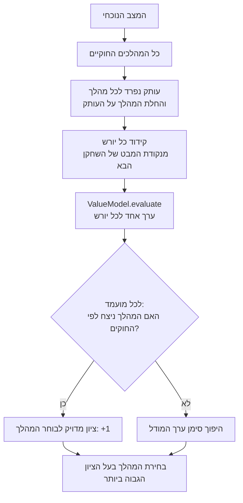
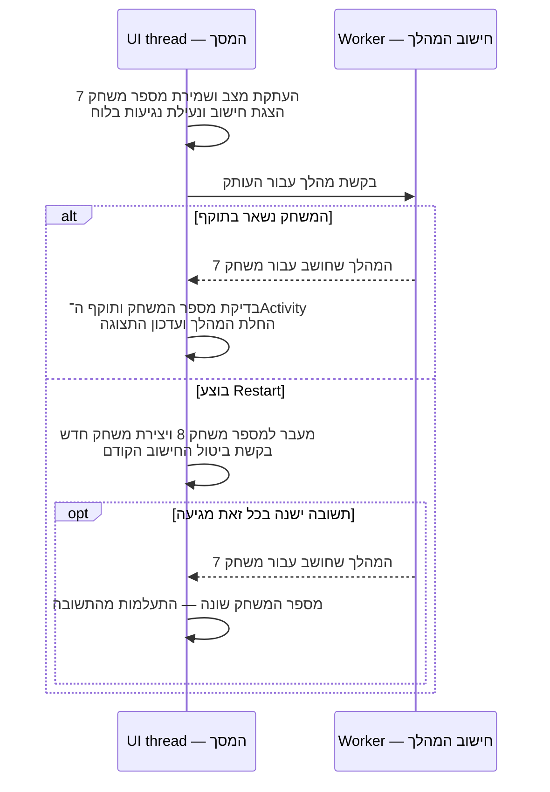

[מפת המסלול]({{ '/android/hex/' | relative_url }}) · [הפרק הקודם]({{ '/android/hex/05-model-preparation/' | relative_url }}) · [הפרק הבא]({{ '/android/hex/07-supplied-rl-models/' | relative_url }})

{: .box-success}
**בסוף הפרק:** האדם משחק אדום מול תשובת מחשב כחולה ממודל בדיקה לא מאומן. Restart או החלפת מצב פוסלים תשובת מחשב ממשחק קודם.

## הרעיון

`HexAi` יוצרת עותק נפרד של המשחק לכל מהלך חוקי, משחקת בו את המהלך ומקודדת את **מצב היורש**: מצב המשחק *אחרי* אותו מהלך. ה״יורש״ הוא מצב, לא שחקן ולא תגובה של היריב. המודל מעריך כל מצב כזה מנקודת מבטו של השחקן הבא, ולכן הופכים את סימן הערך כשחוזרים לנקודת מבטו של בוחר המהלך. ניצחון מיידי מקבל ציון `+1`. העבודה עם המודל רצה ב־`ExecutorService`, ו־`gameGeneration` מונע מתשובה ישנה לשנות משחק שהופעל מחדש. אין כאן מודל מאומן או דירוג של חוזק המשחק.

## איך הערכת מצב הופכת לבחירת מהלך? {#move-selection}

נניח שכחול צריך לבחור מהלך. לכל תא פנוי ניצור עותק של המשחק ונניח בו אבן כחולה. אלה **חלופות של מהלך אחד מאותו מצב**, ולא רצף מהלכים על הלוח האמיתי. למשל, אם יש שלושה תאים פנויים, מתקבלים שלושה מצבי יורש: הלוח אחרי מהלך A של כחול, הלוח אחרי מהלך B שלו והלוח אחרי מהלך C שלו. בכל אחד מהם גם רשום שעכשיו תורו של אדום. שלושת המצבים אינם תגובות של אדום; הם שלוש תוצאות אפשריות של *המהלך הנוכחי של כחול*.

**מה בדיוק מחשבים?** `ValueModel` מקבל את הקידוד של כל אחד ממצבי היורש ומחזיר **ערך אחד לכל מצב**, באותו סדר. הערך אומר עד כמה המצב נראה טוב לשחקן שבתור בו, כאן אדום. הוא אינו מחזיר ציון ישיר למהלך כחול, אינו מונה את התגובות האפשריות של אדום לכל מהלך כחול ואינו משווה ביניהן בזמן הבחירה. כדי לקבל ציון למהלך של כחול, `HexAi` הופכת את הסימן: מצב שטוב לאדום רע לכחול. רק אם כחול כבר ניצח במהלך הזה, חוקי המשחק נותנים למהלך ציון מדויק של `+1`, בלי להסתמך על תחזית המודל.

לכן **״מבט של צעד אחד קדימה״** פירושו יצירת מצב אחד קדימה *לכל מהלך מועמד*, והערכתו. אין כאן שכבה שנייה של מהלכי היריב. מודל מאומן יכול לשקף בהערכה שלו דפוסים ותוצאות שנלמדו ממשחקים קודמים, אבל `chooseMove` אינה בודקת כעת כיצד אדום יענה בפועל. בפרק הזה המודל עדיין לא מאומן ומחזיר אפס, כך שאין לפרש את הערכים שלו כתחזית אמינה.

<div markdown="1" class="hex-diagram">



</div>

בקוד שלנו שולחים את **כל** היורשים להערכה יחד, ואז מחשבים ציון לכל מהלך: בניצחון מיידי הציון הוא `+1`; אחרת הוא מינוס ערך היורש שהחזיר המודל. החוקים מכריעים תוצאה סופית; ערך המודל משמש להערכת מצבים שטרם הסתיימו. בוחרים את המהלך בעל הציון הגבוה ביותר.

המספרים בטבלה הם דוגמה להמחשה, ולא תוצאות שנמדדו במודל המסופק:

| מועמד של כחול | מצב היורש | ערך המודל עבור אדום | ציון עבור כחול |
|---:|---:|---:|---:|
| A | המשחק נמשך | <code dir="ltr">+0.70</code> | <code dir="ltr">-0.70</code> |
| B | המשחק נמשך | <code dir="ltr">-0.40</code> | <code dir="ltr">+0.40</code> |
| C | כחול כבר ניצח | אינו קובע את הציון | <code dir="ltr">+1.00</code> לפי החוקים |

בדוגמה נבחר C. המודל הלא מאומן של הפרק מחזיר אפס לכל מצב; כשאין ניצחון מיידי והציונים שווים, סדר המהלכים החוקיים מכריע את הבחירה. זו בדיקת חיבור, ולא אסטרטגיה שנלמדה.

{: .box-note}
**לפני הקוד:** אילו C לא היה אפשרי, מדוע כחול היה מעדיף את B דווקא כשהמודל מחזיר עבורו מספר קטן יותר?

## עורכים את הקבצים

עבדו לפי הסדר: קודם `HexAi`, אחר כך משאב המסך, ולבסוף `MainActivity`.

### HexAi.java

**מיקום:** app > kotlin+java > com.example.hex. הוסיפו קובץ Java חדש בשם `HexAi.java`. הלולאה הראשונה יוצרת מצב יורש וקלט למודל לכל מהלך חוקי; הלולאה השנייה מתאימה את הערכים שחזרו לאותם מהלכים ובוחרת את הטוב ביותר. הרשימות והמערך נשארים באותו סדר, ולכן האינדקס `i` מצביע בכל אחד מהם על אותו מועמד.

```java
package com.example.hex;

import java.util.ArrayList;
import java.util.List;

/**
 * Chooses computer moves by evaluating every legal one-move successor.
 *
 * <p>There is deliberately no heuristic fallback: callers must provide a validated value model.
 */
public final class HexAi {
    private final ValueModel model;

    /**
     * Creates a move selector backed by the supplied value model.
     *
     * @param model model that evaluates encoded positions from the player-to-move perspective
     * @throws IllegalArgumentException if {@code model} is {@code null}
     */
    public HexAi(ValueModel model) {
        if (model == null) {
            throw new IllegalArgumentException("A validated value model is required");
        }
        this.model = model;
    }

    /**
     * Selects the highest-valued legal move using one-step lookahead.
     *
     * @param position position to evaluate; it is not modified
     * @return the best legal move, or {@code null} if the game is already over
     * @throws IllegalStateException if the model returns the wrong number of values or a
     *                               non-finite value
     */
    public HexGame.Move chooseMove(HexGame position) {
        // A finished game has no move to choose.
        if (position.isOver()) {
            return null;
        }

        // Save whose move we are choosing before a copy advances the turn.
        int movingPlayer = position.getCurrentPlayer();
        List<HexGame.Move> legalMoves = position.legalMoves();
        List<HexGame> successors = new ArrayList<>(legalMoves.size());
        List<float[]> modelInputs = new ArrayList<>(legalMoves.size());
        // Build one independent successor and one model input per candidate move.
        for (HexGame.Move move : legalMoves) {
            // Copy so testing this candidate cannot change the real position.
            HexGame successor = position.copy();
            // Play exactly this candidate on its copy; the turn then advances.
            successor.play(move.row, move.column);
            // Keep the resulting state at the same index as its move.
            successors.add(successor);
            // Encode it for the next player, whose turn it now is.
            modelInputs.add(successor.encodeForCurrentPlayer());
        }

        // Evaluate all candidates; each result matches its input by index.
        float[] nextPlayerValues = model.evaluate(modelInputs);
        if (nextPlayerValues.length != legalMoves.size()) {
            throw new IllegalStateException("Model returned the wrong number of values");
        }

        HexGame.Move bestMove = null;
        float bestValue = Float.NEGATIVE_INFINITY;
        // Convert each successor value into the original mover's move score.
        for (int i = 0; i < legalMoves.size(); i++) {
            // Read the state produced by legalMoves.get(i).
            HexGame successor = successors.get(i);
            // An immediate win scores +1; otherwise negate the next player's value.
            float moverValue = successor.getWinner() == movingPlayer
                    ? 1.0f
                    : -nextPlayerValues[i];
            // A non-finite model prediction cannot be used to rank moves.
            if (Float.isNaN(moverValue) || Float.isInfinite(moverValue)) {
                throw new IllegalStateException("Model produced a non-finite value");
            }
            // Replace the current choice only for the first or a strictly better move.
            if (bestMove == null || moverValue > bestValue) {
                // The same index connects this score to its original legal move.
                bestMove = legalMoves.get(i);
                // Remember its score for comparison with later candidates.
                bestValue = moverValue;
            }
        }
        return bestMove;
    }
}
```

### TfliteValueModel.java — קובץ מסופק

**מיקום:** app > kotlin+java > com.example.hex. הקובץ `TfliteValueModel.java` כבר הועתק מחבילת המורה בפרק 5. הקובץ חייב להישאר בשם הזה ועם `package com.example.hex;` בראשו. אינכם צריכים להקליד את מחלקת השילוב: היא מממשת את `ValueModel`, בודקת את קובצי המודל ומחזירה ערך לכל מצב. בפרק הזה התמקדו בבחירת המהלך ובהרצה ברקע.

### activity_main.xml

**מיקום:** app > res > layout. עורכים דרך app > res > layout בתצוגת Code. אין למחוק רכיבי תבנית שאינם ב־diff.

```diff
             android:textColor="@color/muted"
             android:textSize="14sp" />
 
+        <TextView
+            android:layout_width="match_parent"
+            android:layout_height="wrap_content"
+            android:fontFamily="sans-serif-medium"
+            android:letterSpacing="0.1"
+            android:text="@string/mode_label"
+            android:textColor="@color/muted"
+            android:textSize="11sp" />
+
+        <RadioGroup
+            android:id="@+id/modeGroup"
+            android:layout_width="match_parent"
+            android:layout_height="wrap_content"
+            android:layout_marginTop="6dp"
+            android:layout_marginBottom="12dp"
+            android:orientation="horizontal">
+
+            <com.google.android.material.radiobutton.MaterialRadioButton
+                android:id="@+id/modeAi"
+                android:layout_width="0dp"
+                android:layout_height="wrap_content"
+                android:layout_weight="1"
+                android:checked="true"
+                android:text="@string/human_vs_ai" />
+
+            <com.google.android.material.radiobutton.MaterialRadioButton
+                android:id="@+id/modeHuman"
+                android:layout_width="0dp"
+                android:layout_height="wrap_content"
+                android:layout_weight="1"
+                android:text="@string/human_vs_human" />
+        </RadioGroup>
+
         <com.google.android.material.card.MaterialCardView
             android:layout_width="match_parent"
             android:layout_height="wrap_content"
```

### model_info.json — קובץ מסופק

**מיקום:** app > assets. הקובץ כבר הועתק מחבילת המורה בפרק 5, לצד `hex_value_v1.tflite`. אין להקליד או לשנות אותו. `untrained_mock: true` מציין שזה מודל בדיקה לחיבור, ו־`sha256` מזהה את קובץ המודל שאליו הוא שייך.

### לאיזה משחק שייכת תשובת המחשב? {#background-flow}

המסך צריך להמשיך להגיב גם בזמן שהמודל מחשב. לכן נשלח ל־worker עותק של המשחק ונחזיר את התוצאה ל־UI thread. אבל בינתיים המשתמש יכול ללחוץ Restart: תשובה שהייתה נכונה למשחק הקודם כבר אינה שייכת למשחק שמוצג עכשיו.

<div markdown="1" class="hex-diagram">



</div>

`gameGeneration` הוא מספר הדור של המשחק. שומרים אותו כשמתחילים חישוב ומשווים שוב כשמגיעה תשובה. `cancel(true)` מבקשת לעצור את העבודה, אבל בדיקת הדור מגינה גם כאשר תשובה כבר בדרך. ה־worker בוחן עותקים; **רק ה־UI thread מחילה תשובה שאושרה על המשחק החי** ומעדכנת את המסך. בודקים גם שה־Activity עדיין קיימת. החלפת מצב משחק משתמשת באותו עיקרון של התחלה מחדש.

{: .box-note}
**לפני חיבור המסך:** גם אם התא שהמחשב בחר עדיין פנוי לאחר Restart, מדוע אסור להחיל את התשובה הישנה?

### MainActivity.java

**מיקום:** app > kotlin+java > com.example.hex. ה־Activity מחברת בין View Binding, המשחק, הפקדים ועבודת המחשב. השאירו את הקוד שאינו מוצג ב־diff.

<details open markdown="1"><summary>השינוי המלא ב־MainActivity.java</summary>

```diff
 import androidx.core.view.ViewCompat;
 import androidx.core.view.WindowInsetsCompat;
 import com.example.hex.databinding.ActivityMainBinding;
+import java.util.concurrent.ExecutorService;
+import java.util.concurrent.Executors;
+import java.util.concurrent.Future;
 
-/** Connects board taps to the independent game state. */
+/** Coordinates human moves and an offline computer reply. */
 public final class MainActivity extends AppCompatActivity {
     private ActivityMainBinding binding;
     private HexGame game;
+    private TfliteValueModel valueModel;
+    private ExecutorService aiExecutor;
+    private Future<?> aiTask;
+    private boolean vsAi = true;
+    private boolean aiThinking;
+    private boolean modelLoading;
+    private int gameGeneration;
 
     @Override
     protected void onCreate(Bundle savedInstanceState) {
             v.setPadding(systemBars.left, systemBars.top, systemBars.right, systemBars.bottom);
             return insets;
         });
+        aiExecutor = Executors.newSingleThreadExecutor();
         game = new HexGame();
-        binding.boardView.setGame(game);
         binding.boardView.setOnCellClickListener(this::onCellClicked);
         binding.restartButton.setOnClickListener(view -> restartGame());
+        binding.modeAi.setChecked(true);
+        binding.modeGroup.setOnCheckedChangeListener((group, checkedId) -> {
+            boolean requestedAi = checkedId == R.id.modeAi;
+            if (requestedAi != vsAi) {
+                vsAi = requestedAi;
+                restartGame();
+            }
+        });
+        loadModel();
         render();
     }
 
+    private void loadModel() {
+        modelLoading = true;
+        aiExecutor.submit(() -> {
+            TfliteValueModel loaded = null;
+            try {
+                loaded = new TfliteValueModel(getApplicationContext());
+            } catch (Exception ignored) {
+                // The screen will say that the computer is unavailable.
+            }
+            TfliteValueModel result = loaded;
+            runOnUiThread(() -> {
+                if (isFinishing() || isDestroyed()) {
+                    if (result != null) result.close();
+                    return;
+                }
+                valueModel = result;
+                modelLoading = false;
+                render();
+            });
+        });
+    }
+
     private void onCellClicked(int row, int column) {
-        if (game.play(row, column)) {
-            render();
-        }
+        if (aiThinking || game.isOver()
+                || (vsAi && (modelLoading || valueModel == null
+                || game.getCurrentPlayer() != HexGame.RED))) return;
+        if (!game.play(row, column)) return;
+        render();
+        if (vsAi && !game.isOver()) startAiMove();
+    }
+
+    private void startAiMove() {
+        TfliteValueModel model = valueModel;
+        if (!vsAi || model == null || game.isOver()
+                || game.getCurrentPlayer() != HexGame.BLUE || aiThinking) return;
+        aiThinking = true;
+        render();
+        int generation = gameGeneration;
+        HexGame position = game.copy();
+        aiTask = aiExecutor.submit(() -> {
+            try {
+                HexGame.Move move = new HexAi(model).chooseMove(position);
+                runOnUiThread(() -> {
+                    if (isFinishing() || isDestroyed()
+                            || generation != gameGeneration || !aiThinking) return;
+                    aiThinking = false;
+                    if (move != null && game.getCurrentPlayer() == HexGame.BLUE) {
+                        game.play(move.row, move.column);
+                    }
+                    render();
+                });
+            } catch (RuntimeException exception) {
+                runOnUiThread(() -> {
+                    if (isFinishing() || isDestroyed()
+                            || generation != gameGeneration) return;
+                    aiThinking = false;
+                    valueModel = null;
+                    aiExecutor.submit(model::close);
+                    render();
+                });
+            }
+        });
     }
 
     private void restartGame() {
+        gameGeneration++;
+        aiThinking = false;
+        if (aiTask != null) {
+            aiTask.cancel(true);
+            aiTask = null;
+        }
         game = new HexGame();
         render();
     }
 
     private void render() {
         binding.boardView.setGame(game);
-        binding.boardView.setEnabled(!game.isOver());
-        binding.modelText.setText(R.string.model_local);
+        binding.boardView.setEnabled(!aiThinking && !game.isOver()
+                && (!vsAi || (!modelLoading && valueModel != null
+                && game.getCurrentPlayer() == HexGame.RED)));
         if (game.getWinner() == HexGame.RED) {
             binding.statusText.setText(R.string.status_red_wins);
         } else if (game.getWinner() == HexGame.BLUE) {
             binding.statusText.setText(R.string.status_blue_wins);
+        } else if (vsAi && modelLoading) {
+            binding.statusText.setText(R.string.status_model_loading);
+        } else if (vsAi && valueModel == null) {
+            binding.statusText.setText(R.string.ai_unavailable);
+        } else if (aiThinking) {
+            binding.statusText.setText(R.string.status_ai_thinking);
+        } else if (vsAi) {
+            binding.statusText.setText(R.string.status_your_turn);
         } else {
             binding.statusText.setText(game.getCurrentPlayer() == HexGame.RED
                     ? R.string.status_red_turn : R.string.status_blue_turn);
         }
+        binding.modelText.setText(vsAi
+                ? (valueModel == null ? R.string.model_unavailable_help
+                : R.string.model_untrained)
+                : R.string.model_local);
+    }
+
+    @Override
+    protected void onDestroy() {
+        gameGeneration++;
+        if (aiTask != null) aiTask.cancel(true);
+        TfliteValueModel model = valueModel;
+        valueModel = null;
+        if (model != null) aiExecutor.submit(model::close);
+        aiExecutor.shutdown();
+        binding = null;
+        super.onDestroy();
     }
 }
```

</details>

## מריצים ומוודאים

בצעו Sync אם שיניתם Gradle,  ואז הפעילו את האפליקציה. שחקו מהלך אדום וחכו לכחול. בזמן שהמחשב מחשב, לחצו Restart או עברו ל־Two players; מהלך ישן לא יופיע במשחק החדש.

**שאלת הבנה:** אם המודל מעריך את מצב היורש כטוב ליריב, איזה סימן יקבל מהלך השחקן הנוכחי?
