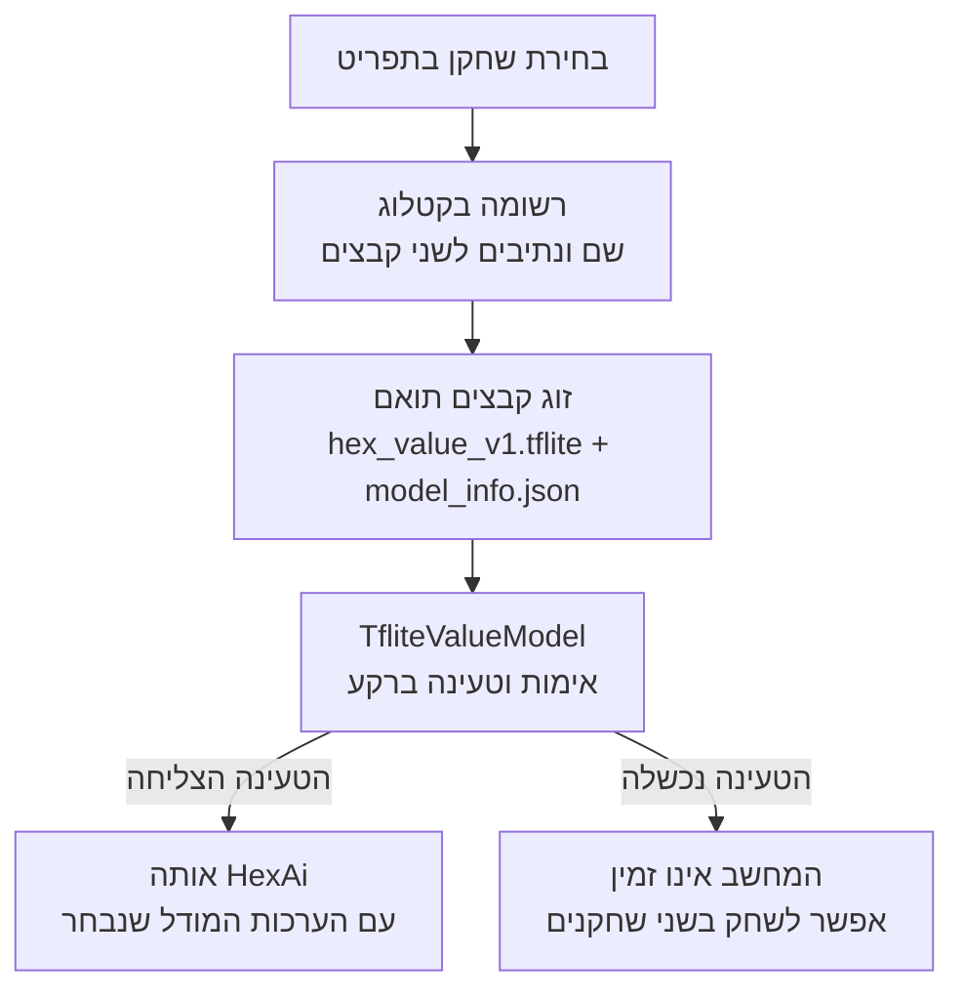

[מפת המסלול]({{ '/android/hex/' | relative_url }}) · [הפרק הקודם]({{ '/android/hex/06-background-ai/' | relative_url }}){: data-sequence-nav="prev"} · [הפרק הבא]({{ '/android/hex/08-day-night-themes/' | relative_url }}){: data-sequence-nav="next"}


{: .box-success}
**בסוף הפרק:** אפשר לבחור אחד משישה שחקני מחשב. כל בחירה מתחילה משחק חדש.

## הרעיון

`model_catalog.json` קובע את סדר השחקנים בתפריט ואת הנתיב המדויק לזוג קובצי מודל ומטא־דאטה. `ModelCatalog` בודקת גרסה, מזהים ייחודיים ונתיבי נכסים. החלפת שחקן מתבצעת ברקע, מאפסת משחק ופוסלת טעינה/תשובה ישנה. אם הזוג שנבחר פגום, המסך מציג שהמחשב לא זמין; מצב שני שחקנים ממשיך לעבוד. מספר איטרציות הוא שם checkpoint, לא דירוג עוצמה.

## מה משתנה כשבוחרים שחקן אחר? {#player-models}

ששת השחקנים משתמשים באותה `HexAi`: אותם חוקים, אותם מהלכים חוקיים ואותה הסתכלות מהלך אחד קדימה. הבחירה מחליפה את **המודל שמעריך את מצבי היורש**. משקלים אחרים עשויים לתת הערכות אחרות, ולכן אותו בוחר מהלכים יכול להשיב אחרת לאותו לוח.

<div markdown="1" class="hex-diagram">



</div>

הקטלוג מצביע על זוג מסוים: קובץ המודל וקובץ המטא־דאטה שמתאר אותו. החלפת הבחירה מתחילה משחק חדש ופוסלת טעינה או תשובה ישנה, כמו [בדיקת הדור בפרק 6]({{ '/android/hex/06-background-ai/#background-flow' | relative_url }}). אם הזוג שנבחר פגום, מציגים כשל במקום להחליף בשקט לשחקן אחר.

{: .box-note}
מספר האיטרציות מתאר מאיזה שלב באימון נשמר השחקן. הוא אינו דירוג קושי: כדי לטעון ששחקן אחד חזק יותר צריך להשוות שחקנים באותה שיטת בדיקה. מודל הבדיקה מפרק 6 נשאר שימושי לבדיקת השילוב גם כשיש מודלים מאומנים.

**לפני הקוד:** אם נחליף רק את קובץ המודל, אילו חלקים ב[מפת האחריות]({{ '/android/hex/#architecture' | relative_url }}) ימשיכו לעבוד באותה דרך? מדוע חשוב שהמסך יציג את זהות המודל שבאמת נטען?

{: .box-note}
[הורידו את חבילת שחקני המורה]({{ '/android/hex/downloads/06-players.zip' | relative_url }}) ופרשו את תיקיות `players/` תחת `app > assets`. בכל תיקייה יש שני קבצים ששייכים זה לזה: `hex_value_v1.tflite` ו־`model_info.json`. הם כבר מוכנים לשימוש; אין צורך לאמן מודלים.

## עורכים את הקבצים

עבדו לפי סדר התלות: משאבים ותלויות לפני קוד שמפנה אליהם; מחלקת חוקים לפני ה־Activity.

### ModelCatalog.java

**מיקום:** app > kotlin+java > com.example.hex. הקובץ החדש קורא את JSON הנכסים, מאמת את השורות ומחזיר אותן בסדר התפריט.

<details open markdown="1"><summary>הוסיפו את הקובץ החדש ModelCatalog.java</summary>

```java
package com.example.hex;

import android.content.Context;

import androidx.annotation.NonNull;

import org.json.JSONArray;
import org.json.JSONObject;

import java.io.InputStreamReader;
import java.nio.charset.StandardCharsets;
import java.util.ArrayList;
import java.util.Collections;
import java.util.HashSet;
import java.util.List;
import java.util.Set;

/**
 * Loads the available bundled computer-player levels from the asset catalog.
 *
 * <p>Preserved training checkpoints can be exposed by adding entries to the catalog asset.
 */
public final class ModelCatalog {
    /** Asset containing the list of bundled model levels. */
    public static final String CATALOG_ASSET = "model_catalog.json";
    private static final int CATALOG_VERSION = 1;

    private ModelCatalog() {
    }

    /**
     * Loads and validates all model levels in the bundled catalog.
     *
     * @param context Android context used to open application assets
     * @return an unmodifiable, non-empty list in catalog order
     * @throws Exception if the catalog cannot be read or does not satisfy its contract
     */
    public static List<Level> load(Context context) throws Exception {
        JSONObject catalog = readJson(context);
        if (catalog.getInt("catalog_version") != CATALOG_VERSION) {
            throw new IllegalArgumentException("Unsupported model catalog version");
        }

        JSONArray entries = catalog.getJSONArray("levels");
        if (entries.length() == 0) {
            throw new IllegalArgumentException("Model catalog must contain at least one level");
        }

        List<Level> levels = new ArrayList<>(entries.length());
        Set<String> ids = new HashSet<>();
        for (int i = 0; i < entries.length(); i++) {
            JSONObject entry = entries.getJSONObject(i);
            Level level = new Level(
                    requiredText(entry, "id"),
                    requiredText(entry, "label"),
                    requiredText(entry, "description"),
                    checkedAssetPath(requiredText(entry, "model_asset"), ".tflite"),
                    checkedAssetPath(requiredText(entry, "metadata_asset"), ".json"));
            if (!level.id.matches("[a-z0-9][a-z0-9-]*") || !ids.add(level.id)) {
                throw new IllegalArgumentException("Model catalog level IDs must be unique slugs");
            }
            levels.add(level);
        }
        return Collections.unmodifiableList(levels);
    }

    private static String requiredText(JSONObject object, String name) throws Exception {
        String value = object.getString(name).trim();
        if (value.isEmpty()) {
            throw new IllegalArgumentException("Model catalog field is empty: " + name);
        }
        return value;
    }

    private static String checkedAssetPath(String path, String suffix) {
        if (path.startsWith("/") || path.contains("\\") || !path.endsWith(suffix)) {
            throw new IllegalArgumentException("Invalid model catalog asset path: " + path);
        }
        for (String segment : path.split("/")) {
            if (segment.isEmpty() || ".".equals(segment) || "..".equals(segment)) {
                throw new IllegalArgumentException("Invalid model catalog asset path: " + path);
            }
        }
        return path;
    }

    private static JSONObject readJson(Context context) throws Exception {
        StringBuilder jsonText = new StringBuilder();
        try (InputStreamReader reader = new InputStreamReader(
                context.getAssets().open(CATALOG_ASSET), StandardCharsets.UTF_8)) {
            char[] buffer = new char[1024];
            int count;
            while ((count = reader.read(buffer)) != -1) {
                jsonText.append(buffer, 0, count);
            }
        }
        return new JSONObject(jsonText.toString());
    }

    /** Describes one selectable computer-player model and its bundled assets. */
    public static final class Level {
        /** Stable slug that uniquely identifies the level. */
        public final String id;
        /** Short user-facing level name. */
        public final String label;
        /** User-facing explanation of the model or checkpoint. */
        public final String description;
        /** Relative asset path to the TFLite model. */
        public final String modelAsset;
        /** Relative asset path to the model metadata JSON. */
        public final String metadataAsset;

        private Level(String id, String label, String description,
                      String modelAsset, String metadataAsset) {
            this.id = id;
            this.label = label;
            this.description = description;
            this.modelAsset = modelAsset;
            this.metadataAsset = metadataAsset;
        }

        @Override
        @NonNull
        public String toString() {
            return label;
        }
    }
}
```

</details>

### activity_main.xml

**מיקום:** app > res > layout. עורכים דרך app > res > layout בתצוגת Code. אין למחוק רכיבי תבנית שאינם ב־diff.

```diff
                 android:text="@string/human_vs_human" />
         </RadioGroup>
 
+        <LinearLayout
+            android:id="@+id/computerLevelContainer"
+            android:layout_width="match_parent"
+            android:layout_height="wrap_content"
+            android:layout_marginBottom="12dp"
+            android:orientation="vertical">
+
+            <TextView
+                android:layout_width="match_parent"
+                android:layout_height="wrap_content"
+                android:fontFamily="sans-serif-medium"
+                android:letterSpacing="0.1"
+                android:text="@string/computer_level_label"
+                android:textColor="@color/muted"
+                android:textSize="11sp" />
+
+            <Spinner
+                android:id="@+id/computerLevelSpinner"
+                android:layout_width="match_parent"
+                android:layout_height="48dp"
+                android:contentDescription="@string/computer_level_label"
+                android:spinnerMode="dropdown" />
+
+            <TextView
+                android:layout_width="match_parent"
+                android:layout_height="wrap_content"
+                android:text="@string/computer_levels_pending"
+                android:textColor="@color/muted"
+                android:textSize="12sp" />
+        </LinearLayout>
+
         <com.google.android.material.card.MaterialCardView
             android:layout_width="match_parent"
             android:layout_height="wrap_content"
```

### model_catalog.json

**מיקום:** app > assets. צרו קובץ חדש בשם `model_catalog.json`. הוסיפו שורה לקטלוג רק לאחר שקיבלתם זוג model/metadata מתאים; השורה הראשונה היא ברירת המחדל.

סדר השורות הוא סדר ה־Spinner: `early-test`,‏ `trained-000010`,‏ `trained-000100`,‏ `trained-001000`,‏ `trained-002620`,‏ `trained-005000`. זהו הסדר של הייחוס הנוכחי.

```json
{
  "catalog_version": 1,
  "levels": [
    {
      "id": "early-test",
      "label": "Early training - iteration 3",
      "description": "Only 3 training iterations; strength not established",
      "model_asset": "players/early-test/hex_value_v1.tflite",
      "metadata_asset": "players/early-test/model_info.json"
    },
    {
      "id": "trained-000010",
      "label": "Trained — iteration 10",
      "description": "A100 self-play training ·10 iterations · fully offline",
      "model_asset": "players/trained-000010/hex_value_v1.tflite",
      "metadata_asset": "players/trained-000010/model_info.json"
    },
    {
      "id": "trained-000100",
      "label": "Trained — iteration 100",
      "description": "A100 self-play training ·100 iterations · fully offline",
      "model_asset": "players/trained-000100/hex_value_v1.tflite",
      "metadata_asset": "players/trained-000100/model_info.json"
    },
    {
      "id": "trained-001000",
      "label": "Trained — iteration 1000",
      "description": "A100 self-play training ·1000 iterations · fully offline",
      "model_asset": "players/trained-001000/hex_value_v1.tflite",
      "metadata_asset": "players/trained-001000/model_info.json"
    },
    {
      "id": "trained-002620",
      "label": "Trained — iteration 2,620",
      "description": "A100 self-play training · 2,620 iterations · fully offline",
      "model_asset": "players/trained-002620/hex_value_v1.tflite",
      "metadata_asset": "players/trained-002620/model_info.json"
    },
    {
      "id": "trained-005000",
      "label": "Trained — iteration 5,000",
      "description": "A100 self-play training ·5,000 iterations · fully offline",
      "model_asset": "players/trained-005000/hex_value_v1.tflite",
      "metadata_asset": "players/trained-005000/model_info.json"
    }
  ]
}
```

### MainActivity.java

**מיקום:** app > kotlin+java > com.example.hex. הוסיפו את בחירת השחקן ואת החלפת המודל. המתודות המטפלות במהלך מחשב ובכישלון כבר קיימות מפרק 6; כאן מוסיפים את ההגנות הדרושות כאשר אפשר להחליף מודל בזמן שחישוב קודם מסתיים.

בתוך `handleAiFailure` בודקים שהמודל שנכשל הוא עדיין המודל הפעיל לפני שמאפסים אותו. כך כישלון של מודל קודם אינו מוחק מודל חדש שכבר נטען. בצעו את קטעי השינוי לפי הסדר.

```diff
 package com.example.hex;
 
 import android.os.Bundle;
+import android.view.View;
+import android.widget.AdapterView;
+import android.widget.ArrayAdapter;
 
 import androidx.activity.EdgeToEdge;
 import androidx.appcompat.app.AppCompatActivity;
 import androidx.core.graphics.Insets;
```

```diff
 import androidx.core.view.WindowInsetsCompat;
 
 import com.example.hex.databinding.ActivityMainBinding;
 
+import java.util.Collections;
+import java.util.List;
 import java.util.concurrent.ExecutorService;
 import java.util.concurrent.Executors;
 import java.util.concurrent.Future;
+import java.util.concurrent.atomic.AtomicInteger;
 
 /** Hosts the game screen and coordinates board input, model loading, and background AI turns. */
 public final class MainActivity extends AppCompatActivity {
     private ActivityMainBinding binding;
     private HexGame game;
     private TfliteValueModel valueModel;
     private ExecutorService aiExecutor;
     private Future<?> aiTask;
+    private List<ModelCatalog.Level> computerLevels = Collections.emptyList();
+    private ModelCatalog.Level selectedLevel;
     private boolean vsAi = true;
     private boolean aiThinking;
     private boolean modelLoading;
     private int gameGeneration;
+    private final AtomicInteger modelSelectionGeneration = new AtomicInteger();
 
     @Override
     protected void onCreate(Bundle savedInstanceState) {
         super.onCreate(savedInstanceState);
```

```diff
         binding.modeGroup.setOnCheckedChangeListener((group, checkedId) -> {
             boolean requestedAi = checkedId == R.id.modeAi;
             if (requestedAi != vsAi) {
                 vsAi = requestedAi;
+                binding.computerLevelContainer.setVisibility(vsAi ? View.VISIBLE : View.GONE);
                 restartGame();
             }
         });
-        loadModel();
-
-        render();
-    }
-
-    private void loadModel() {
+        setupComputerLevels();
+
+        render();
+        if (vsAi && game.getCurrentPlayer() == HexGame.BLUE && !game.isOver()) {
+            startAiMove();
+        }
+    }
+
+    private void setupComputerLevels() {
+        try {
+            computerLevels = ModelCatalog.load(getApplicationContext());
+        } catch (Exception exception) {
+            computerLevels = Collections.emptyList();
+            binding.computerLevelSpinner.setEnabled(false);
+            return;
+        }
+
+        ArrayAdapter<ModelCatalog.Level> adapter = new ArrayAdapter<>(this,
+                android.R.layout.simple_spinner_item, computerLevels);
+        adapter.setDropDownViewResource(android.R.layout.simple_spinner_dropdown_item);
+        binding.computerLevelSpinner.setAdapter(adapter);
+        binding.computerLevelSpinner.setSelection(0, false);
+        binding.computerLevelSpinner.setOnItemSelectedListener(
+                new AdapterView.OnItemSelectedListener() {
+                    @Override
+                    public void onItemSelected(AdapterView<?> parent, View view,
+                                               int position, long id) {
+                        switchComputerLevel(computerLevels.get(position));
+                    }
+
+                    @Override
+                    public void onNothingSelected(AdapterView<?> parent) {
+                        // The current selection remains active.
+                    }
+                });
+        switchComputerLevel(computerLevels.get(0));
+    }
+
+    private void switchComputerLevel(ModelCatalog.Level level) {
+        if (level == selectedLevel && (modelLoading || valueModel != null)) {
+            return;
+        }
+
+        selectedLevel = level;
+        int selectionGeneration = modelSelectionGeneration.incrementAndGet();
+        TfliteValueModel previousModel = valueModel;
+        valueModel = null;
         modelLoading = true;
+        restartGame();
+
         aiExecutor.submit(() -> {
-            TfliteValueModel loaded = null;
+            if (previousModel != null) {
+                previousModel.close();
+            }
+            if (selectionGeneration != modelSelectionGeneration.get()) {
+                return;
+            }
+
+            TfliteValueModel loadedModel = null;
+            Exception loadFailure = null;
             try {
-                loaded = new TfliteValueModel(getApplicationContext());
-            } catch (Exception ignored) {
-                // The screen will say that the computer is unavailable.
-            }
-            TfliteValueModel result = loaded;
-            runOnUiThread(() -> {
-                if (isFinishing() || isDestroyed()) {
-                    if (result != null) {
-                        result.close();
-                    }
-                    return;
-                }
-                valueModel = result;
-                modelLoading = false;
-                render();
-            });
-        });
+                loadedModel = new TfliteValueModel(getApplicationContext(),
+                        level.modelAsset, level.metadataAsset);
+            } catch (Exception exception) {
+                loadFailure = exception;
+            }
+
+            TfliteValueModel result = loadedModel;
+            Exception failure = loadFailure;
+            runOnUiThread(() -> finishModelSwitch(
+                    selectionGeneration, level, result, failure));
+        });
+    }
+
+    private void finishModelSwitch(int selectionGeneration, ModelCatalog.Level level,
+                                   TfliteValueModel loadedModel, Exception failure) {
+        if (isFinishing() || isDestroyed()
+                || selectionGeneration != modelSelectionGeneration.get()
+                || selectedLevel != level) {
+            if (loadedModel != null) {
+                loadedModel.close();
+            }
+            return;
+        }
+
+        modelLoading = false;
+        valueModel = failure == null ? loadedModel : null;
+        render();
     }
 
     private void onCellClicked(int row, int column) {
         if (aiThinking || (vsAi && modelLoading) || game.isOver()
```

```diff
     private void startAiMove() {
         TfliteValueModel model = valueModel;
         if (!vsAi || model == null || game.isOver()
                 || game.getCurrentPlayer() != HexGame.BLUE || aiThinking) {
+            render();
             return;
         }
 
         aiThinking = true;
```

```diff
         if (isFinishing() || isDestroyed() || generation != gameGeneration) {
             return;
         }
         aiThinking = false;
-        valueModel = null;
-        aiExecutor.submit(failedModel::close);
+        if (valueModel == failedModel) {
+            valueModel = null;
+            aiExecutor.submit(failedModel::close);
+        }
         render();
     }
 
     private void restartGame() {
```

```diff
         }
 
         if (!vsAi) {
             binding.modelText.setText(R.string.model_local);
+        } else if (selectedLevel == null) {
+            binding.modelText.setText(R.string.model_unavailable_help);
+        } else if (modelLoading) {
+            binding.modelText.setText(getString(R.string.model_loading, selectedLevel.label));
         } else if (valueModel == null) {
             binding.modelText.setText(R.string.model_unavailable_help);
+        } else if (valueModel.isUntrainedMock()) {
+            binding.modelText.setText(R.string.model_untrained);
         } else {
-            binding.modelText.setText(R.string.model_untrained);
+            binding.modelText.setText(selectedLevel.description);
         }
     }
 
     @Override
     protected void onDestroy() {
         gameGeneration++;
+        modelSelectionGeneration.incrementAndGet();
         if (aiTask != null) {
             aiTask.cancel(true);
         }
         TfliteValueModel modelToClose = valueModel;
```

{: .box-warning}
מטא־דאטה וזוגות `.tflite` של ששת השחקנים מגיעים יחד בחבילת המורה ואינם נכתבים ידנית. אל תערבבו קובץ מודל משורה אחת עם `model_info.json` משורה אחרת. ברירת המחדל היא `early-test`. המטא־דאטה שלה מכילה `untrained_mock: true`, ולכן מסך הייחוס מכנה אותה מודל בדיקה אף ששמה מציין שלוש איטרציות. אל תציגו אותה כבעלת חוזק נמדד.

## מריצים ומוודאים

בצעו Sync אם שיניתם Gradle,  ואז הפעילו את האפליקציה. עברו על כל שש הבחירות: כל מעבר מאפס את הלוח; לאחר מהלך אדום מתקבלת תשובה כחולה חוקית.

**שאלת הבנה:** למה יש לשמור קובץ TFLite והמטא־דאטה שלו כזוג?

[לשיעור הבא: ערכות נושא ליום וללילה ←]({{ '/android/hex/08-day-night-themes/' | relative_url }})

## כך נראה המסך בסיום הפרק


בתמונה נבחר שחקן המחשב הראשון. אפשר להחליף אותו בתפריט שמעל הלוח.
