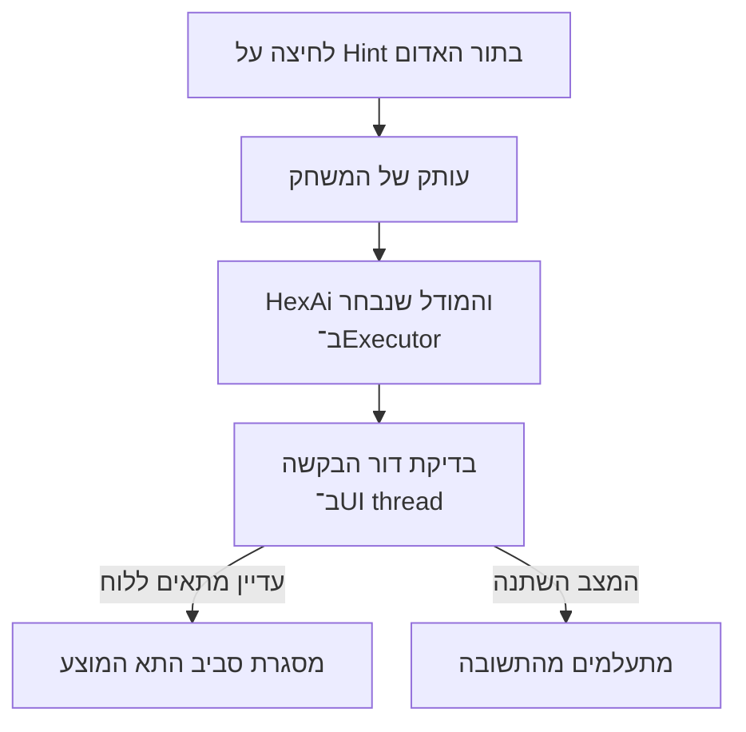

[מפת המסלול]({{ '/android/hex/' | relative_url }}) · [הפרק הקודם]({{ '/android/hex/07-supplied-rl-models/' | relative_url }}){: data-sequence-nav="prev"} · [הפרק הבא]({{ '/android/hex/09-day-night-themes/' | relative_url }}){: data-sequence-nav="next"}

{: .box-success}
**בסוף הפרק:** במשחק מול מחשב, לחיצה על **Hint** בתור האדום מבקשת מהמודל שנבחר להציע מהלך. התא המוצע מוקף בלוח, אבל לא מונחת בו אבן. השחקן עדיין בוחר בעצמו היכן לשחק.

## הרעיון

`HexAi.chooseMove` כבר מקבלת עותק של מצב משחק ובוחרת מהלך חוקי עבור **השחקן שתורו כעת**. בפרק 6 השתמשנו בתוצאה כדי להניח אבן כחולה. עכשיו נקרא לאותה מתודה בתור האדום, אבל נעביר את התוצאה אל תצוגת הלוח במקום אל `game.play`. אין צורך במודל שני או באלגוריתם בחירה חדש.

גם בקשת רמז פועלת ברקע: חיזוי המודל אינו צריך לעצור את המסך. בזמן החישוב מותר לשחק מהלך אחר. לכן תשובה שמגיעה אחרי מהלך, Restart או החלפת מודל חייבת להיפסל. `hintGeneration` הוא מספר שמשתנה בכל פעם שמבטלים את הרמז של המצב הישן; בקשת הרמז זוכרת את המספר שהיה כשהתחילה.

<div markdown="1" class="hex-diagram">



</div>

## עורכים את הקבצים

התחילו ממצב הפרויקט בסוף [פרק 7]({{ '/android/hex/07-supplied-rl-models/' | relative_url }}). קטעי `diff` מציגים רק את השורות שצריך לשנות; שורות בלי `+` או `-` הן הקשר ואין להעתיק את סימני ה־diff לקובץ. סדר העבודה כאן יוצר קודם משאבים ורכיבי מסך, ואז את קוד Java שמשתמש בהם.

### strings.xml ו־colors.xml

ב־`app > res > values > strings.xml` הוסיפו את טקסט הכפתור ואת שני מצבי ההודעה. מספרי השורה והעמודה יוצגו למשתמש מ־1 עד 7, אף שבקוד הם מתחילים מ־0.

```diff
     <string name="restart">Restart game</string>
+    <string name="hint">Hint</string>
+    <string name="hint_thinking">Finding a move…</string>
+    <string name="hint_ready">Suggested move: row %1$d, column %2$d</string>
     <string name="red_goal">RED · TOP ↕ BOTTOM</string>
```

ב־`app > res > values > colors.xml` הוסיפו צבע נפרד למסגרת של התא המוצע:

```diff
     <color name="hex_line">#324154</color>
+    <color name="hex_hint">#D18B00</color>
     <color name="muted">#667085</color>
```

### activity_main.xml

ב־`app > res > layout > activity_main.xml` החליפו את כפתור ה־Restart שבתחתית המסך בשורה של שני כפתורים. ה־`LinearLayout` מחלק את הרוחב ביניהם, וה־`id` של Restart נשאר כפי שהיה כך שהמאזין הקיים ממשיך לעבוד.

```diff
-        <com.google.android.material.button.MaterialButton
-            android:id="@+id/restartButton"
-            style="@style/Widget.Material3.Button.TonalButton"
+        <LinearLayout
             android:layout_width="match_parent"
             android:layout_height="wrap_content"
-            android:text="@string/restart"
-            app:icon="@android:drawable/ic_popup_sync"
-            app:iconGravity="textStart" />
+            android:orientation="horizontal">
+
+            <com.google.android.material.button.MaterialButton
+                android:id="@+id/hintButton"
+                style="@style/Widget.Material3.Button.TonalButton"
+                android:layout_width="0dp"
+                android:layout_height="wrap_content"
+                android:layout_weight="1"
+                android:layout_marginEnd="8dp"
+                android:text="@string/hint" />
+
+            <com.google.android.material.button.MaterialButton
+                android:id="@+id/restartButton"
+                style="@style/Widget.Material3.Button.TonalButton"
+                android:layout_width="0dp"
+                android:layout_height="wrap_content"
+                android:layout_weight="1"
+                android:text="@string/restart"
+                app:icon="@android:drawable/ic_popup_sync"
+                app:iconGravity="textStart" />
+        </LinearLayout>
     </LinearLayout>
 </ScrollView>
```

### HexAi.java

הבוחר הקיים לא משתנה מבחינה התנהגותית. עדכנו רק את תיאור המחלקה ב־`HexAi.java`, כי מעכשיו היא משמשת גם להצעה שאינה משוחקת:


 /**
- * Chooses computer moves by evaluating every legal one-move successor.
+ * Chooses or suggests moves by evaluating every legal one-move successor.
  *
  * <p>There is deliberately no heuristic fallback: callers must provide a validated value model.


### HexBoardView.java

ה־View מצייר את הרמז, אך אינו בוחר אותו ואינו משנה את חוקי המשחק. הוסיפו שדה ששומר את התא המוצע ושדה לצבע המסגרת:

```diff
     private HexGame game = new HexGame();
+    private HexGame.Move hintMove;
     private OnCellClickListener listener;
```

```diff
     private final int lineColor;
+    private final int hintColor;
```

אתחלו את הצבע בבנאי, לאחר `lineColor`:

```diff
         lineColor = ContextCompat.getColor(context, R.color.hex_line);
+        hintColor = ContextCompat.getColor(context, R.color.hex_hint);
         strokePaint.setStyle(Paint.Style.STROKE);
```

אחרי `setGame` הוסיפו מתודה שמקבלת הצעה חדשה או `null` להסרתה. `invalidate()` מבקש ציור מחדש, בדיוק כמו ב־`setGame`:

```diff
     public void setGame(HexGame game) {
         this.game = game;
         invalidate();
     }

+    /**
+     * Highlights the suggested empty cell and schedules a redraw.
+     *
+     * @param move suggested cell, or {@code null} to remove the highlight
+     */
+    public void setHintMove(@Nullable HexGame.Move move) {
+        hintMove = move;
+        invalidate();
+    }
+
     /**
      * Sets the listener notified when the user taps a board cell.
```

בתוך הלולאה של `onDraw`, מיד אחרי ציור המילוי והקו הרגיל של המשושה, הוסיפו מסגרת עבה רק אם התא ריק ותואם לקואורדינטות ההצעה. אחרי ציורה מחזירים את `strokePaint` לצבע ולעובי הרגילים כדי ששאר הלוח ייראה כרגיל:

```diff
                 canvas.drawPath(hexPath, fillPaint);
                 canvas.drawPath(hexPath, strokePaint);
+                if (cell == HexGame.EMPTY && hintMove != null
+                        && hintMove.row == row && hintMove.column == column) {
+                    strokePaint.setColor(hintColor);
+                    strokePaint.setStrokeWidth(dp(4));
+                    canvas.drawPath(hexPath, strokePaint);
+                    strokePaint.setColor(lineColor);
+                    strokePaint.setStrokeWidth(dp(1.5f));
+                }
             }
```

### MainActivity.java

ה־Activity אחראית להפעיל את החישוב, לבדוק שהתוצאה עדיין מתאימה למצב ולנקות רמז קודם. הוסיפו את השדות הבאים ליד שדות ה־AI הקיימים. `hintTask` מאפשר לבטל עבודה, `hintMove` הוא התוצאה המוצגת, ו־`hintGeneration` פוסל גם callback שכבר הוכנס לתור של ה־UI thread.

```diff
     private Future<?> aiTask;
+    private Future<?> hintTask;
     private List<ModelCatalog.Level> computerLevels = Collections.emptyList();
     private ModelCatalog.Level selectedLevel;
     private boolean vsAi = true;
     private boolean aiThinking;
+    private boolean hintThinking;
+    private HexGame.Move hintMove;
+    private int hintGeneration;
     private boolean modelLoading;
```

ב־`onCreate`, חברו את הכפתור למתודת הבקשה:

```diff
         binding.restartButton.setOnClickListener(view -> restartGame());
+        binding.hintButton.setOnClickListener(view -> startHint());
         binding.modeGroup.setOnCheckedChangeListener((group, checkedId) -> {
```

ב־`onCellClicked`, נקו רמז רק **אחרי** ש־`game.play` הצליחה. הקשה על תא תפוס אינה משנה את המצב ולכן אינה מוחקת את ההצעה:

```diff
         if (!game.play(row, column)) {
             return;
         }
+        clearHint();
         render();
```

מיד לפני `applyAiMove`, הוסיפו את ארבע המתודות הבאות. `startHint` משתמשת במודל שכבר נבחר, מצלמת עותק של הלוח ומריצה עליו את אותה `HexAi` שמשחקת עבור כחול. אין כאן קריאה ל־`game.play` עם המהלך שהתקבל.

```diff
+    /**
+     * Asks the selected computer model for Red's move without changing the game.
+     * Only one hint request can run for a position, and the request uses a board copy.
+     */
+    private void startHint() {
+        TfliteValueModel model = valueModel;
+        if (!vsAi || modelLoading || model == null || game.isOver() || aiThinking
+                || hintThinking || hintMove != null || game.getCurrentPlayer() != HexGame.RED) {
+            return;
+        }
+
+        hintThinking = true;
+        render();
+        int generation = hintGeneration;
+        // Evaluate a snapshot off the UI thread, just as a computer turn does.
+        HexGame position = game.copy();
+        hintTask = aiExecutor.submit(() -> {
+            try {
+                HexGame.Move move = new HexAi(model).chooseMove(position);
+                runOnUiThread(() -> showHint(generation, move));
+            } catch (RuntimeException exception) {
+                runOnUiThread(() -> handleHintFailure(generation, model));
+            }
+        });
+    }
+
+    /**
+     * Shows a completed suggestion only if it still belongs to the current position.
+     *
+     * @param generation hint request ID captured before the background evaluation
+     * @param move suggested cell, or {@code null} if no legal move was found
+     */
+    private void showHint(int generation, HexGame.Move move) {
+        // finish() or onDestroy() may have started before this UI callback runs.
+        // A different generation means a move, restart, or model change invalidated the hint.
+        // If hintThinking is false, this request is no longer active.
+        if (isFinishing() || isDestroyed() || generation != hintGeneration || !hintThinking) {
+            return;
+        }
+        hintThinking = false;
+        hintMove = move;
+        render();
+    }
+
+    /**
+     * Discards a failed hint and releases the model if it is still the selected one.
+     *
+     * @param generation hint request ID captured before the background evaluation
+     * @param failedModel model used by the failed request
+     */
+    private void handleHintFailure(int generation, TfliteValueModel failedModel) {
+        if (isFinishing() || isDestroyed() || generation != hintGeneration) {
+            return;
+        }
+        hintThinking = false;
+        if (valueModel == failedModel) {
+            valueModel = null;
+            aiExecutor.submit(failedModel::close);
+        }
+        render();
+    }
+
+    /** Invalidates work from the old position, including results already queued for the UI. */
+    private void clearHint() {
+        hintGeneration++;
+        hintThinking = false;
+        hintMove = null;
+        if (hintTask != null) {
+            hintTask.cancel(true);
+            hintTask = null;
+        }
+    }
+
     private void applyAiMove(int generation, HexGame.Move move) {
```

`Future.cancel(true)` מנסה לעצור עבודה שעדיין פועלת, אבל הוא אינו מספיק לבדו: תשובה יכלה כבר להישלח אל `runOnUiThread`. העלאת `hintGeneration` ב־`clearHint` מונעת גם מתשובה כזאת להציג רמז על הלוח החדש.

#### למה `showHint` בודקת ארבעה תנאים? {#show-hint-guard}

כל התנאים מחוברים ב־`||`: אם **אחד** מהם נכון, אין להציג את התוצאה.

| תנאי | מה הוא מונע |
|---:|---:|
| `isFinishing()` | עדכון מסך שהתחיל להיסגר בעקבות `finish()`. |
| `isDestroyed()` | גישה ל־View אחרי `onDestroy`, כשה־binding כבר אינו שמיש. |
| `generation != hintGeneration` | הצגת תוצאה שחושבה למצב קודם: מהלך חדש, Restart או החלפת מודל/מצב משחק קראו ל־`clearHint`. |
| `!hintThinking` | טיפול בתוצאה של בקשה שכבר אינה פעילה, גם אם הגנת הדור לבדה לא תפסה אותה. |

כשכל ארבע הבדיקות שקריות, `hintMove = move` שומרת את ההצעה ו־`render()` שולחת אותה ל־`HexBoardView`. המתודה אינה משחקת את המהלך.

ב־`restartGame`, בטלו את הרמז של המשחק הקודם לפני יצירת הלוח החדש. שינוי מצב משחק או בחירת מודל כבר קוראים ל־`restartGame`, ולכן הם עוברים דרך אותו ניקוי:

```diff
-    /** Resets the board and invalidates pending computer moves. */
+    /** Resets the board and invalidates pending computer moves and hints. */
     private void restartGame() {
         gameGeneration++;
         aiThinking = false;
+        clearHint();
         if (aiTask != null) {
```

ב־`render`, שלחו את ההצעה ללוח. הכפתור מוצג רק מול מחשב ומופעל רק כשהאדם יכול לשחק, המודל זמין, אין חישוב רמז פעיל ואין כבר הצעה על הלוח:

```diff
     private void render() {
         binding.boardView.setGame(game);
+        binding.boardView.setHintMove(hintMove);
         boolean canTap = !aiThinking && !game.isOver()
                 && (!vsAi || (!modelLoading && valueModel != null
                 && game.getCurrentPlayer() == HexGame.RED));
         binding.boardView.setEnabled(canTap);
+        binding.hintButton.setVisibility(vsAi ? View.VISIBLE : View.GONE);
+        binding.hintButton.setEnabled(vsAi && canTap && valueModel != null
+                && !hintThinking && hintMove == null);
```

בהמשך אותה מתודת `render`, הוסיפו את מצבי ההודעה אחרי `aiThinking`. הצגת קואורדינטות מ־1 עד 7 הופכת אותן לקריאות לאדם:

```diff
         } else if (aiThinking) {
             binding.statusText.setText(R.string.status_ai_thinking);
+        } else if (hintThinking) {
+            binding.statusText.setText(R.string.hint_thinking);
+        } else if (hintMove != null) {
+            binding.statusText.setText(getString(R.string.hint_ready,
+                    hintMove.row + 1, hintMove.column + 1));
         } else if (vsAi) {
```

לבסוף, ב־`onDestroy`, בטלו בקשה פעילה לפני סגירת המודל וה־Executor:

```diff
     protected void onDestroy() {
         gameGeneration++;
         modelSelectionGeneration.incrementAndGet();
+        clearHint();
         if (aiTask != null) {
```

## מריצים ובודקים

1. הפעילו משחק **Human vs Computer** והמתינו שהמודל ייטען. לחצו **Hint** בתור האדום: מופיעה מסגרת סביב תא ריק וההודעה מציינת שורה ועמודה. מספר האבנים אינו משתנה והתור נשאר אדום.
2. שחקו תא חוקי אחר, גם אם הוא שונה מן ההצעה. המסגרת נעלמת, והמחשב משחק את תורו הכחול כרגיל. לחיצה על תא תפוס אינה מוחקת רמז קיים.
3. בקשו רמז ולחצו מיד **Restart** או החליפו שחקן מחשב. תשובה מן הלוח הקודם לא תופיע על הלוח החדש. אם המודל עדיין נטען, כפתור הרמז אינו פעיל.
4. עברו ל־**Two players**: כפתור הרמז מוסתר, ושני אנשים עדיין יכולים לשחק. חזרו למשחק מול מחשב וודאו שאפשר לבקש רמז חדש.

**שאלת הבנה:** מדוע ביטול `hintTask` אינו מספיק בלי ההשוואה בין `generation` ל־`hintGeneration`?

[לשיעור הבא: ערכות נושא ליום וללילה ←]({{ '/android/hex/09-day-night-themes/' | relative_url }})
