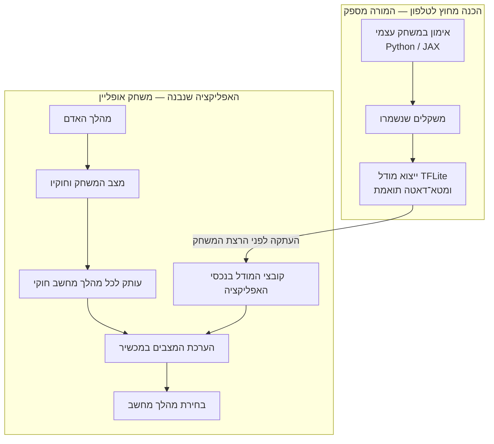
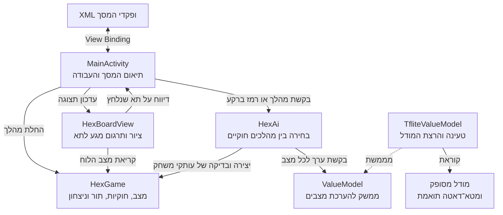

## נקודת ההתחלה

`hexT` הוא Empty Views Activity בשפת Java עם XML ו־View Binding פעיל.
שם החבילה הוא `com.example.hex`; המודל המאומן מסופק על ידי המורה.
אין במסלול משימת אימון ב־Python או ב־Colab.

## לאן אנחנו הולכים? {#destination}

תחילה נבנה משחק ששני אנשים יכולים לשחק בו. אחר כך נוסיף יריב שמשתמש **באותם חוקי משחק**, יוצר עותקים של הלוח ובוחר מהלך בעזרת מודל ערך מסופק. האימון מתרחש מראש מחוץ לטלפון; בזמן המשחק האפליקציה משתמשת בקובץ שנוצר, בלי לפנות ל־Colab ובלי לעדכן את משקלי המודל.

בפרקים **01–04** נגיע למשחק מקומי שלם; בפרקים **05–07** נחבר אליו את המחשב ונבחר בין מודלים מסופקים; בפרק **08** המחשב יציע רמז בלי לשחק אותו; ובפרק **09** נתאים את מראה המסך ליום וללילה. מהלך המחשב שנבחר מוחל על המשחק, והתור חוזר לאדם אם המשחק עדיין לא הסתיים.

{: .box-note}
**לפני שמתחילים:** מה חייב לעבוד במשחק עוד לפני שמודל מאומן יכול להועיל? חשבו על חוקיות המהלך, התור וזיהוי המנצח.

| פרק | נושא | מה עובד בסיום |
|---:|---:|---:|
| [01 — הלוח ושפות היעד]({{ '/android/hex/01-board/' | relative_url }}) | Canvas, משושים, גאומטריית מרכזים ושפות יעד | לוח 7×7 ריק, עם סימון אדום מלמעלה ומלמטה וסימון כחול משמאל ומימין. |
| [02 — מהלכים ותורות]({{ '/android/hex/02-moves-and-turns/' | relative_url }}) | מערך של 49 תאים, callback, מגע וחוקיות | שני אנשים מניחים אבנים בתור; נגיעה מחוץ ללוח או בתא תפוס אינה משנה את התור. |
| [03 — חיבור מנצח]({{ '/android/hex/03-win-detection/' | relative_url }}) | ששת השכנים, חיפוש רוחב וסיום משחק | חיבור אדום מלמעלה למטה או כחול משמאל לימין מוכרז כניצחון, ומשחק נוסף נחסם. |
| [04 — משחק מקומי שלם]({{ '/android/hex/04-local-two-player/' | relative_url }}) | Restart, משאבי מסך ו־View Binding | משחק מקומי מלא עם תור, תוצאה, כפתור Restart ומסך בסגנון יישום הייחוס. |
| [05 — מכינים את המחשב]({{ '/android/hex/05-model-preparation/' | relative_url }}) | העתקי מצב, מהלכים חוקיים וקידוד 7×7×3 | המשחק המקומי עדיין עובד, וקוד הכנת המצבים והמודל המסופק נבנים בפרויקט. |
| [06 — מחשב שעובד ברקע]({{ '/android/hex/06-background-ai/' | relative_url }}) | בחירת מהלך, TFLite ו־Executor | האדם משחק אדום מול תשובת מחשב כחולה; Restart או שינוי מצב פוסלים תשובה ישנה. |
| [07 — שחקני RL מסופקים]({{ '/android/hex/07-supplied-rl-models/' | relative_url }}) | קטלוג JSON, בחירת שחקן ומטא־דאטה | ששת השחקנים המסופקים נבחרים מן הקטלוג. בחירה מחליפה מודל ומתחילה משחק חדש. |
| [08 — רמז למהלך הבא]({{ '/android/hex/08-hint/' | relative_url }}) | שימוש חוזר ב־`HexAi`, חישוב ברקע ופסילת רמז ישן | המחשב מציע מהלך לאדום ומדגיש את התא, בלי להניח אבן. |
| [09 — ערכות נושא ואייקון]({{ '/android/hex/09-day-night-themes/' | relative_url }}) | `values-night`, משאבי צבע, ערכת Material 3 ואייקון האפליקציה | צבעי המסך, הלוח והפקדים מתאימים את עצמם להגדרת התצוגה של המכשיר; אייקון Hex מופיע במסך הבית. |

## מי אחראי על מה באפליקציה? {#architecture}

זו מפת האחריות שאליה נגיע בהדרגה. בפרק הראשון קיימת רק תצוגת הלוח; שאר החלקים יתווספו כשנזדקק להם. החצים מתארים קשרים בין רכיבים, ולא סדר של פעולות בזמן.

ה־View מכירה פיקסלים ומרכזי משושים; `HexGame` מכירה תאים וקשרים ביניהם. לכן אפשר לבדוק את החוקים גם בלי לצייר מסך. `MainActivity` מחברת בין החלקים, ו־`HexAi` משתמשת בחוקים כדי לייצר מועמדים וב־`ValueModel` כדי להעריך אותם. **הערכת מצב ובחירת מהלך הן שתי אחריויות נפרדות.**

{: .box-note}
**שאלת הבנה:** איזו מחלקה צריכה לדחות מהלך לתא תפוס, גם כשהמהלך מגיע מהמחשב ולא מנגיעה במסך?

## מי עושה מה?

| חלק | אחריות |
|---:|---:|
| לוח, מגע, חוקים, תורות, ניצחון וחיבור מסך | התלמיד כותב ומסביר |
| `TfliteValueModel` וקובצי המודלים המאומנים | המורה מספק; התלמיד לומד את החוזה ומשלב |
| `model_catalog.json` | התלמיד מוסיף שורה לזוג נכסים שסופק |
| אימון JAX,‏ Colab וייצוא checkpoints | מחוץ למסלול |

בסוף [פרק 4]({{ '/android/hex/04-local-two-player/' | relative_url }}) אפשר לשחק משחק מקומי שלם.
ב[פרק 5]({{ '/android/hex/05-model-preparation/' | relative_url }}) נכין את מצבי המשחק והמודל המסופק,
ב[פרק 6]({{ '/android/hex/06-background-ai/' | relative_url }}) נבדוק יריב באמצעות מודל לא מאומן,
וב[פרק 7]({{ '/android/hex/07-supplied-rl-models/' | relative_url }}) נבחר בין השחקנים שסופקו.
מספר איטרציות מאוחר יותר אינו מבטיח מודל חזק יותר.
ב[פרק 8]({{ '/android/hex/08-hint/' | relative_url }}) נוסיף רמז למהלך בלי להניח אבן,
וב[פרק 9]({{ '/android/hex/09-day-night-themes/' | relative_url }}) נוסיף צבעי יום ולילה לאותו מסך.

{: .box-note}
חבילת המורה לפרק 5 וחבילת השחקנים לפרק 7 זמינות בקישורים שבפרקים. הגרסה המאוחדת הישנה של פרק 5 נשמרה כ[פרק 5old לעיון בלבד]({{ '/android/hex/05old-background-ai/' | relative_url }}).
