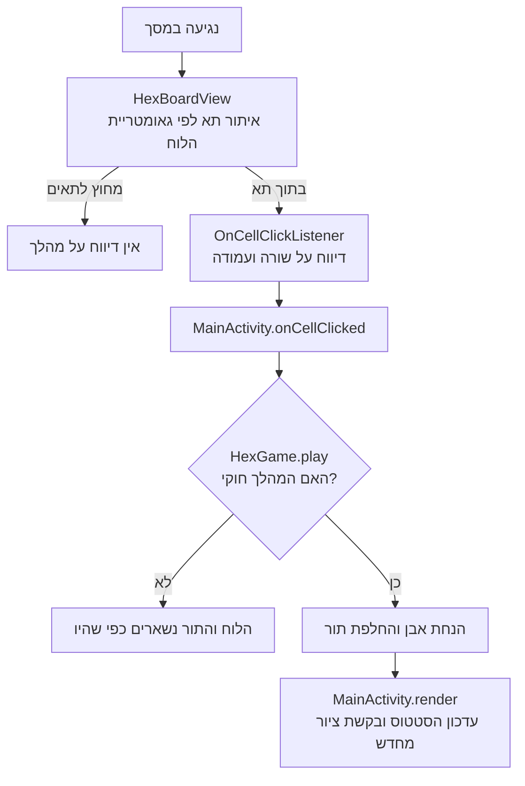

[מפת המסלול]({{ '/android/hex5/' | relative_url }}) · [הפרק הקודם]({{ '/android/hex5/01-board/' | relative_url }}){: data-sequence-nav="prev"} · [הפרק הבא]({{ '/android/hex5/03-win-detection/' | relative_url }}){: data-sequence-nav="next"}


{: .box-success}
**בסוף הפרק:** שני אנשים מניחים אבנים בתור; נגיעה מחוץ ללוח או בתא תפוס אינה משנה את התור.

## הרעיון

המצב עובר ל־`HexGame`, מחלקת Java ללא תלות ב־Android. תא נשמר במערך לפי `row * size + column`. משחק חדש הוא 7×7 כברירת מחדל, ואפשר ליצור לוח בגודל אחר באמצעות `HexGame(int size)`. רק `play` משנה את המערך ואת התור. ה־View מחזיר שורה ועמודה דרך `OnCellClickListener` ואינו מחליט אם מותר לשחק. אותו חישוב מרכז משמש לציור ולבדיקת מגע; `containsPoint` דוחה נגיעה ברווח שבין משושים. `performClick()` ממלא את חוזה הנגישות של View.

## מנגיעה למהלך ולציור מחדש {#move-flow}

נגיעה היא **בקשה לשחק בתא**. ה־View מתרגמת את מיקום האצבע לשורה ועמודה; רק מחלקת המשחק מחליטה אם הבקשה חוקית. לאחר מהלך חוקי ה־Activity מעדכנת את התצוגה מתוך המצב החדש.

<div markdown="1" class="hex-diagram">



</div>

אותו חישוב מרכזים משמש לציור ולזיהוי התא שנלחץ. לעומת זאת, בדיקת תא תפוס עובדת על מערך התאים ב־`HexGame`, בלי תלות בגודל המסך. חלוקת האחריות הזו תאפשר בהמשך למחשב לבקש מהלך באמצעות אותם חוקים.

{: .box-note}
**לפני הקוד:** מדוע נגיעה בתא תפוס אינה אמורה להעביר את התור? באיזה חלק בתרשים נקבעת התשובה?

## עורכים את הקבצים

עבדו לפי סדר התלות: משאבים לפני קוד שמפנה אליהם; מחלקת החוקים לפני ה־Activity.

### strings.xml

**מיקום:** app > res > values. המשאב מרכז צבעים, מחרוזות או theme שהמסך משתמש בהם. שנו רק את השורות המוצגות.

```diff
     <string name="red_goal">RED · TOP ↕ BOTTOM</string>
     <string name="blue_goal">BLUE · LEFT ↔ RIGHT</string>
     <string name="board_description">Seven by seven Hex board</string>
+    <string name="status_red_turn">Red to move</string>
+    <string name="status_blue_turn">Blue to move</string>
 </resources>
```

### הרחבת `HexGame.java`

**מיקום:** app > kotlin+java > com.example.hex. בפרק 1 יצרתם את המחלקה עם גודל ברירת מחדל, שני בנאים ו־`getSize()`. השאירו אותם כפי שהם. הוסיפו את מצב התאים ואת חוקי המשחק מסביב לממשק הזה.

הוסיפו את הייבוא בראש הקובץ:

~~~diff
 package com.example.hex;
+
+import java.util.Arrays;
~~~

הוסיפו ערכים לשחקנים ולתא ריק, ושמרו את התאים ואת התור הנוכחי. גודל הלוח נשאר בשדה שכבר כתבתם:

~~~diff
     public static final int DEFAULT_SIZE = 7;
+    /** Cell value used for an unoccupied cell. */
+    public static final int EMPTY = 0;
+    /** Player value for Red, whose goal is to connect top to bottom. */
+    public static final int RED = 1;
+    /** Player value for Blue, whose goal is to connect left to right. */
+    public static final int BLUE = 2;

     private final int size;
+    private final int[] cells;
+    private int currentPlayer;
~~~

הבנאי שמקבל גודל כבר שומר אותו. אתחלו בו מערך באותו גודל וקבעו שאדום מתחיל:

~~~diff
     public HexGame(int size) {
         this.size = size;
+        cells = new int[size * size];
+        currentPlayer = RED;
     }
~~~

אחרי `getSize()`, הוסיפו פעולות לקריאת תא, לביצוע מהלך חוקי ולקריאת מצב התור. הוסיפו גם את עזרי האינדקס והגבולות בסוף המחלקה, לפני הסוגר המסולסל האחרון:

~~~diff
+    /**
+     * Places the current player's stone and advances the turn when the move is legal.
+     *
+     * <p>TWIN-ID: HEX.APPLY_MOVE
+     *
+     * @param row zero-based board row
+     * @param column zero-based board column
+     * @return {@code true} if the move was played; {@code false} if the rules reject it,
+     *         leaving the board and turn unchanged
+     */
+    public boolean play(int row, int column) {
+        if (isOutside(row, column)) {
+            return false;
+        }
+        int index = index(row, column);
+        if (cells[index] != EMPTY) {
+            return false;
+        }
+        cells[index] = currentPlayer;
+        currentPlayer = otherPlayer(currentPlayer);
+        return true;
+    }
+
+    /**
+     * Returns the value stored at one board coordinate.
+     *
+     * @param row zero-based board row
+     * @param column zero-based board column
+     * @return {@link #EMPTY}, {@link #RED}, or {@link #BLUE}
+     * @throws IndexOutOfBoundsException if the coordinate is outside the board
+     */
+    public int getCell(int row, int column) {
+        if (isOutside(row, column)) {
+            throw new IndexOutOfBoundsException("Cell is outside the board");
+        }
+        return cells[index(row, column)];
+    }
+
+    /**
+     * Copies all board cells in row-major order.
+     *
+     * @return an independent row-major array of board cells
+     */
+    public int[] getCells() {
+        return Arrays.copyOf(cells, cells.length);
+    }
+
+    /** @return the player that will make the next move */
+    public int getCurrentPlayer() {
+        return currentPlayer;
+    }
+
+    /** RED is 1 and BLUE is 2, so subtracting either from 3 gives the opponent. */
+    public static int otherPlayer(int player) {
+        return 3 - player;
+    }
+
+    private int index(int row, int column) {
+        return row * size + column;
+    }
+
+    private boolean isOutside(int row, int column) {
+        return row < 0 || row >= size || column < 0 || column >= size;
+    }
~~~

### HexBoardView.java

**מיקום:** app > kotlin+java > com.example.hex. מחלקת הציור מקבלת כעת משחק, callback ובדיקת מגע. בצעו את השינויים לפי הסדר. שאר הקוד נשאר כפי שנכתב בפרק 1.

```diff
 import android.graphics.Canvas;
 import android.graphics.Paint;
 import android.graphics.Path;
 import android.util.AttributeSet;
+import android.view.MotionEvent;
 import android.view.View;
 
 import androidx.annotation.NonNull;
 import androidx.annotation.Nullable;
 import androidx.core.content.ContextCompat;
 
 /**
  * Draws a Hex board on a {@link Canvas}.
  *
  * <p>The view's intended role also includes cell input; game rules stay in a separate class.
  */
 public final class HexBoardView extends View {
+    /** Receives taps that land inside a board cell. */
+    public interface OnCellClickListener {
+        /**
+         * Called after the user taps a cell.
+         *
+         * @param row zero-based board row
+         * @param column zero-based board column
+         */
+        void onCellClick(int row, int column);
+    }
+
     private static final float SQRT_THREE = (float) Math.sqrt(3.0);
 
     private final Paint fillPaint = new Paint(Paint.ANTI_ALIAS_FLAG);
     private final Paint strokePaint = new Paint(Paint.ANTI_ALIAS_FLAG);
     private final Paint sidePaint = new Paint(Paint.ANTI_ALIAS_FLAG);
     private final Path hexPath = new Path();
 
-    private final HexGame game = new HexGame();
+    private HexGame game = new HexGame();
+    private OnCellClickListener listener;
     private float radius;
     private float startX;
     private float startY;
 
```

```diff
         strokePaint.setStyle(Paint.Style.STROKE);
         strokePaint.setStrokeJoin(Paint.Join.ROUND);
         sidePaint.setStyle(Paint.Style.STROKE);
         sidePaint.setStrokeCap(Paint.Cap.ROUND);
+        setClickable(true);
+        setFocusable(true);
+    }
+
+    /**
+     * Sets the game position to render and schedules a redraw.
+     *
+     * @param game game whose current board should be displayed
+     */
+    public void setGame(HexGame game) {
+        this.game = game;
+        invalidate();
+    }
+
+    /**
+     * Sets the listener notified when the user taps a board cell.
+     *
+     * @param listener listener that receives taps on the board
+     */
+    public void setOnCellClickListener(OnCellClickListener listener) {
+        this.listener = listener;
     }
 
     @Override
     protected void onDraw(@NonNull Canvas canvas) {
```

```diff
         drawGoalSides(canvas);
 
         strokePaint.setColor(lineColor);
         strokePaint.setStrokeWidth(dp(1.5f));
         for (int row = 0; row < game.getSize(); row++) {
             for (int column = 0; column < game.getSize(); column++) {
                 float centerX = centerX(row, column);
                 float centerY = centerY(row);
                 makeHexagon(centerX, centerY);
-                fillPaint.setColor(emptyColor);
+                int cell = game.getCell(row, column);
+                fillPaint.setColor(cell == HexGame.RED
+                        ? redColor : cell == HexGame.BLUE ? blueColor : emptyColor);
                 fillPaint.setStyle(Paint.Style.FILL);
                 canvas.drawPath(hexPath, fillPaint);
                 canvas.drawPath(hexPath, strokePaint);
             }
```

```diff
         }
         hexPath.close();
     }
 
+    @Override
+    public boolean onTouchEvent(@NonNull MotionEvent event) {
+        if (!isEnabled()) {
+            return false;
+        }
+        if (event.getAction() == MotionEvent.ACTION_UP) {
+            calculateGeometry();
+            // Hexagon interiors do not overlap, so the first containing cell is the tap.
+            for (int row = 0; row < game.getSize(); row++) {
+                for (int column = 0; column < game.getSize(); column++) {
+                    float dx = event.getX() - centerX(row, column);
+                    float dy = event.getY() - centerY(row);
+                    if (containsPoint(dx, dy)) {
+                        listener.onCellClick(row, column);
+                        performClick();
+                        return true;
+                    }
+                }
+            }
+            return true;
+        }
+        return event.getAction() == MotionEvent.ACTION_DOWN || super.onTouchEvent(event);
+    }
+
+    private boolean containsPoint(float dx, float dy) {
+        float absX = Math.abs(dx);
+        float absY = Math.abs(dy);
+        return absX <= SQRT_THREE * radius / 2.0f
+                && absY <= radius
+                && SQRT_THREE * absY + absX <= SQRT_THREE * radius;
+    }
+
+    @Override
+    public boolean performClick() {
+        super.performClick();
+        return true;
+    }
+
     private float centerX(int row, int column) {
         return startX + SQRT_THREE * radius * (column + row * 0.5f);
     }
 
```

#### התאמה לגודל המשחק

`drawGoalSides` ו־`calculateGeometry` כבר משתמשות ב־`game.getSize()` מהפרק הקודם, לכן השאירו אותן ללא שינוי. כאן עדכנו רק את `onDraw`: הוא עדיין עובר על כל תא, אבל עכשיו קורא את ערכו מ־`HexGame` וצובע בהתאם.

### MainActivity.java

**מיקום:** app > kotlin+java > com.example.hex. ה־Activity מחברת בין View Binding, המשחק והמסך. הוסיפו את חיבור הלוח ואת המתודות החדשות במקומות המוצגים.

```diff
 import androidx.core.view.WindowInsetsCompat;
 
 import com.example.hex.databinding.ActivityMainBinding;
 
-public class MainActivity extends AppCompatActivity {
+/** Connects board taps to the independent game state. */
+public final class MainActivity extends AppCompatActivity {
     private ActivityMainBinding binding;
+    private HexGame game;
+
+    /** Creates the game screen and connects its controls to the current game. */
     @Override
     protected void onCreate(Bundle savedInstanceState) {
         super.onCreate(savedInstanceState);
         EdgeToEdge.enable(this);
```

```diff
             Insets systemBars = insets.getInsets(WindowInsetsCompat.Type.systemBars());
             v.setPadding(systemBars.left, systemBars.top, systemBars.right, systemBars.bottom);
             return insets;
         });
+
+        game = new HexGame();
+        binding.boardView.setGame(game);
+        binding.boardView.setOnCellClickListener(this::onCellClicked);
+        render();
+    }
+
+    /**
+     * Plays a legal move from a board tap and updates the screen.
+     *
+     * @param row zero-based row of the tapped cell
+     * @param column zero-based column of the tapped cell
+     */
+    private void onCellClicked(int row, int column) {
+        if (game.play(row, column)) {
+            render();
+        }
+    }
+
+    /** Refreshes the visible screen from the current game state. */
+    private void render() {
+        binding.boardView.setGame(game);
+        binding.statusText.setText(game.getCurrentPlayer() == HexGame.RED
+                ? R.string.status_red_turn : R.string.status_blue_turn);
     }
 }
```

**בדיקה של לוח 11×11:** בפרק הזה עוד אין בורר גודל. כדי לראות שהלוח מתאים את עצמו, פתחו את `MainActivity.java` ובתוך `onCreate()` החליפו זמנית את השורה `game = new HexGame();` בשורה `game = new HexGame(11);`. הפעילו את האפליקציה, ואז החזירו את השורה המקורית לפני שממשיכים. בורר הגודל יתווסף בפרק 7.

## מריצים ומוודאים

בצעו Sync אם שיניתם Gradle,  ואז הפעילו את האפליקציה. הניחו שתי אבנים, געו שוב בתא תפוס וברווח שמחוץ ללוח. מספר האבנים והתור לא משתנים במגע לא חוקי.

**שאלת הבנה:** למה נגיעה בתא תפוס אינה מעבירה תור?

[לשיעור הבא: חיבור מנצח ←]({{ '/android/hex5/03-win-detection/' | relative_url }})
