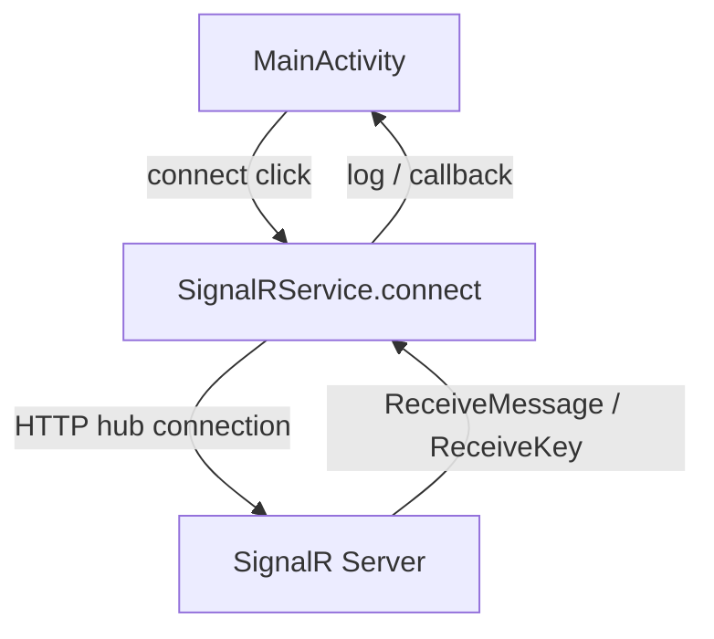
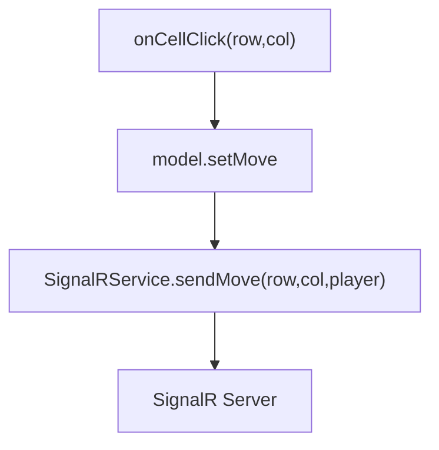
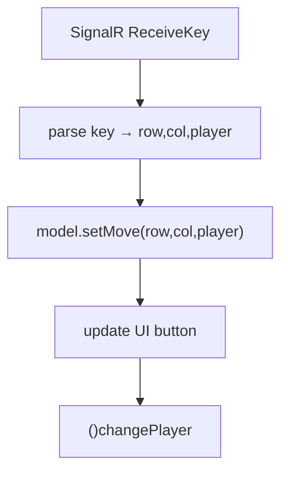

{: .box-note}
במדריך זה נלמד כיצד להרחיב את אפליקציית ה־Tic Tac Toe (איקס עיגול) כך ששני מכשירי אנדרואיד יוכלו לשחק אחד מול השני דרך שרת **SignalR**.

לפני שמתחילים עבודה, יש לוודא שרץ בכיתה (או בבית) שרת SignalR. [בקישור זה יש ConsoleApp קטן של שרת כזה](https://github.com/3strategy/ConsoleSignalRCore6). אפשר פשוט להוריד ולהריץ ברשת המקומית בכיתה. אפשר לקוות שהשרת שאירגנתי בכתובת שבהמשך, רץ כרגע.

* עדכון של הרגע האחרון: כיוון שבבית הספר חוסמים יציאה ל-port 8081 עדכנתי את הסביבה התומכת ל-port 80. **יש לעדכן בקוד שלכם מ8081 ל-80 - בפרט בקובץ ה-Service.**


<details markdown="1"><summary>מה זה בכלל SignalR?</summary>
SignalR היא ספריית קוד פתוח של מיקרוסופט שמיועדת להוספת **יכולות תקשורת בזמן אמת** לאפליקציות אינטרנט. היא מאפשרת לשרת לשלוח עדכונים ישירות ללקוחות (למשל דפדפנים) באותו הרגע בו מתבצע שינוי, **בלי צורך ברענון הדף**. SignalR תומכת ביכולות כמו צ'אט חי, עדכונים בלוחות מידע ומשחקים מרובי משתתפים, וכל זאת בעזרת מודל תכנות פשוט ב־C#. היא מבצעת אופטימיזציה אוטומטית לסוג התקשורת—לדוגמה, WebSockets, Server-Sent Events או Long Polling—לפי מה שהדפדפן תומך בו. SignalR מנהלת בעצמה את כל תהליך החיבור והעדכון מול הלקוח, ומספקת API קל ונוח להפצת הודעות וקבלת מידע בזמן אמת. התמיכה היא כמובן לא רק בדפדפן וקיימות ספריות המאפשרות להתחבר מאפליקציות, כולל Android Java כמו כאן.
</details>

המימוש בלקוח האנדרואיד מתחיל לאחר שמימשנו משחק איקס עיגול המימוש כאן מתחיל מאפליקציה קיימת שהכננו בשיעורים 014a 014b 015a [015b](/android/projectSteps/015b.AddingTicTacToeToMainActivity). ניתן לממש באופן דומה על כל אפליקציה בשינויים מסויימים.

נחלק את העבודה לשלושה שלבים עיקריים, שכל אחד מהם תואם לקומיט שתבצעו ב־Git:

1. **חיבור ל-SignalR + הגדרת אבטחה ל-HTTP**
2. **שליחת מהלך (Send Key)**  
3. **קבלת מהלך ושילובו בלוגיקת המשחק**

---

## שלב 1 – התחברות ל־SignalR

{: .box-note}
בשלב זה נגדיר את כל התשתית להתחברות לשרת SignalR דרך כתובת IP מקומית, ונאפשר תקשורת **HTTP** רגילה (לא מאובטחת) לצורכי פיתוח.

### קבצים שיעודכנו

- `activity_main.xml` (תוספת UI - הגדרת IP וכפתור התחברות)
- `network_security_config.xml` (הקלות אבטחה: איפשור http)
- `AndroidManifest.xml` (בקשת הרשאת אינטרנט, והקלות אבטחה)
- `build.gradle` (כיוון שאנו מוסיפים ספריות)
- `SignalRService.java` (קובץ חדש תמיכת לקוח ב-SignalR)
- `MainActivity.java`

### תרשים תהליך



### עיקרי הקוד

#### הוספת הגדרה להרשאת תקשורת HTTP

{: .box-success}
ניצור קובץ חדש תחת  `res/xml/`  בשם `network_security_config.xml` יש להתאים את כתובת ה-ip לזו של שרת ה-SignalR שבכיתה:

```xml
<?xml version="1.0" encoding="utf-8"?>
<network-security-config>
    <domain-config cleartextTrafficPermitted="true">
        <domain includeSubdomains="false">109.226.44.197</domain>
    </domain-config>
</network-security-config>
```

הערה: שלב זה **הכרחי** מפני שבגרסאות אנדרואיד חדשות שימוש ב-http טקסט גלוי חסום כברירת מחדל. הרצות של https:// מורכבות יותר

נוסיף **ממש למעלה** בקובץ המניפסט `app\src\main\AndroidManifest.xml` בקשת הרשאת אינטרנט:


+    <uses-permission android:name="android.permission.INTERNET" />

    <application
        android:allowBackup="true"
        android:label="@string/app_name"
        android:theme="@android:style/Theme.Holo.Light.DarkActionBar"
        android:networkSecurityConfig="@xml/network_security_config">
        <activity
            android:name=".MainActivity"


### עיצוב ממשק המשתמש

נעדכן את קובץ `activity_main.xml` כך שיכלול שדה להזנת כתובת השרת וכפתור חיבור:


<LinearLayout
    android:orientation="vertical"
    android:gravity="center"
    android:padding="16dp">

    <LinearLayout
        android:layout_width="wrap_content"
        android:layout_height="wrap_content"
        android:orientation="horizontal"
        android:gravity="center"
        android:layout_marginBottom="12dp">

        <EditText
            android:id="@+id/editServerIP"
            android:layout_width="160dp"
            android:layout_height="wrap_content"
            android:hint="109.226.44.197"
            android:inputType="text"
            android:importantForAutofill="no" />

        <Button
            android:id="@+id/buttonConnect"
            android:layout_width="wrap_content"
            android:layout_height="wrap_content"
            android:layout_marginStart="8dp"
            android:onClick="onConnectClick"
            android:text="Connect" />
    </LinearLayout>

+    <!-- כל ההמשך שכאן ללא שינוי -->
    <GridLayout
            android:layout_width="wrap_content"
            android:layout_height="wrap_content"
            android:columnCount="3"
            android:rowCount="3">

            <Button.....



### נעדכן חבילות חדשות ב-build.gradle (Module:app)


dependencies {
// keep all the existing stuff.


+    implementation 'com.microsoft.signalr:signalr:8.0.0'
}


לאחר שינוי בגריידל, יש לסנכרן את הפרוייקט באמצעות הכפתור הזה:


### ניצור את מחלקת SignalRService.java

הקובץ מובא כאן במלואו וכולל כבר את השינויים שנעשו בשלבי ההמשך

<details open markdown="1"><summary>SignalRService.java קובץ שלם להוספה</summary>

``` java
package com.example.tictacmenu.services;

import android.util.Log;

import com.microsoft.signalr.HubConnection;
import com.microsoft.signalr.HubConnectionBuilder;
import com.microsoft.signalr.HubConnectionState;

public class SignalRService {
    private static final String TAG = "SignalRService";

    private HubConnection connection;

    public interface Listener {
        void onConnected();
        void onDisconnected(Throwable error);
        void onReceiveMessage(String user, String message);
        void onReceiveKey(String key);
    }

    public void connect(String baseIp, Listener listener) {
        // Build hub URL: http://<ip>:80/gamehub
        final String url = "http://" + baseIp + ":80/gamehub";

        // Dispose previous connection if exists
        if (connection != null) {
            try { connection.stop(); } catch (Exception ignored) {}
            connection = null;
        }

        connection = HubConnectionBuilder.create(url).build();

        // Subscriptions
        connection.on("ReceiveMessage", (user, message) -> {
            Log.d(TAG, "ReceiveMessage: " + user + ": " + message);
            if (listener != null) listener.onReceiveMessage(user, message);
        }, String.class, String.class);

        connection.on("ReceiveKey", (key) -> {
            Log.d(TAG, "ReceiveKey: " + key);
            if (listener != null) listener.onReceiveKey(key);
        }, String.class);

        // Connect on background thread
        new Thread(() -> {
            try {
                connection.start().blockingAwait();
                Log.d(TAG, "Connected to " + url);
                if (listener != null) listener.onConnected();

                // Debug: send a test message like the C# sample
                try {
                    connection.send("SendMessage", "Jojo", "Hello everybody");
                } catch (Throwable t) {
                    Log.w(TAG, "SendMessage failed: " + t.getMessage());
                }
            } catch (Throwable t) {
                Log.e(TAG, "Hub exception: " + t.getMessage());
                if (listener != null) listener.onDisconnected(t);
            }
        }).start();
    }

    public void disconnect() {
        if (connection != null) {
            try {
                connection.stop().blockingAwait();
            } catch (Throwable ignored) {
            } finally {
                connection = null;
            }
        }
    }

    public boolean isConnected() {
        return connection != null && connection.getConnectionState() == HubConnectionState.CONNECTED;
    }

    public void sendMove(int row, int col, String player) {
        // Encode move as "row,col,player" for server-side handling
        String key = row + "," + col + "," + player;
        sendKey(key);
    }

    public void sendKey(String key) {
        if (connection == null) {
            Log.w(TAG, "sendKey called but connection is null");
            return;
        }
        try {
            connection.send("SendKey", key);
        } catch (Throwable t) {
            Log.e(TAG, "Failed to send key: " + t.getMessage());
        }
    }
}
```

</details>

<details open markdown="1"><summary>תוספות במחלקה MainActivity.java</summary>

```java
// הוספת אימפורט מעל המחלקה
import android.util.Log;
import android.widget.EditText;
import com.example.tictacmenu.services.SignalRService;

```

---

```java
// הוספת בתוך המחלקה
private final SignalRService signalRService = new SignalRService();
private static final String TAG = "MainActivity";


// התחברות והפעלת מאזינים לשרת
public void onConnectClick(View view) {
    EditText ipEdit = findViewById(R.id.editServerIP);
    String ip = ipEdit.getText().toString().trim();
    if (ip.isEmpty()) {
        // Fall back to hint if empty
        ip = ipEdit.getHint() != null ? ipEdit.getHint().toString() : "109.226.44.197";
    }

    String finalIp = ip;
    Toast.makeText(this, "Connecting to " + finalIp + ":8081", Toast.LENGTH_SHORT).show();
    signalRService.connect(finalIp, new SignalRService.Listener() {
        @Override
        public void onConnected() {
            runOnUiThread(() -> Toast.makeText(MainActivity.this, "Connected to hub", Toast.LENGTH_SHORT).show());
        }

        @Override
        public void onDisconnected(Throwable error) {
            runOnUiThread(() -> Toast.makeText(MainActivity.this, "Hub error: " + (error != null ? error.getMessage() : "unknown"), Toast.LENGTH_LONG).show());
        }

        @Override
        public void onReceiveMessage(String user, String message) {
            Log.d(TAG, "we got " + message + " from " + user);
        }

        @Override
        public void onReceiveKey(String key) {
            // בהמשך נטפל כאן בקבלת מידע מהשרת
            Log.d(TAG, "HandleOthersKey: " + key);
        }
    });
}
```

</details>

### תוצאה צפויה

לאחר סנכרון הפרויקט בעקבות שינוי ה-gradle, ניתן להריץ אותו. לאחר לחיצה על **Connect**, תוצג הודעת "Connected" או "Failed" בהתאם למצב השרת. יתכן שיהיה צורך בצד שלי לשנות הגדרות במידה שמבית הספר הפורט אליו אנו ניגשים חסום.

**השרת - אינו שרת זמינות גבוהה. אמור לעבוד ביום יום בשעות היום ובחלק משעות הלילה**

**בסיום שלב זה commit and push**
---

## שלב 2 – שליחת מהלך (Send Key)

{: .box-note}
בשלב זה נוסיף שליחת מהלך לשחקן המקומי — כל לחיצה על תא בלוח תשדר לשרת את המהלך שנבחר (שורה, עמודה, וסימן X או O).

### קבצים שעודכנו

- `MainActivity.java`
- `SignalRService.java` (שינויים אלו כבר כלולים בקובץ שלעיל)

### לוגיקה כללית



### תוספת ל- MainActivity


        if (model.isLegal(row, col)) {
            model.makeMove(row, col);
-           String player = model.getCurrentPlayer();

-           button.setText(model.getCurrentPlayer());

+           button.setText(player);
-           // Send the move to the hub: "row,col,player"
-           signalRService.sendMove(row, col, player);
            
            if (model.checkWin()) {
                model.changePlayer();



### דוגמת קוד מתוך `SignalRService.java` (כבר קיים)

```java
public void sendMove(int row, int col, String player) {
    if (hubConnection != null && hubConnection.getConnectionState() == HubConnectionState.CONNECTED) {
        String key = row + "," + col + "," + player;
        hubConnection.send("SendKey", key);
    }
}
```

### תוצאה צפויה

בלחיצה על תא בלוח, השרת יציג בקונסול הודעה כגון:

```
Hub received key: 1,2,X
```

---

## שלב 3 – קבלת מהלך ושילוב בלוגיקת המשחק

{: .box-note}
בשלב זה נחבר את האירוע **ReceiveKey** מהשרת כך שכל מכשיר יעדכן את הלוח אוטומטית בעת קבלת מהלך מהשחקן השני.

### קבצים שעודכנו

- `MainActivity.java`
- `TicTacToeModel.java`

### תרשים זרימה



### עדכון on("ReceiveKey" ב- `MainActivity.java`

```java
        @Override
        public void onReceiveKey(String key) {
            // בהמשך נטפל כאן בקבלת מידע מהשרת
            Log.d(TAG, "HandleOthersKey: " + key);
            // Expecting format: "row,col,player"
            String[] parts = key.split(",");
            if (parts.length != 3) {
                return;
            }
            try {
                int r = Integer.parseInt(parts[0].trim());
                int c = Integer.parseInt(parts[1].trim());
                String p = parts[2].trim();

                runOnUiThread(() -> {
                    // Only apply if the cell is still empty
                    if (model.isLegal(r, c)) {
                        boolean applied = model.setMove(r, c, p);
                        if (applied) {
                            int id = idFor(r, c);
                            if (id != 0) {
                                Button target = findViewById(id);
                                if (target != null) {
                                    target.setText(p);
                                }
                            // Optional: win/tie checks would go here if implemented

                            // Keep turn alternation consistent with local logic
                            }
                            model.changePlayer();
                        }
                    }
                });
            } catch (NumberFormatException e) {
                Log.w(TAG, "Bad key format: " + key);
            }
        }
    });
}


private int idFor(int row, int col) {
    if (row == 0 && col == 0) return R.id.button00;
    if (row == 0 && col == 1) return R.id.button01;
    if (row == 0 && col == 2) return R.id.button02;
    if (row == 1 && col == 0) return R.id.button10;
    if (row == 1 && col == 1) return R.id.button11;
    if (row == 1 && col == 2) return R.id.button12;
    if (row == 2 && col == 0) return R.id.button20;
    if (row == 2 && col == 1) return R.id.button21;
    if (row == 2 && col == 2) return R.id.button22;
    return 0;
}
```

### הוספת פעולה בקובץ `TicTacToeModel.java`


// טיפול במהלך משחק שהתקבל מהשרת (used for remote moves)
public boolean setMove(int row, int col, String player) {
    if (isLegal(row, col)) {
        board[row][col] = player;
        return true;
    }
    return false;
}


### תוצאה צפויה

כאשר שני מכשירים מחוברים לאותו שרת SignalR, כל מהלך יתעדכן **מיידית** בצד השני – המשחק הופך לרב־משתתפים בזמן אמת.

---

## סיכום

{: .box-success}
חיברנו את משחק האיקס עיגול ל-SignalR 🎮  
מעתה ניתן לשחק בין שני מכשירים או יותר בזמן אמת.

בשלבים הבאים תוכלו להוסיף:

- סנכרון תוצאות (ניצחון/הפסד)
- תמיכה במספר חדרים (rooms)
- קיבוע השחקן בנייד של המשתמש כך שלא יוכל לשחק את שני הצדדים

---

## תפעול תקלות והנגשת שרת

* במידה שהשרת אצלי לא רץ, מומלץ שאחד המחשבים המחוברים ב-wifi יריץ את השרת. כך יותר מחשבים ניידים וטלפונים ניידים יוכלו להתחבר.
* יש לעדכן את הכתובת בקובץ `network_security_config`, לכתובת בה מאזין השרת.
* לבדיקת זמינות של השרת מהכיתה ניתן להריץ את הפקודה הבאה ב- Power Shell.

  `Test-NetConnection -ComputerName 109.226.44.197 -Port 80`

[קישור לגיט.](https://github.com/3strategy/TicTacToeSignalR) שימו לב שמבנה התיקיות ותפריט המבורגר שבנינו אינו חלק מה-repo הזה שמדגים רק חיבור ל-signalR
