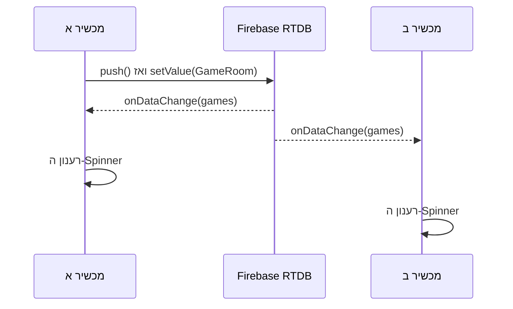

[חזרה ל־020: שיפור העיצוב](/android/projectSteps/020tictacmenu-theme-alignment) ·
[או ישירות ל־019c: השלמת View Binding](/android/projectSteps/019c.BindingForFragmentsAndMenuActivity)

{: .box-note}
בשיעור הזה נוסיף ל־`Main2Activity` לובי קטן: המשתמש ייתן שם למשחק, יפרסם חדר ב־Firebase Realtime Database, ויראה ב־Spinner את כל החדרים שפורסמו. הרשימה תתעדכן מעצמה בכל מכשיר פתוח.

בסיום יהיה לנו שלב עובד שאפשר לבדוק בפני עצמו:

1. כל משתמש מחובר יכול לפרסם חדר בשם שיבחר.
2. Firebase ייתן לכל חדר מפתח ייחודי, ולכן מותר לפרסם כמה חדרים בעלי אותו שם.
3. כל המכשירים יראו מיד חדרים חדשים ברשימה.
4. הלוח שבתחתית המסך ימשיך בינתיים לעבוד כמשחק מקומי.

בשיעור `021b` נפתח חדר מהרשימה, נחבר את הלוח לחדר, ונאפשר לשחקן שלישי לצפות במשחק. בשלב הנוכחי עדיין לא מצטרפים לחדר ולא שולחים מהלכים.

---

## לפני שמתחילים

השיעור ממשיך מפרויקט שבו כבר קיימים:

- Firebase Authentication ומשתמש מחובר.
- התלות של Firebase Realtime Database וקובץ `google-services.json`.
- המחלקה `FBRef` משיעורי Firebase.
- View Binding משיעורי `019`.
- `Main2Activity`, שהוא התאום המיועד ל־RTDB, ולוח מקומי שעובד בעזרת `TicTacToeModel`.

לא משנים את `MainActivity`, את `SignalRService` או את `activity_main.xml`. כך משחק SignalR נשאר כפי שהוא, ואנו בונים לידו גרסת RTDB נפרדת.

{: .box-warning}
הדוגמה נועדה ללימוד ראשון של כתיבה, קריאה והאזנה. אין בה אבטחה של חדרי המשחק. כל לקוח יכול לקרוא ולכתוב את כל הנתונים בענף שניצור.

---

## שלב 1 - רק למורים - פתיחת הענף בחוקי RTDB

<details markdown="1"><summary>חוקי פיירבייס לא רלוונטים בשלב ראשוני של הלמידה. ניתן להגיש פרוייקט גם ללא חוקים נוקשים</summary>

כל נתוני הדוגמה יישמרו תחת ענף נפרד:

```text
/TicTacToeRtdb
```

אם בקובץ החוקים שלכם אין כלל כללי בשם `$key`, אפשר להוסיף תחת `rules`:

```json
"TicTacToeRtdb": {
  ".read": true,
  ".write": true
}
```

במסד הנתונים המשותף של הפרויקט כבר קיים כלל כללי בשם `$key`. כללי Firebase החופפים אינם מסננים זה את זה, ולכן במקרה הזה לא מוסיפים לידו כלל נוסף. מעדכנים את הכלל הקיים כך:

<div class="two-columns before-after" markdown="1">
<div markdown="1">

### לפני

```json
"$key": {
  ".read": "$key.endsWith('*' + auth.uid)",
  ".write": "$key.endsWith('*' + auth.uid)"
}
```

</div>
<div markdown="1">

### אחרי

```json
"$key": {
  ".read": "$key === 'TicTacToeRtdb' || $key.endsWith('*' + auth.uid)",
  ".write": "$key === 'TicTacToeRtdb' || $key.endsWith('*' + auth.uid)"
}
```

</div>
</div>

</details>

### מה המשמעות של החוקים הפתוחים?

חוקי RTDB נבדקים בשרת Firebase בכל פעולת קריאה או כתיבה. כאשר אנו כותבים
`".read": true` ו־`".write": true` בענף `TicTacToeRtdb`, אנו אומרים לשרת:

- אפשר להוריד את כל מה שנמצא בענף הזה.
- אפשר להוסיף, לשנות ואף למחוק כל דבר בענף הזה.
- אין בדיקה שה־UID שכתוב בתוך `playerX` הוא באמת ה־UID של מי ששלח את הכתיבה.
- אין בדיקה ששם החדר, מבנה החדר או תוכן אחר הם תקינים.

הבדיקה ב־`Main2Activity` שיש משתמש מחובר נחוצה לאפליקציה שלנו כדי לקבל UID ולכתוב
אותו ב־`playerX`, אך היא **אינה חוק אבטחה**. לקוח אחר יכול לפנות ישירות למסד ולעקוף
את הבדיקה שב־Activity. זה מכוון בתרגיל הראשון כדי שנוכל להתרכז בכתיבה, בקריאה
ובהאזנה; אין להשתמש בחוקים כאלה לנתונים אמיתיים או פרטיים.

{: .box-warning}
`true` כאן פירושו ציבורי ממש, לא "כל משתמש Firebase מחובר". כדי לדרוש התחברות
היינו כותבים תנאי כמו `auth != null`, אך זה אינו החוק שבחרנו עבור ההדגמה הזאת.

---

## שלב 2 - מבנה הנתונים של חדר

כל חדר יישמר מתחת למפתח אקראי ש־Firebase ייצור:

```text
/TicTacToeRtdb/games/{pushId}
    name: "Class game"
    playerX: "<uid of the creator>"
    playerO: ""
    moves: ""
```

בשלב הזה אנו משתמשים בפועל ב־`name` וב־`playerX`. את `playerO` ואת `moves` כותבים כמחרוזות ריקות, כדי שהאובייקט שנפרסם כבר יהיה בדיוק האובייקט שנמשיך איתו ב־`021b`.

צרו מחלקת Java חדשה:

- תצוגת Android: `app > kotlin+java > com.example.tictacmenu > models`
- שם המחלקה: `GameRoom`

הכניסו לקובץ את הקוד המלא:

```java
package com.example.tictacmenu.models;

/**
 * Stores the small amount of data published for one RTDB Tic-Tac-Toe room.
 */
public class GameRoom {

    /** The room name entered by its creator. */
    private String name = "";

    /** The Firebase user ID of the player using X. */
    private String playerX = "";

    /** The Firebase user ID of the player using O, or an empty string while waiting. */
    private String playerO = "";

    /** The complete semicolon-separated sequence of moves played in this room. */
    private String moves = "";

    /**
     * Creates an empty room object for Firebase snapshot conversion.
     */
    public GameRoom() {
    }

    /**
     * Creates a room with all values that will be written to Firebase.
     *
     * @param name room name entered by the creator
     * @param playerX Firebase user ID of player X
     * @param playerO Firebase user ID of player O, or an empty string
     * @param moves complete move sequence, or an empty string
     */
    public GameRoom(String name, String playerX, String playerO, String moves) {
        this.name = name;
        this.playerX = playerX;
        this.playerO = playerO;
        this.moves = moves;
    }

    /**
     * Returns the displayed room name.
     *
     * @return room name
     */
    public String getName() {
        return name;
    }

    /**
     * Sets the displayed room name when Firebase creates this object.
     *
     * @param name room name
     */
    public void setName(String name) {
        this.name = name;
    }

    /**
     * Returns the Firebase user ID assigned to X.
     *
     * @return player X user ID
     */
    public String getPlayerX() {
        return playerX;
    }

    /**
     * Sets the Firebase user ID assigned to X.
     *
     * @param playerX player X user ID
     */
    public void setPlayerX(String playerX) {
        this.playerX = playerX;
    }

    /**
     * Returns the Firebase user ID assigned to O.
     *
     * @return player O user ID, or an empty string while waiting
     */
    public String getPlayerO() {
        return playerO;
    }

    /**
     * Sets the Firebase user ID assigned to O.
     *
     * @param playerO player O user ID
     */
    public void setPlayerO(String playerO) {
        this.playerO = playerO;
    }

    /**
     * Returns the complete move sequence.
     *
     * @return semicolon-separated move sequence
     */
    public String getMoves() {
        return moves;
    }

    /**
     * Sets the complete move sequence.
     *
     * @param moves semicolon-separated move sequence
     */
    public void setMoves(String moves) {
        this.moves = moves;
    }
}
```

{: .box-note}
Firebase זקוק לבנאי הריק ול־getters ול־setters כדי להפוך `DataSnapshot` בחזרה ל־`GameRoom`. הבנאי המלא נוח לנו כאשר אנו יוצרים חדר חדש. `GameRoom` מתאר רק את הנתונים ששמורים בענן; `TicTacToeModel` ממשיך לתאר את חוקי הלוח המקומי.

### כיצד אובייקט Java הופך לנתונים ב־RTDB?

RTDB אינו שומר את האובייקט Java עצמו. הוא שומר עץ פשוט של שמות וערכים, דומה מאוד
ל־JSON. בקריאה ובכתיבה ה־SDK של Firebase מבצע עבורנו את ההמרה:

| כיוון | מה Firebase עושה |
| --- | --- |
| `setValue(room)` | קורא את מאפייני `GameRoom` וכותב ילדים בשם `name`, `playerX`, `playerO` ו־`moves` |
| `getValue(GameRoom.class)` | יוצר `GameRoom` בעזרת הבנאי הריק, ואז ממלא את המאפיינים מה־snapshot |

לכן למחלקת הנתונים יש צורה פשוטה וצפויה:

- בנאי `public` ללא פרמטרים, כדי ש־Firebase יוכל ליצור אובייקט בלי לדעת אילו ערכים
  להעביר לבנאי המלא.
- getter ו־setter ציבוריים לכל מאפיין, כדי ששמות הערכים יוכלו לעבור בין Java ובין
  עץ הנתונים.
- טיפוסים פשוטים ש־Firebase מכיר, וכאן כולם `String`.

הבנאי המלא אינו דרישה של Firebase. הוא קיים רק כדי שהקוד שלנו יוכל ליצור חדר חדש
בשורה אחת. גם ה־JavaDoc אינו דרישה של Firebase; הוא קיים כדי להסביר למתכנת מה כל
ערך מייצג.

{: .box-note}
`GameRoom` הוא **תיאור נתונים** בלבד. אין בו הפניה למסד, כתיבה או מאזין. לכן אפשר
להסתכל עליו ולדעת בדיוק מה נשמר בענן, בלי לערבב זאת עם פעולות המסך או עם חוקי
האיקס־עיגול שב־`TicTacToeModel`.

---

## שלב 3 - הפניה קבועה לענף החדרים

פתחו:

- תצוגת Android: `app > kotlin+java > com.example.tictacmenu > services > FBRef`

הוסיפו ל־`FBRef` את ההפניה הבאה:

```diff
 public final class FBRef {
     public static final FirebaseAuth refAuth = FirebaseAuth.getInstance();
     public static final FirebaseDatabase FBDB = FirebaseDatabase.getInstance();
     public static final DatabaseReference refUsers = FBDB.getReference("Users");
+
+    /** Reference containing the rooms owned only by this RTDB tutorial project. */
+    public static final DatabaseReference refGames = FBDB.getReference("TicTacToeRtdb").child("games");
 
     public static GoogleSignInClient googleSignInClient;
```

מעתה כל קוד שצריך את רשימת החדרים יכול להשתמש ב־`FBRef.refGames`. אין כאן מחלקת service חדשה: בשלב הקטן הזה יש לנו רק הפניה אחת, כתיבה אחת ומאזין אחד, ולכן נשאיר את פעולות המסך בתוך ה־Activity. אם נעביר אותן עכשיו למחלקה נוספת, התלמיד יצטרך לעקוב אחרי יותר קבצים בלי שהלוגיקה תהיה פשוטה יותר.

### מהו `DatabaseReference`?

`DatabaseReference` הוא כתובת למקום מסוים בעץ של RTDB. הוא אינו הנתונים עצמם ואינו
מבצע קריאה ברגע שיוצרים אותו. בשורה שלנו הכתובת נבנית בשני חלקים:

```java
FBDB.getReference("TicTacToeRtdb").child("games")
```

אפשר לקרוא אותה משמאל לימין:

1. `getReference("TicTacToeRtdb")` מצביע על הענף `/TicTacToeRtdb`.
2. `child("games")` מתקדם לילד שלו, ולכן התוצאה מצביעה על
   `/TicTacToeRtdb/games`.

מותר ליצור הפניה גם כשהמקום עדיין אינו קיים במסד. יצירת ההפניה אינה יוצרת ענף
ריק; הענף יופיע בפועל רק כאשר נכתוב אליו נתון. מאותה הפניה אפשר ליצור ילד חדש,
לכתוב ערך או לחבר מאזין. שמירת הכתובת ב־`FBRef` מונעת מצב שבו הכתיבה פונה בטעות
לנתיב אחד וההאזנה לנתיב אחר.

---

## שלב 4 - מסך נפרד לגרסת RTDB

עד עכשיו `MainActivity` ו־`Main2Activity` השתמשו באותו `activity_main.xml`. מסך SignalR כולל כתובת שרת וכפתור Connect, ואילו מסך RTDB צריך שם משחק ורשימת חדרים. לכן ניצור layout נפרד ולא נשנה את מסך SignalR.

בתצוגת Android לחצו לחיצה ימנית על `app > res > layout`, בחרו `New > Layout Resource File`, וקראו לקובץ:

```text
activity_main2.xml
```

החליפו את תוכנו בקוד הבא:

```xml
<?xml version="1.0" encoding="utf-8"?>
<LinearLayout xmlns:android="http://schemas.android.com/apk/res/android"
    android:layout_width="match_parent"
    android:layout_height="match_parent"
    android:gravity="center"
    android:orientation="vertical"
    android:padding="16dp">

    <!-- Lobby used to publish a room and see every published room. -->
    <EditText
        android:id="@+id/editGameName"
        android:layout_width="match_parent"
        android:layout_height="wrap_content"
        android:hint="@string/rtdb_game_name_hint"
        android:importantForAutofill="no"
        android:inputType="text"
        android:singleLine="true" />

    <Button
        android:id="@+id/buttonStartGame"
        android:layout_width="match_parent"
        android:layout_height="wrap_content"
        android:text="@string/rtdb_start_game" />

    <TextView
        android:layout_width="wrap_content"
        android:layout_height="wrap_content"
        android:layout_marginTop="12dp"
        android:text="@string/rtdb_available_games"
        android:textStyle="bold" />

    <Spinner
        android:id="@+id/spinnerGames"
        android:layout_width="match_parent"
        android:layout_height="wrap_content"
        android:minHeight="48dp" />

    <TextView
        android:id="@+id/textNoGames"
        android:layout_width="wrap_content"
        android:layout_height="wrap_content"
        android:text="@string/rtdb_no_games" />

    <!-- The existing board remains local in 021a and becomes realtime in 021b. -->
    <GridLayout
        android:layout_width="wrap_content"
        android:layout_height="wrap_content"
        android:layout_marginTop="12dp"
        android:columnCount="3"
        android:rowCount="3">

        <Button
            android:id="@+id/button00"
            android:layout_width="100dp"
            android:layout_height="100dp"
            android:onClick="onCellClick"
            android:tag="0,0"
            android:textSize="24sp" />

        <Button
            android:id="@+id/button01"
            android:layout_width="100dp"
            android:layout_height="100dp"
            android:onClick="onCellClick"
            android:tag="0,1"
            android:textSize="24sp" />

        <Button
            android:id="@+id/button02"
            android:layout_width="100dp"
            android:layout_height="100dp"
            android:onClick="onCellClick"
            android:tag="0,2"
            android:textSize="24sp" />

        <Button
            android:id="@+id/button10"
            android:layout_width="100dp"
            android:layout_height="100dp"
            android:onClick="onCellClick"
            android:tag="1,0"
            android:textSize="24sp" />

        <Button
            android:id="@+id/button11"
            android:layout_width="100dp"
            android:layout_height="100dp"
            android:onClick="onCellClick"
            android:tag="1,1"
            android:textSize="24sp" />

        <Button
            android:id="@+id/button12"
            android:layout_width="100dp"
            android:layout_height="100dp"
            android:onClick="onCellClick"
            android:tag="1,2"
            android:textSize="24sp" />

        <Button
            android:id="@+id/button20"
            android:layout_width="100dp"
            android:layout_height="100dp"
            android:onClick="onCellClick"
            android:tag="2,0"
            android:textSize="24sp" />

        <Button
            android:id="@+id/button21"
            android:layout_width="100dp"
            android:layout_height="100dp"
            android:onClick="onCellClick"
            android:tag="2,1"
            android:textSize="24sp" />

        <Button
            android:id="@+id/button22"
            android:layout_width="100dp"
            android:layout_height="100dp"
            android:onClick="onCellClick"
            android:tag="2,2"
            android:textSize="24sp" />
    </GridLayout>
</LinearLayout>
```

הלובי נמצא מעל הלוח הקיים. איננו מסתירים את הלוח או מוסיפים כפתור הצטרפות שאינו עובד עדיין: התוצאה של 021a צריכה להיות שלמה וברורה בפני עצמה.

---

## שלב 5 - הטקסטים של הלובי

פתחו `app > res > values > strings.xml` והוסיפו את הטקסטים הבאים. באותה הזדמנות הסירו את המילה `(Prep)` משם פריט התפריט:

```diff
-    <string name="menu_rtdb_prep">RTDB Game (Prep)</string>
+    <string name="menu_rtdb_prep">RTDB Game</string>
     <!-- TODO: Remove or change this placeholder text -->
     <string name="hello_blank_fragment">Hello blank fragment</string>
     <string name="menu_logout">Disconnect</string>
 
+    <string name="rtdb_game_name_hint">Game name</string>
+    <string name="rtdb_start_game">Start game and wait</string>
+    <string name="rtdb_available_games">Available games</string>
+    <string name="rtdb_no_games">No games have been published yet.</string>
+    <string name="rtdb_room_waiting">waiting</string>
+    <string name="rtdb_room_playing">playing</string>
+    <string name="rtdb_room_label">%1$s — %2$s</string>
+    <string name="rtdb_game_name_required">Enter a game name</string>
+    <string name="rtdb_login_required">Log in before opening an RTDB game</string>
+    <string name="rtdb_game_published">Game published</string>
+    <string name="rtdb_read_failed">Firebase read failed: %1$s</string>
+    <string name="rtdb_write_failed">Firebase write failed: %1$s</string>
+
 </resources>
```

בנו את הפרויקט עכשיו. הבנייה צריכה ליצור את `ActivityMain2Binding`, ובו השדות `editGameName`, `buttonStartGame`, `spinnerGames`, `textNoGames` וכל כפתורי הלוח.

---

## שלב 6 - חיבור `Main2Activity` ל־RTDB

פתחו:

- תצוגת Android: `app > kotlin+java > com.example.tictacmenu > activities > Main2Activity`

### 6.1 - imports, תיעוד ושדות

עדכנו את ה־imports:

```diff
 import android.os.Bundle;
 import android.view.View;
+import android.widget.ArrayAdapter;
 import android.widget.Button;
 import android.widget.Toast;
 
+import androidx.annotation.NonNull;
 import androidx.appcompat.app.AppCompatActivity;
 
-import com.example.tictacmenu.databinding.ActivityMainBinding;
+import com.example.tictacmenu.R;
+import com.example.tictacmenu.databinding.ActivityMain2Binding;
+import com.example.tictacmenu.models.GameRoom;
 import com.example.tictacmenu.models.TicTacToeModel;
+import com.example.tictacmenu.services.FBRef;
+import com.google.firebase.auth.FirebaseUser;
+import com.google.firebase.database.DataSnapshot;
+import com.google.firebase.database.DatabaseError;
+import com.google.firebase.database.DatabaseReference;
+import com.google.firebase.database.ValueEventListener;
+
+import java.util.ArrayList;
+import java.util.List;
```

החליפו את תיעוד המחלקה ואת השדות שבראשה:

```diff
 /**
- * Hosts the Tic-Tac-Toe screen planned for the Firebase Realtime Database
- * (RTDB) implementation.
- *
- * <p>This activity currently provides only local game behavior. It does not
- * connect to SignalR and therefore does not implement the SignalR Connect
- * button behavior available in {@link MainActivity}.</p>
+ * Publishes and displays RTDB game rooms while keeping the board local in lesson 021a.
  */
 public class Main2Activity extends AppCompatActivity {
+
+    /** Local Tic-Tac-Toe state used by the unchanged board from the previous lesson. */
     private TicTacToeModel model;
-    private ActivityMainBinding binding;
+
+    /** View Binding access to the RTDB lobby and local board. */
+    private ActivityMain2Binding binding;
+
+    /** Firebase reference containing every room published by this tutorial. */
+    private DatabaseReference gamesReference;
+
+    /** Listener that keeps the room Spinner synchronized with Firebase. */
+    private ValueEventListener gamesListener;
+
+    /** Human-readable room labels displayed by the Spinner. */
+    private final List<String> roomLabels = new ArrayList<>();
+
+    /** Adapter that presents the current room labels in the Spinner. */
+    private ArrayAdapter<String> roomsAdapter;
+
+    /** Firebase user ID of the person using this activity. */
+    private String currentUid;
```

שימו לב להחלפה מ־`ActivityMainBinding` ל־`ActivityMain2Binding`. כך ה־Activity החדש משתמש ב־layout החדש, ולא משנה דבר במסך SignalR.

### 6.2 - יצירת המסך והתחלת ההאזנה

החליפו את `onCreate`:

```diff
+    /**
+     * Creates the room lobby, preserves the local board, and starts the rooms subscription.
+     *
+     * @param savedInstanceState previously saved Android state, when available
+     */
     @Override
     protected void onCreate(Bundle savedInstanceState) {
         super.onCreate(savedInstanceState);
-        binding = ActivityMainBinding.inflate(getLayoutInflater());
+        binding = ActivityMain2Binding.inflate(getLayoutInflater());
         setContentView(binding.getRoot());
-        model = new TicTacToeModel();
 
+        FirebaseUser currentUser = FBRef.refAuth.getCurrentUser();
+        if (currentUser == null) {
+            Toast.makeText(this, R.string.rtdb_login_required, Toast.LENGTH_SHORT).show();
+            finish();
+            return;
+        }
+
+        currentUid = currentUser.getUid();
+        gamesReference = FBRef.refGames;
+        model = new TicTacToeModel();
+
+        setupRoomSpinner();
+        binding.buttonStartGame.setOnClickListener(view -> startGameAndWait());
+        listenForRooms();
     }
```

הבדיקה של `currentUser` מונעת שימוש ב־`getUid()` כאשר אין משתמש מחובר. היוצר של כל חדר יקבל את הסימן X, ולכן אנו שומרים את ה־UID שלו ב־`currentUid`.

### 6.3 - הכנת ה־Spinner

הוסיפו אחרי `onCreate`:

```java
/**
 * Creates the standard Android Spinner adapter used for room names.
 */
private void setupRoomSpinner() {
    roomsAdapter = new ArrayAdapter<>(
            this,
            android.R.layout.simple_spinner_item,
            roomLabels
    );
    roomsAdapter.setDropDownViewResource(android.R.layout.simple_spinner_dropdown_item);
    binding.spinnerGames.setAdapter(roomsAdapter);
}
```

ה־`ArrayAdapter` מציג את המחרוזות שב־`roomLabels`. בכל פעם שנשנה את הרשימה נקרא ל־`notifyDataSetChanged()`, וה־Spinner יצייר אותה מחדש.

### 6.4 - קריאה והאזנה לאותה רשימת חדרים

הוסיפו את המתודה:

```java
/**
 * Subscribes to the games branch and rebuilds the room chooser after each change.
 */
private void listenForRooms() {
    gamesListener = new ValueEventListener() {
        /**
         * Replaces the Spinner contents with the latest complete games snapshot.
         *
         * @param snapshot current contents of the games branch
         */
        @Override
        public void onDataChange(@NonNull DataSnapshot snapshot) {
            roomLabels.clear();

            for (DataSnapshot roomSnapshot : snapshot.getChildren()) {
                GameRoom room = roomSnapshot.getValue(GameRoom.class);
                String state = room.getPlayerO().isEmpty()
                        ? getString(R.string.rtdb_room_waiting)
                        : getString(R.string.rtdb_room_playing);
                roomLabels.add(getString(R.string.rtdb_room_label, room.getName(), state));
            }

            roomsAdapter.notifyDataSetChanged();
            binding.textNoGames.setVisibility(
                    roomLabels.isEmpty() ? View.VISIBLE : View.GONE
            );
        }

        /**
         * Shows a Firebase message when the games subscription is cancelled.
         *
         * @param error reason Firebase cancelled the subscription
         */
        @Override
        public void onCancelled(@NonNull DatabaseError error) {
            Toast.makeText(
                    Main2Activity.this,
                    getString(R.string.rtdb_read_failed, error.getMessage()),
                    Toast.LENGTH_LONG
            ).show();
        }
    };

    gamesReference.addValueEventListener(gamesListener);
}
```

`addValueEventListener` עושה כאן שתי פעולות פשוטות:

1. מיד לאחר החיבור הוא קורא את התוכן הנוכחי של `games` ומפעיל את `onDataChange`.
2. לאחר מכן הוא מפעיל שוב את `onDataChange` בכל פעם שהתוכן משתנה.

לכן איננו זקוקים גם ל־`get()` נפרד. ה־SDK של Firebase מטפל בחיבור המתמשך; בקוד Android אנו עובדים רק עם `ValueEventListener`, בלי לפתוח SSE ידנית.

בכל עדכון אנו מנקים את הרשימה המקומית ובונים אותה מחדש מתוך ה־snapshot המלא. זה אינו הפתרון היעיל ביותר לרשימות ענק, אבל הוא הפתרון הפשוט ביותר לרשימת חדרי לימוד קטנה.

### פירוק פעולת ההאזנה

הביטוי `gamesReference.addValueEventListener(gamesListener)` מחבר מאזין **לערך
המלא** שבכתובת `/TicTacToeRtdb/games`. מרגע החיבור, אותו מאזין נשאר פעיל:

1. Firebase מפעיל את `onDataChange` פעם ראשונה עם המצב הנוכחי. אם אין חדרים,
   ה־snapshot קיים כתשובה אך אין לו ילדים.
2. אם לקוח כלשהו מוסיף, משנה או מוחק דבר מתחת ל־`games`, Firebase מפעיל שוב את
   `onDataChange`.
3. מכיוון שהמאזין מחובר לענף `games`, בכל הפעלה אנו מקבלים צילום מלא ועדכני של כל
   הענף, ולא רק את החדר האחרון שהשתנה.

`DataSnapshot` הוא צילום לקריאה של הנתונים במקום מסוים ברגע שבו האירוע התקבל.
איננו משנים אותו. במקום זאת אנו קוראים ממנו:

- `snapshot.getChildren()` מחזיר את הילדים הישירים של `games`. כל ילד הוא חדר
  אחד שמפתח ה־push שלו נמצא ב־`roomSnapshot.getKey()`.
- `roomSnapshot.getValue(GameRoom.class)` ממיר את תוכן הילד לאובייקט `GameRoom`,
  בעזרת מבנה המחלקה שיצרנו.
- לאחר ההמרה אפשר לעבוד בקוד Java רגיל, למשל `room.getName()` ו־
  `room.getPlayerO()`.

בתרגיל אנו מניחים שכל הנתונים במסד נכתבו דרך האפליקציה ולכן ההמרה תמיד מחזירה
חדר תקין. באפליקציה שאינה סומכת על הנתונים היינו בודקים גם אם `room` הוא `null`
ואם השדות החיוניים חסרים.

`onCancelled` אינו אירוע של "אין חדרים". הוא נקרא כאשר Firebase אינו יכול להמשיך
את הקריאה, למשל בגלל `Permission denied`. ה־`DatabaseError` מכיל את הסיבה, ואנו
מציגים אותה כדי שהתקלה לא תיראה כמו רשימה ריקה.

{: .box-note}
אין כאן קריאת `get()` ואחריה מנגנון עדכון נפרד. אותו `ValueEventListener` נותן גם
את הקריאה הראשונה וגם את העדכונים הבאים. ה־SDK מנהל את התקשורת בזמן אמת; האפליקציה
אינה פותחת חיבור SSE בעצמה ואינה מבצעת Refresh מחזורי.

### 6.5 - פרסום חדר חדש

הוסיפו את המתודה:

```java
/**
 * Publishes a named room with the current user assigned to X.
 */
private void startGameAndWait() {
    String gameName = binding.editGameName.getText().toString().trim();
    if (gameName.isEmpty()) {
        binding.editGameName.setError(getString(R.string.rtdb_game_name_required));
        binding.editGameName.requestFocus();
        return;
    }

    DatabaseReference newRoomReference = gamesReference.push();
    GameRoom room = new GameRoom(gameName, currentUid, "", "");
    newRoomReference.setValue(room)
            .addOnSuccessListener(unused -> {
                binding.editGameName.setText("");
                Toast.makeText(this, R.string.rtdb_game_published, Toast.LENGTH_SHORT).show();
            })
            .addOnFailureListener(error -> Toast.makeText(
                    this,
                    getString(R.string.rtdb_write_failed, error.getMessage()),
                    Toast.LENGTH_LONG
            ).show());
}
```

כאן נמצאות פעולות הכתיבה הראשונות שלנו:

- `push()` יוצר הפניה לילד חדש בעל מפתח ייחודי. שם המשחק אינו המפתח, ולכן שני חדרים בשם `Class game` יכולים להתקיים יחד.
- `setValue(room)` כותב את כל שדות ה־`GameRoom` למיקום החדש.
- `addOnSuccessListener` מנקה את שדה השם רק אחרי שהכתיבה הצליחה.
- `addOnFailureListener` מציג את הודעת Firebase כאשר הכתיבה נכשלת.

אין צורך להוסיף את החדר ידנית ל־Spinner. הכתיבה משנה את `games`, ולכן המאזין שכבר חיברנו מקבל snapshot חדש ומעדכן את הרשימה.

### פירוק פעולת הכתיבה

`gamesReference.push()` אינו שולח חדר ריק למסד. הוא רק מחזיר `DatabaseReference`
חדש, למשל לכתובת:

```text
/TicTacToeRtdb/games/-Oabc123...
```

Firebase מייצר מפתח push ייחודי, ולכן איננו צריכים לספור חדרים או לבדוק אם השם כבר
תפוס. שם החדר נשאר ערך שהמשתמש רואה, ואילו מפתח ה־push הוא הזהות הטכנית של החדר.
שני חדרים יכולים אפוא להיקרא `Class game`, אך הם יישמרו בשתי כתובות שונות.

רק `newRoomReference.setValue(room)` מבצע את הכתיבה. `setValue` מחליף את כל הערך
במיקום שאליו ההפניה מצביעה. במקרה שלנו ההפניה מצביעה על חדר חדש אחד, ולכן איננו
מחליפים את ענף `games` כולו ואיננו פוגעים בחדרים האחרים.

הכתיבה מתבצעת באופן אסינכרוני: `setValue` מחזיר מיד אובייקט `Task`, והאפליקציה
ממשיכה לעבוד בזמן ש־Firebase מטפל בבקשה. אל ה־Task אנו מחברים שתי תוצאות אפשריות:

- `addOnSuccessListener` נקרא כשהכתיבה הושלמה בהצלחה. רק אז מנקים את שדה השם
  ומציגים `Game published`.
- `addOnFailureListener` נקרא כשהכתיבה נכשלת ומקבלים את הסיבה, למשל חוסר הרשאה.
  במקרה כזה שדה השם נשאר כדי שהמשתמש לא יצטרך להקליד אותו שוב.

המאזין וה־Task ממלאים תפקידים שונים: ה־Task מדווח לשולח אם **פעולת הכתיבה שלו**
הצליחה; `ValueEventListener` מדווח לכל מסך מאזין מהו **מצב רשימת החדרים כעת**.
לכן איננו מעדכנים את הרשימה מתוך `addOnSuccessListener` — העדכון החי של Firebase
יעשה זאת גם במכשיר הכותב וגם בשאר המכשירים.

### 6.6 - תיעוד הלוח המקומי וניקוי המאזין

הוסיפו JavaDoc מעל שתי מתודות הלוח הקיימות. גוף המתודות אינו משתנה:

```diff
+    /**
+     * Applies a move only to the local board retained from the previous lesson.
+     *
+     * @param view board button clicked by the user
+     */
     public void onCellClick(View view) {
         ⁞
     }
 
+    /**
+     * Clears the text displayed by every local board button.
+     */
     private void resetBoard() {
         ⁞
     }
```

לבסוף הוסיפו לפני הסוגר האחרון של המחלקה:

```java
/**
 * Removes the Firebase rooms subscription when this activity is destroyed.
 */
@Override
protected void onDestroy() {
    if (gamesListener != null) {
        gamesReference.removeEventListener(gamesListener);
    }
    super.onDestroy();
}
```

אנו שומרים את המאזין בשדה כדי להסיר בדיוק את אותו אובייקט. לאחר סגירת המסך אין עוד צורך לעדכן את ה־Spinner שלו.

הזהות של אובייקט המאזין חשובה. `removeEventListener` צריך לקבל את אותו
`gamesListener` שנמסר קודם ל־`addValueEventListener`. יצירת
`new ValueEventListener()` בזמן ההסרה הייתה יוצרת אובייקט אחר, ולכן המאזין המקורי
היה נשאר מחובר. השדה מאפשר לשתי המתודות להשתמש באותו אובייקט, והבדיקה מול `null`
מגינה על המקרה שבו המסך נסגר לפני שהמאזין נוצר.

אנו מסירים אותו ב־`onDestroy` מפני שלמסך שנהרס אין עוד Spinner לעדכן. כך גם נמנעים
מאזינים כפולים אם נפתח מסך חדש בהמשך. זהו ניקוי בצד הלקוח בלבד; הוא אינו מוחק את
החדרים מהמסד.

---

## מה זורם בין המכשירים?



`GameRoom` הוא הנתון שעובר אל Firebase וחוזר ממנו. `Main2Activity` מבצע את פעולות ה־put וה־subscribe ומעדכן את המסך. `TicTacToeModel` עדיין מטפל בלוח המקומי בלבד. ההפרדה הזאת מכוונת:

| רכיב | תפקיד ב־021a |
| --- | --- |
| `GameRoom` | צורת הנתונים הנשמרת ב־Firebase |
| `FBRef` | הכתובת הקבועה של ענף החדרים |
| `Main2Activity` | פעולות המסך: פרסום, האזנה ועדכון ה־Spinner |
| `TicTacToeModel` | חוקי המשחק והלוח המקומי הקיים |

במילים אחרות, המכשירים אינם שולחים הודעות זה לזה ישירות:

1. כל Activity מחבר מאזין לכתובת המשותפת ב־Firebase.
2. מכשיר א כותב חדר חדש אל השרת של Firebase.
3. השרת משנה את עץ הנתונים ושולח snapshot חדש לכל הלקוחות שמאזינים לאותו ענף.
4. כל Activity ממיר את ה־snapshot לרשימת `GameRoom` ומרענן את ה־Spinner המקומי שלו.

ה־Spinner אינו מקור האמת ואינו משותף בין המכשירים. הוא רק תצוגה מקומית של המצב
שנמצא ב־RTDB. אם נסגור את המסך, הרשימה המקומית תיעלם; אם נפתח אותו שוב, האירוע
הראשון של `ValueEventListener` יבנה אותה מחדש מהמסד.

---

## בדיקת התוצאה

1. בצעו Build והריצו את האפליקציה.
2. התחברו למשתמש Firebase ופתחו מהתפריט `RTDB Game`.
3. ודאו שבתחילה מופיעה ההודעה `No games have been published yet.` אם אין חדרים במסד.
4. כתבו שם משחק ולחצו `Start game and wait`.
5. ודאו שהחדר מופיע ב־Spinner בתור `שם החדר — waiting`.
6. פתחו את האפליקציה במכשיר או באמולטור נוסף, התחברו עם משתמש אחר ופתחו את אותו מסך. החדר צריך להופיע גם שם בלי לחיצה על Refresh.
7. פרסמו בשני המכשירים חדרים בעלי אותו שם. ודאו ששתי שורות נפרדות קיימות ב־Firebase תחת מפתחות שונים.
8. לחצו על הלוח. הוא עדיין צריך לעבוד מקומית בלבד; זה המצב הצפוי בסיום 021a.
9. סגרו ופתחו שוב את המסך. החדרים נשארים במסד ומופיעים שוב ברשימה.

ב־Firebase Console הנתונים אמורים להיראות בערך כך:

```text
TicTacToeRtdb
└── games
    ├── -Abc123...
    │   ├── moves: ""
    │   ├── name: "Class game"
    │   ├── playerO: ""
    │   └── playerX: "uid-a"
    └── -Def456...
        ├── moves: ""
        ├── name: "Class game"
        ├── playerO: ""
        └── playerX: "uid-b"
```

{: .box-success}
אם חדר חדש שמפורסם במכשיר אחד מופיע מיד בשני, השלמנו כתיבה, קריאה ראשונית והאזנה לעדכונים בזמן אמת.

---

## תקלות נפוצות

{: .box-warning}
`Permission denied`:

- ודאו שפרסמתם את חוקי RTDB ולא רק ערכתם אותם.
- במסד המשותף, ודאו ששיניתם את כלל `$key` הקיים. כלל נוסף בשם `TicTacToeRtdb` אינו עוקף את כלל ה־wildcard החופף.
- ודאו שהשם נכתב בדיוק `TicTacToeRtdb`, כולל אותיות גדולות וקטנות.

{: .box-warning}
`ActivityMain2Binding` או אחד השדות שלו מופיעים באדום:

- ודאו שהקובץ נקרא בדיוק `activity_main2.xml`.
- בצעו Gradle Sync ולאחריו Build.
- ודאו שכל id ב־XML זהה לשם שבו משתמשים בקוד.

{: .box-warning}
Firebase אינו מצליח להמיר snapshot ל־`GameRoom`:

- ודאו שקיים `public GameRoom()` ללא פרמטרים.
- ודאו שלכל שדה יש getter ו־setter ציבוריים.
- אם ערכתם ידנית נתונים ישנים ב־Console, מחקו את החדר השגוי ופרסמו חדר חדש מהאפליקציה.

{: .box-warning}
הכתיבה מצליחה אבל הרשימה אינה משתנה:

- ודאו שקראתם ל־`gamesReference.addValueEventListener(gamesListener)`.
- ודאו שאחרי בניית `roomLabels` נקראת `roomsAdapter.notifyDataSetChanged()`.
- ודאו שגם הכתיבה וגם ההאזנה משתמשות ב־`FBRef.refGames`.

---

## סיכום

בשלב הזה השתמשנו בשלוש פעולות יסוד של RTDB:

1. `push()` בחר מקום חדש וייחודי.
2. `setValue()` כתב אליו אובייקט Java פשוט.
3. `addValueEventListener()` החזיר את המצב הקיים והמשיך לעדכן אותנו בזמן אמת.

התוצאה קטנה אך שלמה: אפשר לפרסם כמה חדרים ולראות אותם מכל מכשיר. ב־[021b - משחק וצפייה בזמן אמת ב־Firebase RTDB]({{ '/android/projectSteps/021b.TicTacToeRTDBGame' | relative_url }}) נשתמש בחדר שנבחר, נשמור בו את השחקן השני ואת רצף המהלכים, ונציג את אותו משחק לשני השחקנים ולצופים.

## המשך

- [021b - משחק וצפייה בזמן אמת ב־Firebase RTDB](/android/projectSteps/021b.TicTacToeRTDBGame)

<!-- gemini-tutor-links:start -->
<div markdown="1" dir="rtl">

## מורה־עזר ב־Gemini

{: .box-note}
[פתחו את Gem: מאמן Firebase ל־TicTacToe](https://gemini.google.com/gem/1Q_lIRv8lGndHJSXSSc2PmQakGc47EiLL?usp=sharing) כדי לקבל רמזים, שאלות אבחון והסברים המתאימים לשלב שבו אתם נמצאים.

</div>
<!-- gemini-tutor-links:end -->
