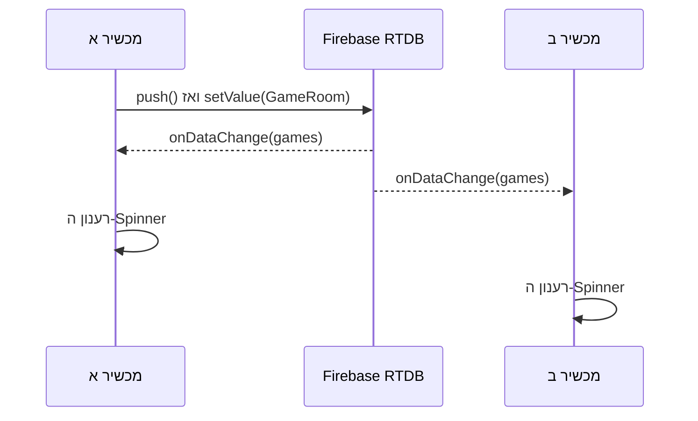

[חזרה ל־020: שיפור העיצוב](/android/projectSteps/020tictacmenu-theme-alignment) ·
[או ישירות ל־019c: השלמת View Binding](/android/projectSteps/019c.BindingForFragmentsAndMenuActivity)

{: .box-note}
בשיעור הזה נוסיף ל־`Main2Activity` לובי קטן: המשתמש ייתן שם למשחק, יפרסם חדר ב־Firebase Realtime Database, ויראה ב־Spinner את כל החדרים שפורסמו. הרשימה תתעדכן מעצמה בכל מכשיר פתוח.

בסיום יהיה לנו שלב עובד שאפשר לבדוק בפני עצמו:

1. כל משתמש מחובר יכול לפרסם חדר בשם שיבחר.
2. Firebase ייתן לכל חדר מפתח ייחודי, ולכן מותר לפרסם כמה חדרים בעלי אותו שם.
3. כל המכשירים יראו מיד חדרים חדשים ברשימה.
4. הלוח שבתחתית המסך ימשיך בינתיים לעבוד כמשחק מקומי.

בשיעור `021b` נפתח חדר מהרשימה, נחבר את הלוח לחדר, ונאפשר לשחקן שלישי לצפות במשחק. בשלב הנוכחי עדיין לא מצטרפים לחדר ולא שולחים מהלכים.

---

## לפני שמתחילים

השיעור ממשיך מפרויקט שבו כבר קיימים:

- Firebase Authentication ומשתמש מחובר.
- התלות של Firebase Realtime Database וקובץ `google-services.json`.
- המחלקה `FBRef` משיעורי Firebase.
- View Binding משיעורי `019`.
- `Main2Activity`, שהוא התאום המיועד ל־RTDB, ולוח מקומי שעובד בעזרת `TicTacToeModel`.

לא משנים את `MainActivity`, את `SignalRService` או את `activity_main.xml`. כך משחק SignalR נשאר כפי שהוא, ואנו בונים לידו גרסת RTDB נפרדת.

{: .box-warning}
הדוגמה נועדה ללימוד ראשון של כתיבה, קריאה והאזנה. אין בה אבטחה של חדרי המשחק. כל לקוח יכול לקרוא ולכתוב את כל הנתונים בענף שניצור.

---

## שלב 1 - רק למורים - פתיחת הענף בחוקי RTDB

<details markdown="1"><summary>חוקי פיירבייס לא רלוונטים בשלב ראשוני של הלמידה. ניתן להגיש פרוייקט גם ללא חוקים נוקשים</summary>

כל נתוני הדוגמה יישמרו תחת ענף נפרד:

```text
/TicTacToeRtdb
```

אם בקובץ החוקים שלכם אין כלל כללי בשם `$key`, אפשר להוסיף תחת `rules`:

```json
"TicTacToeRtdb": {
  ".read": true,
  ".write": true
}
```

במסד הנתונים המשותף של הפרויקט כבר קיים כלל כללי בשם `$key`. כללי Firebase החופפים אינם מסננים זה את זה, ולכן במקרה הזה לא מוסיפים לידו כלל נוסף. מעדכנים את הכלל הקיים כך:

<div class="two-columns before-after" markdown="1">
<div markdown="1">

### לפני

```json
"$key": {
  ".read": "$key.endsWith('*' + auth.uid)",
  ".write": "$key.endsWith('*' + auth.uid)"
}
```

</div>
<div markdown="1">

### אחרי

```json
"$key": {
  ".read": "$key === 'TicTacToeRtdb' || $key.endsWith('*' + auth.uid)",
  ".write": "$key === 'TicTacToeRtdb' || $key.endsWith('*' + auth.uid)"
}
```

</div>
</div>

</details>

### מה המשמעות של החוקים הפתוחים?

חוקי RTDB נבדקים בשרת Firebase בכל פעולת קריאה או כתיבה. כאשר אנו כותבים
`".read": true` ו־`".write": true` בענף `TicTacToeRtdb`, אנו אומרים לשרת:

- אפשר להוריד את כל מה שנמצא בענף הזה.
- אפשר להוסיף, לשנות ואף למחוק כל דבר בענף הזה.
- אין בדיקה שה־UID שכתוב בתוך `playerX` הוא באמת ה־UID של מי ששלח את הכתיבה.
- אין בדיקה ששם החדר, מבנה החדר או תוכן אחר הם תקינים.

הבדיקה ב־`Main2Activity` שיש משתמש מחובר נחוצה לאפליקציה שלנו כדי לקבל UID ולכתוב
אותו ב־`playerX`, אך היא **אינה חוק אבטחה**. לקוח אחר יכול לפנות ישירות למסד ולעקוף
את הבדיקה שב־Activity. זה מכוון בתרגיל הראשון כדי שנוכל להתרכז בכתיבה, בקריאה
ובהאזנה; אין להשתמש בחוקים כאלה לנתונים אמיתיים או פרטיים.

{: .box-warning}
`true` כאן פירושו ציבורי ממש, לא "כל משתמש Firebase מחובר". כדי לדרוש התחברות
היינו כותבים תנאי כמו `auth != null`, אך זה אינו החוק שבחרנו עבור ההדגמה הזאת.

---

## שלב 2 - מבנה הנתונים של חדר

כל חדר יישמר מתחת למפתח אקראי ש־Firebase ייצור:

```text
/TicTacToeRtdb/games/{pushId}
    name: "Class game"
    playerX: "<uid of the creator>"
    playerO: ""
    moves: ""
```

בשלב הזה אנו משתמשים בפועל ב־`name` וב־`playerX`. את `playerO` ואת `moves` כותבים כמחרוזות ריקות, כדי שהאובייקט שנפרסם כבר יהיה בדיוק האובייקט שנמשיך איתו ב־`021b`.

צרו מחלקת Java חדשה:

- תצוגת Android: `app > kotlin+java > com.example.tictacmenu > models`
- שם המחלקה: `GameRoom`

הכניסו לקובץ את הקוד המלא:

```java
package com.example.tictacmenu.models;

/**
 * Stores the small amount of data published for one RTDB Tic-Tac-Toe room.
 */
public class GameRoom {

    /** The room name entered by its creator. */
    private String name = "";

    /** The Firebase user ID of the player using X. */
    private String playerX = "";

    /** The Firebase user ID of the player using O, or an empty string while waiting. */
    private String playerO = "";

    /** The complete semicolon-separated sequence of moves played in this room. */
    private String moves = "";

    /**
     * Creates an empty room object for Firebase snapshot conversion.
     */
    public GameRoom() {
    }

    /**
     * Creates a room with all values that will be written to Firebase.
     *
     * @param name room name entered by the creator
     * @param playerX Firebase user ID of player X
     * @param playerO Firebase user ID of player O, or an empty string
     * @param moves complete move sequence, or an empty string
     */
    public GameRoom(String name, String playerX, String playerO, String moves) {
        this.name = name;
        this.playerX = playerX;
        this.playerO = playerO;
        this.moves = moves;
    }

    /**
     * Returns the displayed room name.
     *
     * @return room name
     */
    public String getName() {
        return name;
    }

    /**
     * Sets the displayed room name when Firebase creates this object.
     *
     * @param name room name
     */
    public void setName(String name) {
        this.name = name;
    }

    /**
     * Returns the Firebase user ID assigned to X.
     *
     * @return player X user ID
     */
    public String getPlayerX() {
        return playerX;
    }

    /**
     * Sets the Firebase user ID assigned to X.
     *
     * @param playerX player X user ID
     */
    public void setPlayerX(String playerX) {
        this.playerX = playerX;
    }

    /**
     * Returns the Firebase user ID assigned to O.
     *
     * @return player O user ID, or an empty string while waiting
     */
    public String getPlayerO() {
        return playerO;
    }

    /**
     * Sets the Firebase user ID assigned to O.
     *
     * @param playerO player O user ID
     */
    public void setPlayerO(String playerO) {
        this.playerO = playerO;
    }

    /**
     * Returns the complete move sequence.
     *
     * @return semicolon-separated move sequence
     */
    public String getMoves() {
        return moves;
    }

    /**
     * Sets the complete move sequence.
     *
     * @param moves semicolon-separated move sequence
     */
    public void setMoves(String moves) {
        this.moves = moves;
    }
}
```

{: .box-note}
במימוש שבחרנו Firebase משתמש בבנאי הריק וב־getters/setters כדי למפות בין `GameRoom` לנתוני `DataSnapshot`. זו אינה צורת המיפוי היחידה: בהעמקה הבאה נשווה גם שדות ציבוריים ומפות. הבנאי המלא נוח לנו כאשר אנו יוצרים חדר חדש. `GameRoom` מתאר רק את הנתונים ששמורים בענן; `TicTacToeModel` ממשיך לתאר את חוקי הלוח המקומי.

### כיצד אובייקט Java הופך לנתונים ב־RTDB?

RTDB אינו שומר את האובייקט Java עצמו. הוא שומר עץ פשוט של שמות וערכים, דומה מאוד
ל־JSON. בקריאה ובכתיבה ה־SDK של Firebase מבצע עבורנו את ההמרה:

| כיוון | מה Firebase עושה |
|---:|---:|
| `setValue(room)` | קורא את מאפייני `GameRoom` וכותב ילדים בשם `name`, `playerX`, `playerO` ו־`moves` |
| `getValue(GameRoom.class)` | יוצר `GameRoom` בעזרת הבנאי הריק, ואז ממלא את המאפיינים מה־snapshot |

לכן למחלקת הנתונים יש צורה פשוטה וצפויה:

- בנאי `public` ללא פרמטרים, כדי ש־Firebase יוכל ליצור אובייקט בלי לדעת אילו ערכים
  להעביר לבנאי המלא.
- getter ו־setter ציבוריים לכל מאפיין, כדי ששמות הערכים יוכלו לעבור בין Java ובין
  עץ הנתונים.
- טיפוסים פשוטים ש־Firebase מכיר, וכאן כולם `String`.

הבנאי המלא אינו דרישה של Firebase. הוא קיים רק כדי שהקוד שלנו יוכל ליצור חדר חדש
בשורה אחת. גם ה־JavaDoc אינו דרישה של Firebase; הוא קיים כדי להסביר למתכנת מה כל
ערך מייצג.

{: .box-note}
`GameRoom` הוא **תיאור נתונים** בלבד. אין בו הפניה למסד, כתיבה או מאזין. לכן אפשר
להסתכל עליו ולדעת בדיוק מה נשמר בענן, בלי לערבב זאת עם פעולות המסך או עם חוקי
האיקס־עיגול שב־`TicTacToeModel`.


<details open markdown="1" id="presence-rtdb-comparison">
<summary><strong>העמקה: GameRoom מול Presence — מחלקת נתונים, Map ו־JSON</strong></summary>

### איזו מחלקה זו, והיכן כבר פגשנו דבר דומה?

המחלקה היא **`GameRoom`**, המופיעה בשלמותה למעלה. היא נוספה לשיעור `021a`
בקומיט `4697c9a` מ־31.8.2026, ולפרויקט TicTacMenu בקומיט `0f6d018`
מאותו תאריך (`implemented 021a`). שיעור `021b` נוסף בקומיט `c03b570` ומשתמש
באותה מחלקה כדי לקרוא שחקנים ומהלכים; הוא אינו מוסיף מחלקת נתונים אחרת.

ב־Presence המקבילה הקטנה והישירה ביותר היא **`Obj/User.java`**: שדות פרטיים,
בנאי ריק, בנאי מלא ו־getters/setters. גם **`Obj/Task.java`** משתמשת באותה שיטה
לשמירת משימות ולקריאת רשימה מתעדכנת. **`models/Student.java`** מכילה הרבה יותר
זוגות כאלה. לעומתן, מסך הנוכחות `PresenceActivity` מרכיב חלק מנתוניו באמצעות
`Map` וקורא ענפים ידנית; זה כנראה החלק שנראה שונה כשעובדים על הנוכחות עצמה.

{: .box-note}
זו הרחבת קריאה והשוואה, ללא שינוי נוסף בפרויקט Android. קטעי Presence מובאים
כאן כדי שאפשר יהיה ללמוד בלי גישה למאגר האחר. הם נבדקו בקוד המקומי ב־14.9.2026
(HEAD: `cdf2425`); דוגמאות הנתונים בהסבר מומצאות. קוד המשחק של `021b` הוא המשך
מתועד: פרויקט TicTacMenu שנבדק עדיין נמצא בסוף `021a`.

אפשר לקרוא לפי הסדר, או לדלג אל [בחירת שיטת הייצוג](#rtdb-representation-choice)
ואל [בדיקת ההבנה](#rtdb-comparison-practice). אחרי השיחה בין שתי האפליקציות נעקוב
ב[תרשימי שני המכשירים ב־021b](/android/projectSteps/021b.TicTacToeRTDBGame#rtdb-two-device-flow).

### מחלקה שנראית כמו ממשק — אבל היא אובייקט ממשי

`GameRoom` היא **POJO** — מחלקת Java רגילה — המשמשת כאן כ־**DTO**, אובייקט
להעברת נתונים. אלו תיאורי תפקיד, לא מילות מפתח שצריך לכתוב ב־Java.
הצורה של בנאי ריק ומאפיינים עם getters/setters מוכרת גם כסגנון JavaBean.

`interface` מתאר חוזה שאחרים מממשים. אי אפשר לכתוב `new SomeInterface()` כדי
ליצור ישירות מופע שלו. לעומת זאת, `new GameRoom(...)` יוצר מופע עם ארבעה שדות,
והמתודות שלו כבר ממומשות. דווקא `ValueEventListener` שבהמשך הוא ממשק: המחלקה
האנונימית `new ValueEventListener() { ... }` מממשת את שתי מתודות האירוע.

| רכיב | אחריות |
|---:|---:|
| `GameRoom` | הנתונים שמעבירים: שם החדר, שני UID ורצף מהלכים |
| `TicTacToeModel` | חוקי המשחק והלוח המקומי |
| `DatabaseReference` | הכתובת שבה קוראים וכותבים |
| `DataSnapshot` | צילום נתונים לקריאה, כפי שנמסר באירוע |
| `ValueEventListener` | הקוד שיופעל כשיגיע צילום נתונים |
| `Main2Activity` | חיבור הקלט, הכתיבה, ההאזנה והציור למסך |

למשל, `room.setPlayerO("uid-o")` משנה את `room` בזיכרון **בלבד**.
הוא לא כותב למסד, לא מוסיף מאזין ולא מודיע למכשיר אחר. גם שינוי ה־snapshot
לא נעשה דרך האובייקט שהופק ממנו. לשמירה צריך פעולה מפורשת על הפניה למסד.

### המקבילה המדויקת ב־Presence: User

להלן גוף המחלקה המלא, כולל כל הבנאים והמתודות. רק שורת ה־package ותיעוד
המחבר שבראש הקובץ הושמטו. הקרדיט המופיע במקור: Albert Levy.

מקור: **Presence — `Obj/User.java`**, שורות 12–69.

```java
public class User {
    private String uid;
    private String username;

    /**
     * Default constructor for the User class.
     * Initializes a new User object with null values for UID and username.
     * This constructor is often used by data mapping frameworks like Firebase.
     */
    public User() {}

    /**
     * Constructs a new User object with the specified UID and username.
     *
     * @param uid The unique identifier for the user.
     * @param username The username of the user.
     */
    public User(String uid, String username) {
        this.uid = uid;
        this.username = username;
    }

    /**
     * Gets the unique identifier (UID) of the user.
     *
     * @return The UID string of the user.
     */
    public String getUid() {
        return uid;
    }

    /**
     * Sets the unique identifier (UID) of the user.
     *
     * @param uid The new UID string for the user.
     */
    public void setUid(String uid) {
        this.uid = uid;
    }

    /**
     * Gets the username of the user.
     *
     * @return The username string of the user.
     */
    public String getUsername() {
        return username;
    }

    /**
     * Sets the username of the user.
     *
     * @param username The new username string for the user.
     */
    public void setUsername(String username) {
        this.username = username;
    }
}
```

זו אותה טכנולוגיה כמו `GameRoom`. ההבדל הוא במספר המאפיינים ובמשמעותם.
ב־`MainActivity` של Presence הקריאה היא `tsk.getResult().getValue(User.class)`;
ב־`LoginActivity` הכתיבה היא `refUsers.child(uid).setValue(userdb)`.
בשני הכיוונים Firebase ממפה אובייקטים, ללא `JSONObject` וללא Gson בקוד הזה.


### למה Presence משתמשת ב־User ו־TicTacMenu מסתדרת בלעדיה?
{: #user-profile-vs-auth}

**כן, בשלב הנוכחי ההבדל נובע מן המידע שהאפליקציה צריכה.** במשחק אנחנו צריכים
לזהות מי מחובר ומי משחק X או O; ב־Presence שומרים גם שם משתמש של היישום
וקוראים אותו להצגה. אבל עצם קיומו של מסך פרופיל אינו מחייב מחלקה משלנו:
אפשר להציג פרטים בסיסיים מתוך `FirebaseUser`, ואפשר לשמור פרופיל באמצעות Map.

#### שני סוגים שונים של "משתמש"

| רכיב | מי מגדיר אותו | תפקידו |
|---:|---:|---:|
| `FirebaseUser` | Firebase Authentication | מייצג את החשבון המחובר ומאפשר לקבל את ה־UID ופרטי חשבון בסיסיים |
| `User` של Presence | קוד האפליקציה, `Obj/User.java` | ממפה רשומת RTDB עם שני מאפיינים: `uid` ו־`username` |
| `/Users/{uid}` | נתיב שהאפליקציה בחרה ב־RTDB | שומר את נתוני הפרופיל שהקוד כותב אליו |
| `GameRoom` | קוד TicTacMenu | ממפה חדר משחק, ובו הפניות לזהות שני השחקנים באמצעות UID |

ה־`Users` שבתפריט **Authentication** ב־Firebase Console אינו הענף `/Users`
של **Realtime Database**. יצירת חשבון ב־Authentication אינה יוצרת אוטומטית
רשומה בענף שבחרנו במסד. הקוד של Presence מבצע את שתי הפעולות במפורש.

#### Presence: יוצרים חשבון, שומרים פרופיל, ואז קוראים אותו

לאחר הצלחת `createUserWithEmailAndPassword`, קטע ההצלחה בהרשמה מבצע:

מקור: **Presence — `Activities/LoginActivity.java`**, שורות 425–432.

```java
FirebaseUser user = getUserAndSetUidFromFBuserAndStoreLast("createUserWithEmail:success");
userdb = new User(uid, name);
refUsers.child(uid).setValue(userdb);
settings.edit()
        .putBoolean("stayConnect", cBstayconnect.isChecked())
        .apply();
Toast.makeText(LoginActivity.this, "Successful registration", Toast.LENGTH_SHORT).show();
setActiveYear();
```

`getUserAndSetUidFromFBuserAndStoreLast(...)` מקבלת את חשבון Firebase ומעדכנת
את ה־UID המקומי. אחר כך `new User(uid, name)` יוצרת אובייקט נתונים משלנו,
ו־`setValue(userdb)` מבקשת לשמור אותו. לדוגמה, נתונים מומצאים בנתיב
`/Users/uid-demo` ייראו כך:

```json
{
  "uid": "uid-demo",
  "username": "Demo Teacher"
}
```

אותו UID מחבר בין החשבון לרשומה. שמירתו גם בתוך הרשומה היא בחירת המודל של
Presence; אפשר לתכנן מודל שבו המזהה מתקבל רק ממפתח ה־snapshot.
בכניסה עם Google, `firebaseAuthWithGoogle(...)` יוצרת רשומה כזו רק כאשר
`isNewUser()` מחזירה `true`, ומשתמשת בשם שמגיע מחשבון Google. למשתמש Google
קיים היא ממשיכה לאפליקציה בלי לכתוב מחדש את הפרופיל.

ב־`MainActivity` הפרופיל נקרא כדי להציג ברכה. זהו כל קטע הקריאה וה־callback:

מקור: **Presence — `Activities/MainActivity.java`**, שורות 129–140.

```java
refUsers.child(FBRef.uid).get().addOnCompleteListener(new OnCompleteListener<DataSnapshot>(){
    @Override
    public void onComplete(@NonNull com.google.android.gms.tasks.Task<DataSnapshot> tsk) {
        if (tsk.isSuccessful()) {
            user = tsk.getResult().getValue(User.class);
            tVMainHeader.setText("Hi "+user.getUsername()+",\nYour active tasks:");
        }
        else {
            Log.e("firebase", "Error getting data", tsk.getException());
        }
    }
});
```

`getValue(User.class)` מפיקה את האובייקט, ו־`getUsername()` נותנת את השם
לכותרת המסך. זו התועלת המעשית של `User` כאן. המחלקה אינה מבצעת את הכניסה,
אינה שומרת סיסמה ואינה מנהלת את רשימת המשימות.

{: .box-warning}
בקטע ההרשמה אין המתנה לאישור כתיבת הפרופיל, ובקטע הקריאה אין בדיקה שהרשומה
קיימת לפני `user.getUsername()`. לכן חשבון Auth יכול להתקיים גם אם כתיבת
הפרופיל נכשלה; קריאה מוצלחת של נתיב ריק עדיין יכולה להחזיר `null`.
באפליקציה שמטפלת במצב הזה צריך מסלול השלמת פרופיל וטיפול בכשל כתיבה.
`isNewUser()` לבדו אינו בדיקה לקיום הרשומה ב־RTDB.

#### הפרופיל של Presence רחב יותר ממחלקת User

`ProfileActivity` מטפלת גם בשנה הפעילה (`activvvYear`, כך מאוית המפתח בקוד),
במסך המועדף, בשפה, בתמונה ובקישור לגיליון תלמידים. אלה **אינם שדות במחלקת
`User` שהצגנו**. היא קוראת וכותבת אותם ישירות תחת הפניית המשתמש.
למשל, זו כל המתודה לשינוי שפה:

מקור: **Presence — `Activities/ProfileActivity.java`**, שורות 201–223.

```java
private void changeLanguage(String selectedLanguage) {
    // Save to SharedPreferences
    languagePrefs.edit()
            .putString(SELECTED_LANGUAGE, selectedLanguage)
            .apply();

    // Save to Firebase for sync across devices
    userRef.child("preferredLanguage").setValue(selectedLanguage);

    // Apply language change using LanguageHelper
    String languageCode;
    if (selectedLanguage.equals("עברית")) {
        languageCode = "he";
    } else {
        languageCode = "en";
    }

    // Use the LanguageHelper to set locale properly
    LanguageHelper.setLocale(this, languageCode);

    // Restart the activity to apply changes
    recreate();
}
```

העדפת השפה נשמרת מקומית וגם ב־`/Users/{uid}/preferredLanguage`.
זה מדגים ששתי הגישות יכולות להתקיים באותו פרופיל: DTO קטן לקריאה מסוימת,
וגישה ישירה לילדים לצרכים אחרים. שינוי שפת הממשק עצמו נעשה ב־`LanguageHelper`
וב־`recreate()`, לא באמצעות הכתיבה למסד.

מכאן גם מגבלה חשובה: לא כדאי לשמור מאוחר יותר `new User(uid, name)` עם
`setValue` על **כל** `/Users/{uid}` רק כדי לשנות שם. האובייקט מכיל שני מאפיינים
בלבד, ולכן ההחלפה עלולה להסיר את העדפות הפרופיל האחרות. לשינוי שם בלבד
מתאים עדכון ממוקד של `username`; זו אותה הבחנה בין החלפה לעדכון שנלמד בהמשך.

#### TicTacMenu: ה־UID מספיק לתפקיד של השחקן

ב־`Main2Activity` של סוף `021a` מופיע הקטע הבא:

מקור: **TicTacMenu — `activities/Main2Activity.java`**, שורות 61–68.

```java
FirebaseUser currentUser = FBRef.refAuth.getCurrentUser();
if (currentUser == null) {
    Toast.makeText(this, R.string.rtdb_login_required, Toast.LENGTH_SHORT).show();
    finish();
    return;
}

currentUid = currentUser.getUid();
```

בהמשך נוצרת `new GameRoom(gameName, currentUid, "", "")`, ולכן ה־UID של
היוצר נשמר ב־`playerX`. ב־021b המצטרף נשמר ב־`playerO`, וכל מכשיר משווה את
ה־`currentUid` שלו לשני השדות כדי להחליט אם הוא X, O או צופה.
אין צורך בשם, בתמונה או בהעדפות כדי לבצע את ההשוואה הזאת; גם `name` של
`GameRoom` הוא **שם החדר**, לא שם המשתמש.

למרות השם, `FBRef.getUser(...)` של TicTacMenu אינה קוראת רשומת User מהמסד.
זו כל המתודה, כפי שנלמדה גם ב־018c:

מקור: **TicTacMenu — `services/FBRef.java`**, שורות 32–41.

```java
public static void getUser(FirebaseUser fbuser) {
    if (fbuser == null) {
        uid = null;
        refUser = null;
        return;
    }

    uid = fbuser.getUid();
    refUser = refUsers.child(uid);
}
```

השורה `refUser = refUsers.child(uid)` רק בונה הפניה ל־`/Users/{uid}`.
אין בה `get()`, מאזין או כתיבה, והיא אינה מוכיחה שקיים שם מידע.
במצב הפרויקט שנבדק, `ProfileFragment` מנפחת layout עם הטקסט
`hello_blank_fragment`; היא עדיין אינה טוענת או עורכת פרופיל. לכן קיום
כפתור "Profile", מחלקת Fragment או הפניה בשם `refUser` אינו מעיד שכבר
מימשנו שמירת פרופילים.

#### מתי נוסיף פרופיל משלנו?

| צורך | מה מספיק או מתאים |
|---:|---:|
| לזהות את השחקן המחובר ולהשוות ל־X/O | `FirebaseUser.getUid()` והשדות ב־GameRoom |
| להציג את השם או תמונת החשבון של המשתמש המחובר | ייתכן ש־`getDisplayName()` או `getPhotoUrl()` יספיקו, עם טיפול בערך חסר |
| לשמור כינוי למשחק, צבע מועדף או העדפות נוספות בין מכשירים | פרופיל ב־RTDB; DTO כמו `PlayerProfile` או Map הם שתי אפשרויות |
| להציג פרטים של היריב לפי ה־UID שבחדר | מקור פרטי תצוגה שהאפליקציה מתכננת לקריאה לפי UID; חשבון FirebaseUser המקומי הוא של המשתמש המחובר |

Firebase Authentication כבר מציע פרטי פרופיל בסיסיים. אם נבחר להעתיק את השם
ל־RTDB, כפי ש־Presence עושה בהרשמת Google, יהיו שני מקומות שמחזיקים שם;
צריך להחליט מי מקור האמת והאם שינוי באחד יעדכן גם את האחר. אין ביניהם
סנכרון אוטומטי שהקוד המצוטט מגדיר.
[מקור: פרטי המשתמש ועדכון פרופיל ב־Firebase Authentication](https://firebase.google.com/docs/auth/android/manage-users#get_a_users_profile).

{: .box-success}
ההחלטה היא לפי הנתונים הדרושים: כרגע TicTacMenu צריכה זהות ונתוני חדר,
ולכן `FirebaseUser` יחד עם `GameRoom` מספיקים. כשנוסיף מידע ייחודי לשחקן,
נבחר איך לשמור ולמפות אותו. גם אז `User` משלנו ישלים את Authentication;
הוא לא יחליף אותו, וה־UID הכתוב ברשומה לא יחליף בדיקת הרשאות בשרת.


`Task` מוסיפה גם `int year`,‏ `boolean fullClass`, ובדיקות עזר `equals(Task)`
ו־`isIn(ArrayList<Task>)`. המתודות האלה הן לוגיקה מקומית ואינן נשלחות לענן.
`equals(Task)` היא העמסה ייעודית, לא דריסה של `equals(Object)` לכל אוספי Java;
זו הבחנה ב־Java, שאינה נדרשת למיפוי RTDB.

### מה באמת עובר בין Java לעץ JSON?

הביטוי הבא יוצר רק אובייקט מקומי:

```java
GameRoom room = new GameRoom("Demo", "uid-x", "", "");
```

לאחר `newRoomReference.setValue(room)` התוכן בכתובת החדר יהיה:

```json
{
  "name": "Demo",
  "playerX": "uid-x",
  "playerO": "",
  "moves": ""
}
```

אין בנתונים שם מחלקה, בנאים או קוד של מתודות. מפתח החדר נמצא **מעל** האובייקט:
מקבלים אותו באמצעות `roomSnapshot.getKey()`. הוא אינו מוכנס אוטומטית לאחד
משדות `GameRoom`. גם שם להצגה אינו מזהה ייחודי; שני חדרים יכולים להיקרא `Demo`.

| ב־Java | שם המאפיין במיפוי הרגיל | שימוש |
|---:|:---|---:|
| `getPlayerO()` | `playerO` | קריאת הערך לצורך כתיבה |
| `setPlayerO(value)` | `playerO` | השמת הערך בעת שחזור האובייקט |
| `isFullClass()` ב־Task | `fullClass` | getter של מאפיין בוליאני |

ה־SDK משתמש ב־**reflection**: הוא בוחן את מבנה המחלקה בזמן ריצה ומפעיל את
הבנאי והגישה למאפיינים. ב־`GameRoom` אנו בוחרים בנאי ריק ומאפיינים עם getter
ו־setter. זו צורה קריאה וצפויה; **אין חובה גורפת לכתוב setter לכל שדה בכל מודל
Firebase**. הממפה תומך גם בשדות ציבוריים, ובנסיבות מתאימות בהשמה לשדה מזוהה
גם בלי setter. העיקר הוא מבנה נתונים שהממפה יודע לכתוב ולשחזר.
[מקור: הממפה של Firebase Android](https://github.com/firebase/firebase-android-sdk/blob/main/firebase-database/src/main/java/com/google/firebase/database/core/utilities/encoding/CustomClassMapper.java).

לשחזור אובייקט נדרש בנאי ללא פרמטרים. כשאין במחלקה **שום בנאי מפורש**, Java
יוצרת בנאי ברירת מחדל; כך קורה ב־`Student`. כשמוסיפים בנאי עם פרמטרים, הבנאי
הזה כבר אינו נוצר אוטומטית — ולכן כתבנו גם `public GameRoom()`.
אין לשים בבנאי הזה התחברות לרשת או פעולות מסך: ה־SDK מפעיל אותו במהלך המיפוי.

#### השמות המקצועיים: serialization ו־deserialization
{: #rtdb-serialization}

**כן — יצירת האובייקט ומילויו בזמן הקריאה הם deserialization.** בכיוון ההפוך,
המרת נתוני האובייקט לצורה שאפשר לשמור ולהעביר היא serialization:

| כיוון | שם התהליך | מה קורה בדוגמה שלנו |
|---:|---:|---:|
| מאובייקט Java לנתונים שנכתבים | Serialization — סריאליזציה | `setValue(room)` קוראת את מאפייני האובייקט וממפה אותם לערכים ש־RTDB יודע לשמור |
| מנתונים לאובייקט Java | Deserialization — דה־סריאליזציה | `snapshot.getValue(GameRoom.class)` יוצרת מופע בעזרת הבנאי ללא פרמטרים וממלאת אותו מנתוני ה־snapshot |

הבנאי הריק משתתף בכיוון **הקריאה והשחזור**. בכיוון הכתיבה כבר יש לנו אובייקט
`room`, ולכן הממפה קורא ממנו את הערכים ואינו צריך ליצור חדר חדש בבנאי הריק.
במימוש הנוכחי שלנו הוא משתמש ב־getters לכתיבה וב־setters למילוי האובייקט בקריאה.

דיוק קטן: כאשר אנחנו מקבלים `DataSnapshot`, ה־SDK כבר טיפל בקבלת הנתונים
ובפענוח התקשורת. `getValue(GameRoom.class)` ממפה את המבנה שב־snapshot
למחלקת Java מסוימת; הקוד שלנו אינו מקבל מחרוזת JSON גולמית ומפרק אותה ידנית.
אפשר לתאר זאת כ־**deserialization לאובייקט מטיפוס מוגדר**.
[מקור: getValue ומיפוי למחלקה ב־DataSnapshot](https://firebase.google.com/docs/reference/android/com/google/firebase/database/DataSnapshot).

{: .box-note}
המונח serialization אינו אומר שצריך להוסיף `implements Serializable`.
`java.io.Serializable` שייך למנגנון הסריאליזציה של Java, ואילו כאן Firebase
משתמש בממפה שלו. גם `Parcelable` אינו דרישה של RTDB. הקריאות הרגילות שלנו
ל־`room.getMoves()` או ל־`room.setMoves(...)` הן גישה מקומית לשדה; לבדן הן
אינן שומרות, קוראות או מסנכרנות נתונים עם המסד.

חשוב להפריד בין **JSON כמבנה נתונים** לבין **טקסט שמכיל JSON**.
RTDB שומר עץ JSON; כשמשתמשים ב־SDK, בדרך כלל מוסרים אובייקטים, מפות, רשימות
וערכים פשוטים, וה־SDK מטפל בהמרה. לא צריך לבנות מחרוזת JSON בעצמנו.
[מקור: מבנה הנתונים ב־RTDB](https://firebase.google.com/docs/database/android/structure-data).

### אותו דפוס גם למשימות: כותבים אובייקט, קוראים אובייקטים

זו **כל** המתודה `confirmation` ב־Presence. המשתנים שמגיעים מהמסך כבר קיימים
ב־Activity; `refTasks` הוא ענף המשימות. הפרמטרים לבנאי `Task` הם תאריכי התחלה
וסיום, כיתה, מספר משימה, שנה והאם המשימה לכל הכיתה.

מקור: **Presence — `Activities/TaskActivity.java`**, שורות 247–277.

```java
public void confirmation(View view) {
    int taskNum = Integer.parseInt(eTTaskNum.getText().toString());
    serNum = String.format("%02d",taskNum);
    if (startDate == null || dueDate == null || className == null || serNum == null) {
        Toast.makeText(this, "Missing data", Toast.LENGTH_SHORT).show();
    } else {
        Task newTask = new Task(startDate, dueDate,className, serNum, activeYear, cbFullClass.isChecked());
        if (!isNewTask) {
            refTasks.child(String.valueOf(activeYear))
                    .child(String.valueOf(!task.isFullClass()))
                    .child(task.getDateEnd())
                    .child(task.getClassName()+task.getSerNum())
                    .removeValue();
            refTasks.child(String.valueOf(activeYear))
                    .child(String.valueOf(!cbFullClass.isChecked()))
                    .child(dueDate)
                    .child(className+serNum)
                    .setValue(newTask);
            finish();
        } else if (newTask.isIn(MainActivity.tasksList)) {
            Toast.makeText(this, "Task already exist!", Toast.LENGTH_SHORT).show();
        } else {
            refTasks.child(String.valueOf(activeYear))
                    .child(String.valueOf(!cbFullClass.isChecked()))
                    .child(dueDate)
                    .child(className+serNum)
                    .setValue(newTask);
            finish();
        }
    }
}
```

בדומה לחדר, מחליטים בנפרד **איפה** לכתוב (`child(...)`) ו**מה** לכתוב
(`newTask`). כאן המפתח נגזר מנתוני המשימה; אצלנו `push()` מייצר מפתח חדש.
המבנה המקונן מסביר מדוע הקורא בהמשך עובר בשלוש לולאות: קבוצה, תאריך ומשימה.

<div markdown="1" class="box-warning">

זהו קוד מקור להשוואה, ויש בו גם מגבלות שכדאי לזהות:

- `finish()` נקרא מיד אחרי בקשת הכתיבה; זה אינו אישור שהשרת שמר אותה.
- בעריכה, `removeValue()` ו־`setValue()` הן שתי פעולות נפרדות. כשל ביניהן עלול
  להשאיר את הרשומה מחוקה. עדכון רב־נתיבי אטומי יכול לכלול מחיקת הנתיב הישן
  וכתיבת החדש יחד, באמצעות מפה שבה המפתחות הם שני הנתיבים.
- `Integer.parseInt(...)` מתבצע לפני בדיקת החוסרים; קלט ריק או לא מספרי עלול
  לזרוק חריגה. מחלקת DTO אינה מחליפה בדיקת קלט.

</div>

לעומת זאת, ב־`startGameAndWait()` שלנו הודעת ההצלחה ב־021a, וב־021b פתיחת החדר,
נמצאות ב־`addOnSuccessListener`. זו הפרדה טובה יותר בין התחלת הבקשה להצלחתה.
להלן כל קטע יצירת המאזין ורישומו מתוך `onCreate` של Presence:

מקור: **Presence — `Activities/MainActivity.java`**, שורות 141–160.

```java
vel = new ValueEventListener() {
    @Override
    public void onDataChange(@NonNull DataSnapshot dS) {
        tasksList.clear();
        for(DataSnapshot dataFull : dS.getChildren()) {
            for(DataSnapshot dataDate : dataFull.getChildren()) {
                for(DataSnapshot data : dataDate.getChildren()) {
                    tasksList.add(data.getValue(Task.class));
                }
            }
        }
        taskAdp.notifyDataSetChanged();
        if (pd != null) {
            pd.dismiss();
        }
    }
    @Override
    public void onCancelled(@NonNull DatabaseError error) {}
};
refTasks.child(String.valueOf(activeYear)).addValueEventListener(vel);
```

השוו ל־`listenForRooms()` בשיעור הזה: ניקוי רשימה, מעבר על ילדים, המרה באמצעות
`getValue(SomeClass.class)`, ולבסוף הודעה ל־adapter. שני הקטעים בונים מחדש את
הרשימה מתוך צילום מלא. זו בחירה פשוטה וסבירה לרשימה קטנה.
ב־Presence ענף `onCancelled` כאן ריק; אצלנו מוצגת שגיאה, ולכן קל יותר להבחין
בין חוסר הרשאה לבין רשימה שאין בה פריטים. בשני הקטעים כדאי, כשמקשיחים את
האפליקציה, לטפל גם בנתון חסר ובכשל המרה במקום להניח שכל ילד תקין.

בחירת POJO אינה גורמת לזמן אמת. **המאזין** הוא שמספק את העדכונים.
Presence טוענת תלמידים ב־`FBRef` באמצעות `addListenerForSingleValueEvent`,
ומסך הנוכחות משתמש באותה צורת קריאה כדי לשחזר שיעור קיים. הקריאה הזו מסתיימת
אחרי אירוע אחד. לעומתם, `addValueEventListener` ממשיך להאזין עד הסרתו.
`get()` מחזיר בקשת קריאה בודדת כ־Task, לא אובייקט זמין מיד.
[מקור: קריאה והאזנה ב־Android](https://firebase.google.com/docs/database/android/read-and-write#read_data).

### החלק שבאמת שונה: נוכחות שנבנית באמצעות Map

`studentStatus` היא מפה מקומית מכינוי תלמיד למצב; `disturbanceSet` היא קבוצה
נפרדת של הפרעות; `rawTranscripts` היא רשימת התמלולים. המתודה הבאה בונה מהם
רשומה אחת של שיעור. זו המתודה המלאה, ללא השמטות פנימיות:

מקור: **Presence — `Activities/PresenceActivity.java`**, שורות 688–733.

```java
private void pushRawTranscript(String newEntry) {
    if (currentTimestampAndLesson == null) {
        Log.e("PresenceActivity", "currentTimestampAndLesson is null");
        return;
    }

    Map<String, Object> payload = new HashMap<>();
    payload.put("class", detectedClassName);

    // Group by status using English constants, but EXCLUDE ON_TIME
    Map<String, List<String>> grouped = new HashMap<>();
    for (Map.Entry<String, String> e : studentStatus.entrySet()) {
        String statusKey = e.getValue();
        // Skip ON_TIME students - we don't want them in Firebase
        if (!StudentStatus.ON_TIME.equals(statusKey)) {
            grouped.computeIfAbsent(statusKey, k -> new ArrayList<>()).add(e.getKey());
        }
    }

    // Push structured status data using English keys for DB (excluding ON_TIME)
    Map<String, Object> statusMap = new HashMap<>();
    for (Map.Entry<String, List<String>> entry : grouped.entrySet()) {
        List<String> names = entry.getValue();
        if (names != null && !names.isEmpty()) {
            // Use English constant as key in database (ON_TIME already excluded above)
            statusMap.put(entry.getKey(), names);
        }
    }

    // Only add statusSummary if there are actual statuses to report
    if (!statusMap.isEmpty()) {
        payload.put("statusSummary", statusMap);
    }

    if (!disturbanceSet.isEmpty()) {
        payload.put("disturbances", new ArrayList<>(disturbanceSet));
    }

    payload.put("rawTranscript", rawTranscripts);

    refPresUidCurrentWeek
            .child(currentTimestampAndLesson)
            .setValue(payload)
            .addOnSuccessListener(unused -> Log.i("PresenceActivity", "Upload success"))
            .addOnFailureListener(e -> Log.e("PresenceActivity", "Upload failed", e));
}
```

כאן אין `AttendanceRecord` עם getters/setters. `payload.put(...)` בונה במפורש
את שמות הענפים. למשל, הנתונים המומצאים הבאים מתארים מבנה אפשרי; `ABSENT`
ו־`LATE` משמשים כאן כשמות המחשה לקבועי המצבים:

```json
{
  "class": "DemoClass",
  "statusSummary": {
    "ABSENT": ["student-a"],
    "LATE": ["student-b"]
  },
  "rawTranscript": ["demo transcript"]
}
```

`computeIfAbsent` יוצר רשימה עבור מצב שטרם הופיע ואז מוסיף אליה כינוי.
הקיבוץ משנה את צורת המידע: מכינוי ← מצב בזיכרון, למצב ← רשימת כינויים במסד.
זהו עיבוד שאנחנו כתבנו, לא קסם של Firebase. הממפה רק שומר את המפה שהוכנה.

יש כאן כמה בחירות מועילות: שמות מצבים שאינם תלויים בשפת הממשק, קיבוץ נוח
לדוח, השמטת `ON_TIME` במכוון, והמרת `Set` ל־`ArrayList` לפני מסירתו ל־SDK.
הפרמטר `newEntry` אינו נקרא בגוף המתודה: למרות השם `pushRawTranscript`, היא
אינה מפעילה `push()` ואינה שומרת רק את התמלול החדש. היא שומרת את המצב המצטבר.

### setValue מחליף — גם כאשר האובייקט הוא Map

`setValue(payload)` מחליף את **כל השיעור** בנתיב `currentTimestampAndLesson`.
אם נשמר קודם `disturbances`, וכעת הקבוצה ריקה ולכן הענף הושמט מן המפה,
ההחלפה תסיר גם את ההפרעות הישנות. זה מתאים לשמירת תמונה מלאה של מצב מקומי.
אם לקוח אחר הוסיף שם שדה שהקוד שלנו אינו מכיר, גם הוא עלול להיעלם.

לעומת זאת, ב־021b הכתיבה היא אל `selectedRoomReference.child("moves")`, ולכן רק
הרצף מוחלף; `name`,‏ `playerX` ו־`playerO` נשארים במקומם. **היקף ההחלפה נקבע
לפי הכתובת**, לא לפי מספר השדות במחלקה.

`updateChildren` מעדכן את הנתיבים שנמסרו במפה, ו־`null` בנתיב מסמן מחיקה.
אין לראות בו מיזוג עמוק אוטומטי: `updates.put("statusSummary", wholeMap)` מחליף
את כל `statusSummary`; מפתח כמו `"statusSummary/LATE"` מצביע רק לתת־הענף הזה.
Presence עצמה משתמשת גם ב־`updateChildren(batch)` ב־`LoadActivity`, בהעלאת
תלמידים. כל ערך ב־batch הוא רשומת תלמיד מלאה, ולכן הוא מחליף את אותו תלמיד,
אך תלמידים שמפתחותיהם לא נשלחו נשארים בענף.
[מקור: setValue, updateChildren וערכי null](https://firebase.google.com/docs/reference/android/com/google/firebase/database/DatabaseReference).

{: .box-warning}
אם נחליף את `setValue(payload)` ב־`updateChildren(payload)` בלבד, השמטת
`disturbances` ריק כבר לא תמחק את ההפרעות הישנות. החלפת API בלי להגדיר את
משמעות ההשמטה משנה את ההתנהגות. גם עדכון אטומי אינו פותר תחרות של שני כותבים
שמעדכנים את אותו ערך על סמך עותק ישן.

### קריאה ידנית: פחות מחלקות, יותר אחריות אצל הקורא

זהו בלוק שחזור `statusSummary` בשלמותו מתוך `restoreDataFromSnapshot`.
בתחילת המתודה המלאה מתבצע `studentStatus.clear()`, ולכן מתבצעת בנייה מחדש:

מקור: **Presence — `Activities/PresenceActivity.java`**, שורות 286–298.

```java
// Restore status summary
DataSnapshot statusSnapshot = snapshot.child("statusSummary");
if (statusSnapshot.exists()) {
    for (DataSnapshot statusGroup : statusSnapshot.getChildren()) {
        String status = statusGroup.getKey();
        for (DataSnapshot nameSnapshot : statusGroup.getChildren()) {
            String name = nameSnapshot.getValue(String.class);
            if (name != null && status != null) {
                studentStatus.put(name, status);
            }
        }
    }
}
```

`getKey()` מחזיר כאן את שם **המצב**, לא מזהה תלמיד. `getValue(String.class)`
מחזיר את הכינוי בכל ילד. שתי הלולאות הופכות בחזרה מצב ← רשימת כינויים
לכינוי ← מצב. המפה הדינמית מתאימה לכך שמספר המצבים והתלמידים משתנה.
הקוד ברור לגבי ערכים חסרים, אך עדיין מניח שהעלים הם מחרוזות; בדיקת `null`
לא תתקן עלה שהטיפוס שלו שגוי.

אפשר לשלב שיטות: מחלקת `AttendanceRecord` עם שדות קבועים, ובתוכה
`Map<String, List<String>> statusSummary`. זו אפשרות תכנונית להמשך, לא קוד
שקיים כאן. גם `GenericTypeIndicator<Map<String, List<String>>>` יכול לספק
ל־`getValue` מידע על טיפוס מקונן שנמחק בזמן ריצה; הוא אינו בודק שהמצב המתקבל
מותר לפי חוקי היישום.
[מקור: GenericTypeIndicator](https://firebase.google.com/docs/reference/android/com/google/firebase/database/GenericTypeIndicator).

### JSON מפורש ב־Presence שייך למסלול אחר

Presence בונה גם `JSONObject`, אבל לשם הכנת מידע ל־`MashovActivity`.
זו כל מתודת ההכנה; שימו לב להמרת כינויים לשמות מלאים ול־`JSONArray`:

מקור: **Presence — `Activities/PresenceActivity.java`**, שורות 812–880.

```java
private JSONObject buildMashovAttendanceData() {
    try {
        JSONObject data = new JSONObject();

        // Add class name
        data.put("class", detectedClassName);

        // Build status summary with full names instead of nicknames
        JSONObject statusSummary = new JSONObject();

        // Group by status (using English constants)
        Map<String, List<String>> grouped = new HashMap<>();
        for (Map.Entry<String, String> e : studentStatus.entrySet()) {
            String statusKey = e.getValue();
            // Skip ON_TIME students - we don't need them in Mashov
            if (!StudentStatus.ON_TIME.equals(statusKey)) {
                grouped.computeIfAbsent(statusKey, k -> new ArrayList<>()).add(e.getKey());
            }
        }

        // Convert nicknames to full names
        for (Map.Entry<String, List<String>> entry : grouped.entrySet()) {
            String status = entry.getKey();
            List<String> nicknames = entry.getValue();
            List<String> fullNames = new ArrayList<>();

            for (String nickname : nicknames) {
                Student student = FBRef.findStudentByNick(nickname, detectedClassName);
                if (student != null) {
                    fullNames.add(student.getFullName());
                } else {
                    Log.w("PresenceActivity", "Could not find full name for nickname: " + nickname);
                    fullNames.add(nickname); // fallback to nickname
                }
            }

            if (!fullNames.isEmpty()) {
                JSONArray statusArray = new JSONArray();
                for (String fullName : fullNames) {
                    statusArray.put(fullName);
                }
                statusSummary.put(status, statusArray);
            }
        }

        data.put("statusSummary", statusSummary);

        // Handle disturbances with full names
        if (!disturbanceSet.isEmpty()) {
            JSONArray disturbancesArray = new JSONArray();
            for (String nickname : disturbanceSet) {
                Student student = FBRef.findStudentByNick(nickname, detectedClassName);
                if (student != null) {
                    disturbancesArray.put(student.getFullName());
                } else {
                    Log.w("PresenceActivity", "Could not find full name for disturbance nickname: " + nickname);
                    disturbancesArray.put(nickname); // fallback to nickname
                }
            }
            data.put("disturbances", disturbancesArray);
        }

        return data;

    } catch (JSONException e) {
        Log.e("PresenceActivity", "Error building Mashov attendance data", e);
        return null;
    }
}
```

וזו כל המתודה שמעבירה את התוצאה למסך הבא:

מקור: **Presence — `Activities/PresenceActivity.java`**, שורות 885–900.

```java
private void launchMashovUpdate() {
    if (detectedClassName == null) {
        Toast.makeText(this, "No class detected yet", Toast.LENGTH_SHORT).show();
        return;
    }

    JSONObject attendanceData = buildMashovAttendanceData();
    if (attendanceData == null) {
        Toast.makeText(this, "Failed to prepare attendance data", Toast.LENGTH_SHORT).show();
        return;
    }

    Intent intent = new Intent(this, MashovActivity.class);
    intent.putExtra("ATTENDANCE_DATA", attendanceData.toString());
    startActivity(intent);
}
```

כאן `attendanceData.toString()` יוצר **טקסט JSON** שמועבר ב־Intent.
ב־`MashovActivity` נעשית הפעולה ההפוכה: `new JSONObject(attendanceJson)`.
המסלול הזה אינו כותב ל־RTDB, והוא גם אינו שולח דבר למכשיר השני.
`JSONObject` נוח כשצריך ליצור או לפרש מסמך JSON מפורש, במיוחד עבור ממשק
חיצוני. Gson הוא ממפה JSON אחר; הוא אינו מנגנון ההמרה של RTDB שבקטעים האלה.
[מקור: JSONObject ב־Android](https://developer.android.com/reference/org/json/JSONObject).

לא מוסרים ל־RTDB `payload.toString()` של `Map`: זו מחרוזת תצוגה של Java,
שאינה בהכרח JSON. גם `JSONObject.toString()` תקין שיישמר ב־`setValue` יישמר
כערך מחרוזת, ולא יתפרק אוטומטית לילדים שאפשר לקרוא ב־`child("class")`.
לכתיבת עץ משתמשים בערכים הנתמכים של ה־SDK, כגון Map או POJO מתאים.

### מה פשוט יותר, ומה עדיף כאן?
{: #rtdb-representation-choice}

| גישה | מה טוב בה | המחיר | התאמה לשני הפרויקטים |
|---:|---:|---:|---:|
| POJO עם getters/setters | מבנה מוגדר, השלמת קוד, טיפוסים ושימוש חוזר | הרבה קוד טכני; צריך לשמור על חוזה המיפוי | בחירה טובה ל־GameRoom,‏ User ו־Task |
| POJO עם שדות ציבוריים | פחות שורות; עדיין יש טיפוסים ומיפוי אוטומטי | כל קוד יכול לשנות שדה ישירות | חלופה סבירה ל־DTO קטן; אינה דורשת החלפת RTDB |
| `Map<String, Object>` וקריאה ידנית | שמות נתיבים מפורשים, מבנה דינמי, נוח לעדכונים חלקיים | שגיאות כתיב בטקסט עוברות קומפילציה; יותר בדיקות בזמן ריצה | שימושי לקיבוץ המצבים ולעדכון נתיבים ב־Presence |
| `JSONObject` / `JSONArray` | שליטה במסמך JSON ובייצוג שלו כטקסט | בנייה ופירוק מפורשים; אינו DTO שממופה אוטומטית בקטעים שלנו | מתאים כאן להכנת נתוני Mashov |

למשל, זו חלופה קצרה **להמחשה בלבד**, שמייצגת את אותם ארבעה מאפיינים:

```java
/** Data-only alternative for comparing RTDB representations. */
public class GameRoomFields {
    public String name = "";
    public String playerX = "";
    public String playerO = "";
    public String moves = "";

    /** Creates an empty value object for snapshot conversion. */
    public GameRoomFields() {}
}
```

השדות הציבוריים חוסכים זוג מתודות לכל מאפיין. getter/setter שרק קורא ומשים
אינו מוסיף כשלעצמו בדיקת תקינות או הגנה; הוא כן נותן נקודת גישה עקבית שאפשר
לתעד ולשנות. אורך `GameRoom` נובע גם מה־Javadoc, שמופיע ב־Quick Documentation
של Android Studio. התיעוד לא מגדיל את נתוני החדר שעוברים במסד.

לרצף השיעורים הזה כדאי להשאיר את `GameRoom`: המבנה קטן, קבוע, וכבר משמש
את הלובי ואת המשחק. אין סיבה להעביר אותו ל־Map רק כדי להעלים getters.
במסך הנוכחות, Map נוחה לנתונים המקובצים; אם כמה מסכים יתחילו לשכפל את אותו
קוד פענוח, DTO משותף עם מפה פנימית יכול לרכז את החוזה. מספר שורות קצר יותר
אינו מדד מספיק: חשוב גם היכן נגלות שגיאות וכמה קוראים צריכים להבין את המבנה.

### דברים שחוזה הנתונים חייב להבהיר

- **חסר, ריק ו־null:** בחדר קיים שחסר בו `playerO`, האתחול `= ""` נשאר
  לאחר הבנאי אם לא הושם ערך מהנתונים. כשכל החדר חסר, `getValue(GameRoom.class)`
  מחזיר `null`, לא חדר ריק. `setValue(null)` מוחק נתון; `""` היא מחרוזת ריקה.
  אוסף ריק אינו ערך נשמר שמבטיח ענף קיים ב־RTDB, לכן בודקים היעדר ילדים.
- **טיפוסים:** `0`,‏ `"0"` ו־`false` אינם אותו סוג ערך. בקריאה ללא טיפוס,
  `getValue()` משתמש בין היתר ב־`Long` למספר שלם וב־`Double` למספר עשרוני.
  אין להמיר בעיוורון באמצעות cast ל־`Integer`. המרה למחלקה דורשת טיפוסים
  תואמים, וגם `null` check אינו תחליף לטיפול ב־`DatabaseException` במקרה שגוי.
- **שמות:** `playerO` ו־`player0` הם מפתחות שונים. שינוי getter עלול לשנות
  את השם שנכתב למסד. `Student` מדגימה שמות שדות כמו `FullName`, אבל
  `getFullName()` מגדיר במיפוי הרגיל את `fullName`; אין להסיק את שם המפתח
  רק מהשדה הפרטי. יש להתאים את הכותב והקורא לאותן אותיות.
- **זהות:** מזהה חדר או תלמיד עדיף שישמש זהות יציבה; שם או כינוי יכולים
  להשתנות ולהתנגש. כינוי ברשימת נוכחות נוח לקריאה, אך מגביל שינויי שם
  והבחנה בין שני תלמידים בעלי אותו כינוי. UID בתוך הנתונים אינו הוכחת זהות.

הטיפוסים והמשמעות של snapshot חסר מתועדים ב־[DataSnapshot](https://firebase.google.com/docs/reference/android/com/google/firebase/database/DataSnapshot).
לשמירה על שם חיצוני קבוע אפשר להשתמש ב־[`@PropertyName`](https://firebase.google.com/docs/reference/android/com/google/firebase/database/PropertyName)
על ה־getter ועל ה־setter המתאימים. getter מחושב שאינו מיועד לשמירה מסמנים
ב־[`@Exclude`](https://firebase.google.com/docs/reference/android/com/google/firebase/database/Exclude),
כדי שלא ייכנס בטעות לחוזה הנתונים. בגרסאות עתידיות יש גם להחליט כיצד קוראים
שדות חדשים וישנים; התעלמות משדה לא מוכר אינה ממירה שם ישן לשם חדש, וכתיבת
אובייקט ישן בשלמותו עלולה למחוק שדה חדש שהוא לא מכיר.

### רצף המהלכים הוא פורמט נוסף בתוך JSON

ב־021b הערך `"0,0,X;1,1,O"` הוא **String אחד בתוך עץ JSON**.
הפסיקים והנקודה־פסיק שייכים לפרוטוקול הפשוט שהגדרנו, לא לתחביר JSON.
Firebase אינו יודע ש־`1,1,O` הוא מהלך, ואינו בודק תור, גבולות לוח או ניצחון.
ה־Activity מפרקת את הרצף ומזינה אותו ל־`TicTacToeModel`.

עד תשעה מהלכים, שמירת הרצף ובניית הלוח מחדש הן בחירה פשוטה שמאפשרת גם
לצופה שמצטרף באמצע לקבל את כל המצב. רצף ארוך יותר עשוי להצדיק ילדים
מובנים עם `row`,‏ `col` ו־`player`, אך צריך אז להגדיר סדר וזהות לכל מהלך.
`push()` מונע התנגשות במפתחות, אך אינו קובע מי רשאי לשחק או מהו התור הבא.

שני מכשירים שקראו אותו רצף ואז כתבו כל אחד רצף מורחב יכולים לדרוס זה את זה.
גם שני מצטרפים יכולים לראות `playerO` ריק ולנסות לתפוס אותו יחד. להמשך,
`runTransaction` מאפשר לחשב שינוי מחדש אם המצב השתנה; פונקציית העסקה יכולה
לרוץ שוב, ולכן אינה מקום להודעות UI או לתופעות לוואי. צריך לתכנן בנפרד
אימות נתונים והרשאות. זה כיוון להעמקה, ואינו מיושם ב־021b.
[מקור: עסקאות לשמירת נתונים במקביל](https://firebase.google.com/docs/database/android/read-and-write#save_data_as_transactions).

### זמן אמת אינו אישור שמירה או הגנת שרת

אירוע מקומי יכול להגיע לכותב לפני אישור השרת. לכן `onDataChange` מציין מצב
שהלקוח רואה, ו־callback של הצלחת כתיבה מציין שהכתיבה אושרה; הוא אינו אישור
שהמכשיר האחר כבר צייר את המסך. אופליין אפשר לראות עדכון מקומי בזמן שהכתיבה
ממתינה לרשת. שמירה לדיסק בין הפעלות היא הגדרה נפרדת, ולא תכונה שנובעת מ־DTO.
[מקור: עבודה אופליין ב־Android](https://firebase.google.com/docs/database/android/offline-capabilities).

אין לבצע כתיבה חוזרת מתוך מאזין רק כדי לצייר: הדבר עלול ליצור עדכונים מיותרים
ואף לולאת תגובות. שומרים את המאזין ומסירים אותו מההפניה שאליה נרשם בסיום
ההאזנה. יש להימנע מרישום כפול של אותו מאזין במתודות lifecycle שונות.
ב־Presence, למשל, מאזין המשימות נרשם הן ב־`onCreate` והן ב־`onResume`;
כשמשתמשים בקוד כדוגמה לתכנון lifecycle, צריך לבחור זוג רישום/הסרה עקבי.

בדיקות במסך וב־model עוזרות ללקוח שלנו; Security Rules צריכות לאכוף בשרת
מי רשאי לקרוא ולכתוב ומהו מבנה מותר. getter/setter, מפה ו־JSON נותנים שלוש
דרכי ייצוג, ואינם שלוש רמות אבטחה. למשל, אימות UID מול `auth.uid` ואימות שינוי
מותר בחדר הם החלטות של כללי המסד, לא של `setPlayerO`.
[מקור: תנאים ואימות בכללי RTDB](https://firebase.google.com/docs/database/security/rules-conditions).

### בדיקת הבנה: צפו את התוצאה לפני הרצה
{: #rtdb-comparison-practice}

ענו קודם על סמך הקוד. אם רוצים לאמת, משתמשים רק בחדר הדגמה או ב־Emulator
עם נתונים מומצאים, ללא שינוי ברשומות Presence.

1. קראנו חדר, הפעלנו `room.setMoves("0,0,X")` וסיימנו. מה יראה המכשיר השני?
2. שמרנו שיעור ובו הפרעות. בשמירה הבאה המפה אינה מכילה `disturbances`.
   מה ההבדל בין `setValue(payload)` ל־`updateChildren(payload)`?
3. האם החלפת `GameRoom` ב־Map תגרום לשני שחקנים לקבל עדכונים מהר יותר?
4. מה נקבל אם נקרא `getValue(GameRoom.class)` על `/games` במקום על ילד אחד?
5. מכשיר X אופליין והלוח שלו השתנה בעקבות כתיבה. האם O כבר ראה את המהלך?
6. האם הוספת `getDisplayLabel()` למודל היא בהכרח שינוי תצוגה בלבד?

<details markdown="1">
<summary>תשובות והסבר</summary>

1. דבר לא נכתב לשרת, ולכן לא הגיע שינוי למכשיר האחר.
2. בהחלפה מלאה הענף הישן יוסר. בעדכון חלקי היעדר המפתח משאיר אותו; למחיקה
   צריך למסור את הנתיב עם ערך `null`.
3. לא. צורת המיפוי אינה מחליפה את המאזין או את התקשורת; בוחרים בה לפי מבנה הנתונים.
4. הענף הוא אוסף חדרים, לא חדר. הממפה עשוי לדווח על מפתחות לא מוכרים ולהחזיר
   אובייקט עם ברירות מחדל; זו אינה קריאת רשימה. עוברים על הילדים וממירים כל חדר.
5. לא. האירוע המקומי אינו מעיד על חיבור או על קבלת המהלך אצל O.
6. לא בהכרח. getter מתאים עשוי להפוך למאפיין נשמר. אם זו תווית מחושבת בלבד,
   צריך להחריג אותה או להשאיר את חישובה בשכבת התצוגה.

</details>

</details>


---

## שלב 3 - הפניה קבועה לענף החדרים

פתחו:

- תצוגת Android: `app > kotlin+java > com.example.tictacmenu > services > FBRef`

הוסיפו ל־`FBRef` את ההפניה הבאה:

```diff
 public final class FBRef {
     public static final FirebaseAuth refAuth = FirebaseAuth.getInstance();
     public static final FirebaseDatabase FBDB = FirebaseDatabase.getInstance();
     public static final DatabaseReference refUsers = FBDB.getReference("Users");
+
+    /** Reference containing the rooms owned only by this RTDB tutorial project. */
+    public static final DatabaseReference refGames = FBDB.getReference("TicTacToeRtdb").child("games");
 
     public static GoogleSignInClient googleSignInClient;
```

מעתה כל קוד שצריך את רשימת החדרים יכול להשתמש ב־`FBRef.refGames`. אין כאן מחלקת service חדשה: בשלב הקטן הזה יש לנו רק הפניה אחת, כתיבה אחת ומאזין אחד, ולכן נשאיר את פעולות המסך בתוך ה־Activity. אם נעביר אותן עכשיו למחלקה נוספת, התלמיד יצטרך לעקוב אחרי יותר קבצים בלי שהלוגיקה תהיה פשוטה יותר.

### מהו `DatabaseReference`?

`DatabaseReference` הוא כתובת למקום מסוים בעץ של RTDB. הוא אינו הנתונים עצמם ואינו
מבצע קריאה ברגע שיוצרים אותו. בשורה שלנו הכתובת נבנית בשני חלקים:

```java
FBDB.getReference("TicTacToeRtdb").child("games")
```

אפשר לקרוא אותה משמאל לימין:

1. `getReference("TicTacToeRtdb")` מצביע על הענף `/TicTacToeRtdb`.
2. `child("games")` מתקדם לילד שלו, ולכן התוצאה מצביעה על
   `/TicTacToeRtdb/games`.

מותר ליצור הפניה גם כשהמקום עדיין אינו קיים במסד. יצירת ההפניה אינה יוצרת ענף
ריק; הענף יופיע בפועל רק כאשר נכתוב אליו נתון. מאותה הפניה אפשר ליצור ילד חדש,
לכתוב ערך או לחבר מאזין. שמירת הכתובת ב־`FBRef` מונעת מצב שבו הכתיבה פונה בטעות
לנתיב אחד וההאזנה לנתיב אחר.

---

## שלב 4 - מסך נפרד לגרסת RTDB

עד עכשיו `MainActivity` ו־`Main2Activity` השתמשו באותו `activity_main.xml`. מסך SignalR כולל כתובת שרת וכפתור Connect, ואילו מסך RTDB צריך שם משחק ורשימת חדרים. לכן ניצור layout נפרד ולא נשנה את מסך SignalR.

בתצוגת Android לחצו לחיצה ימנית על `app > res > layout`, בחרו `New > Layout Resource File`, וקראו לקובץ:

```text
activity_main2.xml
```

החליפו את תוכנו בקוד הבא:

```xml
<?xml version="1.0" encoding="utf-8"?>
<LinearLayout xmlns:android="http://schemas.android.com/apk/res/android"
    android:layout_width="match_parent"
    android:layout_height="match_parent"
    android:gravity="center"
    android:orientation="vertical"
    android:padding="16dp">

    <!-- Lobby used to publish a room and see every published room. -->
    <EditText
        android:id="@+id/editGameName"
        android:layout_width="match_parent"
        android:layout_height="wrap_content"
        android:hint="@string/rtdb_game_name_hint"
        android:importantForAutofill="no"
        android:inputType="text"
        android:singleLine="true" />

    <Button
        android:id="@+id/buttonStartGame"
        android:layout_width="match_parent"
        android:layout_height="wrap_content"
        android:text="@string/rtdb_start_game" />

    <TextView
        android:layout_width="wrap_content"
        android:layout_height="wrap_content"
        android:layout_marginTop="12dp"
        android:text="@string/rtdb_available_games"
        android:textStyle="bold" />

    <Spinner
        android:id="@+id/spinnerGames"
        android:layout_width="match_parent"
        android:layout_height="wrap_content"
        android:minHeight="48dp" />

    <TextView
        android:id="@+id/textNoGames"
        android:layout_width="wrap_content"
        android:layout_height="wrap_content"
        android:text="@string/rtdb_no_games" />

    <!-- The existing board remains local in 021a and becomes realtime in 021b. -->
    <GridLayout
        android:layout_width="wrap_content"
        android:layout_height="wrap_content"
        android:layout_marginTop="12dp"
        android:columnCount="3"
        android:rowCount="3">

        <Button
            android:id="@+id/button00"
            android:layout_width="100dp"
            android:layout_height="100dp"
            android:onClick="onCellClick"
            android:tag="0,0"
            android:textSize="24sp" />

        <Button
            android:id="@+id/button01"
            android:layout_width="100dp"
            android:layout_height="100dp"
            android:onClick="onCellClick"
            android:tag="0,1"
            android:textSize="24sp" />

        <Button
            android:id="@+id/button02"
            android:layout_width="100dp"
            android:layout_height="100dp"
            android:onClick="onCellClick"
            android:tag="0,2"
            android:textSize="24sp" />

        <Button
            android:id="@+id/button10"
            android:layout_width="100dp"
            android:layout_height="100dp"
            android:onClick="onCellClick"
            android:tag="1,0"
            android:textSize="24sp" />

        <Button
            android:id="@+id/button11"
            android:layout_width="100dp"
            android:layout_height="100dp"
            android:onClick="onCellClick"
            android:tag="1,1"
            android:textSize="24sp" />

        <Button
            android:id="@+id/button12"
            android:layout_width="100dp"
            android:layout_height="100dp"
            android:onClick="onCellClick"
            android:tag="1,2"
            android:textSize="24sp" />

        <Button
            android:id="@+id/button20"
            android:layout_width="100dp"
            android:layout_height="100dp"
            android:onClick="onCellClick"
            android:tag="2,0"
            android:textSize="24sp" />

        <Button
            android:id="@+id/button21"
            android:layout_width="100dp"
            android:layout_height="100dp"
            android:onClick="onCellClick"
            android:tag="2,1"
            android:textSize="24sp" />

        <Button
            android:id="@+id/button22"
            android:layout_width="100dp"
            android:layout_height="100dp"
            android:onClick="onCellClick"
            android:tag="2,2"
            android:textSize="24sp" />
    </GridLayout>
</LinearLayout>
```

הלובי נמצא מעל הלוח הקיים. איננו מסתירים את הלוח או מוסיפים כפתור הצטרפות שאינו עובד עדיין: התוצאה של 021a צריכה להיות שלמה וברורה בפני עצמה.

---

## שלב 5 - הטקסטים של הלובי

פתחו `app > res > values > strings.xml` והוסיפו את הטקסטים הבאים. באותה הזדמנות הסירו את המילה `(Prep)` משם פריט התפריט:

```diff
-    <string name="menu_rtdb_prep">RTDB Game (Prep)</string>
+    <string name="menu_rtdb_prep">RTDB Game</string>
     <!-- TODO: Remove or change this placeholder text -->
     <string name="hello_blank_fragment">Hello blank fragment</string>
     <string name="menu_logout">Disconnect</string>
 
+    <string name="rtdb_game_name_hint">Game name</string>
+    <string name="rtdb_start_game">Start game and wait</string>
+    <string name="rtdb_available_games">Available games</string>
+    <string name="rtdb_no_games">No games have been published yet.</string>
+    <string name="rtdb_room_waiting">waiting</string>
+    <string name="rtdb_room_playing">playing</string>
+    <string name="rtdb_room_label">%1$s — %2$s</string>
+    <string name="rtdb_game_name_required">Enter a game name</string>
+    <string name="rtdb_login_required">Log in before opening an RTDB game</string>
+    <string name="rtdb_game_published">Game published</string>
+    <string name="rtdb_read_failed">Firebase read failed: %1$s</string>
+    <string name="rtdb_write_failed">Firebase write failed: %1$s</string>
+
 </resources>
```

בנו את הפרויקט עכשיו. הבנייה צריכה ליצור את `ActivityMain2Binding`, ובו השדות `editGameName`, `buttonStartGame`, `spinnerGames`, `textNoGames` וכל כפתורי הלוח.

---

## שלב 6 - חיבור `Main2Activity` ל־RTDB

פתחו:

- תצוגת Android: `app > kotlin+java > com.example.tictacmenu > activities > Main2Activity`

### 6.1 - imports, תיעוד ושדות

עדכנו את ה־imports:

```diff
 import android.os.Bundle;
 import android.view.View;
+import android.widget.ArrayAdapter;
 import android.widget.Button;
 import android.widget.Toast;
 
+import androidx.annotation.NonNull;
 import androidx.appcompat.app.AppCompatActivity;
 
-import com.example.tictacmenu.databinding.ActivityMainBinding;
+import com.example.tictacmenu.R;
+import com.example.tictacmenu.databinding.ActivityMain2Binding;
+import com.example.tictacmenu.models.GameRoom;
 import com.example.tictacmenu.models.TicTacToeModel;
+import com.example.tictacmenu.services.FBRef;
+import com.google.firebase.auth.FirebaseUser;
+import com.google.firebase.database.DataSnapshot;
+import com.google.firebase.database.DatabaseError;
+import com.google.firebase.database.DatabaseReference;
+import com.google.firebase.database.ValueEventListener;
+
+import java.util.ArrayList;
+import java.util.List;
```

החליפו את תיעוד המחלקה ואת השדות שבראשה:

```diff
 /**
- * Hosts the Tic-Tac-Toe screen planned for the Firebase Realtime Database
- * (RTDB) implementation.
- *
- * <p>This activity currently provides only local game behavior. It does not
- * connect to SignalR and therefore does not implement the SignalR Connect
- * button behavior available in {@link MainActivity}.</p>
+ * Publishes and displays RTDB game rooms while keeping the board local in lesson 021a.
  */
 public class Main2Activity extends AppCompatActivity {
+
+    /** Local Tic-Tac-Toe state used by the unchanged board from the previous lesson. */
     private TicTacToeModel model;
-    private ActivityMainBinding binding;
+
+    /** View Binding access to the RTDB lobby and local board. */
+    private ActivityMain2Binding binding;
+
+    /** Firebase reference containing every room published by this tutorial. */
+    private DatabaseReference gamesReference;
+
+    /** Listener that keeps the room Spinner synchronized with Firebase. */
+    private ValueEventListener gamesListener;
+
+    /** Human-readable room labels displayed by the Spinner. */
+    private final List<String> roomLabels = new ArrayList<>();
+
+    /** Adapter that presents the current room labels in the Spinner. */
+    private ArrayAdapter<String> roomsAdapter;
+
+    /** Firebase user ID of the person using this activity. */
+    private String currentUid;
```

שימו לב להחלפה מ־`ActivityMainBinding` ל־`ActivityMain2Binding`. כך ה־Activity החדש משתמש ב־layout החדש, ולא משנה דבר במסך SignalR.

### 6.2 - יצירת המסך והתחלת ההאזנה

החליפו את `onCreate`:

```diff
+    /**
+     * Creates the room lobby, preserves the local board, and starts the rooms subscription.
+     *
+     * @param savedInstanceState previously saved Android state, when available
+     */
     @Override
     protected void onCreate(Bundle savedInstanceState) {
         super.onCreate(savedInstanceState);
-        binding = ActivityMainBinding.inflate(getLayoutInflater());
+        binding = ActivityMain2Binding.inflate(getLayoutInflater());
         setContentView(binding.getRoot());
-        model = new TicTacToeModel();
 
+        FirebaseUser currentUser = FBRef.refAuth.getCurrentUser();
+        if (currentUser == null) {
+            Toast.makeText(this, R.string.rtdb_login_required, Toast.LENGTH_SHORT).show();
+            finish();
+            return;
+        }
+
+        currentUid = currentUser.getUid();
+        gamesReference = FBRef.refGames;
+        model = new TicTacToeModel();
+
+        setupRoomSpinner();
+        binding.buttonStartGame.setOnClickListener(view -> startGameAndWait());
+        listenForRooms();
     }
```

הבדיקה של `currentUser` מונעת שימוש ב־`getUid()` כאשר אין משתמש מחובר. היוצר של כל חדר יקבל את הסימן X, ולכן אנו שומרים את ה־UID שלו ב־`currentUid`.

### 6.3 - הכנת ה־Spinner

הוסיפו אחרי `onCreate`:

```java
/**
 * Creates the standard Android Spinner adapter used for room names.
 */
private void setupRoomSpinner() {
    roomsAdapter = new ArrayAdapter<>(
            this,
            android.R.layout.simple_spinner_item,
            roomLabels
    );
    roomsAdapter.setDropDownViewResource(android.R.layout.simple_spinner_dropdown_item);
    binding.spinnerGames.setAdapter(roomsAdapter);
}
```

ה־`ArrayAdapter` מציג את המחרוזות שב־`roomLabels`. בכל פעם שנשנה את הרשימה נקרא ל־`notifyDataSetChanged()`, וה־Spinner יצייר אותה מחדש.

### 6.4 - קריאה והאזנה לאותה רשימת חדרים

הוסיפו את המתודה:

```java
/**
 * Subscribes to the games branch and rebuilds the room chooser after each change.
 */
private void listenForRooms() {
    gamesListener = new ValueEventListener() {
        /**
         * Replaces the Spinner contents with the latest complete games snapshot.
         *
         * @param snapshot current contents of the games branch
         */
        @Override
        public void onDataChange(@NonNull DataSnapshot snapshot) {
            roomLabels.clear();

            for (DataSnapshot roomSnapshot : snapshot.getChildren()) {
                GameRoom room = roomSnapshot.getValue(GameRoom.class);
                String state = room.getPlayerO().isEmpty()
                        ? getString(R.string.rtdb_room_waiting)
                        : getString(R.string.rtdb_room_playing);
                roomLabels.add(getString(R.string.rtdb_room_label, room.getName(), state));
            }

            roomsAdapter.notifyDataSetChanged();
            binding.textNoGames.setVisibility(
                    roomLabels.isEmpty() ? View.VISIBLE : View.GONE
            );
        }

        /**
         * Shows a Firebase message when the games subscription is cancelled.
         *
         * @param error reason Firebase cancelled the subscription
         */
        @Override
        public void onCancelled(@NonNull DatabaseError error) {
            Toast.makeText(
                    Main2Activity.this,
                    getString(R.string.rtdb_read_failed, error.getMessage()),
                    Toast.LENGTH_LONG
            ).show();
        }
    };

    gamesReference.addValueEventListener(gamesListener);
}
```

`addValueEventListener` עושה כאן שתי פעולות פשוטות:

1. מיד לאחר החיבור הוא קורא את התוכן הנוכחי של `games` ומפעיל את `onDataChange`.
2. לאחר מכן הוא מפעיל שוב את `onDataChange` בכל פעם שהתוכן משתנה.

לכן איננו זקוקים גם ל־`get()` נפרד. ה־SDK של Firebase מטפל בחיבור המתמשך; בקוד Android אנו עובדים רק עם `ValueEventListener`, בלי לפתוח SSE ידנית.

בכל עדכון אנו מנקים את הרשימה המקומית ובונים אותה מחדש מתוך ה־snapshot המלא. זה אינו הפתרון היעיל ביותר לרשימות ענק, אבל הוא הפתרון הפשוט ביותר לרשימת חדרי לימוד קטנה.

### פירוק פעולת ההאזנה

הביטוי `gamesReference.addValueEventListener(gamesListener)` מחבר מאזין **לערך
המלא** שבכתובת `/TicTacToeRtdb/games`. מרגע החיבור, אותו מאזין נשאר פעיל:

1. Firebase מפעיל את `onDataChange` פעם ראשונה עם המצב הנוכחי. אם אין חדרים,
   ה־snapshot קיים כתשובה אך אין לו ילדים.
2. אם לקוח כלשהו מוסיף, משנה או מוחק דבר מתחת ל־`games`, Firebase מפעיל שוב את
   `onDataChange`.
3. מכיוון שהמאזין מחובר לענף `games`, בכל הפעלה אנו מקבלים צילום מלא ועדכני של כל
   הענף, ולא רק את החדר האחרון שהשתנה.

`DataSnapshot` הוא צילום לקריאה של הנתונים במקום מסוים ברגע שבו האירוע התקבל.
איננו משנים אותו. במקום זאת אנו קוראים ממנו:

- `snapshot.getChildren()` מחזיר את הילדים הישירים של `games`. כל ילד הוא חדר
  אחד שמפתח ה־push שלו נמצא ב־`roomSnapshot.getKey()`.
- `roomSnapshot.getValue(GameRoom.class)` ממיר את תוכן הילד לאובייקט `GameRoom`,
  בעזרת מבנה המחלקה שיצרנו.
- לאחר ההמרה אפשר לעבוד בקוד Java רגיל, למשל `room.getName()` ו־
  `room.getPlayerO()`.

בתרגיל אנו מניחים שכל הנתונים במסד נכתבו דרך האפליקציה ולכן ההמרה תמיד מחזירה
חדר תקין. באפליקציה שאינה סומכת על הנתונים היינו בודקים גם אם `room` הוא `null`
ואם השדות החיוניים חסרים.

`onCancelled` אינו אירוע של "אין חדרים". הוא נקרא כאשר Firebase אינו יכול להמשיך
את הקריאה, למשל בגלל `Permission denied`. ה־`DatabaseError` מכיל את הסיבה, ואנו
מציגים אותה כדי שהתקלה לא תיראה כמו רשימה ריקה.

{: .box-note}
אין כאן קריאת `get()` ואחריה מנגנון עדכון נפרד. אותו `ValueEventListener` נותן גם
את הקריאה הראשונה וגם את העדכונים הבאים. ה־SDK מנהל את התקשורת בזמן אמת; האפליקציה
אינה פותחת חיבור SSE בעצמה ואינה מבצעת Refresh מחזורי.

### 6.5 - פרסום חדר חדש

הוסיפו את המתודה:

```java
/**
 * Publishes a named room with the current user assigned to X.
 */
private void startGameAndWait() {
    String gameName = binding.editGameName.getText().toString().trim();
    if (gameName.isEmpty()) {
        binding.editGameName.setError(getString(R.string.rtdb_game_name_required));
        binding.editGameName.requestFocus();
        return;
    }

    DatabaseReference newRoomReference = gamesReference.push();
    GameRoom room = new GameRoom(gameName, currentUid, "", "");
    newRoomReference.setValue(room)
            .addOnSuccessListener(unused -> {
                binding.editGameName.setText("");
                Toast.makeText(this, R.string.rtdb_game_published, Toast.LENGTH_SHORT).show();
            })
            .addOnFailureListener(error -> Toast.makeText(
                    this,
                    getString(R.string.rtdb_write_failed, error.getMessage()),
                    Toast.LENGTH_LONG
            ).show());
}
```

כאן נמצאות פעולות הכתיבה הראשונות שלנו:

- `push()` יוצר הפניה לילד חדש בעל מפתח ייחודי. שם המשחק אינו המפתח, ולכן שני חדרים בשם `Class game` יכולים להתקיים יחד.
- `setValue(room)` כותב את כל שדות ה־`GameRoom` למיקום החדש.
- `addOnSuccessListener` מנקה את שדה השם רק אחרי שהכתיבה הצליחה.
- `addOnFailureListener` מציג את הודעת Firebase כאשר הכתיבה נכשלת.

אין צורך להוסיף את החדר ידנית ל־Spinner. הכתיבה משנה את `games`, ולכן המאזין שכבר חיברנו מקבל snapshot חדש ומעדכן את הרשימה.

### פירוק פעולת הכתיבה

`gamesReference.push()` אינו שולח חדר ריק למסד. הוא רק מחזיר `DatabaseReference`
חדש, למשל לכתובת:

```text
/TicTacToeRtdb/games/-Oabc123...
```

Firebase מייצר מפתח push ייחודי, ולכן איננו צריכים לספור חדרים או לבדוק אם השם כבר
תפוס. שם החדר נשאר ערך שהמשתמש רואה, ואילו מפתח ה־push הוא הזהות הטכנית של החדר.
שני חדרים יכולים אפוא להיקרא `Class game`, אך הם יישמרו בשתי כתובות שונות.

רק `newRoomReference.setValue(room)` מבצע את הכתיבה. `setValue` מחליף את כל הערך
במיקום שאליו ההפניה מצביעה. במקרה שלנו ההפניה מצביעה על חדר חדש אחד, ולכן איננו
מחליפים את ענף `games` כולו ואיננו פוגעים בחדרים האחרים.

הכתיבה מתבצעת באופן אסינכרוני: `setValue` מחזיר מיד אובייקט `Task`, והאפליקציה
ממשיכה לעבוד בזמן ש־Firebase מטפל בבקשה. אל ה־Task אנו מחברים שתי תוצאות אפשריות:

- `addOnSuccessListener` נקרא כשהכתיבה הושלמה בהצלחה. רק אז מנקים את שדה השם
  ומציגים `Game published`.
- `addOnFailureListener` נקרא כשהכתיבה נכשלת ומקבלים את הסיבה, למשל חוסר הרשאה.
  במקרה כזה שדה השם נשאר כדי שהמשתמש לא יצטרך להקליד אותו שוב.

המאזין וה־Task ממלאים תפקידים שונים: ה־Task מדווח לשולח אם **פעולת הכתיבה שלו**
הצליחה; `ValueEventListener` מדווח לכל מסך מאזין מהו **מצב רשימת החדרים כעת**.
לכן איננו מעדכנים את הרשימה מתוך `addOnSuccessListener` — העדכון החי של Firebase
יעשה זאת גם במכשיר הכותב וגם בשאר המכשירים.

### 6.6 - תיעוד הלוח המקומי וניקוי המאזין

הוסיפו JavaDoc מעל שתי מתודות הלוח הקיימות. גוף המתודות אינו משתנה:

```diff
+    /**
+     * Applies a move only to the local board retained from the previous lesson.
+     *
+     * @param view board button clicked by the user
+     */
     public void onCellClick(View view) {
         ⁞
     }
 
+    /**
+     * Clears the text displayed by every local board button.
+     */
     private void resetBoard() {
         ⁞
     }
```

לבסוף הוסיפו לפני הסוגר האחרון של המחלקה:

```java
/**
 * Removes the Firebase rooms subscription when this activity is destroyed.
 */
@Override
protected void onDestroy() {
    if (gamesListener != null) {
        gamesReference.removeEventListener(gamesListener);
    }
    super.onDestroy();
}
```

אנו שומרים את המאזין בשדה כדי להסיר בדיוק את אותו אובייקט. לאחר סגירת המסך אין עוד צורך לעדכן את ה־Spinner שלו.

הזהות של אובייקט המאזין חשובה. `removeEventListener` צריך לקבל את אותו
`gamesListener` שנמסר קודם ל־`addValueEventListener`. יצירת
`new ValueEventListener()` בזמן ההסרה הייתה יוצרת אובייקט אחר, ולכן המאזין המקורי
היה נשאר מחובר. השדה מאפשר לשתי המתודות להשתמש באותו אובייקט, והבדיקה מול `null`
מגינה על המקרה שבו המסך נסגר לפני שהמאזין נוצר.

אנו מסירים אותו ב־`onDestroy` מפני שלמסך שנהרס אין עוד Spinner לעדכן. כך גם נמנעים
מאזינים כפולים אם נפתח מסך חדש בהמשך. זהו ניקוי בצד הלקוח בלבד; הוא אינו מוחק את
החדרים מהמסד.

---

## מה זורם בין המכשירים?



`GameRoom` הוא הנתון שעובר אל Firebase וחוזר ממנו. `Main2Activity` מבצע את פעולות ה־put וה־subscribe ומעדכן את המסך. `TicTacToeModel` עדיין מטפל בלוח המקומי בלבד. ההפרדה הזאת מכוונת:

| רכיב | תפקיד ב־021a |
| --- | --- |
| `GameRoom` | צורת הנתונים הנשמרת ב־Firebase |
| `FBRef` | הכתובת הקבועה של ענף החדרים |
| `Main2Activity` | פעולות המסך: פרסום, האזנה ועדכון ה־Spinner |
| `TicTacToeModel` | חוקי המשחק והלוח המקומי הקיים |

במילים אחרות, המכשירים אינם שולחים הודעות זה לזה ישירות:

1. כל Activity מחבר מאזין לכתובת המשותפת ב־Firebase.
2. מכשיר א כותב חדר חדש אל השרת של Firebase.
3. השרת משנה את עץ הנתונים ושולח snapshot חדש לכל הלקוחות שמאזינים לאותו ענף.
4. כל Activity ממיר את ה־snapshot לרשימת `GameRoom` ומרענן את ה־Spinner המקומי שלו.

ה־Spinner אינו מקור האמת ואינו משותף בין המכשירים. הוא רק תצוגה מקומית של המצב
שנמצא ב־RTDB. אם נסגור את המסך, הרשימה המקומית תיעלם; אם נפתח אותו שוב, האירוע
הראשון של `ValueEventListener` יבנה אותה מחדש מהמסד.

---

## בדיקת התוצאה

1. בצעו Build והריצו את האפליקציה.
2. התחברו למשתמש Firebase ופתחו מהתפריט `RTDB Game`.
3. ודאו שבתחילה מופיעה ההודעה `No games have been published yet.` אם אין חדרים במסד.
4. כתבו שם משחק ולחצו `Start game and wait`.
5. ודאו שהחדר מופיע ב־Spinner בתור `שם החדר — waiting`.
6. פתחו את האפליקציה במכשיר או באמולטור נוסף, התחברו עם משתמש אחר ופתחו את אותו מסך. החדר צריך להופיע גם שם בלי לחיצה על Refresh.
7. פרסמו בשני המכשירים חדרים בעלי אותו שם. ודאו ששתי שורות נפרדות קיימות ב־Firebase תחת מפתחות שונים.
8. לחצו על הלוח. הוא עדיין צריך לעבוד מקומית בלבד; זה המצב הצפוי בסיום 021a.
9. סגרו ופתחו שוב את המסך. החדרים נשארים במסד ומופיעים שוב ברשימה.

ב־Firebase Console הנתונים אמורים להיראות בערך כך:

```text
TicTacToeRtdb
└── games
    ├── -Abc123...
    │   ├── moves: ""
    │   ├── name: "Class game"
    │   ├── playerO: ""
    │   └── playerX: "uid-a"
    └── -Def456...
        ├── moves: ""
        ├── name: "Class game"
        ├── playerO: ""
        └── playerX: "uid-b"
```

{: .box-success}
אם חדר חדש שמפורסם במכשיר אחד מופיע מיד בשני, השלמנו כתיבה, קריאה ראשונית והאזנה לעדכונים בזמן אמת.

---

## תקלות נפוצות

{: .box-warning}
`Permission denied`:

- ודאו שפרסמתם את חוקי RTDB ולא רק ערכתם אותם.
- במסד המשותף, ודאו ששיניתם את כלל `$key` הקיים. כלל נוסף בשם `TicTacToeRtdb` אינו עוקף את כלל ה־wildcard החופף.
- ודאו שהשם נכתב בדיוק `TicTacToeRtdb`, כולל אותיות גדולות וקטנות.

{: .box-warning}
`ActivityMain2Binding` או אחד השדות שלו מופיעים באדום:

- ודאו שהקובץ נקרא בדיוק `activity_main2.xml`.
- בצעו Gradle Sync ולאחריו Build.
- ודאו שכל id ב־XML זהה לשם שבו משתמשים בקוד.

{: .box-warning}
Firebase אינו מצליח להמיר snapshot ל־`GameRoom`:

- ודאו שקיים `public GameRoom()` ללא פרמטרים.
- ודאו שלכל שדה יש getter ו־setter ציבוריים.
- אם ערכתם ידנית נתונים ישנים ב־Console, מחקו את החדר השגוי ופרסמו חדר חדש מהאפליקציה.

{: .box-warning}
הכתיבה מצליחה אבל הרשימה אינה משתנה:

- ודאו שקראתם ל־`gamesReference.addValueEventListener(gamesListener)`.
- ודאו שאחרי בניית `roomLabels` נקראת `roomsAdapter.notifyDataSetChanged()`.
- ודאו שגם הכתיבה וגם ההאזנה משתמשות ב־`FBRef.refGames`.

---

## סיכום

בשלב הזה השתמשנו בשלוש פעולות יסוד של RTDB:

1. `push()` בחר מקום חדש וייחודי.
2. `setValue()` כתב אליו אובייקט Java פשוט.
3. `addValueEventListener()` החזיר את המצב הקיים והמשיך לעדכן אותנו בזמן אמת.

התוצאה קטנה אך שלמה: אפשר לפרסם כמה חדרים ולראות אותם מכל מכשיר. ב־[021b - משחק וצפייה בזמן אמת ב־Firebase RTDB]({{ '/android/projectSteps/021b.TicTacToeRTDBGame' | relative_url }}) נשתמש בחדר שנבחר, נשמור בו את השחקן השני ואת רצף המהלכים, ונציג את אותו משחק לשני השחקנים ולצופים.

## המשך

- [021b - משחק וצפייה בזמן אמת ב־Firebase RTDB](/android/projectSteps/021b.TicTacToeRTDBGame)

<!-- gemini-tutor-links:start -->
<div markdown="1" class="hebrew">

## מורה־עזר ב־Gemini

{: .box-note}
[פתחו את Gem: מאמן Firebase ל־TicTacToe](https://gemini.google.com/gem/1Q_lIRv8lGndHJSXSSc2PmQakGc47EiLL?usp=sharing) כדי לקבל רמזים, שאלות אבחון והסברים המתאימים לשלב שבו אתם נמצאים.

</div>
<!-- gemini-tutor-links:end -->
