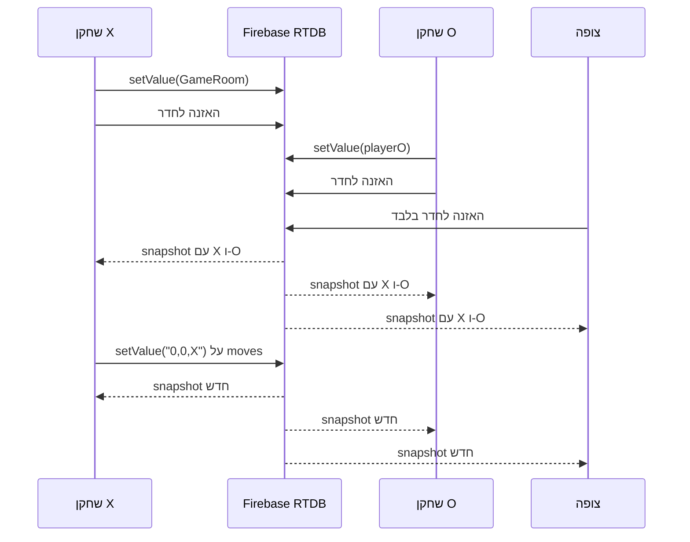

{: .box-note}
ב־[021a - פרסום חדרי משחק ב־Firebase RTDB]({{ '/android/projectSteps/021a.TicTacToeRTDBRooms' | relative_url }}) פרסמנו חדרים והצגנו רשימה שמתעדכנת בזמן אמת. כעת נשלים את המשחק: היוצר יהיה X, המשתמש הראשון שיפתח חדר ממתין יהיה O, וכל משתמש נוסף שיפתח חדר פעיל יהיה צופה. כולם יקבלו את אותו לוח דרך מאזין RTDB אחד לחדר שנבחר.

בסוף השיעור נוכל לבדוק תוצאה מלאה:

1. יצירת חדר פותחת אותו וממתינה לשחקן O.
2. פתיחת חדר שממתין מצרפת את המשתמש בתור O.
3. X ו־O משחקים בתורות ורואים מיד את אותם מהלכים.
4. משתמש שלישי פותח חדר פעיל וצופה בו ללא אפשרות ללחוץ על הלוח.
5. פתיחת חדר שכבר התחיל בונה מחדש את כל הלוח מן המהלכים השמורים.

לא נוסיף transactions, בדיקות תקינות בשרת, מספרי רצף, מחיקת חדרים או סימון משחק שהסתיים. מטרתנו היא הזרימה הקטנה והברורה ביותר.

---

## נקודת ההתחלה

השיעור מתחיל מהתוצאה העובדת של `021a`. בפרט, כבר קיימים:

- `GameRoom` ובו `name`, `playerX`, `playerO` ו־`moves`.
- `FBRef.refGames`, שמצביע אל `/TicTacToeRtdb/games`.
- לובי ובו שם משחק, כפתור פרסום ו־Spinner של חדרים.
- `ValueEventListener` שמעדכן את רשימת החדרים.
- חוקי קריאה וכתיבה פתוחים לענף `TicTacToeRtdb`.

בשיעור הזה לא משנים את `GameRoom`, את `FBRef`, את `TicTacToeModel`, את `MainActivity` או את קוד SignalR.

---

## לפני הקוד - ההחלטה הפשוטה על המהלכים

נשמור את **כל רצף המהלכים במחרוזת אחת**:

```text
0,0,X;1,1,O;0,1,X
```

כל מהלך מכיל שורה, עמודה ושחקן, מופרדים בפסיקים. נקודה־פסיק מפרידה בין המהלכים.

כאשר שחקן לוחץ על משבצת:

1. הלקוח מוסיף את המהלך לסוף המחרוזת המקומית שקיבל לאחרונה.
2. הוא כותב מחדש את כל `moves` בעזרת `setValue`.
3. Firebase שולח snapshot חדש לכל מי שמאזין לחדר.
4. כל לקוח מנקה את הלוח ובונה אותו מחדש מתחילת המחרוזת.

{: .box-note}
הלוח מכיל לכל היותר תשעה מהלכים, ולכן המחרוזת קטנה מאוד. כתיבת הרצף המלא ובנייתו מחדש קלות יותר להבנה מאוסף ילדים, מאזיני `ChildEventListener`, מספרי רצף וטיפול במהלך שהוחמץ.

{: .box-warning}
אנו סומכים לחלוטין על הלקוחות. שני שחקנים יכולים תאורטית לכתוב יחד ואחד מהם יכול לדרוס את כתיבת האחר. לקוח ששונה בזדון יכול גם לכתוב רצף לא חוקי. זה מקובל בתרגיל הזה ואינו דפוס למשחק אמיתי.

מבנה חדר פעיל ייראה כך:

```text
/TicTacToeRtdb/games/{pushId}
    name: "Class game"
    playerX: "uid-x"
    playerO: "uid-o"
    moves: "0,0,X;1,1,O"
```

---

## שלב 1 - הטקסטים החדשים

פתחו בתצוגת Android את `app > res > values > strings.xml` ועדכנו את אזור הטקסטים של RTDB:

```diff
     <string name="rtdb_available_games">Available games</string>
     <string name="rtdb_no_games">No games have been published yet.</string>
+    <string name="rtdb_open_game">Open selected game</string>
     <string name="rtdb_room_waiting">waiting</string>
     <string name="rtdb_room_playing">playing</string>
     <string name="rtdb_room_label">%1$s — %2$s</string>
     <string name="rtdb_game_name_required">Enter a game name</string>
     <string name="rtdb_login_required">Log in before opening an RTDB game</string>
-    <string name="rtdb_game_published">Game published</string>
+    <string name="rtdb_waiting_for_player">Waiting for player O…</string>
+    <string name="rtdb_watching_game">Watching this game</string>
+    <string name="rtdb_your_turn">You are %1$s — your turn</string>
+    <string name="rtdb_other_turn">You are %1$s — other player’s turn</string>
     <string name="rtdb_read_failed">Firebase read failed: %1$s</string>
     <string name="rtdb_write_failed">Firebase write failed: %1$s</string>
```

איננו צריכים עוד את `Game published`: לאחר פרסום מוצלח היוצר יעבור מיד אל החדר ויראה `Waiting for player O…`.

---

## שלב 2 - הפרדת הלובי מתצוגת המשחק

פתחו בתצוגת Android את `app > res > layout > activity_main2.xml`.

אנו צריכים להסתיר את כל הלובי ולהציג את כל אזור המשחק בבת אחת. לכן נוסיף שני `LinearLayout` פנימיים:

| id | מה הוא מכיל | מצב התחלתי |
| --- | --- | --- |
| `lobbyLayout` | יצירת חדר, רשימת החדרים וכפתור פתיחה | גלוי |
| `gameLayout` | שם המשחק, מצב המשחק והלוח | `gone` |

בצעו את השינוי המבני הבא. כל תשעת כפתורי הלוח הקיימים נשארים ללא שינוי בתוך ה־`GridLayout`; הסימן `⁞` מציין קוד קיים שלא הוצג שוב.

    
     android:padding="16dp">
 
-    <!-- Lobby used to publish a room and see every published room. -->
+    <!-- Lobby used to publish a room or select an existing room. -->
+    <LinearLayout
+        android:id="@+id/lobbyLayout"
+        android:layout_width="match_parent"
+        android:layout_height="wrap_content"
+        android:orientation="vertical">
+
         <EditText
             android:id="@+id/editGameName"
             ⁞
         <TextView
             android:id="@+id/textNoGames"
             android:layout_width="wrap_content"
             android:layout_height="wrap_content"
             android:text="@string/rtdb_no_games" />
+
+        <Button
+            android:id="@+id/buttonOpenGame"
+            android:layout_width="match_parent"
+            android:layout_height="wrap_content"
+            android:text="@string/rtdb_open_game" />
+    </LinearLayout>
 
-    <!-- The existing board remains local in 021a and becomes realtime in 021b. -->
-    <GridLayout
-        android:layout_width="wrap_content"
+    <!-- Selected room view shared by players and read-only spectators. -->
+    <LinearLayout
+        android:id="@+id/gameLayout"
+        android:layout_width="match_parent"
         android:layout_height="wrap_content"
-        android:layout_marginTop="12dp"
-        android:columnCount="3"
-        android:rowCount="3">
+        android:gravity="center"
+        android:orientation="vertical"
+        android:visibility="gone">
+
+        <TextView
+            android:id="@+id/textGameName"
+            android:layout_width="wrap_content"
+            android:layout_height="wrap_content"
+            android:textSize="22sp"
+            android:textStyle="bold" />
+
+        <TextView
+            android:id="@+id/textGameStatus"
+            android:layout_width="wrap_content"
+            android:layout_height="wrap_content"
+            android:layout_marginBottom="16dp"
+            android:layout_marginTop="4dp" />
+
+        <GridLayout
+            android:layout_width="wrap_content"
+            android:layout_height="wrap_content"
+            android:columnCount="3"
+            android:rowCount="3">
 
             <Button
                 android:id="@+id/button00"
                 ⁞
             <Button
                 android:id="@+id/button22"
                 ⁞
-    </GridLayout>
+        </GridLayout>
+    </LinearLayout>
 </LinearLayout>
    

Android Studio יסדר בדרך כלל את ההזחה בעזרת `Code > Reformat Code`. ההזחה אינה משנה את מבנה ה־XML; מה שחשוב הוא שכל רכיב נמצא בתוך הקבוצה הנכונה ושכל תג פתיחה נסגר.

{: .box-note}
`android:visibility="gone"` פירושו שאזור המשחק אינו מצויר וגם אינו תופס מקום. ב־Java נהפוך את המצבים: נסתיר את `lobbyLayout` ונציג את `gameLayout`.

בצעו Build. ודאו ש־View Binding מזהה את `buttonOpenGame`, את `lobbyLayout`, את `gameLayout`, את `textGameName` ואת `textGameStatus`.

---

## שלב 3 - הנתונים המקומיים הדרושים לבחירת חדר

פתחו בתצוגת Android:

- `app > kotlin+java > com.example.tictacmenu > activities > Main2Activity`

עדכנו את תיעוד המחלקה והשדות. אין imports חדשים בשיעור הזה; כל הטיפוסים כבר יובאו ב־021a.

```diff
 /**
- * Publishes and displays RTDB game rooms while keeping the board local in lesson 021a.
+ * Runs the minimal Firebase Realtime Database multiplayer Tic-Tac-Toe flow.
+ *
+ * <p>The activity intentionally trusts every database value. Its role and turn
+ * checks only control this client UI and are not security checks.</p>
  */
 public class Main2Activity extends AppCompatActivity {
 
-    /** Local Tic-Tac-Toe state used by the unchanged board from the previous lesson. */
+    /** Local board model rebuilt whenever Firebase publishes the room snapshot. */
     private TicTacToeModel model;
 
-    /** View Binding access to the RTDB lobby and local board. */
+    /** View Binding access to the RTDB lobby and game board. */
     private ActivityMain2Binding binding;
     ⁞
     /** Listener that keeps the room Spinner synchronized with Firebase. */
     private ValueEventListener gamesListener;
 
+    /** Firebase reference for the room currently being played or watched. */
+    private DatabaseReference selectedRoomReference;
+
+    /** Listener that redraws the selected game after every room change. */
+    private ValueEventListener selectedRoomListener;
+
+    /** Room objects shown in the same order as the Spinner labels. */
+    private final List<GameRoom> rooms = new ArrayList<>();
+
+    /** Firebase push keys shown in the same order as the Spinner labels. */
+    private final List<String> roomIds = new ArrayList<>();
+
     /** Human-readable room labels displayed by the Spinner. */
     private final List<String> roomLabels = new ArrayList<>();
 
     /** Adapter that presents the current room labels in the Spinner. */
     private ArrayAdapter<String> roomsAdapter;
 
+    /** Most recent complete value received for the selected room. */
+    private GameRoom selectedRoom;
+
     /** Firebase user ID of the person using this activity. */
     private String currentUid;
+
+    /** Local role: {@code X}, {@code O}, or an empty string for a spectator. */
+    private String localPlayer = "";
```

ל־Spinner יש רק מחרוזות לתצוגה. כאשר המשתמש בוחר שורה אנו צריכים גם את האובייקט וגם את מפתח ה־push של אותו חדר. לכן שלוש הרשימות נשמרות באותו סדר:

| רשימה | ערך לדוגמה במקום 0 |
| --- | --- |
| `roomLabels` | `Class game — waiting` |
| `rooms` | אובייקט `GameRoom` של אותו חדר |
| `roomIds` | מפתח ה־push של אותו חדר |

זה אינו מבנה מתוחכם, אבל קל לראות כיצד בחירת position אחד מחזירה את שלושת הפרטים המתאימים.

---

## שלב 4 - כפתור פתיחת חדר ורשימה שניתנת לבחירה

בתוך `onCreate`, חברו את הכפתור החדש:

```diff
         setupRoomSpinner();
         binding.buttonStartGame.setOnClickListener(view -> startGameAndWait());
+        binding.buttonOpenGame.setOnClickListener(view -> openSelectedGame());
         listenForRooms();
```

בסוף `setupRoomSpinner`, השביתו אותו כל עוד אין חדרים:

```diff
         roomsAdapter.setDropDownViewResource(android.R.layout.simple_spinner_dropdown_item);
         binding.spinnerGames.setAdapter(roomsAdapter);
+        binding.buttonOpenGame.setEnabled(false);
```

כעת עדכנו את `onDataChange` של מאזין רשימת החדרים:

```diff
 public void onDataChange(@NonNull DataSnapshot snapshot) {
+    rooms.clear();
+    roomIds.clear();
     roomLabels.clear();
 
     for (DataSnapshot roomSnapshot : snapshot.getChildren()) {
         GameRoom room = roomSnapshot.getValue(GameRoom.class);
+        rooms.add(room);
+        roomIds.add(roomSnapshot.getKey());
+
         String state = room.getPlayerO().isEmpty()
                 ? getString(R.string.rtdb_room_waiting)
                 : getString(R.string.rtdb_room_playing);
         roomLabels.add(getString(R.string.rtdb_room_label, room.getName(), state));
     }
 
     roomsAdapter.notifyDataSetChanged();
-    binding.textNoGames.setVisibility(
-            roomLabels.isEmpty() ? View.VISIBLE : View.GONE
-    );
+    boolean hasRooms = !rooms.isEmpty();
+    binding.textNoGames.setVisibility(hasRooms ? View.GONE : View.VISIBLE);
+    binding.buttonOpenGame.setEnabled(hasRooms);
 }
```

אנו מנקים ובונים מחדש את שלוש הרשימות יחד. כך הן נשארות מסונכרנות גם כאשר נוסף חדר או כאשר חדר עובר מ־`waiting` ל־`playing`.

---

## שלב 5 - היוצר נכנס מיד לחדר שפרסם

בתוך `startGameAndWait`, החליפו את פעולת ההצלחה:

```diff
 DatabaseReference newRoomReference = gamesReference.push();
 GameRoom room = new GameRoom(gameName, currentUid, "", "");
 newRoomReference.setValue(room)
-        .addOnSuccessListener(unused -> {
-            binding.editGameName.setText("");
-            Toast.makeText(this, R.string.rtdb_game_published, Toast.LENGTH_SHORT).show();
-        })
+        .addOnSuccessListener(unused -> openRoom(newRoomReference.getKey()))
         .addOnFailureListener(error -> Toast.makeText(
```

`newRoomReference` כבר מצביע אל מפתח ה־push החדש. רק אחרי שהכתיבה הצליחה אנו מוסרים את המפתח ל־`openRoom`. היוצר יזוהה בהמשך לפי `playerX` ויראה מסך המתנה.

---

## שלב 6 - הצטרפות או צפייה בחדר שנבחר

הוסיפו את המתודה הבאה:

```java
/**
 * Joins the selected waiting room or watches the selected playing room.
 */
private void openSelectedGame() {
    int position = binding.spinnerGames.getSelectedItemPosition();
    if (position < 0 || position >= rooms.size()) {
        return;
    }

    GameRoom room = rooms.get(position);
    String roomId = roomIds.get(position);

    if (currentUid.equals(room.getPlayerX()) || currentUid.equals(room.getPlayerO())) {
        openRoom(roomId);
    } else if (room.getPlayerO().isEmpty()) {
        gamesReference.child(roomId).child("playerO").setValue(currentUid)
                .addOnSuccessListener(unused -> openRoom(roomId))
                .addOnFailureListener(error -> Toast.makeText(
                        this,
                        getString(R.string.rtdb_write_failed, error.getMessage()),
                        Toast.LENGTH_LONG
                ).show());
    } else {
        openRoom(roomId);
    }
}
```

ההחלטה נעשית בשלושה תנאים פשוטים:

1. אם ה־UID כבר כתוב ב־`playerX` או ב־`playerO`, זה שחקן שחוזר לחדר שלו.
2. אחרת, אם `playerO` ריק, המשתמש כותב את ה־UID שלו רק לילד `playerO` והופך ל־O.
3. אחרת שני מקומות השחקנים תפוסים, ולכן המשתמש פותח את החדר כצופה.

הכתיבה אל:

```java
gamesReference.child(roomId).child("playerO")
```

מגיעה אל `/games/{roomId}/playerO`. לכן `setValue(currentUid)` מחליף רק את השדה הזה ולא את כל החדר.

{: .box-warning}
אין transaction. אם שני משתמשים ינסו להצטרף לאותו חדר ממתין בדיוק באותו רגע, הכתיבה האחרונה יכולה לנצח. זה חלק מההנחה המכוונת של אמון מלא ופשטות.

---

## שלב 7 - מאזין לחדר הנבחר

הוסיפו:

```java
/**
 * Shows the board and subscribes to one complete game-room snapshot.
 *
 * @param roomId Firebase push key of the room to open
 */
private void openRoom(String roomId) {
    binding.lobbyLayout.setVisibility(View.GONE);
    binding.gameLayout.setVisibility(View.VISIBLE);
    setBoardEnabled(false);

    selectedRoomReference = gamesReference.child(roomId);
    selectedRoomListener = new ValueEventListener() {
        /**
         * Redraws the selected board from its latest complete room snapshot.
         *
         * @param snapshot current contents of the selected room
         */
        @Override
        public void onDataChange(@NonNull DataSnapshot snapshot) {
            selectedRoom = snapshot.getValue(GameRoom.class);
            if (selectedRoom != null) {
                showSelectedRoom();
            }
        }

        /**
         * Shows a Firebase message when the room subscription is cancelled.
         *
         * @param error reason Firebase cancelled the subscription
         */
        @Override
        public void onCancelled(@NonNull DatabaseError error) {
            Toast.makeText(
                    Main2Activity.this,
                    getString(R.string.rtdb_read_failed, error.getMessage()),
                    Toast.LENGTH_LONG
            ).show();
        }
    };
    selectedRoomReference.addValueEventListener(selectedRoomListener);
}
```

כעת יש שני מאזינים בעלי תפקידים שונים:

| מאזין | כתובת | תפקיד |
| --- | --- | --- |
| `gamesListener` | `/games` | ממשיך לעדכן את רשימת כל החדרים |
| `selectedRoomListener` | `/games/{roomId}` | מעדכן רק את המשחק הפתוח |

לפני שמגיע snapshot ראשון אנו משביתים את הלוח. איננו יודעים עדיין אם המשתמש X, O או צופה, ואיננו רוצים לאפשר לחיצה על מצב שעדיין לא נקרא.

---

## שלב 8 - בניית הלוח מחדש מן הרצף

הוסיפו את שתי המתודות:

```java
/**
 * Rebuilds the board and status text from the latest complete room snapshot.
 */
private void showSelectedRoom() {
    binding.textGameName.setText(selectedRoom.getName());
    model.resetGame();
    resetBoard();

    String moves = selectedRoom.getMoves();
    if (!moves.isEmpty()) {
        String[] moveList = moves.split(";");
        for (String move : moveList) {
            String[] parts = move.split(",");
            int row = Integer.parseInt(parts[0]);
            int col = Integer.parseInt(parts[1]);
            String player = parts[2];

            model.setMove(row, col, player);
            buttonFor(row, col).setText(player);
            model.changePlayer();
        }
    }

    if (currentUid.equals(selectedRoom.getPlayerX())) {
        localPlayer = "X";
    } else if (currentUid.equals(selectedRoom.getPlayerO())) {
        localPlayer = "O";
    } else {
        localPlayer = "";
    }

    showGameStatus();
}

/**
 * Shows whether this client is waiting, watching, or allowed to play now.
 */
private void showGameStatus() {
    if (selectedRoom.getPlayerO().isEmpty()) {
        binding.textGameStatus.setText(R.string.rtdb_waiting_for_player);
        setBoardEnabled(false);
    } else if (localPlayer.isEmpty()) {
        binding.textGameStatus.setText(R.string.rtdb_watching_game);
        setBoardEnabled(false);
    } else if (localPlayer.equals(model.getCurrentPlayer())) {
        binding.textGameStatus.setText(getString(R.string.rtdb_your_turn, localPlayer));
        setBoardEnabled(true);
    } else {
        binding.textGameStatus.setText(getString(R.string.rtdb_other_turn, localPlayer));
        setBoardEnabled(false);
    }
}
```

נעקוב אחרי דוגמה קצרה:

```text
moves = "0,0,X;1,1,O;0,1,X"
```

1. `split(";")` יוצר שלוש מחרוזות של מהלכים.
2. `split(",")` מפרק כל מהלך לשורה, עמודה ושחקן.
3. `model.setMove` מכניס את הסימן ללוח המקומי.
4. `buttonFor` מציג את אותו סימן בכפתור המתאים.
5. `model.changePlayer` מעביר את התור. אחרי שלושה מהלכים התור הוא O.

בכל snapshot מתחילים ממצב ריק. לכן אין תלות בכך שהלקוח ראה את האירוע הקודם: גם צופה שפתח את החדר באמצע המשחק מקבל את המחרוזת המלאה ובונה מיד את אותו לוח.

לאחר בניית הלוח אנו משווים את `currentUid` לשני ה־UID-ים שבחדר. מחרוזת ריקה ב־`localPlayer` פירושה שהמשתמש אינו אחד משני השחקנים ולכן הוא צופה.

{: .box-warning}
`setBoardEnabled(false)` הוא התנהגות של המסך בלבד. הוא אינו משנה את חוקי Firebase ואינו מונע מלקוח אחר לכתוב. כך גם בדיקת התור בהמשך.

---

## שלב 9 - כתיבת מהלך במקום משחק מקומי

החליפו את כל `onCellClick` הישן במתודה הבאה:

```java
/**
 * Publishes a locally permitted move as a new complete sequence string.
 *
 * @param view board button clicked by the user
 */
public void onCellClick(View view) {
    if (selectedRoom == null
            || selectedRoom.getPlayerO().isEmpty()
            || localPlayer.isEmpty()
            || !localPlayer.equals(model.getCurrentPlayer())) {
        return;
    }

    Button button = (Button) view;
    String[] position = button.getTag().toString().split(",");
    int row = Integer.parseInt(position[0]);
    int col = Integer.parseInt(position[1]);

    if (!model.isLegal(row, col)) {
        return;
    }

    String move = row + "," + col + "," + localPlayer;
    String previousMoves = selectedRoom.getMoves();
    String updatedMoves = previousMoves.isEmpty() ? move : previousMoves + ";" + move;

    setBoardEnabled(false);
    selectedRoomReference.child("moves").setValue(updatedMoves)
            .addOnFailureListener(error -> {
                showGameStatus();
                Toast.makeText(
                        this,
                        getString(R.string.rtdb_write_failed, error.getMessage()),
                        Toast.LENGTH_LONG
                ).show();
            });
}
```

ארבעת התנאים הראשונים חוסמים לחיצה מקומית כאשר:

- עדיין לא התקבל חדר.
- X עדיין מחכה ל־O.
- המשתמש הוא צופה.
- זהו תורו של השחקן האחר.

אחרי בדיקת המשבצת אנו בונים מהלך כגון `2,1,O` ומצרפים אותו לרצף. שימו לב שאיננו קוראים כאן ל־`model.makeMove` ואיננו משנים את הטקסט של הכפתור. מקור האמת הוא RTDB: הכתיבה תגרום ל־snapshot חדש, ורק `showSelectedRoom` יבנה ממנו את הלוח בכל המכשירים.

אנו משביתים מיד את הכפתורים כדי למנוע לחיצה כפולה בזמן שהכתיבה בדרך. אם הכתיבה נכשלת, `showGameStatus` מחזיר את המצב המקומי המתאים ומוצגת הודעת שגיאה.

{: .box-note}
ה־TODO-ים הקיימים של ניצחון ותיקו ב־`TicTacToeModel` נשארים ללא שינוי. השיעור עוסק בסנכרון המהלכים, לא בהשלמת חוקי המשחק.

---

## שלב 10 - עזרי הלוח

החליפו את `resetBoard` הקיים בארבע המתודות הבאות:

```java
/**
 * Finds the bound board button at a row and column.
 *
 * @param row board row from zero to two
 * @param col board column from zero to two
 * @return matching board button
 */
private Button buttonFor(int row, int col) {
    if (row == 0 && col == 0) return binding.button00;
    if (row == 0 && col == 1) return binding.button01;
    if (row == 0 && col == 2) return binding.button02;
    if (row == 1 && col == 0) return binding.button10;
    if (row == 1 && col == 1) return binding.button11;
    if (row == 1 && col == 2) return binding.button12;
    if (row == 2 && col == 0) return binding.button20;
    if (row == 2 && col == 1) return binding.button21;
    if (row == 2 && col == 2) return binding.button22;
    return null;
}

/**
 * Returns every board button in display order.
 *
 * @return array containing the nine board buttons
 */
private Button[] boardButtons() {
    return new Button[]{
            binding.button00, binding.button01, binding.button02,
            binding.button10, binding.button11, binding.button12,
            binding.button20, binding.button21, binding.button22
    };
}

/**
 * Clears the text displayed by every board button.
 */
private void resetBoard() {
    for (Button button : boardButtons()) {
        button.setText("");
    }
}

/**
 * Enables or disables all local board buttons without changing Firebase rules.
 *
 * @param enabled whether this client may press board buttons
 */
private void setBoardEnabled(boolean enabled) {
    for (Button button : boardButtons()) {
        button.setEnabled(enabled);
    }
}
```

`buttonFor` עונה על השאלה "איזה כפתור מתאים לשורה ולעמודה שקראנו מן המחרוזת?". `boardButtons` מרכז את תשעת הכפתורים כדי שגם ניקוי וגם הפעלה או השבתה יוכלו לעבור עליהם בלולאה קצרה.

---

## שלב 11 - הסרת שני המאזינים

עדכנו את `onDestroy`:

```diff
 /**
- * Removes the Firebase rooms subscription when this activity is destroyed.
+ * Removes both Firebase subscriptions when this activity is destroyed.
  */
 @Override
 protected void onDestroy() {
     if (gamesListener != null) {
         gamesReference.removeEventListener(gamesListener);
     }
+    if (selectedRoomListener != null) {
+        selectedRoomReference.removeEventListener(selectedRoomListener);
+    }
     super.onDestroy();
 }
```

המאזין הראשון שייך לרשימת החדרים, והשני לחדר שנפתח. כל אחד מוסר מן ההפניה שאליה חובר. הסרת המאזינים אינה מוחקת חדר או מהלך מ־Firebase.

---

## הזרימה השלמה



הצופה משתמש בדיוק באותו `ValueEventListener` ובאותה בניית לוח כמו השחקנים. ההבדל היחיד הוא ש־`localPlayer` שלו ריק, ולכן `showGameStatus` משבית את הכפתורים.

---

## בדיקת התוצאה

לבדיקה מלאה נוחים שלושה משתמשי Firebase נפרדים בשלושה מכשירים או אמולטורים.

### בדיקה 1 - יצירה והצטרפות

1. משתמש א יוצר חדר. הלובי נעלם ומופיע `Waiting for player O…`.
2. ודאו שהלוח של משתמש א מושבת.
3. משתמש ב בוחר את החדר הממתין ולוחץ `Open selected game`.
4. משתמש ב רואה שהוא O וממתין לתורו.
5. משתמש א רואה מיד שהוא X ושזה תורו.
6. ברשימת החדרים במכשיר נוסף מצב החדר משתנה מ־`waiting` ל־`playing`.

### בדיקה 2 - מהלכים בזמן אמת

1. X לוחץ על משבצת. X מופיע בשני הלוחות.
2. נסו ללחוץ שוב אצל X. הלוח שלו צריך להיות מושבת.
3. O לוחץ על משבצת אחרת. O מופיע בשני הלוחות והתור חוזר ל־X.
4. ודאו שב־Firebase השדה `moves` מכיל רצף כגון `0,0,X;1,1,O`.

### בדיקה 3 - צפייה

1. משתמש ג בוחר את החדר שמסומן `playing` ופותח אותו.
2. הוא רואה `Watching this game` ואת כל המהלכים שכבר שוחקו.
3. כל כפתורי הלוח שלו מושבתים.
4. כאשר X או O משחקים, הלוח של משתמש ג מתעדכן מיד.

### בדיקה 4 - בנייה מחדש

1. צאו מן המסך אחרי כמה מהלכים.
2. פתחו שוב את `RTDB Game` ובחרו את אותו חדר.
3. ודאו שכל הלוח נבנה מחדש מן המחרוזת `moves`.
4. ודאו שהחדר נשאר ברשימה גם לאחר שהמשתמשים יצאו.

{: .box-success}
כאשר שני השחקנים והצופה רואים אותו לוח, והלוח נבנה מחדש לאחר פתיחה חוזרת, הושלמה גרסת ה־RTDB הפשוטה.

---

## מה לא ניסינו לפתור?

כדאי לדעת במפורש היכן פישטנו:

- אין אימות מהלכים או תפקידים בחוקי RTDB.
- אין transaction כאשר שני משתמשים מנסים להיות O.
- אין טיפול בהתנגשות בין שתי כתיבות `moves`.
- אין `finished`, מחיקת חדר או ניקוי חדרים ישנים.
- אין בדיקה שהמחרוזת שקיבלנו בנויה נכון.
- אין השלמה של ניצחון או תיקו.
- אין מסך חזרה מן המשחק אל הלובי.

כל אלה יכולים להיות חשובים במוצר אמיתי, אך היו מסתירים את שלוש הפעולות שאנו רוצים להבין כאן: כתיבת ערך, האזנה לערך ובניית המסך מן הערך שהתקבל.

---

## סיכום התפקידים

| רכיב | תפקיד בסיום 021b |
| --- | --- |
| `GameRoom` | הנתונים המשותפים: שם, שני UID-ים ורצף מהלכים |
| `TicTacToeModel` | מצב הלוח המקומי והתור, שנבנים מחדש מן הרצף |
| `FBRef.refGames` | הכתובת המשותפת של חדרי המדריך |
| `gamesListener` | רשימת החדרים ומצב `waiting` או `playing` |
| `selectedRoomListener` | המשחק הפתוח אצל שחקן או צופה |
| `Main2Activity` | מחבר בין פעולות המשתמש, RTDB וה־Views |

התוצאה נשארת בכוונה בתוך Activity אחד: זהו שיעור ראשון וקצר ב־RTDB, ולכן אפשר לעקוב באותו קובץ אחר כל הדרך מלחיצה, דרך `setValue`, אל snapshot חדש ועד לציור הלוח.
