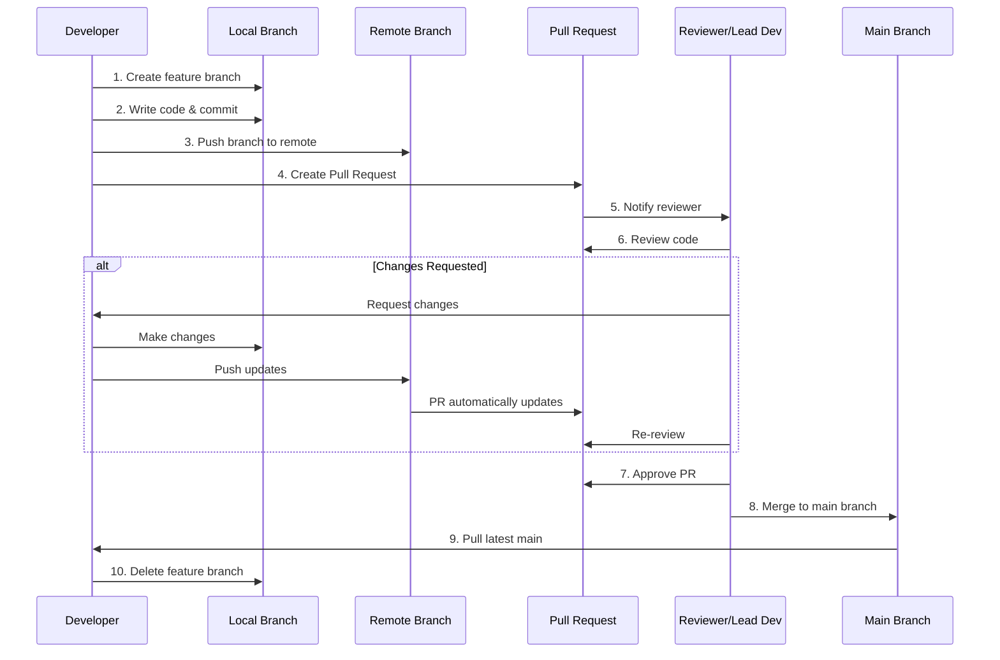

<!-- The intention is to write the beginners git markdown someplace else later, and reference my video -->

## What is a Pull Request?

A **Pull Request (PR)** is a way to propose changes to a codebase in a team environment. Instead of directly pushing changes to the main branch, developers:

1. Create a separate branch for their work
2. Make and commit their changes on that branch
3. Request that their changes be "pulled" into the main branch
4. Wait for review and approval from team members
5. Merge the changes after approval

This workflow prevents conflicts, ensures code quality through review, and maintains a stable main branch.

## The Pull Request Flow

## Step-by-Step Process

### Phase 1: Developer Creates Feature Branch and Makes Changes

**Who:** Developer working on a new feature or bug fix

**What happens:**
- Developer creates a new branch from main (e.g., "feature/add-login")
- Makes changes and commits them locally
- Pushes the branch to the remote repository
- Opens a Pull Request

### Phase 2: Review and Approval

**Who:** Senior Developer, Team Lead, or designated Reviewer

**What happens:**
- Reviewer receives notification about the PR
- Reviews the code changes, looking for:
  - Code quality and standards
  - Bugs or potential issues
  - Test coverage
  - Documentation
- Either approves or requests changes

### Phase 3: Merge

**Who:** Reviewer or the Developer (depending on team policy)

**What happens:**
- Once approved, the PR is merged into main
- The feature branch can be deleted
- All team members pull the latest main branch

## GUI Instructions by IDE

### Visual Studio 2022

#### Creating a Pull Request

1. **Create and Switch to a New Branch**
   - Go to: `Git` → `New Branch`
   - Enter branch name (e.g., "feature/my-feature")
   - Check "Checkout branch" 
   - Click `Create`

2. **Make Your Changes and Commit**
   - Make your code changes
   - Go to: `Git` → `Commit or Stash`
   - Enter commit message
   - Click `Commit All`

3. **Push Your Branch**
   - Go to: `Git` → `Push`
   - If first push: `Git` → `Push Branch`

4. **Create Pull Request**
   - Go to: `Git` → `Manage Branches`
   - Right-click your branch → `Create Pull Request`
   - Or visit your repository on GitHub/Azure DevOps
   - Fill in PR title and description
   - Select reviewers
   - Click `Create`

#### Reviewing and Approving a Pull Request

1. **Open Pull Requests View**
   - Go to: `Git` → `Manage Pull Requests`
   - Or: `View` → `Git Changes` → `Pull Requests` tab

2. **Review the PR**
   - Click on the PR to view
   - View `Files Changed` to see code differences
   - Add comments on specific lines if needed

3. **Approve and Merge**
   - Click `Approve` button
   - Click `Complete` or `Merge` button
   - Choose merge type (usually "Merge commit")
   - Confirm merge

---

### Visual Studio Code

#### Creating a Pull Request

1. **Create and Switch to a New Branch**
   - Click the branch name in the bottom-left status bar
   - Select `Create new branch`
   - Enter branch name
   - Press Enter

2. **Make Your Changes and Commit**
   - Make your code changes
   - Click the Source Control icon (left sidebar)
   - Enter commit message in the text box
   - Click the checkmark ✓ above the message box

3. **Push Your Branch**
   - Click the `...` menu in Source Control
   - Select `Push`
   - If first push, select `Publish Branch`

4. **Create Pull Request**
   - Install "GitHub Pull Requests" extension (if using GitHub)
   - Click the GitHub icon in left sidebar
   - Click `Create Pull Request`
   - Or: Click notification that appears after pushing
   - Fill in PR details
   - Click `Create`

#### Reviewing and Approving a Pull Request

1. **Open Pull Requests View**
   - Click GitHub/GitLab icon in left sidebar
   - View list of Pull Requests

2. **Review the PR**
   - Click on the PR
   - Select `Description` to read details
   - Select `Changes` to view code differences
   - Right-click lines to add comments

3. **Approve and Merge**
   - Click `Approve` in the PR view
   - Click `Merge Pull Request`
   - Choose merge method
   - Click `Confirm Merge`

---

### Android Studio

#### Creating a Pull Request

1. **Create and Switch to a New Branch**
   - Go to: `Git` → `Branches` (or click branch name in bottom-right)
   - Click `New Branch`
   - Enter branch name
   - Click `Create`

2. **Make Your Changes and Commit**
   - Make your code changes
   - Go to: `Git` → `Commit` (or press `Ctrl+K` / `Cmd+K`)
   - Select files to commit
   - Enter commit message
   - Click `Commit`

3. **Push Your Branch**
   - Go to: `Git` → `Push` (or press `Ctrl+Shift+K` / `Cmd+Shift+K`)
   - Confirm push dialog

4. **Create Pull Request**
   - After pushing, Android Studio may show a notification
   - Click `Create Pull Request` in notification
   - Or: Go to `Git` → `GitHub` → `Create Pull Request`
   - Fill in PR title and description
   - Select reviewers
   - Click `Create Pull Request`

#### Reviewing and Approving a Pull Request

1. **Open Pull Requests View**
   - Go to: `Git` → `GitHub` → `View Pull Requests`
   - Or: Bottom toolbar → `Pull Requests` tab

2. **Review the PR**
   - Double-click the PR to open
   - Click `Files Changed` tab
   - Review code differences
   - Right-click lines to add comments

3. **Approve and Merge**
   - Click `Approve` or `Review` → `Approve`
   - Click `Merge` button
   - Select merge type
   - Click `Confirm Merge`

---

## Comparison Table: GUI vs CLI

| Action | Visual Studio 2022 | VS Code | Android Studio | Git CLI |
|--------|-------------------|---------|----------------|---------|
| **Create Branch** | `Git` → `New Branch` | Click branch icon (bottom-left) → `Create new branch` | `Git` → `Branches` → `New Branch` | `git checkout -b branch-name` |
| **Commit Changes** | `Git` → `Commit or Stash` | Source Control → Enter message → ✓ | `Git` → `Commit` or `Ctrl+K` | `git commit -m "message"` |
| **Push Branch** | `Git` → `Push` | Source Control `...` → `Push` | `Git` → `Push` or `Ctrl+Shift+K` | `git push origin branch-name` |
| **Create PR** | `Git` → `Manage Branches` → Right-click → `Create Pull Request` | GitHub icon → `Create Pull Request` | `Git` → `GitHub` → `Create Pull Request` | Done on GitHub/GitLab website |
| **View PRs** | `Git` → `Manage Pull Requests` | GitHub icon → PR list | `Git` → `GitHub` → `View Pull Requests` | Done on GitHub/GitLab website |
| **Merge PR** | PR view → `Complete`/`Merge` | PR view → `Merge Pull Request` | PR view → `Merge` | `git checkout main` + `git merge branch-name` |

## Common Team Workflows

### Feature Branch Workflow
- Each feature/bug fix gets its own branch
- Developer creates PR when ready
- Reviewer approves and merges
- Branch is deleted after merge

### GitFlow Workflow
- Similar but with additional branches:
  - `main`: production-ready code
  - `develop`: integration branch
  - `feature/*`: new features
  - `release/*`: release preparation
  - `hotfix/*`: urgent fixes

### Forking Workflow
- Used in open-source projects
- Contributors fork the repository
- Create PR from fork to original repo
- Maintainers review and merge

## Best Practices

1. **Keep PRs Small**: Easier to review, faster to merge
2. **Write Clear Descriptions**: Explain what and why
3. **Add Tests**: Ensure your code works
4. **Respond to Feedback**: Address reviewer comments promptly
5. **Keep Branch Updated**: Regularly merge main into your feature branch
6. **Delete Merged Branches**: Keep repository clean
7. **Use Draft PRs**: For work-in-progress that needs early feedback

## Key Differences from Solo Development

| Solo Development | Team Development with PRs |
|-----------------|--------------------------|
| Push directly to main | Push to feature branches |
| No review process | Code review required |
| Less structured | Formal approval process |
| Immediate changes | Changes must be approved |
| No merge conflicts (if solo) | Must resolve conflicts with team's work |
| Less documentation | PR descriptions document changes |

## Summary

Pull Requests transform Git from a version control system into a collaboration platform. They ensure that:
- Code is reviewed before merging
- Multiple developers can work without conflicts
- The main branch stays stable
- Team members learn from each other's code
- Changes are documented and traceable

This is the foundation of modern software team collaboration!