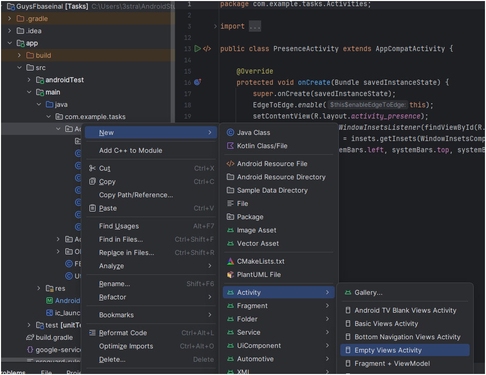
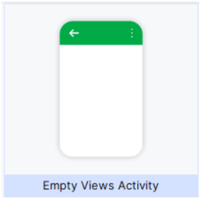
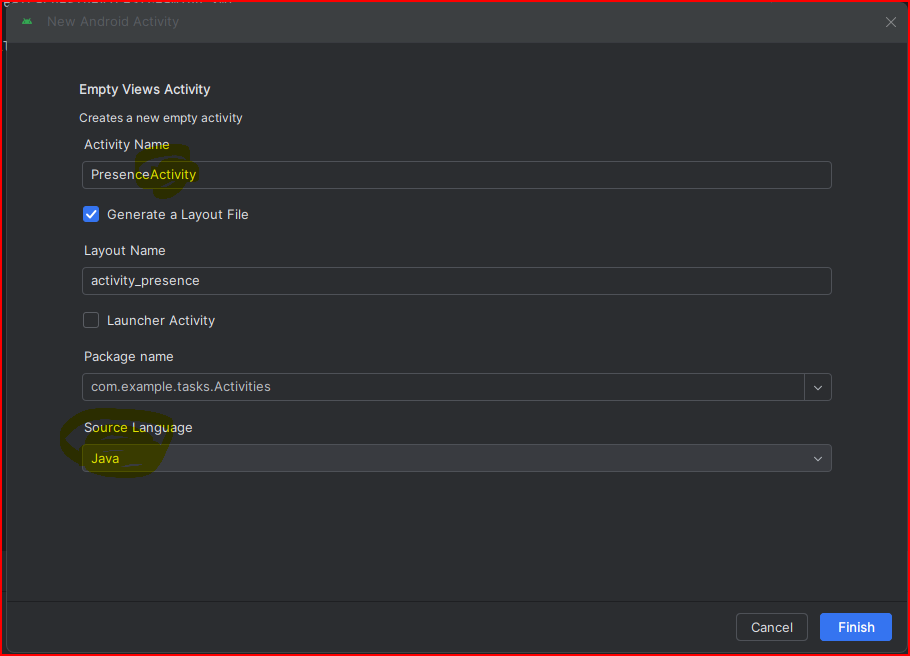
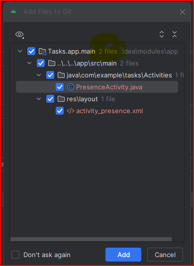

## הוסף את ה-Activities שתכננת כ- Empty Views Activities.
1. משתמשים בתפריט הבא:
    
    -  **אם הנכם בוחרים מהגלריה, זה נראה כך:**
        
1. אמור להופיע מסך יצירה כמו בתמונה 
    

    - חשוב לרשום את המילה Activity כמו בתמונה (naming conventions),
    - **וחשוב לבחור Java** כשפה. אם האפשרות לבחירת שפה אינה זמינה - כנראה שבחרתי Empty Activity וא משהו אחר שמחייב Kotlin

1. אם הכל תקין, במסך ההוספה ל-Git, יופיע שנוספו רק 2 קבצים ולא 7 או 13.
    

1. הריצו את הפרוייקט. אם יש בעיות הקשורות לגרסאות פיתרו אותן [בעזרת המדריך הבא](/android/versionUpdates)

1. **Commit, Push**: בכל פעם שיש עדכון - אפילו קטן - נרצה לשמור תמונת מצב. אפשר להתעקש על ה-Commit למרות שיש Warnings.
    - נבחר את הcheckbox העליון כדי לסמן את כולם
    - נרשום הודעת commit
    - ונעשה commit and push


## אחרי שהוספנו כמה וכמה Activities:
נרצה להוסיף אותן גם לתפריט ה- ⋮
1. נפתח את ה-AndroidManifest.xml
    

1. ה-Activities שלנו כבר שם, אבל עדיין לא בתפריט. זה נראה כך:
    

## הוספת כל ה‑Activities לתפריט Overflow (⋮)

כדי להוסיף את כל ה‑Activities שיצרנו לתפריט ⋮ בפינה העליונה של האפליקציה, יש לבצע את השלבים הבאים:

---
## הוספת כל ה‑Activities לתפריט Overflow (⋮)

כדי להוסיף את כל ה‑Activities שיצרתם לתפריט ⋮ בפינה העליונה של האפליקציה, בצעו את השלבים הבאים:

---

### 1. יצירת קובץ תפריט (menu XML)

1. בתיקיית **res/menu** (אם אין קיימת, צרו אותה).
2. ודאו שבתקייה קיימת קובץ בשם `main.xml`.
3. בתוך הקובץ, הוסיפו פריטים לכל Activity כך:

```xml
<?xml version="1.0" encoding="utf-8"?>
<menu xmlns:android="http://schemas.android.com/apk/res/android"
      xmlns:app="http://schemas.android.com/apk/res-auto">

    <item
        android:id="@+id/action_activity1"
        android:title="Activity1"
        app:showAsAction="never" />

    <item
        android:id="@+id/action_activity2"
        android:title="Activity2"
        app:showAsAction="never" />

    <!-- הוסיפו כאן עוד <item> לפי כל Activity שיצרתם -->

</menu>
```

---

### 2. טיפול בבחירת פריטים

ב־Activity שבו תרצו שהתפריט יופיע, הוסיפו את המתודה `onOptionsItemSelected` כדי להפעיל את ה־Activity המתאים בעת בחירת פריט:

```java
@Override
public boolean onOptionsItemSelected(@NonNull MenuItem item) {
    switch (item.getItemId()) {
        case R.id.action_activity1:
            startActivity(new Intent(this, Activity1.class));
            return true;

        case R.id.action_activity2:
            startActivity(new Intent(this, Activity2.class));
            return true;

        // הוסיפו כאן עוד מקרים לפי כל פריט שתיארתם ב‑menu XML

        default:
            return super.onOptionsItemSelected(item);
    }
}
```

---

### 3. התאמות נוספות (אופציונלי)

* אם אתם משתמשים ב‑AppCompat, ודאו שאתם משתמשים ב־`app:showAsAction="never"` כפי שמוצג למעלה.
* תוכלו להגדיר `android:orderInCategory` בפריטים כדי לקבוע את סדרם בתפריט.

---

**זהו!** כעת מופיעים כל ה‑Activities שלכם בתפריט ⋮ והבחירה בכל פריט תפתח את ה־Activity המתאים.
