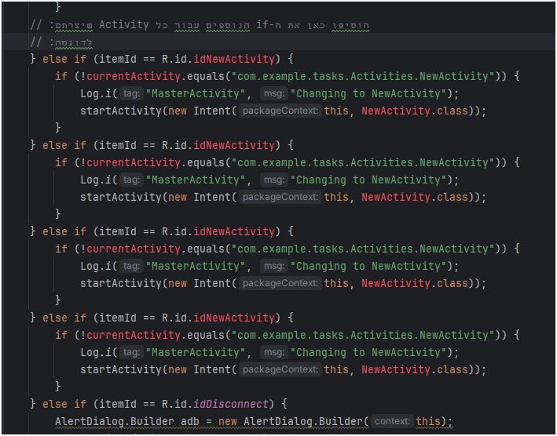
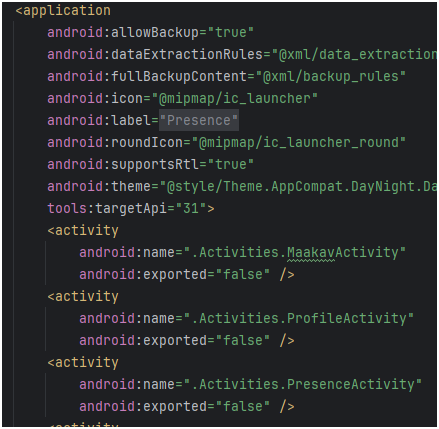
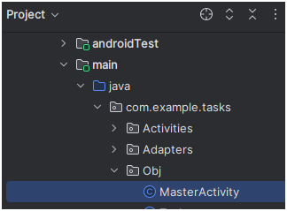

## הוספת כל ה‑Activities לתפריט Overflow (⋮)
אחרי שהוספנו כמה וכמה Activities להוסיף אותן גם לתפריט ה- ⋮

כדי להוסיף את כל ה‑Activities שיצרנו לתפריט ⋮ בפינה העליונה של האפליקציה, יש לבצע את השלבים הבאים:

1. נפתח את ה-AndroidManifest.xml
    

1. ה-Activities שלנו כבר שם, אבל עדיין לא בתפריט. זה נראה כך:
    

---

### 1. יצירת קובץ תפריט (menu XML)

1. בתיקיית **res/menu** (אם לא קיימת, צרו אותה).
2. ודאו שבתקייה קיים קובץ בשם `main.xml`.
3. בתוך הקובץ, הוסיפו פריטים לכל Activity כך:

```xml
<?xml version="1.0" encoding="utf-8"?>
<menu xmlns:android="http://schemas.android.com/apk/res/android"
      xmlns:app="http://schemas.android.com/apk/res-auto">

    <item
        android:id="@+id/action_activity1"
        android:title="Activity1"
        app:showAsAction="never" />

    <item
        android:id="@+id/action_activity2"
        android:title="Activity2"
        app:showAsAction="never" />

    <!-- הוסיפו כאן עוד <item> לפי כל Activity שיצרתם -->

</menu>
```

---

### 2. טיפול בבחירת פריטים

1. פתחו את קובץ MasterActivity הנמצא כאן:
    
1. עדכנו את הפונקציה(מתודה) `onOptionsItemSelected` כדי להפעיל את ה־Activity המתאים לאחר בחירה מהתפריט:
## הוספת כל ה‑Activities לתפריט Overflow (⋮)

כדי להוסיף את כל ה‑Activities שיצרתם לתפריט ⋮ בפינה העליונה של האפליקציה, בצעו את השלבים הבאים:

```java
@Override
public boolean onOptionsItemSelected(@NonNull MenuItem item) {
    ActivityManager am = (ActivityManager) this.getSystemService(ACTIVITY_SERVICE);
    List<ActivityManager.RunningTaskInfo> taskInfo = am.getRunningTasks(1);
    String currentActivity = taskInfo.get(0).topActivity.getClassName(); // Be cautious: deprecated for third-party apps

    int itemId = item.getItemId();

    if (itemId == R.id.idMain) {
        if (!currentActivity.equals("com.example.tasks.Activities.MainActivity")) {
            Log.i("MasterActivity", "Changing to MainActivity");
            startActivity(new Intent(this, MainActivity.class));
        }
    } else if (itemId == R.id.idTasksDone) {
        if (!currentActivity.equals("com.example.tasks.Activities.DoneTasksActivity")) {
            Log.i("MasterActivity", "Changing to DoneTasksActivity");
            startActivity(new Intent(this, DoneTasksActivity.class));
        }
    } else if (itemId == R.id.idYears) {
        if (!currentActivity.equals("com.example.tasks.Activities.YearsActivity")) {
            Log.i("MasterActivity", "Changing to YearsActivity");
            startActivity(new Intent(this, YearsActivity.class));
        }
    }

    // הוסיפו כאן את ה-if הנוספים עבור כל Activity שיצרתם:
    // לדוגמה:
    // else if (itemId == R.id.idNewActivity) {
    //     if (!currentActivity.equals("com.example.tasks.Activities.NewActivity")) {
    //         Log.i("MasterActivity", "Changing to NewActivity");
    //         startActivity(new Intent(this, NewActivity.class));
    //     }
    // }

    else if (itemId == R.id.idDisconnect) {
        AlertDialog.Builder adb = new AlertDialog.Builder(this);
        adb.setTitle("Disconnect Account");
        adb.setMessage("Are you sure you want to\nDisconnect account & Exit?");
        adb.setPositiveButton("Ok", new DialogInterface.OnClickListener() {
            @Override
            public void onClick(DialogInterface dialog, int which) {
                refAuth.signOut(); // Ensure refAuth initialized
                finishAffinity();
            }
        });
        adb.setNeutralButton("Cancel", new DialogInterface.OnClickListener() {
            @Override
            public void onClick(DialogInterface dialog, int which) {
                dialog.cancel();
            }
        });
        adb.setCancelable(false);
        adb.create().show();
    } else if (itemId == R.id.idExit) {
        AlertDialog.Builder adb = new AlertDialog.Builder(this);
        adb.setTitle("Quit Application");
        adb.setMessage("Are you sure?");
        adb.setPositiveButton("Ok", new DialogInterface.OnClickListener() {
            @Override
            public void onClick(DialogInterface dialog, int which) {
                finishAffinity();
            }
        });
        adb.setNeutralButton("Cancel", new DialogInterface.OnClickListener() {
            @Override
            public void onClick(DialogInterface dialog, int which) {
                dialog.cancel();
            }
        });
        adb.setCancelable(false);
        adb.create().show();
    }
    return super.onOptionsItemSelected(item);
}
```

---

### 3. התאמות נוספות (אופציונלי)

* ודאו שאתם משתמשים ב־`app:showAsAction="never"` עבור כל `<item>`.
* השתמשו ב־`android:orderInCategory` כדי לקבוע את סדר הפריטים בתפריט.

---

**זהו!** עכשיו תוכלו להוסיף בקלות עוד `if` לכל Activity שיצרתם ולהפעיל אותו מתפריט ה־Overflow.
