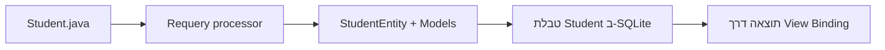

{: .box-note}
בפרק הזה נתחיל מפרויקט **Empty Views Activity** רגיל ונבצע עליו רק שינויים
הכרחיים. בסוף הפרק נגדיר `Student` ב-Java, ניתן ל-Requery ליצור טבלת SQLite,
נוסיף שלושה תלמידים פעם אחת ונציג אותם במסך.



## נקודת ההתחלה

צרו ב-Android Studio פרויקט **Empty Views Activity**:

- Name: `sqlrequery`
- Package name: `com.example.sqlrequery`
- Language: **Java**
- Minimum SDK: **API 31**
- Build configuration language: **Kotlin DSL**

{: .box-warning}
אל תחליפו קובץ שלם כאשר ההוראה מציגה diff. שורה שמתחילה ב-`+` נוספה, שורה
שמתחילה ב-`-` נמחקה, וכל שורה אחרת נשארת בדיוק כפי ש-Android Studio יצרה אותה.

## מה נשנה — ומה נשאיר בשקט

{: .table-he}

| קובץ | השינוי המינימלי |
|---|---|
| `app/build.gradle.kts` | View Binding ושלוש תלויות Requery |
| `activity_main.xml` | הפיכת ה-`TextView` הקיים לאזור התוצאות |
| `MainActivity.java` | View Binding, פתיחת המסד והצגת תלמידים |
| `model/Student.java` | קובץ חדש: הגדרת ה-Entity |
| `Database.java` | קובץ חדש: תשתית המסד שנרחיב בפרקים הבאים |

לא נשנה את ה-Manifest, ה-themes,‏ `colors.xml`, קובצי הגיבוי, האייקונים,
`buildTypes`,‏ AppCompat,‏ Material או ConstraintLayout. הם כבר עובדים ואינם
מפריעים למטרת הפרק.

## 1. מכינים Gradle בלי לפרק את התבנית

פתחו דרך **Gradle Scripts** את `build.gradle.kts (Module :app)`.

### 1.1 מפעילים View Binding

מיד לאחר בלוק `compileSdk`, הוסיפו:

```diff
 android {
     namespace = "com.example.sqlrequery"
     compileSdk {
         version = release(37)
     }

+    buildFeatures {
+        viewBinding = true
+    }

     defaultConfig {
```

השינוי יגרום ל-Android ליצור מחלקה בשם `ActivityMainBinding` מן הקובץ
`activity_main.xml`. לא נצטרך להשתמש ב-`findViewById`.

### 1.2 מוסיפים את Requery

בתחתית `dependencies`, הוסיפו שלוש שורות. כל התלויות שיצרה התבנית — כולל
תלויות הבדיקות — נשארות במקומן:

```diff
 dependencies {
     implementation(libs.activity.ktx)
     implementation(libs.appcompat)
     implementation(libs.constraintlayout)
     implementation(libs.material)
     testImplementation(libs.junit)
     androidTestImplementation(libs.espresso.core)
     androidTestImplementation(libs.ext.junit)
+    implementation("io.requery:requery:1.6.0")
+    implementation("io.requery:requery-android:1.6.0")
+    annotationProcessor("io.requery:requery-processor:1.6.0")
 }
```

שלוש השורות החדשות ממלאות תפקידים שונים:

{: .table-he}

| תלות | תפקיד |
|---|---|
| `requery` | annotations ו-API של entities ושאילתות typed |
| `requery-android` | חיבור Requery ל-SQLite הרגיל של Android |
| `requery-processor` | יצירת מחלקות Java בזמן build |

`annotationProcessor` הוא כלי build. הוא יקרא את `Student.java` וייצר קוד לפני
שהקומפילציה מסתיימת.

אין שום שינוי ב-`gradle/libs.versions.toml`, ב-`defaultConfig`, בתיקיות `test`
ו-`androidTest`, או בקובצי הבדיקה שבתוכן.

{: .box-success}
בצעו **Sync Project with Gradle Files** ואז **Build > Make Project**. התבנית עדיין
אמורה להיבנות כפי שנוצרה, וכעת גם שלוש ספריות Requery זמינות.

## 2. עוברים ל-View Binding בשינוי מקומי

### 2.1 מכינים את ה-TextView הקיים

פתחו `app > res > layout > activity_main.xml`. אל תחליפו את ה-layout ואל תמחקו
את ה-`ConstraintLayout`. שנו רק את ה-`TextView` שכבר נמצא בו:

```diff
     <TextView
+        android:id="@+id/results"
         android:layout_width="wrap_content"
         android:layout_height="wrap_content"
+        android:fontFamily="monospace"
         android:text="Hello World!"
+        android:textSize="17sp"
         app:layout_constraintBottom_toBottomOf="parent"
         app:layout_constraintEnd_toEndOf="parent"
         app:layout_constraintStart_toStartOf="parent"
         app:layout_constraintTop_toTopOf="parent" />
```

ה-id החדש ייצור ב-View Binding את השדה `binding.results`. הכתב המונוספייס
יעזור להציג את ה-id והשם בעמודות קריאות.

### 2.2 מחברים את ה-Activity ל-binding

פתחו `app > kotlin+java > com.example.sqlrequery > MainActivity` והוסיפו import:

```diff
 import androidx.core.view.ViewCompat;
 import androidx.core.view.WindowInsetsCompat;

+import com.example.sqlrequery.databinding.ActivityMainBinding;
```

בתחילת המחלקה הוסיפו שדה:

```diff
 public class MainActivity extends AppCompatActivity {
+    private ActivityMainBinding binding;

     @Override
```

כעת החליפו רק את שתי השורות שמשתמשות ב-layout וב-`findViewById`. שאר קוד
ה-Edge-to-Edge וה-insets נשאר:

<div class="two-columns before-after">
<div markdown="1" class="column">

### לפני

    
    @Override
    protected void onCreate(Bundle savedInstanceState) {
        super.onCreate(savedInstanceState);
        EdgeToEdge.enable(this);
-        setContentView(R.layout.activity_main);
-        ViewCompat.setOnApplyWindowInsetsListener(findViewById(R.id.main), (v, insets) -> {
            Insets systemBars = insets.getInsets(WindowInsetsCompat.Type.systemBars());
            v.setPadding(systemBars.left, systemBars.top, systemBars.right, systemBars.bottom);
            return insets;
        });
    }
    

</div>
<div markdown="1" class="column">

### אחרי

    
    @Override
    protected void onCreate(Bundle savedInstanceState) {
        super.onCreate(savedInstanceState);
        EdgeToEdge.enable(this);
+        binding = ActivityMainBinding.inflate(getLayoutInflater());
+        setContentView(binding.getRoot());
+        ViewCompat.setOnApplyWindowInsetsListener(binding.main, (v, insets) -> {
            Insets systemBars = insets.getInsets(WindowInsetsCompat.Type.systemBars());
            v.setPadding(systemBars.left, systemBars.top, systemBars.right, systemBars.bottom);
            return insets;
        });
    }
    

</div>
</div>

`binding.main` מתייחס ל-id שכבר היה על ה-`ConstraintLayout` בתבנית.
`binding.results` יתייחס ל-id שהוספנו ל-`TextView`.

{: .box-success}
בצעו שוב **Build > Make Project** והריצו. `Hello World!` עדיין צריך להופיע. כך
אנחנו יודעים שמעבר ה-View Binding עובד עוד לפני שחיברנו את מסד הנתונים.

## 3. מגדירים Student Entity

תחת `app > kotlin+java > com.example.sqlrequery`, צרו package בשם `model`.
בתוכו צרו interface בשם `Student`:

```java
package com.example.sqlrequery.model;

import io.requery.Entity;
import io.requery.Generated;
import io.requery.Key;
import io.requery.Persistable;
import io.requery.Table;

/** Defines one row in the SQLite {@code Student} table. */
@Entity
@Table(name = "Student")
public interface Student extends Persistable {
    /** Returns the SQLite-generated primary key. */
    @Key @Generated
    int getId();

    /** Returns the student's display name. */
    String getName();
}
```

- `@Entity` מבקש מ-Requery ליצור מחלקה שאפשר לשמור.
- `@Table(name = "Student")` קובע את שם הטבלה ב-SQLite.
- `@Key` מגדיר מפתח ראשי.
- `@Generated` מאפשר ל-SQLite להקצות id בזמן insert.
- `Persistable` מתאים את הישות ל-`EntityDataStore` שניצור מיד.

### בונים לפני שמשתמשים בקוד שנוצר

בצעו **Build > Make Project**. רק לאחר build זה Requery תיצור:

- `com.example.sqlrequery.model.StudentEntity`
- `com.example.sqlrequery.model.Models`

אל תכתבו ואל תערכו את הקבצים האלה. `StudentEntity` מוסיפה setters ו-attributes
typed כמו `StudentEntity.ID`;‏ `Models.DEFAULT` מתאר ל-Requery את ה-schema.

## 4. מוסיפים את תשתית המסד

תחת `app > kotlin+java > com.example.sqlrequery`, צרו class בשם `Database`:

```java
package com.example.sqlrequery;

import android.content.Context;

import com.example.sqlrequery.model.Models;
import com.example.sqlrequery.model.Student;
import com.example.sqlrequery.model.StudentEntity;

import io.requery.Persistable;
import io.requery.android.sqlite.DatabaseSource;
import io.requery.sql.EntityDataStore;

/** Contains the database setup and Student operations used in the first lesson. */
final class Database {
    private static EntityDataStore<Persistable> data;

    /**
     * Opens the normal Android SQLite database through Requery.
     *
     * @param context any Android context
     * @return the shared store used for inserts and typed queries
     */
    static synchronized EntityDataStore<Persistable> open(Context context) {
        if (data == null) {
            DatabaseSource source = new DatabaseSource(
                    context.getApplicationContext(),
                    Models.DEFAULT,
                    "class-netflix.db",
                    1);
            source.setLoggingEnabled(true);
            data = new EntityDataStore<>(source.getConfiguration());
        }
        return data;
    }

    /** Inserts the example students only when the Student table is empty. */
    static void seedIfEmpty(EntityDataStore<Persistable> data) {
        if (data.count(Student.class).get().value() != 0) return;

        addStudent(data, "Maya");
        addStudent(data, "Noa");
        addStudent(data, "Dana");
    }

    /** Creates and inserts one Student row. */
    static StudentEntity addStudent(EntityDataStore<Persistable> data, String name) {
        StudentEntity student = new StudentEntity();
        student.setName(name);
        return data.insert(student);
    }

    private Database() {}
}
```

הקובץ חדש, ולכן כאן נכון להציג אותו בשלמותו. שלושת חלקיו ימשיכו איתנו:

- `open` פותחת פעם אחת את `class-netflix.db` ותישאר תשתית המסד בכל הסדרה.
- `seedIfEmpty` מונעת הוספה חוזרת בכל restart; בפרק הבא נרחיב אותה.
- `addStudent` תשמש עכשיו ל-seed ובהמשך גם לכפתור הוספת תלמיד.

`DatabaseSource` מחבר את Requery אל SQLite של Android. הוא מקבל את
`Models.DEFAULT`, שם קובץ וגרסת schema. הפעלת logging מאפשרת לראות ב-Logcat את
ה-SQL שנוצר בלי לכתוב SQL ידנית.

## 5. פותחים, שולפים ומציגים

חזרו אל `MainActivity`.

### 5.1 imports ושדה המסד

לאחר ה-import של `ActivityMainBinding`, הוסיפו:

```diff
 import com.example.sqlrequery.databinding.ActivityMainBinding;
+import com.example.sqlrequery.model.Student;
+import com.example.sqlrequery.model.StudentEntity;

+import io.requery.Persistable;
+import io.requery.query.Result;
+import io.requery.sql.EntityDataStore;
```

הוסיפו את שדה המסד לצד `binding`:

```diff
 public class MainActivity extends AppCompatActivity {
     private ActivityMainBinding binding;
+    private EntityDataStore<Persistable> data;
```

### 5.2 מחברים למסד במקום הנכון

בסוף `onCreate`, אבל **לא** בתוך ה-listener של ה-insets, הוסיפו שלוש שורות:

```diff
         ViewCompat.setOnApplyWindowInsetsListener(binding.main, (v, insets) -> {
             Insets systemBars = insets.getInsets(WindowInsetsCompat.Type.systemBars());
             v.setPadding(systemBars.left, systemBars.top, systemBars.right, systemBars.bottom);
             return insets;
         });

+        data = Database.open(this);
+        Database.seedIfEmpty(data);
+        showStudents();
     }
```

הסדר חשוב: פותחים את המסד, מוסיפים seed אם הוא ריק, ורק אז שולפים למסך.

### 5.3 מוסיפים את הפעולה שמציגה תלמידים

בתוך המחלקה, מתחת ל-`onCreate`, הוסיפו:

```java
/** Selects every Student in ID order and displays the rows. */
private void showStudents() {
    StringBuilder text = new StringBuilder("STUDENTS\n\n");

    try (Result<Student> students = data.select(Student.class)
            .orderBy(StudentEntity.ID)
            .get()) {
        for (Student student : students) {
            text.append(student.getId())
                    .append(" | ")
                    .append(student.getName())
                    .append('\n');
        }
    }

    binding.results.setText(text);
}
```

`data.select(Student.class)` היא שאילתה typed. גם המיון משתמש ב-attribute
שנוצר, `StudentEntity.ID`, ולא בשם עמודה כמחרוזת. `Result` נסגר אוטומטית
בסיום ה-try-with-resources.

## 6. מריצים ובודקים

הריצו את האפליקציה. במסך אמור להופיע:

```text
STUDENTS

1 | Maya
2 | Noa
3 | Dana
```

בהפעלה הראשונה, Logcat אמור להציג פעולות דומות ל:

```sql
create table Student (...)
select count(*) from Student
insert into Student (name) values (?)
insert into Student (name) values (?)
insert into Student (name) values (?)
select id, name from Student order by id
```

סגרו והריצו שוב. עדיין צריכות להופיע בדיוק שלוש שורות. הפעם לא אמורות להיות
פעולות `insert`, מפני ש-`seedIfEmpty` מצאה טבלה שאינה ריקה.

{: .box-warning}
כדי לבדוק first run מחדש, מחקו את נתוני האפליקציה או התקינו אותה מחדש. אל
תמחקו את בדיקת ה-`count`: בלעדיה כל פתיחה תוסיף עוד שלושה תלמידים.

## רשימת בדיקה

- AppCompat,‏ Material,‏ Activity KTX ו-ConstraintLayout נשארו מן התבנית.
- ה-Manifest, ה-themes וקובצי המשאבים שלא נדרשו לא השתנו.
- קטלוג הספריות, קובצי test,‏ test runner ותלויות הבדיקה נשארו ללא שינוי.
- `StudentEntity` ו-`Models` נוצרו ב-build ולא נכתבו ידנית.
- המסך מציג Maya,‏ Noa ו-Dana דרך `binding.results`.
- restart אינו מוסיף שורות חדשות.

{: .box-success}
הגענו לצעד ראשון runnable בשינויים ממוקדים: שמרנו את תבנית Android, הוספנו
תשתית מסד שתמשיך לפרקים הבאים, והחלפנו רק את הקוד שנדרש כדי לראות `Student`
אמיתי מקצה לקצה.

## מבט קדימה

הבחירות בפרק הזה נועדו לצמצם עבודה חוזרת:

{: .table-he}

| מה נכתב עכשיו | מה יקרה בהמשך |
|---|---|
| `Database.open` ושם המסד | יישארו ללא שינוי |
| `addStudent` | תשמש גם את מסך ההוספה |
| `seedIfEmpty` | תתרחב ל-`Movie` ול-`Watching` |
| `Student` | תישאר צד אחד של הקשר |
| `binding` ו-`results` | יישארו בכל ארבעת הפרקים |
| `showStudents` | תוחלף בתצוגת הקשר ואחר כך ב-`INNER JOIN` typed |

רכיבי התבנית שנשארו אינם חוב טכני של התלמיד. הם יכולים להישאר גם בפרקים
הבאים; נשנה קובץ קיים שוב רק כאשר תכונה חדשה באמת דורשת זאת.

[לפרק 2 — קשר עם דירוג](/android/sqlite/02.requery-rated-relationship)
