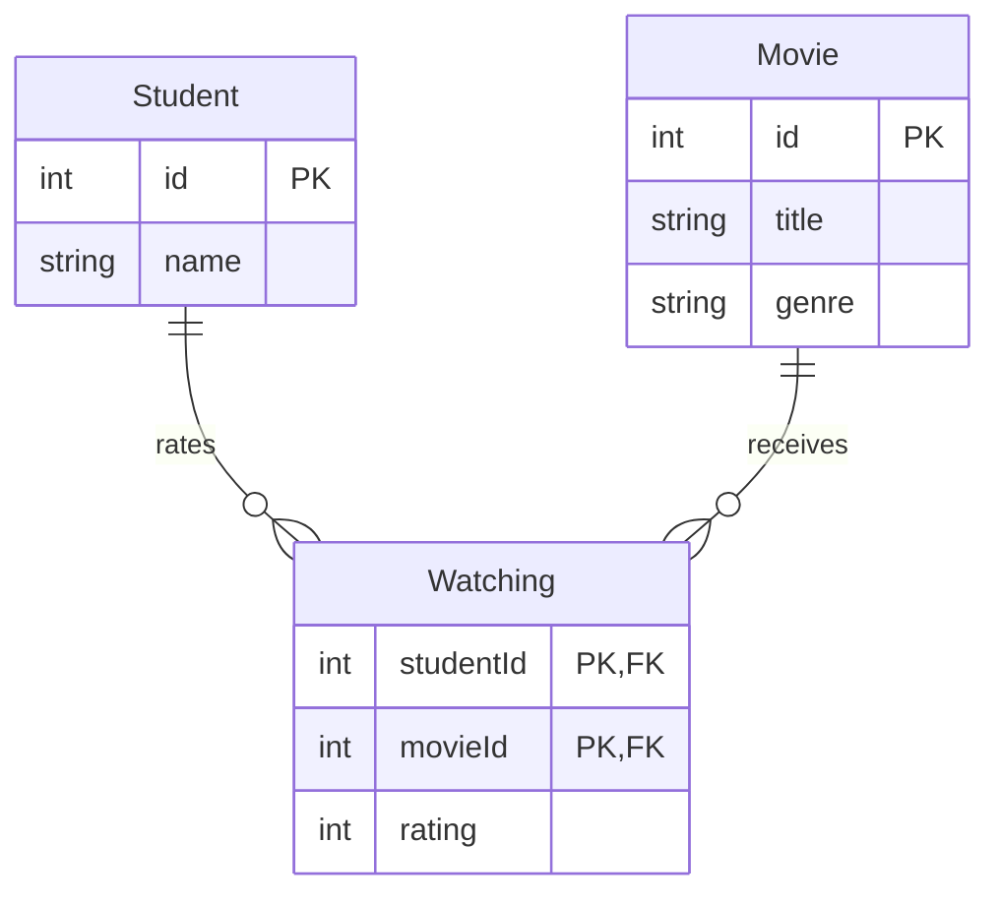

{: .box-note}
הפרק מתחיל מן המצב העובד בסוף
[פרק 1 — טבלת Student](/android/sqlite/01.requery-student). נוסיף שתי הגדרות
Entity, נרחיב את ה-seed ונציג מי צפה במה דרך אובייקטי הקשר. עדיין לא נכתוב
`INNER JOIN`; הוא יהיה הנושא של הפרק הבא.

[חזרה לפרק 1: טבלת Student מקצה לקצה](/android/sqlite/01.requery-student)



## מה משתנה בפרק הזה?

{: .table-he}

| קובץ | שינוי |
|---|---|
| `model/Movie.java` | קובץ חדש: סרט |
| `model/Watching.java` | קובץ חדש: קשר מדורג בין תלמיד לסרט |
| `Database.java` | schema version,‏ seed ושתי פעולות insert חדשות |
| `MainActivity.java` | החלפת תצוגת התלמידים בתצוגת הקשרים |

זה הכול. אין שינוי ב-Gradle, ב-layout, ב-`strings.xml`, ב-Manifest, ב-themes,
בקטלוג הספריות או בקובצי הבדיקות.

## 1. מוסיפים את Movie

תחת `app > kotlin+java > com.example.sqlrequery > model`, צרו interface בשם
`Movie`:

```java
package com.example.sqlrequery.model;

import io.requery.Entity;
import io.requery.Generated;
import io.requery.Key;
import io.requery.Persistable;
import io.requery.Table;

/** Defines one row in the SQLite {@code Movie} table. */
@Entity
@Table(name = "Movie")
public interface Movie extends Persistable {
    /** Returns the SQLite-generated primary key. */
    @Key @Generated
    int getId();

    /** Returns the movie title. */
    String getTitle();

    /** Returns the movie genre. */
    String getGenre();
}
```

`Movie` דומה בכוונה ל-`Student`: מפתח שנוצר ב-SQLite ושתי עמודות טקסט
רגילות. לאחר build, Requery תיצור ממנו `MovieEntity` עם setters ועם attributes
typed כגון `MovieEntity.TITLE`.

## 2. הופכים את הקשר ל-Entity

באותו package צרו interface בשם `Watching`:

```java
package com.example.sqlrequery.model;

import io.requery.Column;
import io.requery.Entity;
import io.requery.Key;
import io.requery.ManyToOne;
import io.requery.Persistable;
import io.requery.Table;

/** Defines the rated association between one {@link Student} and one {@link Movie}. */
@Entity
@Table(name = "Watching")
public interface Watching extends Persistable {
    /** Returns the student side and maps it to the {@code studentId} column. */
    @Key @ManyToOne
    @Column(name = "studentId", nullable = false)
    Student getStudent();

    /** Returns the movie side and maps it to the {@code movieId} column. */
    @Key @ManyToOne
    @Column(name = "movieId", nullable = false)
    Movie getMovie();

    /** Returns the rating stored on this relationship. */
    int getRating();
}
```

### מדוע Watching היא טבלה?

הקשר בין תלמיד לסרט מחזיק מידע משלו: `rating`. הדירוג אינו תכונה של התלמיד
ואינו תכונה של הסרט; הוא שייך לצפייה של תלמיד מסוים בסרט מסוים. לכן הקשר הוא
Entity אמיתי ולא רק collection.

- `@ManyToOne` אומר שכל שורת Watching מצביעה לתלמיד אחד ולסרט אחד.
- `@Column(... nullable = false)` יוצר עמודות foreign key שאינן יכולות להיות
  `NULL`.
- שני `@Key` יוצרים יחד מפתח ראשי מורכב. אותו תלמיד אינו יכול לקבל שתי שורות
  Watching לאותו סרט.

## 3. בונים את המודל החדש

הוספת הקשר גורמת ל-Requery להעביר את `Models` שנוצר אל ה-package המשותף
`com.example.sqlrequery`. לכן, ב-`Database.java`, מחקו import אחד:

```diff
 import android.content.Context;

-import com.example.sqlrequery.model.Models;
 import com.example.sqlrequery.model.Student;
```

אין צורך להוסיף import חלופי: `Database` ו-`Models` נמצאות כעת באותו package.

בצעו **Build > Make Project**. חפשו בעזרת **Search Everywhere**:

- `com.example.sqlrequery.Models`
- `com.example.sqlrequery.model.MovieEntity`
- `com.example.sqlrequery.model.WatchingEntity`

{: .box-warning}
אל תיצרו את המחלקות האלה ידנית. אם `Database.java` עדיין מייבאת
`com.example.sqlrequery.model.Models`, ה-build ייכשל מפני שהמחלקה שנוצרה עברה
package.

## 4. משדרגים את SQLite בלי למחוק את נתוני פרק 1

ב-`Database.open`, הגדילו את גרסת ה-schema:

```diff
             DatabaseSource source = new DatabaseSource(
                     context.getApplicationContext(),
                     Models.DEFAULT,
                     "class-netflix.db",
-                    1);
+                    2);
```

בפתיחה הבאה Android תפעיל את `DatabaseSource.onUpgrade`.‏ Requery תיצור את
הטבלאות והעמודות החסרות, בלי למחוק את טבלת Student ובלי לדרוש מן התלמיד לנקות
את נתוני האפליקציה.

{: .box-note}
הגדלת version אינה “מספר של הפרק”. היא הודעה ל-`SQLiteOpenHelper` שה-schema
השתנה. בפרק 1 היה schema עם Student בלבד; בפרק 2 יש גם Movie ו-Watching.

## 5. מרחיבים את Database

### 5.1 imports

עדכנו את קבוצת ה-imports של המודל והוסיפו `Result`:

```diff
+import com.example.sqlrequery.model.Movie;
+import com.example.sqlrequery.model.MovieEntity;
 import com.example.sqlrequery.model.Student;
 import com.example.sqlrequery.model.StudentEntity;
+import com.example.sqlrequery.model.Watching;
+import com.example.sqlrequery.model.WatchingEntity;

 import io.requery.Persistable;
 import io.requery.android.sqlite.DatabaseSource;
+import io.requery.query.Result;
 import io.requery.sql.EntityDataStore;
```

עדכנו גם את תיעוד המחלקה כך שיישאר נכון בהמשך:

```diff
-/** Contains the database setup and Student operations used in the first lesson. */
+/** Contains the database setup and insert operations used throughout the tutorial. */
 final class Database {
```

### 5.2 seed שעובד גם בשדרוג וגם בהתקנה חדשה

החליפו את `seedIfEmpty`:

```diff
-/** Inserts the example students only when the Student table is empty. */
+/** Inserts the example relationship graph only when Watching is empty. */
 static void seedIfEmpty(EntityDataStore<Persistable> data) {
-    if (data.count(Student.class).get().value() != 0) return;
+    if (data.count(Watching.class).get().value() != 0) return;

-    addStudent(data, "Maya");
-    addStudent(data, "Noa");
-    addStudent(data, "Dana");
+    Student maya = findOrAddStudent(data, "Maya");
+    Student noa = findOrAddStudent(data, "Noa");
+    Student dana = findOrAddStudent(data, "Dana");
+
+    MovieEntity barbie = addMovie(data, "Barbie", "Comedy");
+    MovieEntity dune = addMovie(data, "Dune", "Sci-Fi");
+    MovieEntity insideOut = addMovie(data, "Inside Out 2", "Animation");
+
+    addWatching(data, maya, barbie, 9);
+    addWatching(data, maya, dune, 8);
+    addWatching(data, noa, dune, 10);
+    addWatching(data, dana, insideOut, 9);
 }
```

הבדיקה עברה מ-`Student` ל-`Watching`, מפני שבשדרוג רגיל של פרק 1 כבר קיימים
תלמידים אבל עדיין אין קשרי צפייה.

מיד מתחת ל-`seedIfEmpty`, הוסיפו:

```java
/** Reuses a Step 1 student, or inserts it when the database is new. */
private static Student findOrAddStudent(EntityDataStore<Persistable> data, String name) {
    try (Result<Student> students = data.select(Student.class)
            .where(StudentEntity.NAME.eq(name))
            .get()) {
        Student student = students.firstOrNull();
        return student != null ? student : addStudent(data, name);
    }
}
```

כך אותו קוד תומך בשני מצבים:

1. בשדרוג מפרק 1 נמצאים Maya,‏ Noa ו-Dana הקיימים.
2. בהתקנה חדשה הם אינם קיימים, ולכן `addStudent` מוסיפה אותם.

אין שכפול תלמידים ואין דרישה למחוק app data.

### 5.3 שתי פעולות insert שנשארות להמשך

מתחת ל-`addStudent`, הוסיפו:

```java
/** Creates and inserts one Movie row. */
static MovieEntity addMovie(EntityDataStore<Persistable> data, String title, String genre) {
    MovieEntity movie = new MovieEntity();
    movie.setTitle(title);
    movie.setGenre(genre);
    return data.insert(movie);
}

/** Creates and inserts one rated Student-Movie relationship. */
static void addWatching(EntityDataStore<Persistable> data,
                        Student student, Movie movie, int rating) {
    WatchingEntity watching = new WatchingEntity();
    watching.setStudent(student);
    watching.setMovie(movie);
    watching.setRating(rating);
    data.insert(watching);
}
```

`setStudent` ו-`setMovie` מקבלים אובייקטים, אבל Requery שומרת בטבלת Watching
את ה-id שלהם בעמודות `studentId` ו-`movieId`. שתי הפעולות יישארו ללא שינוי
גם כאשר נוסיף דיאלוגים בפרק הבא.

## 6. מציגים את הקשר דרך navigation

ב-`MainActivity`, החליפו את שני imports של Student:

```diff
-import com.example.sqlrequery.model.Student;
-import com.example.sqlrequery.model.StudentEntity;
+import com.example.sqlrequery.model.Watching;
+import com.example.sqlrequery.model.WatchingEntity;
```

בסוף `onCreate`, שנו רק את שם הפעולה:

```diff
 data = Database.open(this);
 Database.seedIfEmpty(data);
-showStudents();
+showWatchings();
```

כעת החליפו את הפעולה הזמנית מפרק 1:

<div class="two-columns before-after">
<div markdown="1" class="column">

### לפני

    
-/** Selects every Student in ID order and displays the rows. */
-private void showStudents() {
-    StringBuilder text = new StringBuilder("STUDENTS\n\n");
-
-    try (Result<Student> students = data.select(Student.class)
-            .orderBy(StudentEntity.ID)
            .get()) {
-        for (Student student : students) {
-            text.append(student.getId())
-                    .append(" | ")
-                    .append(student.getName())
-                    .append('\n');
-        }
-    }
-
    binding.results.setText(text);
}
    

</div>
<div markdown="1" class="column">

### אחרי

    
+/** Displays every rated relationship through its Student and Movie objects. */
+private void showWatchings() {
+    StringBuilder text = new StringBuilder("STUDENT | MOVIE | RATING\n\n");
+
+    try (Result<Watching> watchings = data.select(Watching.class)
+            .orderBy(WatchingEntity.STUDENT_ID, WatchingEntity.MOVIE_ID)
            .get()) {
+        for (Watching watching : watchings) {
+            text.append(watching.getStudent().getName())
+                    .append(" | ")
+                    .append(watching.getMovie().getTitle())
+                    .append(" | ")
+                    .append(watching.getRating())
+                    .append('\n');
+        }
+    }
+
    binding.results.setText(text);
}
    

</div>
</div>

שלוש הקריאות החשובות הן:

```java
watching.getStudent().getName()
watching.getMovie().getTitle()
watching.getRating()
```

זו relationship navigation: מתחילים באובייקט Watching ועוברים דרך הקשרים אל
Student ו-Movie. בפרק הבא נחליף רק את גוף `showWatchings` בשני
`INNER JOIN`-ים מפורשים ונשמור את אותה תוצאה על המסך.

## 7. מריצים ובודקים

הריצו את האפליקציה **בלי למחוק את נתוני פרק 1**. במסך אמור להופיע:

```text
STUDENT | MOVIE | RATING

Maya | Barbie | 9
Maya | Dune | 8
Noa | Dune | 10
Dana | Inside Out 2 | 9
```

ב-Logcat של השדרוג אמורות להופיע:

- יצירת `Movie` ו-`Watching`;
- שלוש פעולות insert ל-Movie;
- ארבע פעולות insert ל-Watching;
- **אפס** פעולות insert ל-Student.

בטבלת Watching יופיעו שני foreign keys ומפתח מורכב:

```sql
foreign key (movieId) references Movie (id)
foreign key (studentId) references Student (id)
primary key (movieId, studentId)
```

סגרו והריצו שוב. ארבע השורות צריכות להישאר, וב-Logcat לא אמורה להופיע אף פעולת
`insert` חדשה.

## רשימת בדיקה

- נוספו רק `Movie.java` ו-`Watching.java` כקבצים חדשים.
- כל תשתית Android מן הפרק הקודם נשארה ללא שינוי.
- build יצר `MovieEntity`,‏ `WatchingEntity` ו-`Models`.
- שדרוג מפרק 1 לא שכפל את שלושת התלמידים.
- המסך מציג ארבעה קשרים עם rating.
- restart מבצע אפס inserts.

{: .box-success}
כעת יש לנו מודל יחסים עובד ורואים את תוצאתו דרך Java navigation. בפרק הבא לא
נשנה schema,‏ seed או layout; נחליף רק את דרך השליפה ב-`INNER JOIN` typed.

[המשך לפרק 3: JOIN והוספות](/android/sqlite/03.requery-join-and-inserts)
