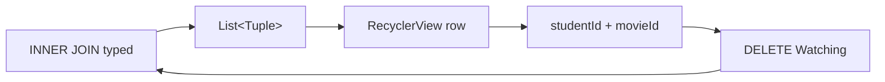

{: .box-note}
הפרק מתחיל מן היישום העובד בסוף
[פרק 3 — JOIN והוספות](/android/sqlite/03.requery-join-and-inserts). נחליף את
תוצאת הטקסט בטבלה מיושרת של `RecyclerView`, נוסיף לכל Watching כפתור Delete,
ונמחק את שורת הקשר המדויקת בעזרת שני חלקי המפתח המורכב שלה.

[חזרה לפרק 3: JOIN והוספות](/android/sqlite/03.requery-join-and-inserts)



## השינוי כולו בתשעה קבצים

{: .table-he}

| קובץ | שינוי ממוקד |
|---|---|
| `app/build.gradle.kts` | תלות אחת של RecyclerView |
| `strings.xml` | שם היישום והטקסטים של הטבלה |
| שני קובצי `themes.xml` | מראה Android נקי ובהיר/כהה |
| `activity_main.xml` | מבנה אנכי, כותרת, ראש טבלה ו-RecyclerView |
| `item_watching.xml` | קובץ חדש: שלוש עמודות וכפתור Delete |
| `WatchAdapter.java` | קובץ חדש: adapter קטן ל-`Tuple`-ים |
| `MainActivity.java` | חיבור הרשימה, ids למחיקה ורענון |
| `Database.java` | פעולת DELETE typed אחת |

ה-entities, ה-schema, ה-seed, שלושת דיאלוגי ההוספה, ה-Manifest, קטלוג
הספריות וכל מערכת הבדיקות נשארים. איננו מוחקים אף קובץ או dependency שיצרה
תבנית Android.

## 1. מוסיפים רק את ספריית RecyclerView

פתחו דרך **Gradle Scripts** את `build.gradle.kts (Module :app)`. בתוך
`dependencies`, הוסיפו שורה אחת ליד שאר ספריות AndroidX:

```diff
     implementation(libs.appcompat)
     implementation(libs.constraintlayout)
     implementation(libs.material)
+    implementation("androidx.recyclerview:recyclerview:1.4.0")
     testImplementation(libs.junit)
```

בצעו **Sync Now**. קטלוג הספריות ותלויות הבדיקות נשארים בדיוק כפי שיצרה אותם
התבנית.

## 2. מכינים את הטקסטים ואת מראה המסך

### 2.1 מעדכנים את משאבי הטקסט

ב-`app > res > values > strings.xml` בצעו את השינוי הבא:

```diff
 <resources>
-    <string name="app_name">sqlrequery</string>
-    <string name="add_student">Add Student</string>
-    <string name="add_movie">Add Movie</string>
-    <string name="add_watching">Add Watching</string>
+    <string name="app_name">Class Netflix</string>
+    <string name="title">🎬 WHO WATCHED WHAT?</string>
+    <string name="add_student">Add student</string>
+    <string name="add_movie">Add movie</string>
+    <string name="add_watching">Add watching</string>
+    <string name="column_student">Student</string>
+    <string name="column_movie">Movie</string>
+    <string name="column_rating">Rating</string>
+    <string name="column_action">Action</string>
+    <string name="delete">Delete</string>
+    <string name="rating_value">%1$d</string>
 </resources>
```

שלושת הערכים הראשונים בכל `Tuple` יוצגו. שני ה-ids שנצטרך למחיקה לא יוצגו
כעמודות.

### 2.2 משתמשים במראה Android הפשוט של יישום הייחוס

ב-`app > res > values > themes.xml` החליפו את התוכן:

```xml
<resources>
    <style name="Theme.Sqlrequery" parent="android:style/Theme.Material.Light.NoActionBar">
        <item name="android:fontFamily">sans</item>
        <item name="android:colorAccent">#6750A4</item>
    </style>
</resources>
```

וב-`app > res > values-night > themes.xml`:

```xml
<resources>
    <style name="Theme.Sqlrequery" parent="android:style/Theme.Material.NoActionBar">
        <item name="android:fontFamily">sans</item>
        <item name="android:colorAccent">#D0BCFF</item>
    </style>
</resources>
```

איננו מסירים את ספריות Material או AppCompat. ה-theme רק נותן למסך הזה את
המראה של יישום הייחוס: שורת פעולות שטוחה וסגולה וכפתורי Delete אפורים וברורים.

## 3. בונים טבלה מיושרת ב-XML

### 3.1 מחליפים את מבנה המסך למבנה אנכי

ב-`activity_main.xml` החליפו את ה-root ואת תחילת הקובץ:

```diff
 <?xml version="1.0" encoding="utf-8"?>
-<androidx.constraintlayout.widget.ConstraintLayout xmlns:android="http://schemas.android.com/apk/res/android"
-    xmlns:app="http://schemas.android.com/apk/res-auto"
-    xmlns:tools="http://schemas.android.com/tools"
-    android:id="@+id/main"
+<LinearLayout xmlns:android="http://schemas.android.com/apk/res/android"
     android:layout_width="match_parent"
     android:layout_height="match_parent"
-    tools:context=".MainActivity">
+    android:orientation="vertical"
+    android:padding="24dp">
+
+    <TextView
+        android:layout_width="wrap_content"
+        android:layout_height="wrap_content"
+        android:layout_marginBottom="12dp"
+        android:text="@string/title"
+        android:textSize="24sp"
+        android:textStyle="bold" />
```

בשורת שלושת הכפתורים השאירו את ה-`Button`-ים הקיימים. עדכנו את העטיפה והוסיפו
לכל אחד מן הכפתורים את אותו style:

```diff
     <LinearLayout
-        android:layout_width="0dp"
+        style="?android:attr/buttonBarStyle"
+        android:layout_width="match_parent"
         android:layout_height="wrap_content"
-        android:layout_marginHorizontal="16dp"
-        android:layout_marginTop="16dp"
-        android:orientation="horizontal"
-        app:layout_constraintEnd_toEndOf="parent"
-        app:layout_constraintStart_toStartOf="parent"
-        app:layout_constraintTop_toTopOf="parent">
+        android:layout_marginBottom="24dp"
+        android:orientation="horizontal">

         <Button
             android:id="@+id/button_add_student"
+            style="?android:attr/buttonBarButtonStyle"
⁞
         <Button
             android:id="@+id/button_add_movie"
+            style="?android:attr/buttonBarButtonStyle"
⁞
         <Button
             android:id="@+id/button_add_watching"
+            style="?android:attr/buttonBarButtonStyle"
```

### 3.2 מחליפים את תוצאת הטקסט בראש טבלה וברשימה

אחרי שורת הכפתורים מחקו את ה-`TextView` הישן של `results`, והוסיפו במקומו:

```xml
    <LinearLayout
        android:layout_width="match_parent"
        android:layout_height="wrap_content"
        android:gravity="center_vertical"
        android:orientation="horizontal"
        android:paddingHorizontal="8dp"
        android:paddingVertical="8dp">

        <TextView
            android:layout_width="0dp"
            android:layout_height="wrap_content"
            android:layout_weight="3"
            android:text="@string/column_student"
            android:textStyle="bold" />

        <TextView
            android:layout_width="0dp"
            android:layout_height="wrap_content"
            android:layout_weight="4"
            android:text="@string/column_movie"
            android:textStyle="bold" />

        <TextView
            android:layout_width="0dp"
            android:layout_height="wrap_content"
            android:layout_weight="2"
            android:gravity="center"
            android:text="@string/column_rating"
            android:textStyle="bold" />

        <TextView
            android:layout_width="88dp"
            android:layout_height="wrap_content"
            android:gravity="center"
            android:text="@string/column_action"
            android:textStyle="bold" />
    </LinearLayout>

    <androidx.recyclerview.widget.RecyclerView
        android:id="@+id/recycler_view"
        android:layout_width="match_parent"
        android:layout_height="0dp"
        android:layout_weight="1"
        android:clipToPadding="false" />
</LinearLayout>
```

`Hello World!` נעלם רק מפני שה-`TextView` כולו מפנה את מקומו לרשימה העובדת.
`layout_weight="1"` מקצה ל-RecyclerView את כל גובה המסך שנותר.

### 3.3 יוצרים layout לשורה אחת

תחת `app > res > layout`, צרו **Layout Resource File** בשם
`item_watching.xml` עם root מסוג `LinearLayout`:

```xml
<?xml version="1.0" encoding="utf-8"?>
<LinearLayout xmlns:android="http://schemas.android.com/apk/res/android"
    android:layout_width="match_parent"
    android:layout_height="wrap_content"
    android:gravity="center_vertical"
    android:orientation="horizontal"
    android:paddingHorizontal="8dp"
    android:paddingVertical="4dp">

    <TextView
        android:id="@+id/student_name"
        android:layout_width="0dp"
        android:layout_height="wrap_content"
        android:layout_weight="3"
        android:singleLine="true"
        android:textSize="16sp" />

    <TextView
        android:id="@+id/movie_title"
        android:layout_width="0dp"
        android:layout_height="wrap_content"
        android:layout_weight="4"
        android:singleLine="true"
        android:textSize="16sp" />

    <TextView
        android:id="@+id/rating"
        android:layout_width="0dp"
        android:layout_height="wrap_content"
        android:layout_weight="2"
        android:gravity="center"
        android:textSize="16sp" />

    <Button
        android:id="@+id/button_delete"
        android:layout_width="88dp"
        android:layout_height="wrap_content"
        android:text="@string/delete" />
</LinearLayout>
```

המשקלים `3 : 4 : 2` והרוחב `88dp` זהים בראש הטבלה ובשורה. לכן כל ארבע
העמודות נשארות מיושרות. View Binding ייצור את `ItemWatchingBinding`.

## 4. כותבים adapter קטן ל-Tuple

תחת `app > kotlin+java > com.example.sqlrequery`, צרו Java Class בשם
`WatchAdapter`:

```java
package com.example.sqlrequery;

import android.annotation.SuppressLint;
import android.view.LayoutInflater;
import android.view.ViewGroup;

import androidx.annotation.NonNull;
import androidx.recyclerview.widget.RecyclerView;

import com.example.sqlrequery.databinding.ItemWatchingBinding;
import com.example.sqlrequery.model.MovieEntity;
import com.example.sqlrequery.model.StudentEntity;
import com.example.sqlrequery.model.WatchingEntity;

import java.util.Collections;
import java.util.List;
import java.util.function.Consumer;

import io.requery.query.Tuple;

/**
 * Displays the tuples returned by the typed join, one reusable row view at a time.
 *
 * <p>The adapter deliberately receives Requery {@link Tuple}s directly. Introducing a separate
 * display-model class would hide the useful connection between the selected typed attributes and
 * the values shown on screen. {@link ItemWatchingBinding} is generated from
 * {@code item_watching.xml}, so row views also use View Binding.</p>
 */
final class WatchAdapter extends RecyclerView.Adapter<WatchAdapter.RowHolder> {
    /** Current snapshot of the join result. */
    private List<Tuple> rows = Collections.emptyList();

    /** Activity action to run when a row's Delete button is pressed. */
    private final Consumer<Tuple> delete;

    /**
     * Creates an adapter whose only row action is supplied by the Activity.
     *
     * @param delete receives the exact tuple represented by the clicked row
     */
    WatchAdapter(Consumer<Tuple> delete) {
        this.delete = delete;
    }

    /** Creates View Binding for one row when RecyclerView needs another reusable view. */
    @NonNull
    @Override
    public RowHolder onCreateViewHolder(@NonNull ViewGroup parent, int viewType) {
        ItemWatchingBinding binding = ItemWatchingBinding.inflate(
                LayoutInflater.from(parent.getContext()), parent, false);
        return new RowHolder(binding);
    }

    /**
     * Copies the selected name, title, and rating from one join tuple into one row.
     *
     * @param holder reusable holder for the row views
     * @param position position of the tuple currently being displayed
     */
    @Override
    public void onBindViewHolder(@NonNull RowHolder holder, int position) {
        Tuple row = rows.get(position);
        holder.binding.studentName.setText(row.get(StudentEntity.NAME));
        holder.binding.movieTitle.setText(row.get(MovieEntity.TITLE));
        holder.binding.rating.setText(holder.itemView.getContext().getString(
                R.string.rating_value, row.get(WatchingEntity.RATING)));
        holder.binding.buttonDelete.setOnClickListener(v -> delete.accept(row));
    }

    /** @return number of join tuples currently available to display */
    @Override
    public int getItemCount() {
        return rows.size();
    }

    /**
     * Replaces the tiny teaching data set after the join is rerun.
     *
     * <p>{@code notifyDataSetChanged()} is intentionally sufficient here: the demo has only a few
     * rows, and DiffUtil/ListAdapter would add machinery unrelated to its database lesson.</p>
     *
     * @param rows fresh snapshot returned by Requery
     */
    @SuppressLint("NotifyDataSetChanged")
    void setRows(List<Tuple> rows) {
        this.rows = rows;
        notifyDataSetChanged();
    }

    /** Holds the generated binding for one recyclable {@code item_watching.xml} view. */
    static final class RowHolder extends RecyclerView.ViewHolder {
        /** Type-safe access to the row's three columns and Delete button. */
        private final ItemWatchingBinding binding;

        /** @param binding binding inflated for this reusable row */
        RowHolder(ItemWatchingBinding binding) {
            super(binding.getRoot());
            this.binding = binding;
        }
    }
}
```

אין כאן מחלקת “שורת תצוגה” נוספת. ה-adapter קורא ישירות מן ה-`Tuple` בעזרת
אותם attributes typed שהשאילתה בחרה. הוא מדווח איזו שורה נלחצה, אך אינו יודע
דבר על SQLite.

{: .box-note}
ברשימה קטנה של כמה שורות, `notifyDataSetChanged()` ברור יותר מ-`DiffUtil` או
`ListAdapter`. זו החלטת פישוט מכוונת, לא המלצה לכל רשימה גדולה.

## 5. מחברים את RecyclerView ל-Activity

### 5.1 מתאימים את ה-Activity ל-theme של Android

ב-`MainActivity.java` החליפו את imports של AppCompat וה-edge-to-edge:

```diff
+import android.app.Activity;
+import android.app.AlertDialog;
 import android.os.Bundle;
⁞
-import androidx.activity.EdgeToEdge;
-import androidx.appcompat.app.AlertDialog;
-import androidx.appcompat.app.AppCompatActivity;
-import androidx.core.graphics.Insets;
-import androidx.core.view.ViewCompat;
-import androidx.core.view.WindowInsetsCompat;
+import androidx.recyclerview.widget.DividerItemDecoration;
+import androidx.recyclerview.widget.LinearLayoutManager;
```

החליפו את מחלקת הבסיס, הוסיפו שדה adapter, ומחקו מ-`onCreate` רק את קוד
ה-edge-to-edge שנשען על ה-view הישן `main`:

```diff
-/** Displays the typed join and owns the three insert dialogs. */
-public class MainActivity extends AppCompatActivity {
+/**
+ * The demo's only screen: three insert dialogs and a deletable RecyclerView of typed join results.
+ *
+ * <p>{@link ActivityMainBinding} is generated from {@code activity_main.xml}, so every XML view is
+ * accessed through View Binding rather than {@code findViewById}. Database calls stay direct and
+ * synchronous because this tiny teaching database contains only a few rows. A real application
+ * should move potentially slow database work off the main thread.</p>
+ */
+public class MainActivity extends Activity {
+    /** Generated, type-safe access to the views in {@code activity_main.xml}. */
     private ActivityMainBinding binding;
+
+    /** The Requery store used directly by this one Activity. */
     private EntityDataStore<Persistable> data;
+
+    /** Connects typed join tuples to the reusable views in the RecyclerView. */
+    private WatchAdapter adapter;
+
+    /**
+     * Inflates the bound layout, opens and seeds SQLite, wires the buttons, and displays the join.
+     *
+     * @param savedInstanceState Android's previously saved Activity state, if one exists
+     */
     @Override
     protected void onCreate(Bundle savedInstanceState) {
         super.onCreate(savedInstanceState);
-        EdgeToEdge.enable(this);
         binding = ActivityMainBinding.inflate(getLayoutInflater());
         setContentView(binding.getRoot());
-        ViewCompat.setOnApplyWindowInsetsListener(binding.main, (v, insets) -> {
-            Insets systemBars = insets.getInsets(WindowInsetsCompat.Type.systemBars());
-            v.setPadding(systemBars.left, systemBars.top, systemBars.right, systemBars.bottom);
-            return insets;
-        });
```

`android.app.AlertDialog` שומר את שלושת הדיאלוגים הקיימים ומתאים אותם למחלקת
הבסיס ול-theme. אין צורך לשנות את הקוד שבתוכם.

### 5.2 יוצרים את הרשימה ואת הקווים בין השורות

מיד לאחר פתיחת המסד וה-seed הוסיפו:

```diff
 data = Database.open(this);
 Database.seedIfEmpty(data);

+adapter = new WatchAdapter(this::deleteWatching);
+binding.recyclerView.setLayoutManager(new LinearLayoutManager(this));
+binding.recyclerView.addItemDecoration(
+        new DividerItemDecoration(this, DividerItemDecoration.VERTICAL));
+binding.recyclerView.setAdapter(adapter);

 binding.buttonAddStudent.setOnClickListener(v -> showAddStudent());
```

`LinearLayoutManager` מסדר שורות זו מתחת לזו, ו-`DividerItemDecoration` מצייר
את הקו הדק בין כל שתי שורות.

### 5.3 מעבירים את תוצאת ה-JOIN ל-adapter

מעל `showWatchings` החליפו את התיעוד הקצר בתיעוד שמסביר גם את הקשר ל-SQL וגם
את שני ה-ids הסמויים:

```java
/**
 * Runs the ORM equivalent of the lesson's two SQL {@code INNER JOIN}s and displays every tuple.
 *
 * <pre>{@code
 * SELECT s.name, m.title, w.rating
 * FROM Student s
 * INNER JOIN Watching w ON w.studentId = s.id
 * INNER JOIN Movie m ON m.id = w.movieId;
 * }</pre>
 *
 * <p>{@code StudentEntity.NAME}, {@code WatchingEntity.STUDENT_ID}, and the other expressions
 * are generated typed attributes—not hand-written table or column-name strings. Selecting these
 * expressions produces a {@link Tuple}; each value is retrieved with the same typed expression
 * that selected it. Two additional selected IDs are the composite key used by Delete; they are
 * not shown to the user. The try-with-resources block closes Requery's {@link Result} cursor.</p>
 */
```

כעת החליפו את גוף `showWatchings` והוסיפו אחריו את `deleteWatching`:

<div class="two-columns before-after">
<div markdown="1" class="column">

### לפני

    
private void showWatchings() {
-    StringBuilder text = new StringBuilder("STUDENT | MOVIE | RATING\n\n");
-
    try (Result<Tuple> rows = data
-            .select(StudentEntity.NAME, MovieEntity.TITLE, WatchingEntity.RATING)
            .from(Student.class)
            .join(Watching.class).on(WatchingEntity.STUDENT_ID.eq(StudentEntity.ID))
            .join(Movie.class).on(MovieEntity.ID.eq(WatchingEntity.MOVIE_ID))
            .orderBy(StudentEntity.ID, MovieEntity.ID)
            .get()) {
-        for (Tuple row : rows) {
-            text.append(row.get(StudentEntity.NAME))
-                    .append(" | ")
-                    .append(row.get(MovieEntity.TITLE))
-                    .append(" | ")
-                    .append(row.get(WatchingEntity.RATING))
-                    .append('\n');
-        }
    }
-
-    binding.results.setText(text);
}
    

</div>
<div markdown="1" class="column">

### אחרי

    
private void showWatchings() {
+    // The typed Requery equivalent of the SQL INNER JOIN in README.md.
    try (Result<Tuple> rows = data
+            .select(StudentEntity.NAME, MovieEntity.TITLE, WatchingEntity.RATING,
+                    WatchingEntity.STUDENT_ID, WatchingEntity.MOVIE_ID)
            .from(Student.class)
            .join(Watching.class).on(WatchingEntity.STUDENT_ID.eq(StudentEntity.ID))
            .join(Movie.class).on(MovieEntity.ID.eq(WatchingEntity.MOVIE_ID))
            .orderBy(StudentEntity.ID, MovieEntity.ID)
            .get()) {
+        adapter.setRows(rows.toList());
    }
}

+private void deleteWatching(Tuple row) {
+    Database.deleteWatching(data,
+            row.get(WatchingEntity.STUDENT_ID), row.get(WatchingEntity.MOVIE_ID));
+    showWatchings();
+    toast("Watching deleted");
+}
    

</div>
</div>

`rows.toList()` יוצרת snapshot לפני שבלוק ה-try סוגר את cursor. שלושת הערכים
הראשונים מוצגים; שני ה-ids נשארים ב-`Tuple` ומזהים את Watching שנלחץ. שמות
וכותרות עלולים לחזור, אבל `studentId + movieId` הוא המפתח המורכב המדויק.

תעדו גם את פעולת המחיקה מיד מעל ההצהרה שלה:

```java
/**
 * Deletes the clicked Watching relationship and immediately reruns the join.
 *
 * <p>The tuple carries {@code studentId} and {@code movieId} even though RecyclerView displays
 * only the student's name, movie title, and rating. Together the two IDs uniquely identify the
 * association row.</p>
 *
 * @param row join tuple represented by the clicked RecyclerView row
 */
```

## 6. מבצעים DELETE typed

ב-`Database.java`, הוסיפו מיד לאחר `addWatching`:

```diff
+    /**
+     * Deletes exactly one association row using Watching's two-column primary key.
+     *
+     * <p>The student and movie IDs come from the same join tuple displayed by RecyclerView. Names
+     * and titles are presentation values and need not be unique, so they are not safe identifiers
+     * for deletion. The final {@code value()} executes Requery's lazy delete result.</p>
+     *
+     * @param data the open Requery store
+     * @param studentId first half of the Watching composite key
+     * @param movieId second half of the Watching composite key
+     */
+    static void deleteWatching(EntityDataStore<Persistable> data, int studentId, int movieId) {
+        data.delete(Watching.class)
+                .where(WatchingEntity.STUDENT_ID.eq(studentId)
+                        .and(WatchingEntity.MOVIE_ID.eq(movieId)))
+                .get().value();
+    }
```

ה-`and` מחייב התאמה של שני חלקי המפתח ולכן מוחק קשר אחד בלבד.

{: .box-warning}
אל תשמיטו את `value()`. פעולות Requery הן lazy:‏ `get()` יוצר תוצאה scalar,
ו-`value()` הוא שמבצע בפועל את פקודת ה-DELETE.

## 7. מריצים ובודקים

1. בצעו Build והריצו. צריכות להופיע ארבע שורות מיושרות, קו דק בין השורות
   וכפתור Delete אפור ליד כל שורה.
2. לחצו Delete ליד `Maya | Barbie | 9`. השורה נעלמת מיד ושלוש האחרות נשארות.
3. סגרו והריצו שוב. השורה שנמחקה אינה חוזרת — `seedIfEmpty` לא משחזרת אותה.
4. הוסיפו Watching חדש. הרשימה מתרעננת מיד בלי restart.
5. ב-Logcat חפשו `delete from Watching` והשוו לשרשרת ה-Requery שכתבתם.

## רשימת בדיקה

- נוספה רק ספריית RecyclerView; כל תלויות התבנית והבדיקות נשארו.
- נוספו רק `WatchAdapter.java` ו-`item_watching.xml` כקבצים חדשים.
- הכותרות, הערכים וכפתורי Delete משתמשים באותם רוחבי עמודות.
- בין שורות הרשימה מופיעים dividers דקים.
- ה-adapter מציג `Tuple` ישירות ואינו ניגש למסד.
- המחיקה משתמשת ב-`studentId` וב-`movieId`, לא בשם ובכותרת.
- לאחר מחיקה השאילתה רצה שוב, והשינוי נשמר לאחר restart.

{: .box-success}
הפכנו תוצאת JOIN סטטית לטבלה אינטראקטיבית בלי לשנות את המודל: RecyclerView
ממחזרת שורות, ה-Activity מתרגמת לחיצה לשני חלקי המפתח, ו-Requery מפיקה DELETE
typed של שורת Watching אחת.


<details markdown="1"><summary>העמקה: מה RecyclerView ממחזר, ומתי לבחור בו?</summary>

### מתי עדיף `RecyclerView`?

`RecyclerView` עדיף כאשר מספר השורות גדול, משתנה או ניתן לגלילה, ואילו `TableLayout` מתאים בעיקר לטבלה קטנה וקבועה. מה פירוש “מִחזור”? במקום ליצור תצוגה חדשה לכל שורה, `RecyclerView` משתמש מחדש בתצוגות שיצאו מהמסך ומעדכן את תוכנן, וכך חוסך זיכרון ומשפר ביצועים. חשוב: המִחזור אינו מוחק או ממחזר את הנתונים עצמם—רק את רכיבי התצוגה. לכן `TableLayout` אינו “שגוי”; הוא פשוט פחות יעיל ונוח לניהול כאשר הרשימה גדלה או משתנה.

### האם שניהם יכולים להציג גם תמונות בטבלה?

כן. בשניהם אפשר להוסיף `ImageView` לכל שורה ולהציג בו תמונה לצד הטקסט. ההבדל אינו ביכולת להציג תמונות, אלא ביעילות: `TableLayout` יוצר ומחזיק בזיכרון את כל השורות והתמונות, ואילו `RecyclerView` ממחזר את תצוגות השורות ולכן מתאים יותר לרשימה גדולה או משתנה. לטעינת תמונות מקבצים או מהאינטרנט נהוג להשתמש בספרייה כמו Glide או Coil.

</details>
